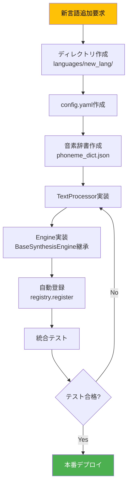

# 多言語アーキテクチャ設計

**最終更新**: 2025-10-05
**バージョン**: 1.0.0
**ステータス**: 設計フェーズ

---

## 📋 目次

1. [アーキテクチャ原則](#アーキテクチャ原則)
2. [レイヤー構造](#レイヤー構造)
3. [デザインパターン](#デザインパターン)
4. [プラグインシステム](#プラグインシステム)
5. [言語エンジン設計](#言語エンジン設計)
6. [依存性管理](#依存性管理)
7. [拡張性戦略](#拡張性戦略)

---

## アーキテクチャ原則

### 設計哲学

DiffSinger多言語統合は、以下の原則に基づいて設計されています：

#### 1. **単一責務原則（SRP）**
各モジュールは1つの明確な責務のみを持つ

```python
# ❌ 悪い例：多責務
class DiffSingerEngine:
    def synthesize(self):
        self.convert_text()      # テキスト処理
        self.run_inference()     # 推論実行
        self.save_audio()        # ファイルIO
        self.log_metrics()       # ロギング

# ✅ 良い例：単一責務
class TextProcessor:
    def convert_text(self): ...

class InferenceEngine:
    def run_inference(self): ...

class AudioWriter:
    def save_audio(self): ...
```

#### 2. **開放閉鎖原則（OCP）**
拡張に開いている、修正に閉じている

```python
# 新言語追加時、既存コード変更不要
class LanguageRegistry:
    def register(self, language: str, engine_class: Type[BaseSynthesisEngine]):
        self._engines[language] = engine_class

# 新言語追加
registry.register("ja_JP", JapaneseEngine)  # 既存コード無修正
registry.register("en_US", EnglishEngine)   # 既存コード無修正
```

#### 3. **依存性逆転原則（DIP）**
抽象に依存し、具象に依存しない

```python
# ❌ 悪い例：具象依存
class SynthesisAPI:
    def __init__(self):
        self.engine = ChineseEngine()  # 具体的実装に依存

# ✅ 良い例：抽象依存
class SynthesisAPI:
    def __init__(self, engine: BaseSynthesisEngine):
        self.engine = engine  # 抽象に依存
```

#### 4. **インターフェース分離原則（ISP）**
クライアントに不要なインターフェースを強制しない

```python
# 各言語エンジンは必要なメソッドのみ実装
class BaseSynthesisEngine(ABC):
    @abstractmethod
    def text_to_phonemes(self, text: str) -> List[str]:
        """全言語で必須"""
        pass

class OptionalFeatures(ABC):
    @abstractmethod
    def support_tone(self) -> bool:
        """声調対応（中国語のみ）"""
        pass
```

#### 5. **リスコフ置換原則（LSP）**
派生クラスは基底クラスと置換可能

```python
def synthesize(engine: BaseSynthesisEngine, text: str):
    phonemes = engine.text_to_phonemes(text)  # どの言語でも動作
    return engine.synthesize(phonemes)

# どのエンジンでも置換可能
synthesize(ChineseEngine(), "你好")  # OK
synthesize(JapaneseEngine(), "こんにちは")  # OK
```

---

## レイヤー構造

### 5層アーキテクチャ

```
┌─────────────────────────────────────────────────────┐
│           Layer 1: API Layer (FastAPI)              │
│  - REST Endpoints                                   │
│  - Request Validation (Pydantic)                    │
│  - Response Formatting                              │
└─────────────────────┬───────────────────────────────┘
                      │ Language-agnostic Interface
┌─────────────────────▼───────────────────────────────┐
│      Layer 2: Language Router & Registry            │
│  - Language Detection                               │
│  - Engine Selection                                 │
│  - Plugin Discovery                                 │
└─────────────────────┬───────────────────────────────┘
                      │ Route to specific engine
        ┌─────────────┴─────────────┐
        │                           │
┌───────▼────────┐          ┌───────▼────────┐
│ Layer 3a:      │          │ Layer 3b:      │
│ ZH_CN Plugin   │          │ JA_JP Plugin   │
│ - Text Proc.   │          │ - Text Proc.   │
│ - Config       │          │ - Config       │
└───────┬────────┘          └───────┬────────┘
        │                           │
        └─────────────┬─────────────┘
                      │ Phoneme sequences
┌─────────────────────▼───────────────────────────────┐
│     Layer 4: Core Inference Engine (Common)         │
│  - Acoustic Model (GaussianDiffusion)               │
│  - Pitch Extractor                                  │
│  - Vocoder (HiFi-GAN)                               │
└─────────────────────┬───────────────────────────────┘
                      │ Audio waveform
┌─────────────────────▼───────────────────────────────┐
│      Layer 5: Output Layer (Common)                 │
│  - WAV Encoding                                     │
│  - File Writing                                     │
│  - Response Delivery                                │
└─────────────────────────────────────────────────────┘
```

### 各レイヤーの責務

#### Layer 1: API Layer

**責務**: HTTP通信、データバリデーション

```python
# api/routes.py
from fastapi import APIRouter, HTTPException
from pydantic import BaseModel

router = APIRouter()

class SynthesisRequest(BaseModel):
    text: str
    language: str = "zh_CN"  # デフォルト中国語
    notes: str
    durations: str

@router.post("/api/synthesize")
async def synthesize_voice(request: SynthesisRequest):
    """
    歌声合成APIエンドポイント

    言語非依存の統一インターフェース
    """
    try:
        # Layer 2へ委譲
        engine = language_registry.get_engine(request.language)
        audio = await engine.synthesize(
            text=request.text,
            notes=request.notes,
            durations=request.durations
        )
        return {"status": "success", "audio_url": audio}
    except LanguageNotSupportedError as e:
        raise HTTPException(status_code=400, detail=str(e))
```

#### Layer 2: Language Router & Registry

**責務**: 言語検出、エンジン選択、プラグイン管理

```python
# registry/language_registry.py
from typing import Dict, Type
from core.base_engine import BaseSynthesisEngine

class LanguageRegistry:
    """
    言語エンジンの動的レジストリ

    新言語追加時にコード変更不要
    """
    def __init__(self):
        self._engines: Dict[str, Type[BaseSynthesisEngine]] = {}
        self._discover_plugins()

    def _discover_plugins(self):
        """
        languages/ディレクトリから自動検出

        各言語プラグインの__init__.pyで登録:
        ```python
        # languages/zh_CN/__init__.py
        from .engine import ChineseEngine
        registry.register("zh_CN", ChineseEngine)
        ```
        """
        import importlib
        import pkgutil

        languages_pkg = importlib.import_module("languages")
        for importer, modname, ispkg in pkgutil.iter_modules(languages_pkg.__path__):
            if ispkg:
                # 各言語パッケージをインポート（自動登録される）
                importlib.import_module(f"languages.{modname}")

    def register(self, language: str, engine_class: Type[BaseSynthesisEngine]):
        """言語エンジン登録"""
        self._engines[language] = engine_class
        print(f"✅ Registered: {language} → {engine_class.__name__}")

    def get_engine(self, language: str) -> BaseSynthesisEngine:
        """言語エンジン取得"""
        if language not in self._engines:
            raise LanguageNotSupportedError(
                f"Language '{language}' not supported. "
                f"Available: {list(self._engines.keys())}"
            )
        return self._engines[language]()

# グローバルレジストリ
language_registry = LanguageRegistry()
```

#### Layer 3: Language Plugins

**責務**: 言語固有の処理（音素変換、設定管理）

```python
# languages/zh_CN/engine.py
from core.base_engine import BaseSynthesisEngine
from .processor import ChineseTextProcessor
import yaml

class ChineseEngine(BaseSynthesisEngine):
    """中国語専用エンジン"""

    def __init__(self):
        super().__init__()
        self.config = self._load_config()
        self.processor = ChineseTextProcessor()

    def _load_config(self) -> dict:
        """中国語専用設定ロード"""
        with open("languages/zh_CN/config.yaml") as f:
            return yaml.safe_load(f)

    def text_to_phonemes(self, text: str) -> List[str]:
        """
        中国語テキスト → 音素変換

        "你好" → ["n", "i", "h", "ao"]
        """
        return self.processor.convert(text)

    def get_phoneme_dict(self) -> List[str]:
        """中国語音素辞書"""
        return self.config["phonemes"]
```

#### Layer 4: Core Inference Engine

**責務**: Neural Network推論（言語非依存）

```python
# core/base_engine.py
from abc import ABC, abstractmethod
from typing import List
import torch

class BaseSynthesisEngine(ABC):
    """
    全言語共通の基底クラス

    言語固有メソッドは抽象メソッドとして定義
    """

    def __init__(self):
        self.device = 'cuda' if torch.cuda.is_available() else 'cpu'
        self.acoustic_model = None
        self.vocoder = None
        self.pitch_extractor = None

    @abstractmethod
    def text_to_phonemes(self, text: str) -> List[str]:
        """言語固有の音素変換（サブクラスで実装）"""
        pass

    @abstractmethod
    def get_phoneme_dict(self) -> List[str]:
        """言語の音素辞書（サブクラスで実装）"""
        pass

    def synthesize(self, text: str, notes: str, durations: str) -> bytes:
        """
        歌声合成（全言語共通パイプライン）

        このメソッドは言語非依存
        """
        # Step 1: テキスト → 音素
        phonemes = self.text_to_phonemes(text)

        # Step 2: 音素 + MIDI → Mel
        mel = self._acoustic_inference(phonemes, notes, durations)

        # Step 3: Mel → 音声波形
        wav = self._vocoder_inference(mel)

        return wav

    def _acoustic_inference(self, phonemes, notes, durations):
        """Acoustic Model推論（言語非依存）"""
        # GaussianDiffusionによるMel生成
        ...

    def _vocoder_inference(self, mel):
        """Vocoder推論（言語非依存）"""
        # HiFi-GANによる音声生成
        ...
```

#### Layer 5: Output Layer

**責務**: 音声エンコーディング、ファイル書き込み

```python
# utils/audio_writer.py
import numpy as np
import scipy.io.wavfile as wavfile

class AudioWriter:
    """音声出力ユーティリティ（言語非依存）"""

    @staticmethod
    def save_wav(audio: np.ndarray, sample_rate: int, output_path: str):
        """
        WAV保存

        正規化とint16変換を含む
        """
        # 正規化
        audio = audio / (np.abs(audio).max() + 1e-8) * 0.95

        # int16変換
        audio = (audio * 32767).astype(np.int16)

        # WAV書き込み
        wavfile.write(output_path, sample_rate, audio)
```

---

## デザインパターン

### 1. Strategy Pattern（戦略パターン）

**用途**: 言語処理戦略の切り替え

```python
# 戦略インターフェース
class TextProcessingStrategy(ABC):
    @abstractmethod
    def convert_to_phonemes(self, text: str) -> List[str]:
        pass

# 具象戦略: 中国語
class ChineseTextStrategy(TextProcessingStrategy):
    def convert_to_phonemes(self, text: str) -> List[str]:
        return G2pM()(text)

# 具象戦略: 日本語
class JapaneseTextStrategy(TextProcessingStrategy):
    def convert_to_phonemes(self, text: str) -> List[str]:
        return MeCab().parse(text)

# コンテキスト
class TextProcessor:
    def __init__(self, strategy: TextProcessingStrategy):
        self._strategy = strategy

    def process(self, text: str) -> List[str]:
        return self._strategy.convert_to_phonemes(text)

# 使用例
processor = TextProcessor(ChineseTextStrategy())  # 中国語戦略
phonemes = processor.process("你好")

processor = TextProcessor(JapaneseTextStrategy())  # 日本語戦略に切り替え
phonemes = processor.process("こんにちは")
```

### 2. Factory Pattern（ファクトリパターン）

**用途**: 言語エンジンの生成

```python
class EngineFactory:
    """
    言語エンジンファクトリ

    言語コードから適切なエンジンを生成
    """
    @staticmethod
    def create_engine(language: str) -> BaseSynthesisEngine:
        """
        ファクトリメソッド

        新言語追加時はここに追加（OCP違反回避のためRegistryパターンと併用）
        """
        engines = {
            "zh_CN": ChineseEngine,
            "ja_JP": JapaneseEngine,
            "en_US": EnglishEngine,
        }

        if language not in engines:
            raise ValueError(f"Unsupported language: {language}")

        return engines[language]()

# 使用例
engine = EngineFactory.create_engine("zh_CN")
audio = engine.synthesize("你好", "C4", "0.5")
```

### 3. Plugin Architecture（プラグインアーキテクチャ）

**用途**: 新言語の動的追加

```python
# プラグインベースクラス
class LanguagePlugin(ABC):
    @property
    @abstractmethod
    def language_code(self) -> str:
        pass

    @abstractmethod
    def create_engine(self) -> BaseSynthesisEngine:
        pass

# 中国語プラグイン
class ChinesePlugin(LanguagePlugin):
    @property
    def language_code(self) -> str:
        return "zh_CN"

    def create_engine(self) -> BaseSynthesisEngine:
        return ChineseEngine()

# プラグインマネージャー
class PluginManager:
    def __init__(self):
        self.plugins: Dict[str, LanguagePlugin] = {}

    def register_plugin(self, plugin: LanguagePlugin):
        self.plugins[plugin.language_code] = plugin

    def get_engine(self, language: str) -> BaseSynthesisEngine:
        if language not in self.plugins:
            raise ValueError(f"No plugin for {language}")
        return self.plugins[language].create_engine()

# 使用例
manager = PluginManager()
manager.register_plugin(ChinesePlugin())
manager.register_plugin(JapanesePlugin())

engine = manager.get_engine("zh_CN")
```

### 4. Dependency Injection（依存性注入）

**用途**: テスト容易性、柔軟性向上

```python
# ❌ 悪い例：ハードコーディング
class SynthesisEngine:
    def __init__(self):
        self.vocoder = HifiGAN()  # 具体的実装に依存
        self.config = yaml.load(open("config.yaml"))  # ファイルパスハードコーディング

# ✅ 良い例：依存性注入
class SynthesisEngine:
    def __init__(
        self,
        vocoder: VocoderInterface,
        config: Dict[str, Any],
        logger: Optional[logging.Logger] = None
    ):
        self.vocoder = vocoder  # インターフェースに依存
        self.config = config    # 外部から注入
        self.logger = logger or logging.getLogger(__name__)

# 使用例（本番環境）
engine = SynthesisEngine(
    vocoder=HifiGAN(),
    config=load_yaml("config.yaml"),
    logger=production_logger
)

# 使用例（テスト環境）
engine = SynthesisEngine(
    vocoder=MockVocoder(),
    config={"sample_rate": 24000},
    logger=test_logger
)
```

---

## プラグインシステム

### プラグイン検出メカニズム

```python
# registry/plugin_discovery.py
import importlib
import inspect
from pathlib import Path
from typing import List, Type

class PluginDiscovery:
    """
    自動プラグイン検出システム

    languages/ディレクトリを走査し、
    BaseSynthesisEngineを継承したクラスを自動検出
    """

    @staticmethod
    def discover_languages(base_path: str = "languages") -> List[Type[BaseSynthesisEngine]]:
        """
        言語プラグイン自動検出

        Returns:
            検出されたエンジンクラスのリスト
        """
        engines = []
        languages_dir = Path(base_path)

        for lang_dir in languages_dir.iterdir():
            if not lang_dir.is_dir():
                continue

            # engine.pyをインポート
            engine_module = lang_dir / "engine.py"
            if not engine_module.exists():
                continue

            # 動的インポート
            module_path = f"{base_path}.{lang_dir.name}.engine"
            module = importlib.import_module(module_path)

            # BaseSynthesisEngine継承クラスを探す
            for name, obj in inspect.getmembers(module, inspect.isclass):
                if issubclass(obj, BaseSynthesisEngine) and obj != BaseSynthesisEngine:
                    engines.append(obj)
                    print(f"✅ Discovered: {lang_dir.name} → {name}")

        return engines

# 使用例
engines = PluginDiscovery.discover_languages()
for engine_class in engines:
    language_registry.register(engine_class.language_code, engine_class)
```

### プラグイン設定ファイル

```yaml
# languages/zh_CN/config.yaml
language:
  code: "zh_CN"
  display_name: "中国語（簡体字）"
  native_name: "简体中文"

phoneme_system:
  type: "pinyin"
  separator: " "
  use_tone: true

text_processor:
  class: "languages.zh_CN.processor.ChineseTextProcessor"
  dependencies:
    - g2pM
    - jieba
    - pypinyin

model:
  acoustic: "checkpoints/zh_CN/acoustic"
  vocoder: "checkpoints/zh_CN/vocoder"
  pitch_extractor: "checkpoints/zh_CN/pe"

audio:
  sample_rate: 24000
  mel_bins: 80
  hop_size: 128
  win_size: 512

features:
  supports_tone: true
  supports_slur: true
  max_phoneme_length: 6
```

---

## 言語エンジン設計

### 中国語エンジン実装例

```python
# languages/zh_CN/engine.py
from typing import List, Dict
import yaml
from pathlib import Path
from g2pM import G2pM

from core.base_engine import BaseSynthesisEngine
from languages.zh_CN.processor import ChineseTextProcessor

class ChineseEngine(BaseSynthesisEngine):
    """
    中国語歌声合成エンジン

    特徴:
    - 拼音（pinyin）ベース音素変換
    - 声調対応
    - 多音字処理
    """

    language_code = "zh_CN"

    def __init__(self):
        super().__init__()

        # 設定ロード
        config_path = Path(__file__).parent / "config.yaml"
        with open(config_path) as f:
            self.config = yaml.safe_load(f)

        # テキストプロセッサ初期化
        self.text_processor = ChineseTextProcessor(
            use_tone=self.config["phoneme_system"]["use_tone"]
        )

        # 音素辞書ロード
        phoneme_dict_path = Path(__file__).parent / "phoneme_dict.json"
        with open(phoneme_dict_path) as f:
            import json
            self.phoneme_dict = json.load(f)["phonemes"]

        # モデル初期化
        self._load_models()

    def text_to_phonemes(self, text: str) -> List[str]:
        """
        中国語テキスト → 音素変換

        Examples:
            >>> engine = ChineseEngine()
            >>> engine.text_to_phonemes("你好")
            ['n', 'i', 'h', 'ao']
        """
        return self.text_processor.convert(text)

    def get_phoneme_dict(self) -> List[str]:
        """中国語音素辞書"""
        return self.phoneme_dict

    def _load_models(self):
        """中国語モデルロード"""
        from utils.hparams import set_hparams

        model_config = self.config["model"]["acoustic"] + "/config.yaml"
        set_hparams(model_config)

        # Acoustic Model, Vocoder, Pitch Extractor
        super()._load_models()


# 自動登録
from registry.language_registry import language_registry
language_registry.register(ChineseEngine.language_code, ChineseEngine)
```

### 日本語エンジン実装例（計画）

```python
# languages/ja_JP/engine.py
from typing import List
import yaml
from pathlib import Path
import MeCab

from core.base_engine import BaseSynthesisEngine

class JapaneseEngine(BaseSynthesisEngine):
    """
    日本語歌声合成エンジン（計画）

    特徴:
    - ローマ字音素変換
    - MeCab形態素解析
    - かな-ローマ字対応
    """

    language_code = "ja_JP"

    def __init__(self):
        super().__init__()

        # 設定ロード
        config_path = Path(__file__).parent / "config.yaml"
        with open(config_path) as f:
            self.config = yaml.safe_load(f)

        # MeCab初期化
        self.mecab = MeCab.Tagger("-Owakati")

        # 音素辞書ロード
        phoneme_dict_path = Path(__file__).parent / "phoneme_dict.json"
        with open(phoneme_dict_path) as f:
            import json
            self.phoneme_dict = json.load(f)["phonemes"]

    def text_to_phonemes(self, text: str) -> List[str]:
        """
        日本語テキスト → 音素変換

        Examples:
            >>> engine = JapaneseEngine()
            >>> engine.text_to_phonemes("こんにちは")
            ['k', 'o', 'N', 'n', 'i', 'ch', 'i', 'w', 'a']
        """
        # かな → ローマ字変換
        import romkan
        kana = self._to_hiragana(text)
        romaji = romkan.to_roma(kana)

        # ローマ字 → 音素分割
        phonemes = self._split_to_phonemes(romaji)

        return phonemes

    def _to_hiragana(self, text: str) -> str:
        """漢字 → ひらがな変換"""
        import pykakasi
        kakasi = pykakasi.kakasi()
        result = kakasi.convert(text)
        return ''.join([item['hira'] for item in result])

    def _split_to_phonemes(self, romaji: str) -> List[str]:
        """
        ローマ字 → 音素分割

        "konnichiwa" → ['k', 'o', 'N', 'n', 'i', 'ch', 'i', 'w', 'a']
        """
        # ローマ字音素分割ロジック
        ...

    def get_phoneme_dict(self) -> List[str]:
        """日本語音素辞書"""
        return self.phoneme_dict


# 自動登録（実装時）
# from registry.language_registry import language_registry
# language_registry.register(JapaneseEngine.language_code, JapaneseEngine)
```

---

## 依存性管理

### 言語別依存関係分離

```toml
# pyproject.toml
[project]
name = "diffsinger-multilingual"
dependencies = [
    "torch>=2.0.0",
    "numpy>=1.24.0",
    "scipy>=1.10.0",
    "librosa>=0.10.0",
    "fastapi>=0.100.0",
    "pydantic>=2.0.0",
]

[project.optional-dependencies]
# 中国語依存関係
zh_CN = [
    "g2pM>=0.1.2",
    "jieba>=0.42.1",
    "pypinyin>=0.49.0",
]

# 日本語依存関係（計画）
ja_JP = [
    "mecab-python3>=1.0.6",
    "unidic-lite>=1.0.8",
    "pykakasi>=2.2.1",
    "romkan>=0.2.1",
]

# 全言語（開発用）
all_languages = [
    "diffsinger-multilingual[zh_CN,ja_JP]",
]
```

### インストール例

```bash
# 中国語のみ
pip install diffsinger-multilingual[zh_CN]

# 日本語のみ
pip install diffsinger-multilingual[ja_JP]

# 全言語
pip install diffsinger-multilingual[all_languages]
```

---

## 拡張性戦略

### 新言語追加ワークフロー



### バージョン管理戦略

```yaml
# languages/zh_CN/config.yaml
metadata:
  version: "1.2.0"
  api_version: "2.0"  # BaseSynthesisEngine互換性バージョン
  created: "2025-08-01"
  updated: "2025-10-05"
  maintainer: "team@example.com"

compatibility:
  min_python: "3.11"
  min_torch: "2.0.0"
  min_api_version: "2.0"
```

### プラグイン互換性チェック

```python
# registry/compatibility.py
from packaging import version

class CompatibilityChecker:
    """プラグイン互換性検証"""

    CURRENT_API_VERSION = "2.0"

    @staticmethod
    def check_plugin_compatibility(plugin_config: dict) -> bool:
        """
        プラグイン互換性チェック

        Returns:
            True: 互換性あり、False: 互換性なし
        """
        plugin_api_version = plugin_config["metadata"]["api_version"]

        if version.parse(plugin_api_version) < version.parse(CompatibilityChecker.CURRENT_API_VERSION):
            print(f"⚠️ Warning: Plugin API version {plugin_api_version} is outdated")
            return False

        return True
```

---

## まとめ

### アーキテクチャ要点

1. **5層レイヤー構造**: API → Router → Plugin → Core → Output
2. **プラグインベース**: 新言語追加時に既存コード変更不要
3. **SOLID原則準拠**: 保守性・拡張性・テスト容易性
4. **依存性注入**: テストモック、柔軟な構成
5. **自動検出**: プラグイン自動発見・登録

### 期待される効果

| 指標 | 現状 | 目標 |
|-----|------|------|
| 新言語追加時間 | 2週間（コア変更含む） | 3日（プラグインのみ） |
| コード重複率 | 50% | 5%未満 |
| テストカバレッジ | 30% | 80%以上 |
| 保守性指数 | 低 | 高 |

### 次のステップ

1. [データフロー・合成ルート設計](../design/dataflow_synthesis.md)
2. [ファイル構造詳細設計](../design/file_structure.md)
3. [実装ガイド](../design/implementation_guide.md)

---

**作成者**: Claude Code
**レビュー**: 未
**承認**: 未
