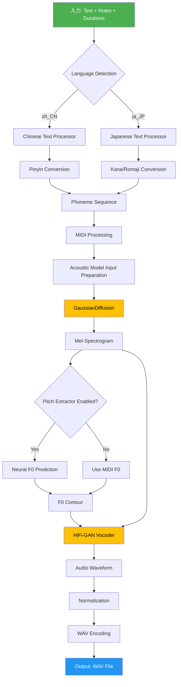
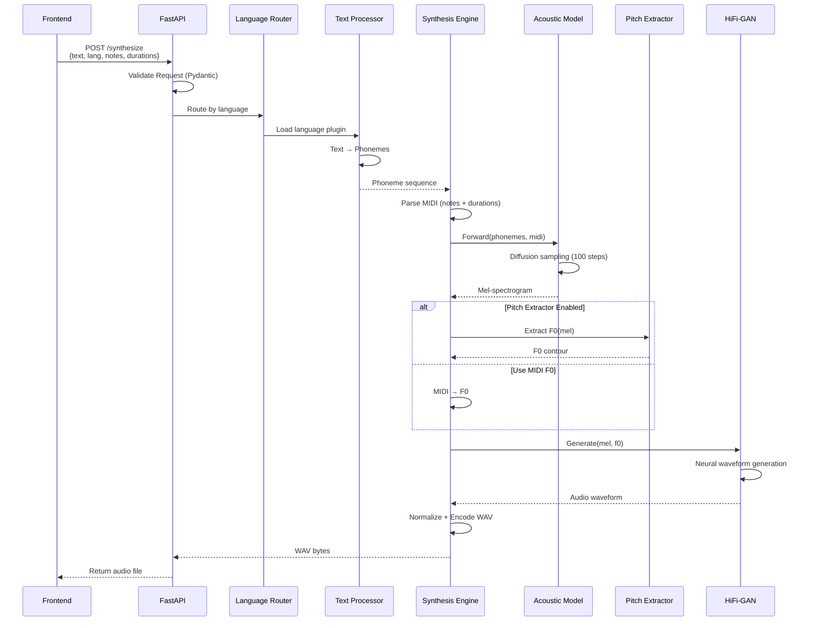
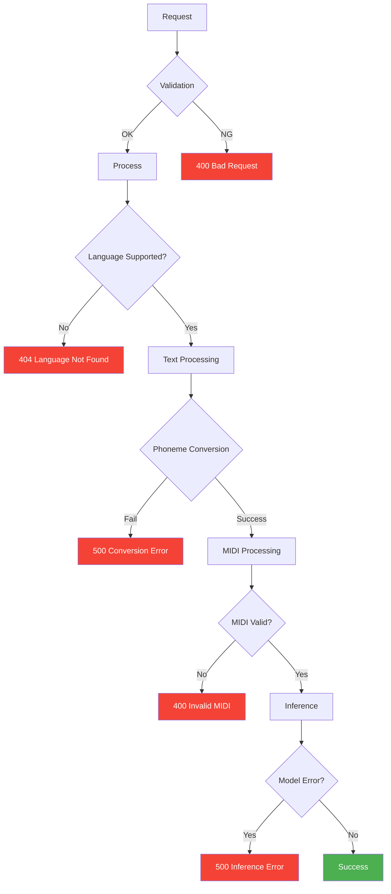

# データフロー・合成ルート詳細

**最終更新**: 2025-10-05
**バージョン**: 1.0.0

---

## 📋 目次

1. [完全合成パイプライン](#完全合成パイプライン)
2. [フェーズ別詳細](#フェーズ別詳細)
3. [言語別データフロー](#言語別データフロー)
4. [エラーハンドリング経路](#エラーハンドリング経路)
5. [パフォーマンス最適化](#パフォーマンス最適化)

---

## 完全合成パイプライン

### 全体フロー図



### シーケンス図



---

## フェーズ別詳細

### Phase 1: 入力処理・バリデーション

**入力形式**:
```python
class SynthesisRequest(BaseModel):
    text: str = Field(..., min_length=1, max_length=1000)
    language: str = Field(default="zh_CN", regex="^[a-z]{2}_[A-Z]{2}$")
    notes: str = Field(..., description="C4 | D4 | E4")
    durations: str = Field(..., description="0.5 | 0.5 | 1.0")
    speaker_id: int = Field(default=0, ge=0)
```

**バリデーションロジック**:
```python
def validate_input(request: SynthesisRequest):
    """
    入力データ検証

    検証項目:
    1. text: 非空文字列、最大1000文字
    2. language: ISO 639-1_ISO 3166-1形式（例: zh_CN, ja_JP）
    3. notes: |区切りのMIDI音名
    4. durations: |区切りの秒数
    5. notes数 == durations数
    """
    note_list = [n.strip() for n in request.notes.split('|') if n.strip()]
    dur_list = [d.strip() for d in request.durations.split('|') if d.strip()]

    if len(note_list) != len(dur_list):
        raise ValueError(
            f"Notes count ({len(note_list)}) != "
            f"Durations count ({len(dur_list)})"
        )

    # MIDI音名検証（C0-C8, #/b対応）
    midi_pattern = re.compile(r'^[A-G](#|b)?[0-8]$')
    for note in note_list:
        if not midi_pattern.match(note):
            raise ValueError(f"Invalid MIDI note: {note}")

    return True
```

### Phase 2: 音素変換

#### 中国語パス

```
入力: "小酒窝长睫毛"
    ↓
jieba分かち書き: ["小", "酒窝", "长", "睫毛"]
    ↓
G2pM変換: ["xiao3", "jiu3", "wo1", "chang2", "jie2", "mao2"]
    ↓
音素分割: ["x", "iao", "j", "iu", "w", "o", "ch", "ang", "j", "ie", "m", "ao"]
    ↓
エンコーディング: [57, 13, 20, 10, 56, 28, ...] (TokenTextEncoder)
```

**実装**:
```python
# languages/zh_CN/processor.py
class ChineseTextProcessor:
    def __init__(self):
        self.g2p = G2pM()
        self.tokenizer = jieba

    def convert(self, text: str) -> List[str]:
        """
        中国語テキスト → 音素列

        処理:
        1. 多音字補正（最长 → 最常）
        2. jieba分かち書き
        3. G2pM音素変換
        4. 声母・韻母分割
        """
        # 多音字補正
        text = self._fix_polyphones(text)

        # 拼音変換
        pinyins = self.g2p(text, tone=True, char_split=True)

        # 音素分割
        phonemes = []
        for pinyin in pinyins:
            phonemes.extend(self._split_pinyin(pinyin))

        return phonemes

    def _split_pinyin(self, pinyin: str) -> List[str]:
        """
        拼音 → 声母・韻母分割

        "xiao3" → ["x", "iao"]
        """
        # 声母リスト
        SHENMU = ['zh', 'ch', 'sh', 'b', 'p', 'm', 'f', 'd', 't', 'n', 'l',
                  'g', 'k', 'h', 'j', 'q', 'x', 'r', 'z', 'c', 's', 'y', 'w']

        # 韻母リスト
        YUNMU = ['a', 'ai', 'an', 'ang', 'ao', 'e', 'ei', 'en', 'eng', 'er',
                 'i', 'ia', 'ian', 'iang', 'iao', 'ie', 'in', 'ing', 'iong',
                 'iu', 'o', 'ong', 'ou', 'u', 'ua', 'uai', 'uan', 'uang',
                 'ui', 'un', 'uo', 'v', 'van', 've', 'vn']

        # 声調除去
        pinyin_no_tone = re.sub(r'[0-5]', '', pinyin)

        # 声母・韻母マッチング
        for shenmu in SHENMU:
            if pinyin_no_tone.startswith(shenmu):
                yunmu = pinyin_no_tone[len(shenmu):]
                if yunmu in YUNMU:
                    return [shenmu, yunmu]

        # 韻母のみ
        if pinyin_no_tone in YUNMU:
            return [pinyin_no_tone]

        return [pinyin_no_tone]
```

#### 日本語パス（計画）

```
入力: "こんにちは"
    ↓
MeCab形態素解析: ["こんにち", "は"]
    ↓
ひらがな確認: "こんにちは"
    ↓
ローマ字変換: "konnichiwa"
    ↓
音素分割: ["k", "o", "N", "n", "i", "ch", "i", "w", "a"]
    ↓
エンコーディング: [25, 30, 40, 25, 12, ...] (TokenTextEncoder)
```

**実装計画**:
```python
# languages/ja_JP/processor.py
class JapaneseTextProcessor:
    def __init__(self):
        self.mecab = MeCab.Tagger("-Owakati")
        self.kakasi = pykakasi.kakasi()

    def convert(self, text: str) -> List[str]:
        """
        日本語テキスト → 音素列

        処理:
        1. MeCab形態素解析
        2. 漢字 → ひらがな変換（pykakasi）
        3. ひらがな → ローマ字変換（romkan）
        4. ローマ字 → 音素分割
        """
        # 漢字 → ひらがな
        result = self.kakasi.convert(text)
        kana = ''.join([item['hira'] for item in result])

        # ひらがな → ローマ字
        romaji = romkan.to_roma(kana)

        # ローマ字 → 音素分割
        phonemes = self._split_romaji(romaji)

        return phonemes

    def _split_romaji(self, romaji: str) -> List[str]:
        """
        ローマ字 → 音素分割

        "konnichiwa" → ["k", "o", "N", "n", "i", "ch", "i", "w", "a"]
        """
        phonemes = []
        i = 0
        while i < len(romaji):
            # 2文字音素（ch, sh, ts等）
            if i + 1 < len(romaji):
                two_char = romaji[i:i+2]
                if two_char in ['ch', 'sh', 'ts', 'ky', 'gy', 'ny', ...]:
                    phonemes.append(two_char)
                    i += 2
                    continue

            # 1文字音素
            phonemes.append(romaji[i])
            i += 1

        # 促音（っ）処理: "N" に変換
        phonemes = [p if p != 'n' or i == 0 or phonemes[i-1] != 'n' else 'N'
                    for i, p in enumerate(phonemes)]

        return phonemes
```

### Phase 3: MIDI処理

**MIDI情報パース**:
```python
def parse_midi_info(notes: str, durations: str) -> Dict[str, torch.Tensor]:
    """
    MIDI文字列 → Tensor変換

    Args:
        notes: "C4 | D4 | E4"
        durations: "0.5 | 0.5 | 1.0"

    Returns:
        {
            "pitch_midi": tensor([60, 62, 64]),  # MIDI番号
            "midi_dur": tensor([12, 12, 24]),    # フレーム数
            "is_slur": tensor([0, 0, 0])         # スラーフラグ
        }
    """
    note_list = [n.strip() for n in notes.split('|') if n.strip()]
    dur_list = [float(d.strip()) for d in durations.split('|') if d.strip()]

    # MIDI音名 → MIDI番号変換
    pitch_midi = [note_to_midi(note) for note in note_list]

    # 秒 → フレーム数変換（hop_size=128, sr=24000）
    hop_size = 128
    sample_rate = 24000
    midi_dur = [int(dur * sample_rate / hop_size) for dur in dur_list]

    # スラー検出（ノート名に"~"接尾辞）
    is_slur = [1 if note.endswith('~') else 0 for note in note_list]

    return {
        "pitch_midi": torch.LongTensor(pitch_midi),
        "midi_dur": torch.FloatTensor(midi_dur),
        "is_slur": torch.LongTensor(is_slur)
    }

def note_to_midi(note: str) -> int:
    """
    音名 → MIDI番号

    "C4" → 60, "C#4" → 61, "Db4" → 61
    """
    # 音名パース
    match = re.match(r'([A-G])(#|b)?(\d)', note.strip('~'))
    if not match:
        raise ValueError(f"Invalid note: {note}")

    pitch_class, accidental, octave = match.groups()

    # ベースMIDI番号（C0 = 12）
    base = {
        'C': 0, 'D': 2, 'E': 4, 'F': 5,
        'G': 7, 'A': 9, 'B': 11
    }[pitch_class]

    # 変化記号
    if accidental == '#':
        base += 1
    elif accidental == 'b':
        base -= 1

    # オクターブ計算
    midi_num = base + (int(octave) + 1) * 12

    return midi_num
```

### Phase 4: Acoustic推論

**GaussianDiffusion処理**:
```python
def acoustic_inference(
    phonemes: torch.Tensor,
    pitch_midi: torch.Tensor,
    midi_dur: torch.Tensor,
    is_slur: torch.Tensor
) -> torch.Tensor:
    """
    音素 + MIDI → Mel-spectrogram

    Args:
        phonemes: [T_txt] 音素インデックス
        pitch_midi: [T_note] MIDI番号
        midi_dur: [T_note] フレーム数
        is_slur: [T_note] スラーフラグ

    Returns:
        mel: [T_mel, 80] Mel-spectrogram
    """
    # モデル準備
    model = GaussianDiffusion(...)
    model.eval()

    with torch.no_grad():
        # Forward推論
        output = model(
            txt_tokens=phonemes.unsqueeze(0),  # [1, T_txt]
            pitch_midi=pitch_midi.unsqueeze(0),  # [1, T_note]
            midi_dur=midi_dur.unsqueeze(0),  # [1, T_note]
            is_slur=is_slur.unsqueeze(0),  # [1, T_note]
            infer=True
        )

        mel = output['mel_out']  # [1, T_mel, 80]

    return mel.squeeze(0)  # [T_mel, 80]
```

### Phase 5: Vocoder推論

**HiFi-GAN処理**:
```python
def vocoder_inference(mel: torch.Tensor, f0: torch.Tensor) -> np.ndarray:
    """
    Mel + F0 → 音声波形

    Args:
        mel: [T, 80] Mel-spectrogram
        f0: [T] F0 contour

    Returns:
        wav: [T_wav] 音声波形
    """
    # Vocoder準備
    vocoder = HifiGAN(...)
    vocoder.eval()

    # 入力整形
    mel = mel.transpose(0, 1).unsqueeze(0)  # [1, 80, T]
    f0 = f0.unsqueeze(0)  # [1, T]

    with torch.no_grad():
        wav = vocoder(mel, f0)  # [1, T_wav]

    return wav.squeeze(0).cpu().numpy()
```

---

## 言語別データフロー

### 中国語フロー

```
"小酒窝"
  ↓ (jieba)
["小", "酒窝"]
  ↓ (G2pM)
["xiao3", "jiu3", "wo1"]
  ↓ (split)
["x", "iao", "j", "iu", "w", "o"]
  ↓ (encode)
[57, 13, 20, 10, 56, 28]
  ↓ (+ MIDI)
Acoustic Model → Mel
  ↓
Vocoder → WAV
```

### 日本語フロー（計画）

```
"桜"
  ↓ (MeCab + pykakasi)
"さくら"
  ↓ (romkan)
"sakura"
  ↓ (split)
["s", "a", "k", "u", "r", "a"]
  ↓ (encode)
[35, 1, 25, 32, 34, 1]
  ↓ (+ MIDI)
Acoustic Model → Mel
  ↓
Vocoder → WAV
```

---

## エラーハンドリング経路



---

## パフォーマンス最適化

### バッチ処理

```python
async def synthesize_batch(requests: List[SynthesisRequest]) -> List[bytes]:
    """
    バッチ合成（並列処理）

    複数リクエストを同時処理してスループット向上
    """
    tasks = [synthesize_single(req) for req in requests]
    results = await asyncio.gather(*tasks)
    return results
```

### キャッシング戦略

```python
from functools import lru_cache

@lru_cache(maxsize=1000)
def convert_text_to_phonemes(text: str, language: str) -> Tuple[str, ...]:
    """
    音素変換結果キャッシュ

    同じテキストの再変換を回避
    """
    processor = get_processor(language)
    phonemes = processor.convert(text)
    return tuple(phonemes)  # リスト → タプル（hashable）
```

---

**作成者**: Claude Code
**レビュー**: 未
**承認**: 未
