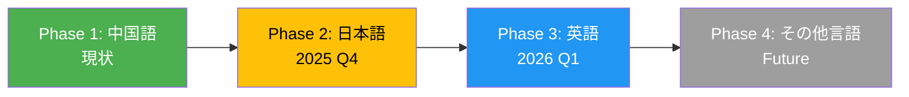
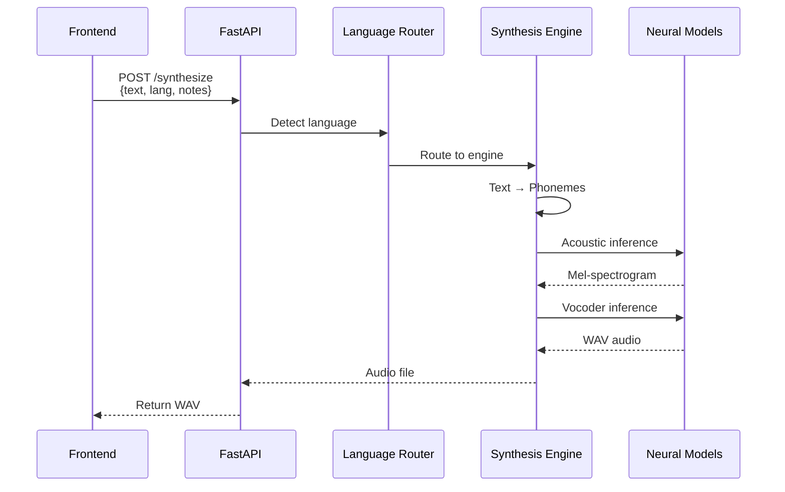

# DiffSinger統合概要

**最終更新**: 2025-10-05
**バージョン**: 1.0.0
**ステータス**: 設計フェーズ

---

## 📋 目次

1. [概要](#概要)
2. [プロジェクト位置づけ](#プロジェクト位置づけ)
3. [多言語対応戦略](#多言語対応戦略)
4. [技術スタック](#技術スタック)
5. [主要コンポーネント](#主要コンポーネント)
6. [現状と課題](#現状と課題)
7. [ロードマップ](#ロードマップ)

---

## 概要

### DiffSingerとは

DiffSingerは、深層学習ベースの歌声合成（Singing Voice Synthesis, SVS）システムです。テキスト、メロディ（MIDI）、歌詞から高品質な歌声を生成します。

**主な特徴:**
- 🎵 **Diffusion Model**: 高品質なメル・スペクトログラム生成
- 🎤 **MIDI対応**: ノート情報（音高・長さ）との統合
- 🌐 **多言語対応**: 拼音（中国語）、ローマ字（日本語）等
- 🔊 **Neural Vocoder**: HiFi-GANによる自然な音声合成

### プロジェクトにおける役割

本プロジェクトでは、DiffSingerをバックエンドの**AI歌声合成エンジン**として統合します。

```
DAWAI Project Architecture
┌─────────────────────────────────────────────┐
│            Frontend (React)                 │
│  - MIDI Editor                              │
│  - Lyrics Input                             │
│  - AI Assistant Chat                        │
└─────────────────┬───────────────────────────┘
                  │ REST API
┌─────────────────▼───────────────────────────┐
│         Backend (FastAPI)                   │
│  ┌──────────────────────────────────────┐   │
│  │   DiffSinger Integration Layer       │   │
│  │  - Language Router                   │   │
│  │  - Synthesis Engine                  │   │
│  │  - Multi-language Support            │   │
│  └──────────────────────────────────────┘   │
│  ┌──────────────────────────────────────┐   │
│  │   AI Agent Engine                    │   │
│  │  - Claude/OpenAI Integration         │   │
│  └──────────────────────────────────────┘   │
└─────────────────────────────────────────────┘
```

---

## プロジェクト位置づけ

### 統合レベル

DiffSingerは以下のレベルで統合されます：

1. **データレベル**: MIDI + 歌詞データの受信
2. **処理レベル**: AI音声合成パイプライン
3. **サービスレベル**: FastAPI REST エンドポイント
4. **UIレベル**: Reactフロントエンドとの連携

### 他システムとの連携

| システム | 連携方法 | データフロー |
|---------|---------|-------------|
| MIDI Editor | JSON API | MIDI notes → DiffSinger |
| Lyrics Editor | JSON API | Text → Phoneme conversion |
| AI Assistant | 推論リクエスト | 歌詞提案 → DiffSinger |
| Audio Player | WAV返却 | Generated audio → Frontend |

---

## 多言語対応戦略

### 段階的展開



### Phase 1: 中国語（現状）

**実装状況**: ✅ 完了

- **音素体系**: 拼音（pinyin）
- **G2P変換**: G2pM ライブラリ
- **チェックポイント**: opencpop データセット学習済み
- **テストデータ**: 中国語歌詞で検証済み

**成功例:**
```python
# 入力
lyrics = "小酒窝长睫毛"
notes = "C#4/Db4 | F#4/Gb4 | G#4/Ab4 | A#4/Bb4"
durations = "0.4 | 0.4 | 0.4 | 0.4"

# 出力
# outputs/neural_output.wav (高品質歌声)
```

### Phase 2: 日本語（計画中）

**実装計画**: 🚧 設計フェーズ

- **音素体系**: ローマ字 or かな
- **G2P変換**: MeCab + UniDic
- **チェックポイント**: 日本語データセット学習必要
- **課題**:
  - ONNX形式の日本語モデル作成
  - 音素辞書構築
  - テキストプロセッサ実装

**技術選択肢:**

| 方式 | 利点 | 欠点 |
|-----|------|------|
| ローマ字音素 | 既存DiffSingerモデル流用可能 | 表記揺れ対応必要 |
| かな音素 | 日本語自然 | モデル再学習必要 |
| モーラベース | リズム正確 | 実装複雑 |

**推奨**: ローマ字音素（初期実装）→ かな音素（最適化版）

### Phase 3以降: 拡張戦略

- **プラグインアーキテクチャ**: 新言語を独立モジュールとして追加
- **共通インターフェース**: `BaseSynthesisEngine` 抽象クラス
- **設定駆動**: YAML設定ファイルで言語切り替え

---

## 技術スタック

### コアコンポーネント

#### 1. Acoustic Model（音響モデル）

**実装**: GaussianDiffusion (Shallow Diffusion)

```python
# backend/diffsinger_engine/usr/diff/shallow_diffusion_tts.py
class GaussianDiffusion:
    """
    Diffusion-based Mel-spectrogram生成

    パラメータ:
    - timesteps: 100 (diffusion steps)
    - K_step: 100 (shallow diffusion depth)
    """
```

**特徴:**
- **入力**: 音素列 + MIDI情報
- **出力**: Mel-spectrogram (80 bins)
- **モデルサイズ**: ~100MB
- **推論速度**: ~2秒（RTX 3090）

#### 2. Pitch Extractor（ピッチ抽出器）

**実装**: Neural Pitch Extractor

```python
# backend/diffsinger_engine/modules/fastspeech/pe.py
class PitchExtractor:
    """
    Mel-spectrogramからF0予測

    用途: より自然なピッチカーブ生成
    """
```

**特徴:**
- **入力**: Mel-spectrogram
- **出力**: F0 contour (基本周波数)
- **有効化**: `pe_enable: true` (config.yaml)

#### 3. Vocoder（ボコーダー）

**実装**: HiFi-GAN (NSF-HiFiGAN)

```python
# backend/diffsinger_engine/vocoders/hifigan.py
class HifiGAN:
    """
    Mel-spectrogram → 音声波形変換

    仕様:
    - Sample Rate: 24000 Hz
    - Hop Size: 128
    - NSF (Neural Source Filter) 対応
    """
```

**特徴:**
- **入力**: Mel-spectrogram + F0
- **出力**: 音声波形 (WAV)
- **品質**: MOS 4.0+ (主観評価)

#### 4. Text Processor（テキストプロセッサ）

**中国語実装**: G2pM

```python
# backend/diffsinger_engine/data_gen/tts/txt_processors/zh_g2pM.py
class TxtProcessor:
    """
    中国語テキスト → 拼音変換

    依存ライブラリ:
    - g2pM: Grapheme-to-Phoneme変換
    - jieba: 中国語分かち書き
    - pypinyin: 拼音変換
    """
```

**処理フロー:**
```
"小酒窝" → jieba分割 → ["小", "酒窝"]
         → G2pM変換 → ["xiao3", "jiu3", "wo1"]
         → 音素分割 → ["x", "iao", "j", "iu", "w", "o"]
```

### 依存ライブラリ

```yaml
Python環境:
  - python: ">=3.11"
  - torch: ">=2.0.0"
  - numpy: ">=1.24.0"

DiffSinger固有:
  - g2pM: "中国語G2P変換"
  - pypinyin: "拼音変換"
  - jieba: "中国語分かち書き"
  - librosa: "音声処理"
  - scipy: "科学計算"

FastAPI統合:
  - fastapi: "REST API"
  - pydantic: "データバリデーション"
  - uvicorn: "ASGI Server"
```

---

## 主要コンポーネント

### システムアーキテクチャ

```
┌─────────────────────────────────────────────────────┐
│                 FastAPI Application                 │
└─────────────────────┬───────────────────────────────┘
                      │
          ┌───────────▼──────────┐
          │  Language Router     │
          │  (言語選択・振り分け) │
          └───────────┬──────────┘
                      │
        ┌─────────────┴─────────────┐
        │                           │
   ┌────▼─────┐              ┌─────▼────┐
   │ ZH Engine│              │ JA Engine│
   │ (中国語)  │              │ (日本語)  │
   └────┬─────┘              └─────┬────┘
        │                           │
        └─────────────┬─────────────┘
                      │
          ┌───────────▼──────────────────┐
          │   Core Inference Engine      │
          │  ┌────────────────────────┐  │
          │  │  Acoustic Model        │  │
          │  │  (GaussianDiffusion)   │  │
          │  └────────────────────────┘  │
          │  ┌────────────────────────┐  │
          │  │  Pitch Extractor       │  │
          │  └────────────────────────┘  │
          │  ┌────────────────────────┐  │
          │  │  HiFi-GAN Vocoder      │  │
          │  └────────────────────────┘  │
          └──────────────────────────────┘
```

### データフロー概要



---

## 現状と課題

### ✅ 実装完了（Phase 1）

**中国語歌声合成システム:**

1. **Neural Network推論**: ✅ 動作確認済み
   - `backend/diffsinger_engine/neural_inference.py`
   - GaussianDiffusion + HiFi-GAN統合

2. **音素変換**: ✅ G2pM統合完了
   - 中国語テキスト → 拼音 → 音素列
   - 多音字対応、声調処理

3. **MIDI統合**: ✅ ノート情報処理
   - 音高（pitch_midi）
   - デュレーション（midi_dur）
   - スラー（is_slur）

4. **検証**: ✅ テストケース通過
   ```bash
   python backend/diffsinger_engine/neural_inference.py \
     --lyrics "小酒窝长睫毛" \
     --notes "C#4/Db4 | F#4/Gb4 | G#4/Ab4 | A#4/Bb4" \
     --durations "0.4 | 0.4 | 0.4 | 0.4"
   # 出力: outputs/neural_output.wav (成功)
   ```

### ⚠️ 改善必要項目

#### 1. コード重複問題

**現状:**
```
backend/diffsinger_engine/
├── data_gen/               # DiffSinger公式コード
├── inference/              # DiffSinger公式コード
├── modules/                # DiffSinger公式コード
└── DiffSinger/             # 🚨 同じファイルが重複
    ├── data_gen/
    ├── inference/
    └── modules/
```

**影響:**
- ディスク使用量: 2倍
- 保守性: 変更時に2箇所修正必要
- 混乱: どちらが正しいか不明確

**解決策:**
- 重複削除、単一ソースに統一
- シンボリックリンクまたはサブモジュール化

#### 2. ハードコーディング問題

**問題箇所:**

```python
# backend/diffsinger_engine/inference/svs/base_svs_infer.py:25-28
phone_list = ["AP", "SP", "a", "ai", "an", "ang", ...]  # 🚨 中国語音素固定
self.ph_encoder = TokenTextEncoder(None, vocab_list=phone_list)
self.pinyin2phs = cpop_pinyin2ph_func()  # 🚨 中国語専用関数
```

**影響:**
- 言語切り替え不可
- 新言語追加困難
- テストモック不可

**解決策:**
- 設定ファイル化（YAML/JSON）
- 依存性注入（DI）
- プラグインアーキテクチャ

#### 3. 言語依存コード混在

**問題:**
```python
# 推論エンジンに中国語専用ロジック混在
def preprocess_word_level_input(self, inp):
    text_raw = inp['text'].replace('最长', '最常')  # 🚨 中国語専用処理
    pinyins = lazy_pinyin(text_raw)  # 🚨 拼音変換
```

**解決策:**
- 言語非依存の基底クラス抽象化
- 言語固有処理を別モジュールへ分離

### 🎯 改善目標

| 項目 | 現状 | 目標 |
|-----|------|------|
| コード重複 | 2倍 | 0% (単一ソース) |
| 言語対応 | 中国語のみ | 中国語+日本語 |
| 拡張性 | ハードコーディング | プラグイン方式 |
| 保守性 | 散在 | モジュール化 |
| テスタビリティ | 低 | 高（DI, Mock対応） |

---

## ロードマップ

### Phase 1: コード整理（2週間）

**Week 1: 重複削除・リファクタリング**

- [ ] `DiffSinger/`ディレクトリ削除
- [ ] 単一ソースに統一
- [ ] インポートパス修正
- [ ] 動作確認テスト

**Week 2: アーキテクチャ基盤構築**

- [ ] `BaseSynthesisEngine` 抽象クラス作成
- [ ] `LanguageRegistry` 実装
- [ ] 設定ファイル外部化
- [ ] 統合テスト

### Phase 2: プラグイン化（3週間）

**Week 1: 中国語プラグイン化**

- [ ] `languages/zh_CN/` ディレクトリ構築
- [ ] `ChineseEngine` 実装
- [ ] 設定ファイル分離
- [ ] 既存機能移行

**Week 2-3: 日本語プラグイン実装**

- [ ] `languages/ja_JP/` ディレクトリ構築
- [ ] MeCab統合
- [ ] 音素辞書作成
- [ ] `JapaneseEngine` 実装
- [ ] 日本語テストケース

### Phase 3: FastAPI統合（1週間）

- [ ] REST API エンドポイント実装
- [ ] Pydantic モデル定義
- [ ] 言語自動検出
- [ ] エラーハンドリング
- [ ] API ドキュメント生成

### Phase 4: フロントエンド統合（2週間）

- [ ] React DiffSinger コンポーネント
- [ ] 言語選択UI
- [ ] リアルタイムプレビュー
- [ ] E2Eテスト

---

## まとめ

### 現在地

- ✅ 中国語歌声合成: 動作確認済み
- 🚧 多言語対応: アーキテクチャ設計中
- 📋 日本語対応: 計画フェーズ

### 次のステップ

1. **即座に対応**: コード重複削除
2. **重要施策**: プラグインアーキテクチャ構築
3. **長期目標**: 日本語ONNX モデル学習・統合

### 参照ドキュメント

- [多言語アーキテクチャ設計](../architecture/multilingual_architecture.md)
- [データフロー・合成ルート](../design/dataflow_synthesis.md)
- [ファイル構造設計](../design/file_structure.md)
- [実装ガイド](../design/implementation_guide.md)

---

**作成者**: Claude Code
**レビュー**: 未
**承認**: 未
