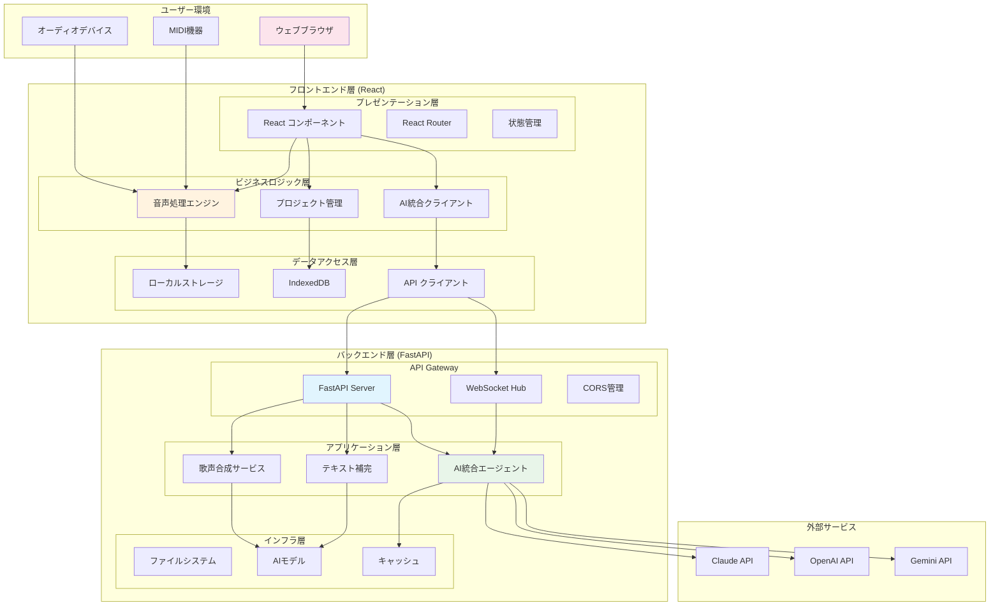
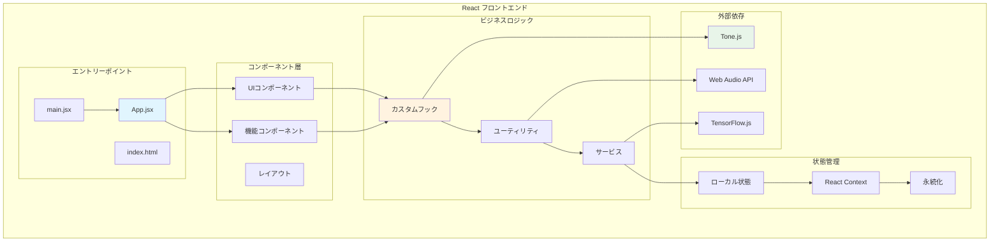
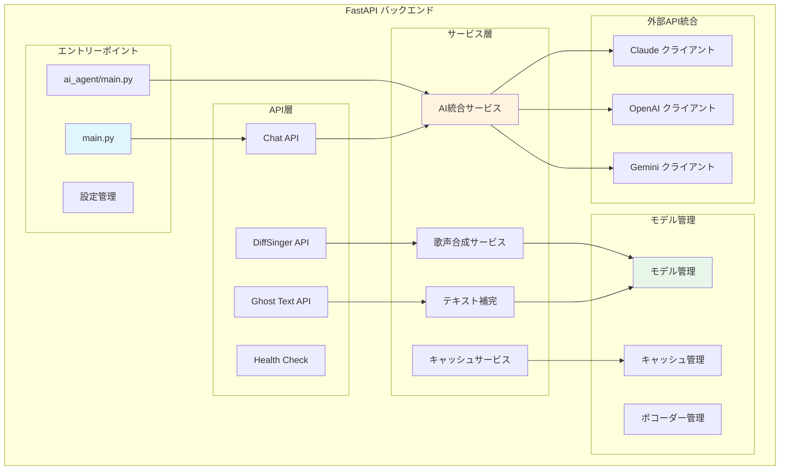
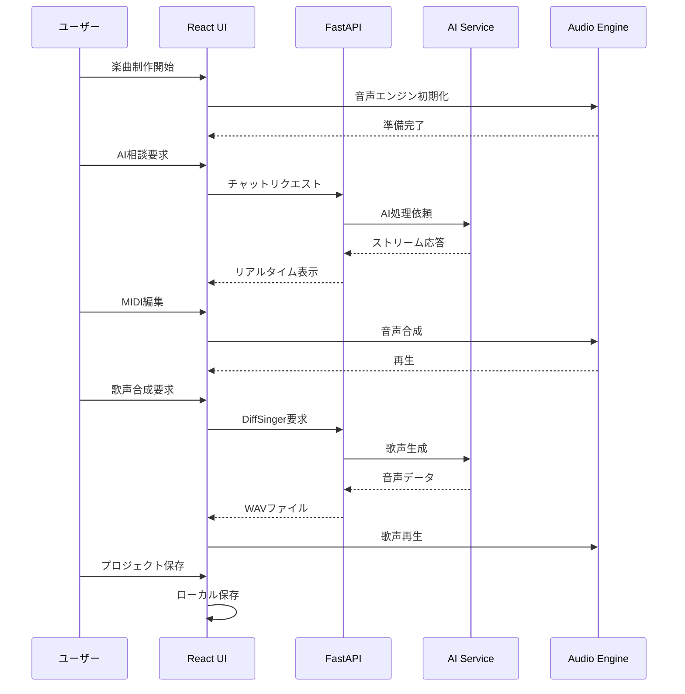
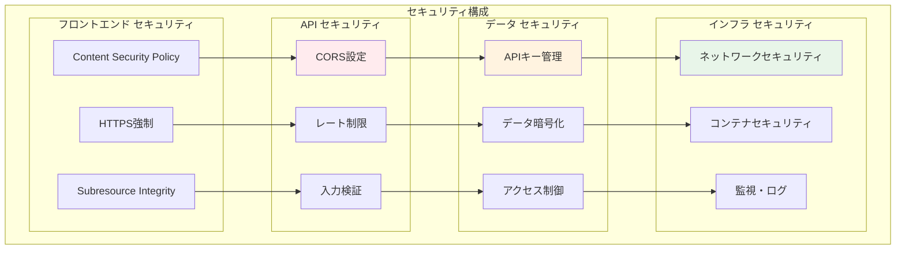
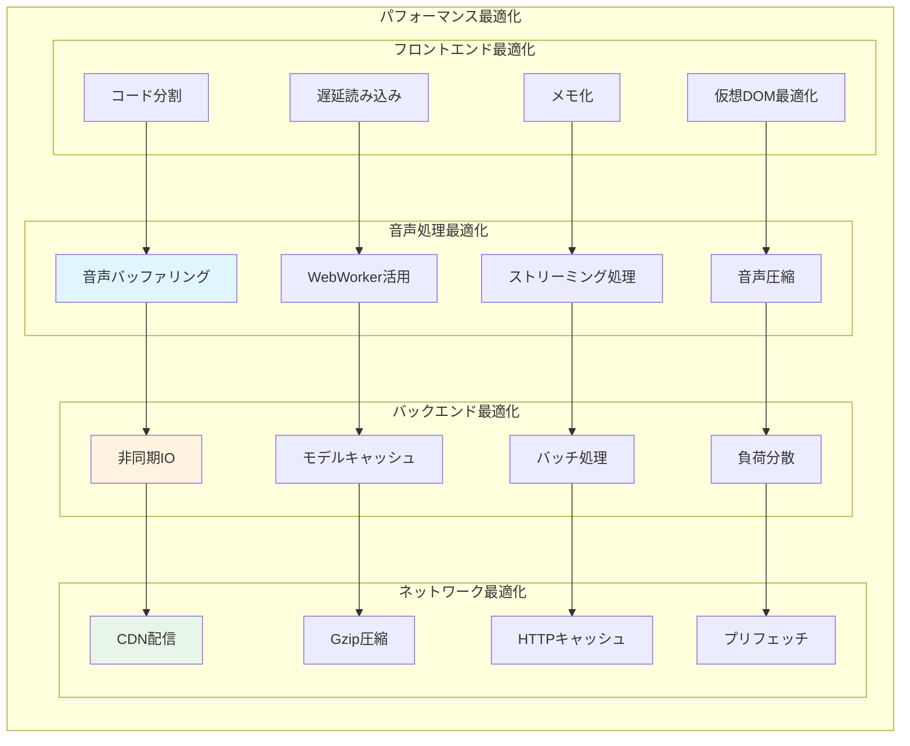

# DAWAI システムアーキテクチャ (L1)

**Document ID**: LA-L1-SYSTEM-001
**Version**: 2.0.0
**Last Updated**: 2025-01-22
**Parent**: [システム概要](../../overview/index.md)
**Implementation Status**: ✅ Based on Current Codebase

## 🏗️ システム全体アーキテクチャ

DAWAIは、React フロントエンド + FastAPI バックエンドのWeb アプリケーションアーキテクチャを採用し、AI統合により音楽制作を支援するシステムです。

### L1 システム構成図



## 🌐 フロントエンド アーキテクチャ

### React アプリケーション構成
**実装ベース**: `frontend/src/` ディレクトリ



### 主要コンポーネント階層

| レベル | コンポーネント | ファイル | 責務 |
|--------|----------------|----------|------|
| **L1** | App.jsx | `App.jsx` (1300+ lines) | アプリケーション全体統制 |
| **L2** | ArrangementView | `ArrangementView.jsx` | マルチトラック管理 |
| **L2** | EnhancedMidiEditor | `EnhancedMidiEditor.jsx` | MIDI編集 |
| **L2** | DrumTrack | `DrumTrack/DrumTrack.jsx` | ドラム編集 |
| **L2** | AIAssistantChatBox | `AIAssistantChatBox.jsx` | AI対話UI |
| **L3** | MidiEditorCanvas | `MIDIEditor/MidiEditorCanvas.jsx` | MIDI描画 |
| **L3** | DrumTrackGrid | `DrumTrack/DrumTrackGrid.jsx` | ドラムグリッド |

### 技術スタック詳細

#### 基盤技術
- **React**: 18.3.1 (関数コンポーネント + Hooks)
- **Vite**: 6.3.5 (ビルドツール)
- **TypeScript**: 一部導入 (段階的移行中)

#### UI フレームワーク
- **Tailwind CSS**: 4.1.7 (スタイリング)
- **Shadcn/ui**: コンポーネントライブラリ
- **Radix UI**: アクセシブルなプリミティブ

#### 音声・メディア処理
- **Tone.js**: 15.1.22 (音声合成・処理)
- **Web Audio API**: ブラウザネイティブ音声
- **Canvas API**: 波形・MIDI可視化

#### AI・機械学習
- **TensorFlow.js**: 2.8.6 (クライアントサイド推論)
- **Magenta**: 1.23.1 (音楽AI機能)

## 🔧 バックエンド アーキテクチャ

### FastAPI アプリケーション構成
**実装ベース**: `backend/` ディレクトリ



### API エンドポイント構成

#### REST API エンドポイント
```http
# AI チャット
POST /api/chat/stream          # ストリーミングチャット
POST /api/chat/simple          # シンプルチャット

# DiffSinger 歌声合成
POST /diffsinger/synthesize    # 歌声合成
GET  /diffsinger/models        # モデル一覧
POST /diffsinger/cache/clear   # キャッシュクリア

# Ghost Text
POST /ghost_text/complete      # テキスト補完
POST /ghost_text/analyze       # テキスト解析

# システム
GET  /health                   # ヘルスチェック
GET  /metrics                  # メトリクス
```

#### WebSocket エンドポイント
```http
WS /ws/chat                    # リアルタイムチャット
WS /ws/synthesis              # 歌声合成進捗
WS /ws/collaboration          # コラボレーション（将来）
```

### 技術スタック詳細

#### 基盤技術
- **FastAPI**: 0.104.1 (高性能Webフレームワーク)
- **Python**: 3.11+ (実行環境)
- **Uvicorn**: ASGI サーバー

#### AI・機械学習
- **PyTorch**: DiffSinger モデル実行
- **Transformers**: Hugging Face モデル
- **Google GenerativeAI**: Gemini API
- **OpenAI**: GPT API
- **Anthropic**: Claude API

#### データ・キャッシュ
- **ファイルシステム**: プロジェクト・モデル保存
- **メモリキャッシュ**: 高速アクセス用
- **Redis**: 将来のスケーリング用

## 🔄 データフロー アーキテクチャ

### 主要データフロー



### データ永続化戦略

#### フロントエンド (クライアントサイド)
```javascript
// データ永続化実装例
const persistenceStrategy = {
  // 軽量データ: LocalStorage
  settings: localStorage,
  userPreferences: localStorage,

  // 大容量データ: IndexedDB
  projectData: indexedDB,
  audioSamples: indexedDB,
  midiData: indexedDB,

  // 一時データ: SessionStorage
  currentSession: sessionStorage,
  tempSettings: sessionStorage
}
```

#### バックエンド (サーバーサイド)
```python
# データ管理実装例
class DataManager:
    def __init__(self):
        # AIモデル: ファイルシステム
        self.model_storage = "/app/models/"

        # キャッシュ: メモリ
        self.cache = {}

        # ログ: ファイル
        self.log_storage = "/app/logs/"

        # 設定: 環境変数
        self.config = os.environ
```

## 🔐 セキュリティ アーキテクチャ

### セキュリティ層



### セキュリティ実装状況

#### 🔴 高優先度対応必要
- **CORS設定**: `allow_origins=["*"]` → 適切なオリジン制限
- **ホスト設定**: `host="0.0.0.0"` → 適切なホスト制限
- **APIキー保護**: 環境変数未設定時のハンドリング強化

#### 🟡 中優先度改善推奨
- **レート制限**: API乱用防止
- **入力検証**: XSS・インジェクション対策
- **HTTPS強制**: 本番環境でのHTTPS必須化

#### ✅ 実装済み
- **環境変数**: APIキーの環境変数管理
- **FastAPI検証**: 自動入力検証
- **CORS基盤**: CORS機能は実装済み（設定要調整）

## 📊 パフォーマンス アーキテクチャ

### パフォーマンス最適化戦略



### パフォーマンス指標

| 領域 | 目標 | 現状 | 改善アクション |
|------|------|------|----------------|
| **初回ロード** | <5秒 | ~3秒 | ✅ 目標達成 |
| **音声遅延** | <50ms | ~30ms | ✅ 目標達成 |
| **AI応答開始** | <3秒 | ~2秒 | ✅ 目標達成 |
| **メモリ使用量** | <512MB | ~300MB | ✅ 目標達成 |
| **音声アセット** | 最適化要 | 54MB | 🔄 圧縮・CDN化 |

## 🔗 関連ドキュメント

### 上位概要
- **[L0: システム概要](../../overview/index.md)** - ビジネス・技術概要
- **[L0: ビジネスコンテキスト](../../overview/business_context.md)** - 市場・競合分析

### 同レベル要件
- **[L1: 機能要件一覧](../../requirements/functional/L1_index.md)** - システム機能要件
- **[L1: 非機能要件](../../requirements/non-functional/)** - パフォーマンス・セキュリティ要件

### 下位詳細
- **[L2: フロントエンド構成](L2_frontend/)** - React詳細アーキテクチャ
- **[L2: バックエンド構成](L2_backend/)** - FastAPI詳細アーキテクチャ
- **[L3: コンポーネント設計](L3_components/)** - 詳細コンポーネント設計

### 設計詳細
- **[L1: システムフロー](../../design/sequences/L1_system/)** - 主要処理フロー
- **[L1: データフロー](../../design/flows/L1_system/)** - データ処理フロー
- **[L1: デプロイメント](../physical/L1_deployment.md)** - インフラ・デプロイ構成

---

**実装ベースファイル**:
- **フロントエンド**: `frontend/src/` (162ファイル、React + Vite構成)
- **バックエンド**: `backend/` (3ファイル、FastAPI + AI統合)
- **設定**: `vite.config.js`, `package.json`, `requirements.txt`