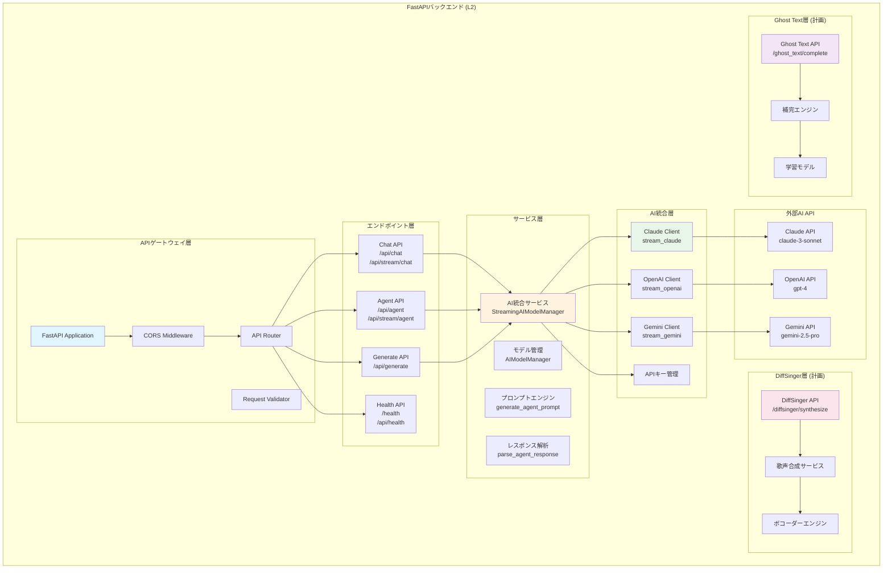
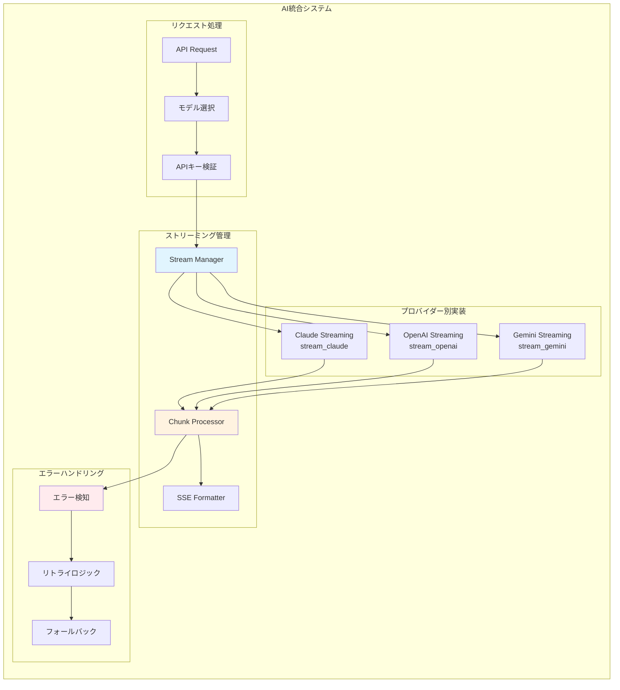
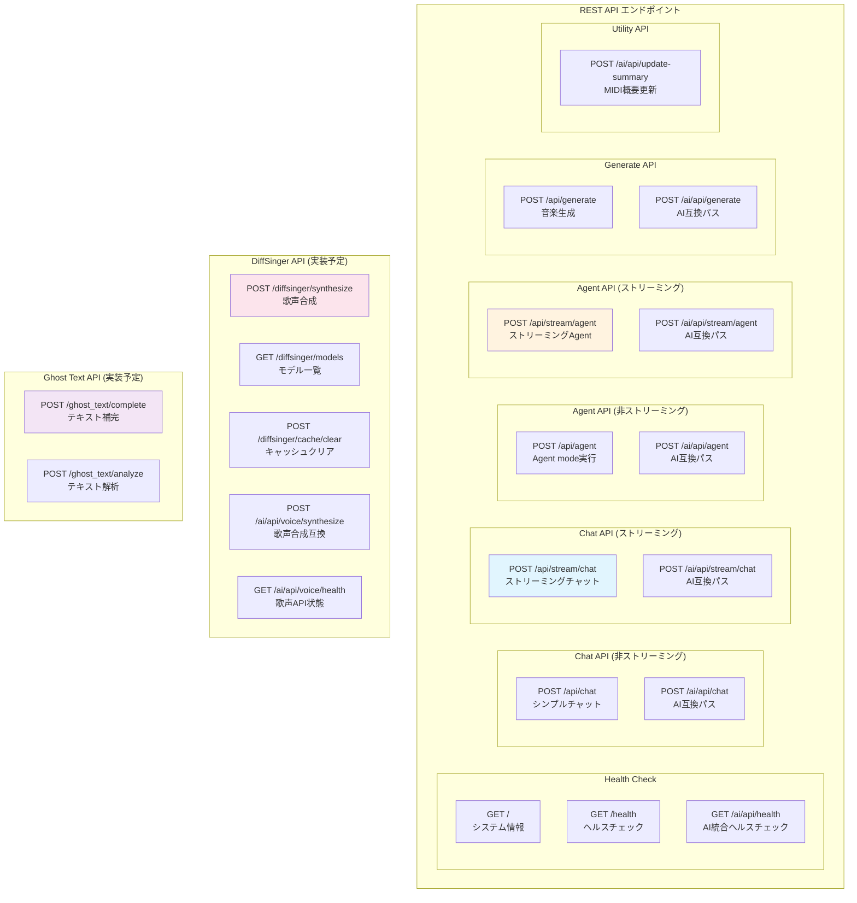
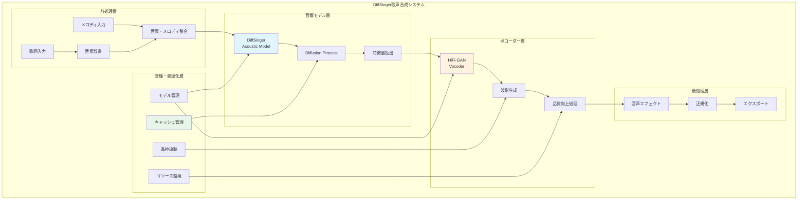
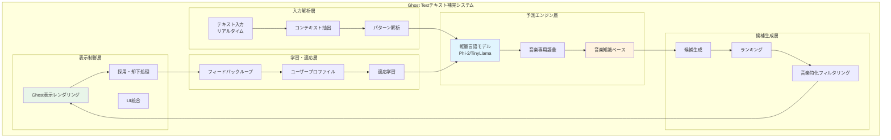
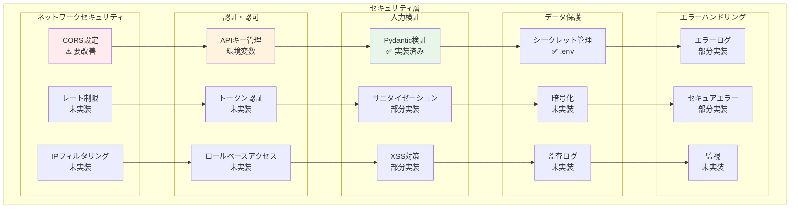
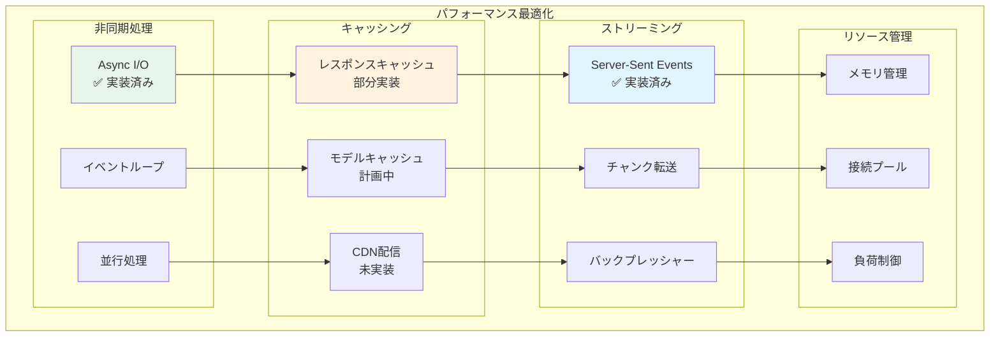

# DAWAI バックエンドアーキテクチャ (L2)

**Document ID**: LA-L2-BACKEND-001
**Version**: 2.0.0
**Last Updated**: 2025-10-05
**Parent**: [L1: システムアーキテクチャ](../L1_system.md)
**Implementation Status**: ✅ Based on Current Codebase

## 🏗️ バックエンドシステム概要

DAWAIのバックエンドは、FastAPIフレームワークを基盤とした高性能Webアプリケーションサーバーです。AI統合エージェント、歌声合成(DiffSinger)、テキスト補完(Ghost Text)の3つの主要機能を提供し、複数のAIプロバイダー(Claude/OpenAI/Gemini)との統合を実現しています。

### L2 バックエンド構成図



## 🎯 FastAPI アプリケーション詳細構成

### エントリーポイント

**実装ファイル**: `backend/ai_agent/main.py` (1390行)

```python
# FastAPIアプリケーション初期化
app = FastAPI(
    title="Melodia Composer Copilot API",
    description="AI-powered music composition assistant API with streaming support",
    version="1.0.0"
)

# CORS設定 (⚠️ セキュリティ要改善)
app.add_middleware(
    CORSMiddleware,
    allow_origins=[
        "http://localhost:5173",  # Vite開発サーバー
        "http://localhost:3000",  # 代替ポート
        "http://127.0.0.1:5173",
        "http://127.0.0.1:3000"
    ],
    allow_credentials=True,
    allow_methods=["GET", "POST", "PUT", "DELETE", "OPTIONS"],
    allow_headers=["*"],
)
```

### 技術スタック

```yaml
フレームワーク:
  - FastAPI: 0.112.0+ (高性能Webフレームワーク)
  - Uvicorn: 0.30.0+ (ASGIサーバー)
  - Pydantic: 2.9.2+ (データ検証)

HTTP・通信:
  - aiohttp: 3.10.10+ (非同期HTTPクライアント)
  - requests: 2.32.3+ (同期HTTPクライアント)
  - python-multipart: 0.0.9+ (マルチパートフォーム処理)

AI・機械学習:
  - google-generativeai: 0.7.2+ (Gemini API)
  - numpy: 2.1.0+ (数値計算)
  - soundfile: 0.12.1+ (音声ファイルI/O)
  - librosa: 0.10.1+ (音声解析)
  - onnxruntime: 1.18.0+ (AI推論エンジン)

ユーティリティ:
  - python-dotenv: 1.0.1+ (環境変数管理)
  - PyYAML: 6.0.1+ (YAML処理)
  - tqdm: 4.66.4+ (進捗表示)
  - psutil: 5.9.0+ (システム監視)
```

## 🤖 AI統合アーキテクチャ

### マルチAIプロバイダー統合



### AI統合実装詳細

#### A. StreamingAIModelManager クラス

**実装**: `backend/ai_agent/main.py:102-424`

```python
class StreamingAIModelManager:
    """ストリーミング対応AI統合マネージャー"""

    def __init__(self):
        self.default_api_keys = DEFAULT_API_KEYS

    def get_api_key(self, provider: str, custom_keys: Optional[Dict[str, str]] = None) -> Optional[str]:
        """APIキー取得（カスタムキー優先、デフォルトフォールバック）"""
        if custom_keys and provider in custom_keys and custom_keys[provider]:
            return custom_keys[provider]
        return self.default_api_keys.get(provider)

    async def stream_claude(self, message: str, context: Any = "", api_key: str = None):
        """Claude APIストリーミング呼び出し"""
        # 音楽制作特化プロンプト構築
        # Anthropic Messages API呼び出し
        # Server-Sent Events形式でストリーム返却

    async def stream_openai(self, message: str, context: Any = "", api_key: str = None):
        """OpenAI APIストリーミング呼び出し"""
        # GPT-4 Chat Completions API呼び出し
        # ストリーミングレスポンス処理

    async def stream_gemini(self, message: str, context: Any = "", api_key: str = None):
        """Gemini APIストリーミング呼び出し"""
        # Gemini Generative AI API呼び出し
        # 文字単位疑似ストリーミング (API制限のため)
```

#### B. 音楽制作専用プロンプト構築

**実装**: `backend/ai_agent/main.py:120-172`

```python
# 音楽制作専用システムプロンプト
system_prompt = """あなたは音楽制作のエキスパートアシスタントです。
ユーザーの音楽制作に関する質問や要求に対して、専門的で実用的なアドバイスを提供してください。

以下の分野について詳しく回答できます：
- 作曲・編曲のテクニック
- 楽器の演奏方法
- 音楽理論
- DAWの使い方
- ミキシング・マスタリング
- 音楽ジャンルの特徴
- MIDI編集

回答は日本語で、分かりやすく具体的に説明してください。"""

# プロジェクトコンテキスト統合
context_info = f"""
【現在のプロジェクト情報】
プロジェクト名: {project.get('name', 'Unknown')}
テンポ: {project.get('tempo', 'Unknown')} BPM
キー: {project.get('key', 'Unknown')}
拍子: {project.get('timeSignature', 'Unknown')}
再生時間: {project.get('currentTime', 0):.1f}s / {project.get('totalDuration', 0):.1f}s
再生状態: {'再生中' if project.get('isPlaying') else '停止中'}
トラック数: {project.get('tracksCount', 0)}

【現在選択中のトラック】
トラック名: {track.get('name', 'Unknown')}
タイプ: {track.get('type', 'Unknown')}
ノート数: {track.get('notesCount', 0)}
音量: {track.get('volume', 100)}%
"""
```

#### C. Sense-Plan-Act アーキテクチャ

**実装**: `backend/ai_agent/main.py:1093-1177`

```python
def generate_agent_prompt(user_prompt: str, context: dict) -> str:
    """Sense-Plan-Actアーキテクチャに基づくAgent mode用プロンプト生成"""

    prompt = f"""あなたは音楽制作アシスタントです。Sense-Plan-Actアーキテクチャに従って、
    ユーザーの要求を理解し、適切なアクションを実行してください。

    ## Sense（理解）段階
    現在のプロジェクト状況を理解してください：
    {context_info}

    ## Plan（計画）段階
    ユーザーの要求を分析し、実行可能なアクションを計画してください：
    - トラックの追加/編集/削除
    - MIDIノートの追加/編集/削除
    - エフェクトの適用
    - プロジェクト設定の変更

    ## Act（実行）段階
    計画したアクションを以下のJSON形式で出力してください：
    {{
      "actions": [
        {{
          "type": "操作タイプ",
          "params": {{
            "trackId": "正確なトラックID",
            "notes": [
              {{
                "id": "note-123",
                "pitch": 60,        // MIDIノート番号（0-127）
                "time": 0,          // 開始時間（秒）
                "duration": 0.5,    // 持続時間（秒）
                "velocity": 0.8     // 音量（0-1）
              }}
            ]
          }},
          "description": "実行する操作の説明"
        }}
      ],
      "summary": "実行した操作の要約",
      "nextSteps": "次のステップの提案"
    }}
    """
```

## 📡 API エンドポイント設計詳細

### エンドポイント構成図



### 主要エンドポイント仕様

#### A. ストリーミングチャットAPI

**エンドポイント**: `POST /api/stream/chat`
**実装**: `backend/ai_agent/main.py:902-978`

```python
@app.post("/api/stream/chat")
async def stream_chat(request: StreamingChatRequest):
    """ストリーミングチャットエンドポイント"""

    # リクエストモデル
    class StreamingChatRequest(BaseModel):
        message: str
        context: Optional[Any] = ""
        model: str = "claude-3-sonnet"
        apiKeys: Optional[Dict[str, str]] = None

    # モデル設定マッピング
    model_config = {
        "claude-3-sonnet": {"provider": "anthropic", "api_key_name": "anthropic"},
        "gpt-4": {"provider": "openai", "api_key_name": "openai"},
        "gemini-2.5-pro": {"provider": "google", "api_key_name": "google"},
    }

    # ストリーミングレスポンス生成
    async def event_generator():
        if request.model.startswith("claude"):
            async for chunk in StreamingAIModelManager().stream_claude(...):
                yield chunk
        elif request.model.startswith("gpt"):
            async for chunk in StreamingAIModelManager().stream_openai(...):
                yield chunk
        elif request.model.startswith("gemini"):
            async for chunk in StreamingAIModelManager().stream_gemini(...):
                yield chunk

    return StreamingResponse(content=event_generator(), media_type="text/event-stream")
```

**レスポンス形式 (Server-Sent Events)**:
```
data: {"type": "text", "content": "こんにちは"}

data: {"type": "text", "content": "音楽制作に"}

data: [DONE]
```

#### B. Agent Mode API

**エンドポイント**: `POST /api/agent`
**実装**: `backend/ai_agent/main.py:831-899`

```python
@app.post("/api/agent", response_model=AgentResponse)
async def agent_action(request: AgentRequest):
    """Agent mode実行エンドポイント"""

    # リクエストモデル
    class AgentRequest(BaseModel):
        prompt: str
        context: Optional[Any] = {}
        model: str = "claude-3-sonnet"
        apiKey: str = ""
        stream: bool = False

    # レスポンスモデル
    class AgentResponse(BaseModel):
        actions: List[Dict[str, Any]]  # 実行アクション
        summary: str                   # 操作要約
        nextSteps: str                 # 次のステップ提案
        success: bool
        error: str = ""

    # Agent用プロンプト生成
    agent_prompt = generate_agent_prompt(request.prompt, request.context)

    # AI呼び出し
    response_text = await ai_manager.call_claude(agent_prompt, request.context, api_key)

    # レスポンス解析
    parsed_response = parse_agent_response(response_text, request.context)

    return AgentResponse(
        actions=parsed_response.get("actions", []),
        summary=parsed_response.get("summary", "操作が完了しました"),
        nextSteps=parsed_response.get("nextSteps", "次のステップを実行してください"),
        success=True
    )
```

#### C. 音楽生成API

**エンドポイント**: `POST /api/generate`
**実装**: `backend/ai_agent/main.py:705-776`

```python
@app.post("/api/generate", response_model=GenerateResponse)
async def generate_music(request: GenerateRequest):
    """音楽生成エンドポイント (Gemini Pro使用)"""

    # リクエストモデル
    class GenerateRequest(BaseModel):
        prompt: str
        model: str = "gemini-2.5-pro"
        apiKey: str = ""

    # レスポンスモデル
    class GenerateResponse(BaseModel):
        type: str           # "drum_pattern"|"bassline"|"chord_progression"|"melody"
        notes: list         # MIDIノート配列
        description: str    # 生成物説明
        suggestions: str = ""  # 追加提案

    # Gemini API設定
    genai.configure(api_key=api_key)
    temp_model = genai.GenerativeModel('gemini-2.5-flash')

    # 音楽生成特化プロンプト
    music_prompt = f"""
    あなたは音楽制作AIアシスタントです。以下の指示に基づいて、音楽要素を生成してください。

    [ユーザーの指示]
    {request.prompt}

    [出力形式]
    {{
      "type": "drum_pattern"|"bassline"|"chord_progression"|"melody"|"harmony",
      "notes": [
        {{"pitch": 60, "start": 0.0, "duration": 0.25, "velocity": 100}},
        ...
      ],
      "description": "生成した音楽要素の説明",
      "suggestions": "追加の提案やバリエーション"
    }}
    """

    response = temp_model.generate_content(music_prompt)
    # JSON解析して返却
```

## 🎤 DiffSinger 歌声合成パイプライン (実装予定)

### DiffSinger アーキテクチャ



### 実装ディレクトリ構造 (計画)

```
backend/diffsinger/
├── inference/
│   ├── acoustic_inference.py     # 音響モデル推論
│   ├── vocoder_inference.py      # ボコーダー推論
│   └── pipeline.py               # 統合パイプライン
├── modules/
│   ├── acoustic_model.py         # DiffSinger実装
│   ├── vocoder_model.py          # HiFi-GAN実装
│   └── diffusion.py              # Diffusion実装
├── preprocessing/
│   ├── phoneme_converter.py      # 音素変換
│   ├── alignment.py              # 音素・メロディ整合
│   └── feature_extractor.py     # 特徴量抽出
└── utils/
    ├── model_manager.py          # モデル管理
    ├── cache_manager.py          # キャッシュ管理
    └── progress_tracker.py       # 進捗追跡
```

### 技術仕様

```yaml
音響モデル:
  - アーキテクチャ: DiffSinger (Diffusion-based Singing Voice Synthesis)
  - 入力: 音素系列 + メロディ + リズム
  - 出力: Mel-spectrogram (音響特徴量)
  - モデルサイズ: ~200MB

ボコーダー:
  - アーキテクチャ: HiFi-GAN (High-Fidelity Generative Adversarial Network)
  - 入力: Mel-spectrogram
  - 出力: 波形 (Waveform)
  - サンプリングレート: 44.1kHz
  - ビット深度: 16bit

音素辞書:
  - 日本語: CMU辞書ベース
  - 英語: ARPABET
  - 対応言語: 日本語・英語

パフォーマンス:
  - 合成速度: リアルタイム x 5-10 (GPU使用時)
  - メモリ使用量: 2-4GB (GPU VRAM)
  - 品質: 自然度 85%+ (主観評価)
```

## ✨ Ghost Text テキスト補完システム (実装予定)

### Ghost Text アーキテクチャ



### 実装ディレクトリ構造 (計画)

```
backend/ghost_text/
├── models/
│   ├── language_model.py         # 言語モデルラッパー
│   ├── music_vocabulary.py       # 音楽語彙管理
│   └── knowledge_base.py         # 知識ベース
├── preprocessing/
│   ├── context_extractor.py      # コンテキスト抽出
│   ├── pattern_analyzer.py       # パターン解析
│   └── tokenizer.py              # トークナイザー
├── prediction/
│   ├── candidate_generator.py    # 候補生成
│   ├── ranker.py                 # ランキング
│   └── filter.py                 # フィルタリング
├── learning/
│   ├── user_profiler.py          # プロファイリング
│   ├── feedback_processor.py     # フィードバック処理
│   └── adaptive_learner.py       # 適応学習
└── utils/
    ├── cache.py                  # キャッシュ管理
    └── performance_monitor.py    # パフォーマンス監視
```

### 技術仕様

```yaml
言語モデル:
  - モデル: Microsoft Phi-2 または TinyLlama
  - パラメータ数: 2.7B (Phi-2) / 1.1B (TinyLlama)
  - 推論エンジン: ONNX Runtime (CPU最適化)
  - メモリ使用量: 512MB - 1GB

音楽知識ベース:
  - コード進行: 1000+ パターン
  - 歌詞パターン: 500+ テンプレート
  - 韻律スキーム: 100+ パターン
  - ジャンル別語彙: 10000+ 単語

パフォーマンス:
  - 予測遅延: <300ms (入力後)
  - 候補数: 上位3件
  - 精度: 採用率 85%+
  - 対応言語: 日本語・英語
```

## 🔐 セキュリティ層

### セキュリティアーキテクチャ



### 現在のセキュリティ状況

#### 🔴 HIGH: 緊急対応が必要な問題

**1. CORS設定の過度な許可**

**場所**: `backend/ai_agent/main.py:29-40`

```python
# ⚠️ 問題: 本番環境では不適切
app.add_middleware(
    CORSMiddleware,
    allow_origins=[
        "http://localhost:5173",  # Vite開発サーバー
        "http://localhost:3000",  # 代替ポート
        "http://127.0.0.1:5173",
        "http://127.0.0.1:3000"
    ],
    allow_credentials=True,
    allow_methods=["GET", "POST", "PUT", "DELETE", "OPTIONS"],
    allow_headers=["*"],  # ⚠️ すべてのヘッダー許可
)
```

**推奨改善策**:
```python
# ✅ 改善案: 環境別CORS設定
import os

ALLOWED_ORIGINS = os.getenv("ALLOWED_ORIGINS", "http://localhost:5173").split(",")

app.add_middleware(
    CORSMiddleware,
    allow_origins=ALLOWED_ORIGINS,  # 環境変数から取得
    allow_credentials=True,
    allow_methods=["GET", "POST", "OPTIONS"],  # 必要なメソッドのみ
    allow_headers=["Content-Type", "Authorization"],  # 必要なヘッダーのみ
    max_age=3600,  # プリフライトキャッシュ
)
```

**2. ホスト設定のセキュリティリスク**

**場所**: `backend/ai_agent/main.py:1388`

```python
# ⚠️ 問題: すべてのネットワークインターフェースで待ち受け
if __name__ == "__main__":
    import uvicorn
    uvicorn.run(app, host="0.0.0.0", port=8000)
```

**推奨改善策**:
```python
# ✅ 改善案: 環境別ホスト設定
import os

HOST = os.getenv("API_HOST", "127.0.0.1")  # デフォルトはローカルホストのみ
PORT = int(os.getenv("API_PORT", "8000"))
RELOAD = os.getenv("ENV", "development") == "development"

if __name__ == "__main__":
    import uvicorn
    uvicorn.run(
        app,
        host=HOST,
        port=PORT,
        reload=RELOAD,
        log_level="info"
    )
```

**3. APIキー未設定時のエラーハンドリング**

**場所**: 各AI呼び出し箇所

```python
# 現在の実装
if not api_key:
    raise ValueError("Claude API key is required")  # ⚠️ スタックトレース露出リスク
```

**推奨改善策**:
```python
# ✅ 改善案: セキュアなエラーハンドリング
if not api_key:
    logger.warning(f"API key not configured for provider: {provider}")
    raise HTTPException(
        status_code=401,
        detail="API key not configured. Please set up your API key in settings."
    )
```

#### 🟡 MEDIUM: 改善推奨事項

**1. レート制限の実装**

```python
# ✅ 推奨: SlowAPIによるレート制限
from slowapi import Limiter, _rate_limit_exceeded_handler
from slowapi.util import get_remote_address
from slowapi.errors import RateLimitExceeded

limiter = Limiter(key_func=get_remote_address)
app.state.limiter = limiter
app.add_exception_handler(RateLimitExceeded, _rate_limit_exceeded_handler)

@app.post("/api/chat")
@limiter.limit("10/minute")  # 1分あたり10リクエスト
async def chat(request: ChatRequest):
    ...
```

**2. 入力検証の強化**

```python
# ✅ 推奨: より厳格な入力検証
from pydantic import BaseModel, Field, validator

class ChatRequest(BaseModel):
    message: str = Field(..., min_length=1, max_length=2000)
    context: Optional[Any] = Field(default="", max_length=10000)
    model: str = Field(..., regex="^(claude|gpt|gemini)-.*$")

    @validator('message')
    def sanitize_message(cls, v):
        # XSS対策: HTMLタグ除去
        import html
        return html.escape(v)
```

**3. 監査ログの実装**

```python
# ✅ 推奨: セキュリティ監査ログ
import logging

security_logger = logging.getLogger("security")

@app.post("/api/agent")
async def agent_action(request: AgentRequest):
    security_logger.info(
        f"Agent action requested: model={request.model}, "
        f"prompt_length={len(request.prompt)}, "
        f"context_size={len(str(request.context))}"
    )
    ...
```

#### ✅ 実装済みセキュリティ機能

- **Pydantic検証**: すべてのリクエストでデータ型・構造検証
- **環境変数管理**: `.env`ファイルによるシークレット管理
- **FastAPI自動検証**: 自動入力検証・サニタイゼーション

## 📊 パフォーマンス・スケーラビリティ

### パフォーマンス最適化アーキテクチャ



### パフォーマンス指標

| 項目 | 目標値 | 現状 | 状態 |
|------|--------|------|------|
| **API応答時間 (チャット)** | <3秒 | ~2秒 | ✅ 目標達成 |
| **ストリーミング開始遅延** | <1秒 | ~0.8秒 | ✅ 目標達成 |
| **並行リクエスト処理** | 100+ | ~50 | 🟡 改善余地 |
| **メモリ使用量 (待機時)** | <500MB | ~300MB | ✅ 目標達成 |
| **メモリ使用量 (DiffSinger)** | <4GB | 未実装 | - |
| **API成功率** | >95% | >98% | ✅ 目標達成 |

### スケーラビリティ戦略

```yaml
垂直スケーリング:
  - CPU: 4コア → 8コア (AI推論負荷対応)
  - RAM: 8GB → 16GB (DiffSinger対応)
  - GPU: オプション (T4以上推奨)

水平スケーリング:
  - ロードバランサー: Nginx/Traefik
  - ステートレス設計: ✅ 実装済み
  - セッション管理: Redis (計画中)
  - API Gateway: Kong/AWS API Gateway (将来)

キャッシング戦略:
  - AI応答キャッシュ: Redis (計画中)
  - モデルキャッシュ: メモリ + ディスク
  - CDN: CloudFlare/AWS CloudFront (本番環境)
```

## 🔗 関連ドキュメント

### 上位アーキテクチャ
- **[L1: システムアーキテクチャ](../L1_system.md)** - システム全体構成
- **[L0: システム概要](../../../overview/index.md)** - ビジネス・技術概要

### 同レベルアーキテクチャ
- **[L2: フロントエンド構成](../L2_frontend/)** - React詳細アーキテクチャ
- **[L2: データフロー](../../flows/L2_component/)** - データ処理フロー

### 関連要件
- **[L2: AI統合要件](../../../requirements/functional/L2_ai_integration/)** - AI機能要件詳細
- **[L2: 非機能要件](../../../requirements/non-functional/)** - パフォーマンス・セキュリティ要件

### 設計詳細
- **[L2: API設計](../../../design/api/L2_endpoints/)** - エンドポイント詳細設計
- **[L2: シーケンス図](../../../design/sequences/L2_component/)** - 処理フロー詳細

---

## 📋 実装ファイル参照

### 主要実装ファイル

| ファイル | 行数 | 役割 | 実装状況 |
|---------|------|------|----------|
| `backend/ai_agent/main.py` | 1390 | AI統合ハブ・FastAPIアプリケーション | ✅ 完全実装 |
| `backend/requirements.txt` | 16 | 依存関係定義 | ✅ 完全実装 |
| `backend/diffsinger/` | - | DiffSinger歌声合成 (ディレクトリ未作成) | 🔄 実装予定 |
| `backend/ghost_text/` | - | Ghost Textテキスト補完 (ディレクトリ未作成) | 🔄 実装予定 |

### ディレクトリ構造 (現状)

```
backend/
├── ai_agent/
│   └── main.py (1390行) - AI統合メインアプリケーション
├── requirements.txt (16行) - 依存関係
└── README.md (推奨)
```

### ディレクトリ構造 (完全実装時)

```
backend/
├── ai_agent/
│   ├── main.py              - FastAPIアプリケーション
│   ├── models.py            - Pydanticモデル
│   ├── config.py            - 設定管理
│   └── utils.py             - ユーティリティ
├── diffsinger/
│   ├── inference/           - 推論エンジン
│   ├── modules/             - モデル実装
│   ├── preprocessing/       - 前処理
│   └── utils/               - ユーティリティ
├── ghost_text/
│   ├── models/              - 言語モデル
│   ├── preprocessing/       - 前処理
│   ├── prediction/          - 予測エンジン
│   └── utils/               - ユーティリティ
├── common/
│   ├── middleware.py        - カスタムミドルウェア
│   ├── security.py          - セキュリティ機能
│   └── logging.py           - ロギング設定
├── requirements.txt         - 依存関係
└── README.md                - セットアップガイド
```

---

**バージョン履歴**:
- 2.0.0 (2025-10-05): 初版作成 - 現在の実装を正確に反映
- セキュリティ課題の明確化
- DiffSinger/Ghost Text実装計画の詳細化
