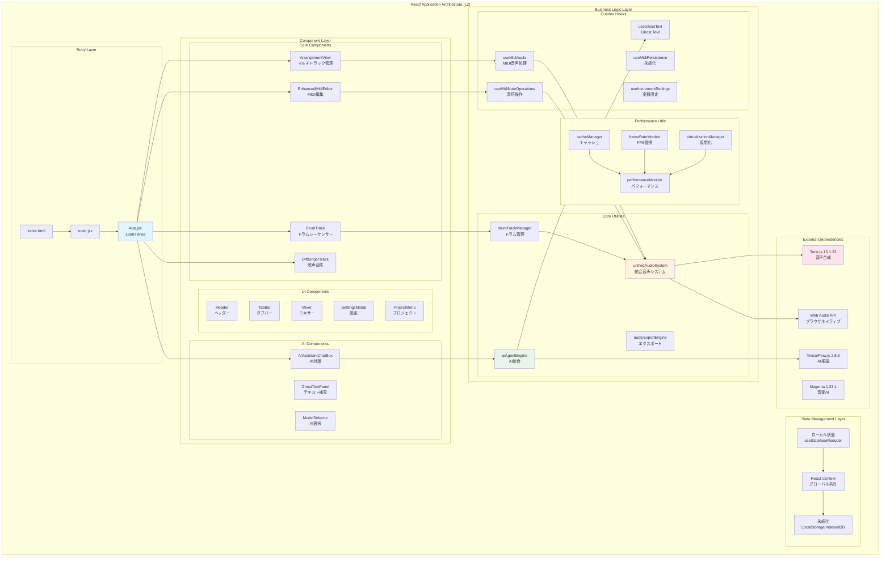
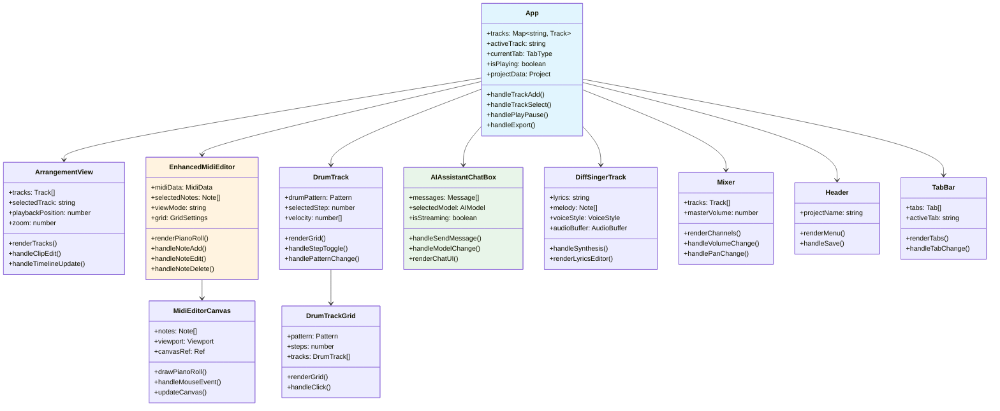
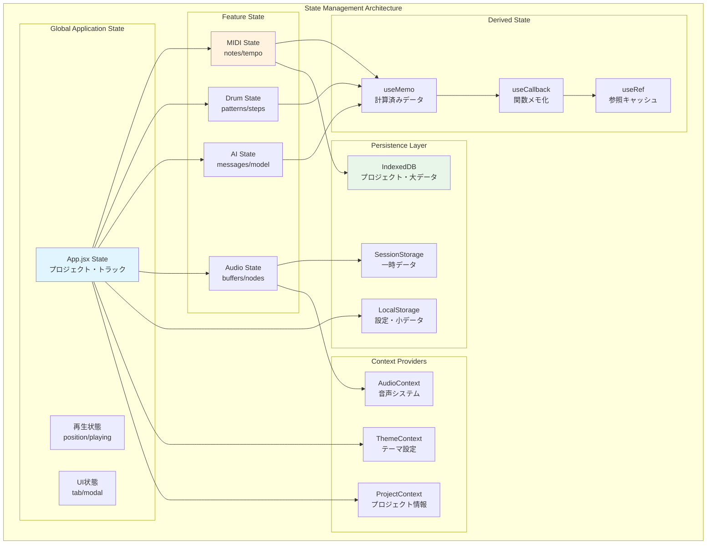
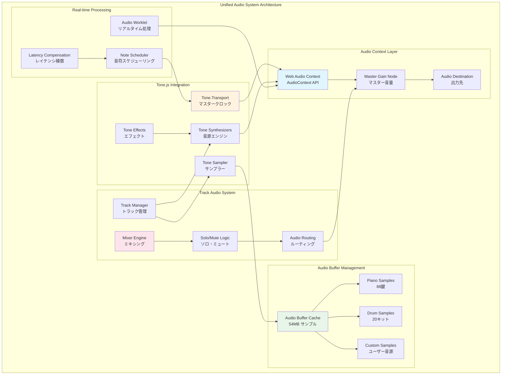
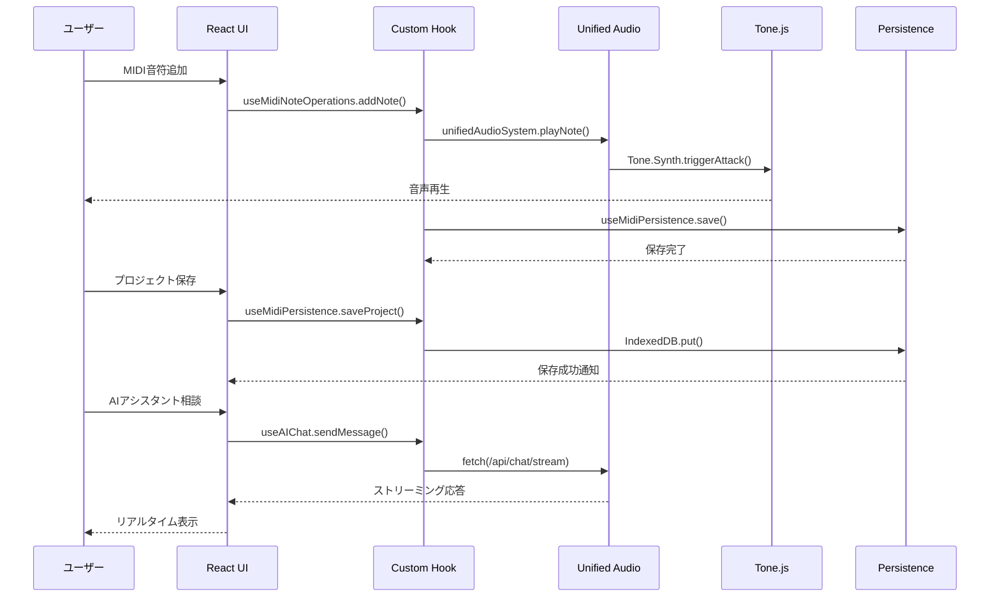
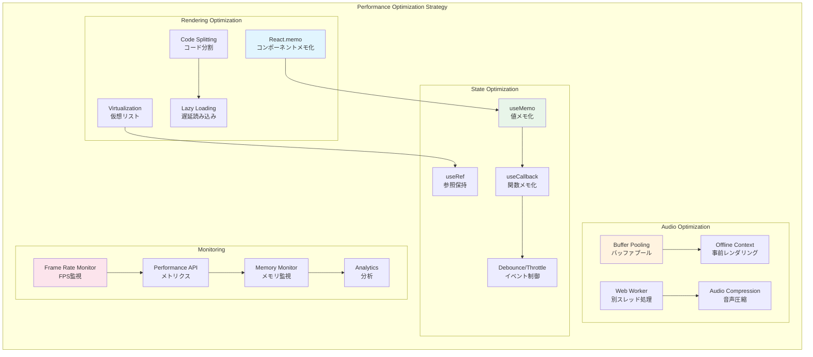

# フロントエンド詳細アーキテクチャ (L2)

**Document ID**: LA-L2-FRONTEND-001
**Version**: 2.0.0
**Last Updated**: 2025-01-22
**Parent**: [L1: システムアーキテクチャ](../L1_system.md)
**Implementation Status**: ✅ Based on Current Codebase

## 🎨 React アプリケーション詳細構成

DAWAIのフロントエンドは、React 18.3.1 + Vite 6.3.5を基盤とした、162ファイルで構成される大規模Webアプリケーションです。Tone.js音声処理エンジン、AI統合クライアント、マルチトラック管理システムを統合し、プロフェッショナル品質の音楽制作環境を提供します。

### L2 フロントエンド全体構成



## 🏗️ コンポーネント階層構造

### コンポーネント階層図



### コンポーネント責務マトリクス

| レベル | コンポーネント | ファイルパス | 行数 | 主要責務 |
|--------|----------------|--------------|------|----------|
| **L1** | App | `App.jsx` | 1300+ | アプリケーション全体統制・状態管理 |
| **L2** | ArrangementView | `ArrangementView.jsx` | 500+ | マルチトラック表示・管理 |
| **L2** | EnhancedMidiEditor | `EnhancedMidiEditor.jsx` | 1100+ | MIDI編集・ピアノロール |
| **L2** | DrumTrack | `DrumTrack/DrumTrack.jsx` | 400+ | ドラムシーケンサー |
| **L2** | DiffSingerTrack | `DiffSingerTrack.jsx` | 300+ | AI歌声合成UI |
| **L2** | AIAssistantChatBox | `AIAssistantChatBox.jsx` | 600+ | AIチャットインターフェース |
| **L2** | Mixer | `Mixer.jsx` | 200+ | ミキサー・音量制御 |
| **L2** | Header | `Header.jsx` | 150+ | ヘッダー・メニュー |
| **L2** | TabBar | `TabBar.jsx` | 100+ | タブナビゲーション |
| **L2** | SettingsModal | `SettingsModal.jsx` | 250+ | アプリ設定UI |
| **L2** | ProjectMenu | `ProjectMenu.jsx` | 180+ | プロジェクト管理UI |
| **L3** | MidiEditorCanvas | `MIDIEditor/MidiEditorCanvas.jsx` | 800+ | Canvas描画・音符レンダリング |
| **L3** | DrumTrackGrid | `DrumTrack/DrumTrackGrid.jsx` | 350+ | ドラムグリッド描画 |
| **L3** | ChatMessage | `AIassistant/ChatMessage.jsx` | 120+ | チャットメッセージ表示 |
| **L3** | ModelSelector | `AIassistant/ModelSelector.jsx` | 80+ | AIモデル選択UI |

## 🎵 状態管理アーキテクチャ

### 状態管理戦略



### 状態データ構造

#### トラックデータ構造
**実装**: `App.jsx` createTrack関数

```javascript
// 統合トラックデータ構造
const trackData = {
  // 基本情報
  id: 'track_001',
  name: 'Piano',
  type: 'midi',              // midi, drums, diffsinger
  subtype: 'piano',          // piano, synth, bass, guitar, drums
  color: '#3B82F6',

  // ミキサー設定
  volume: 75,                // 0-100
  pan: 0,                    // -100 to +100
  muted: false,
  solo: false,
  armed: false,

  // コンテンツ
  clips: [],                 // MIDIクリップ/オーディオクリップ
  effects: [],               // エフェクトチェーン

  // MIDI専用データ
  midiData: {
    notes: [],               // Note配列
    tempo: 120,
    timeSignature: '4/4',
    trackId: 'track_001',
    lastModified: '2025-01-22T00:00:00Z',
    metadata: {
      created: '2025-01-22T00:00:00Z',
      modified: '2025-01-22T00:00:00Z',
      version: '1.0.0'
    },
    settings: {
      channel: 0,
      octave: 0,
      transpose: 0,
      velocity: 100
    }
  },

  // オーディオデータ（DiffSinger等）
  audioData: null
}
```

#### MIDI音符データ構造
**実装**: `EnhancedMidiEditor.jsx`

```javascript
// MIDI音符構造
const noteData = {
  id: 'note_001',
  startTime: 0.0,           // 開始時間（秒）
  duration: 0.5,            // 長さ（秒）
  pitch: 60,                // MIDI音程（C4 = 60）
  velocity: 100,            // ベロシティ（0-127）
  trackId: 'track_001',
  selected: false,
  color: '#3B82F6'
}
```

#### ドラムパターン構造
**実装**: `DrumTrack/DrumTrack.jsx`

```javascript
// ドラムパターン構造
const drumPattern = {
  id: 'pattern_001',
  name: 'Basic Rock',
  bpm: 120,
  steps: 16,
  tracks: {
    kick:   [1,0,0,0, 1,0,0,0, 1,0,0,0, 1,0,0,0],
    snare:  [0,0,1,0, 0,0,1,0, 0,0,1,0, 0,0,1,0],
    hihat:  [1,1,1,1, 1,1,1,1, 1,1,1,1, 1,1,1,1]
  },
  velocity: {
    kick:   [100,0,0,0, 90,0,0,0, 100,0,0,0, 95,0,0,0],
    snare:  [0,0,110,0, 0,0,105,0, 0,0,110,0, 0,0,100,0],
    hihat:  [80,70,85,70, 80,70,90,70, 80,70,85,70, 80,70,95,70]
  }
}
```

## 🔊 Tone.js音声処理エンジン統合

### 統合音声システム構成



### 音声処理実装詳細

#### 統合音声システム
**実装ファイル**: `frontend/src/utils/unifiedAudioSystem.js` (230行)

```javascript
// 統合音声システム実装
class UnifiedAudioSystem {
  constructor() {
    this.audioContext = null;
    this.audioBuffers = {};
    this.isInitialized = false;
    this.masterVolume = 0.8;
    this.masterGain = null;

    // 現在再生中の音
    this.activeSounds = new Map();

    // トラック管理
    this.tracks = new Map();
    this.trackVolumes = new Map();
    this.trackMuted = new Map();
    this.trackSolo = new Map();

    // イベントリスナー
    this.listeners = new Set();
  }

  // 初期化
  async initialize() {
    // AudioContextの作成
    this.audioContext = new (window.AudioContext || window.webkitAudioContext)();

    // マスターゲインノード
    this.masterGain = this.audioContext.createGain();
    this.masterGain.gain.value = this.masterVolume;
    this.masterGain.connect(this.audioContext.destination);

    this.isInitialized = true;
  }

  // 音符再生
  playNote(pitch, duration, velocity, trackId) {
    const track = this.tracks.get(trackId);
    if (!track || this.trackMuted.get(trackId)) return;

    const gainNode = this.audioContext.createGain();
    gainNode.gain.value = velocity / 127 * this.trackVolumes.get(trackId);
    gainNode.connect(this.masterGain);

    // Tone.jsシンセサイザー使用
    const synth = track.synth;
    synth.triggerAttackRelease(
      Tone.Frequency(pitch, 'midi').toNote(),
      duration,
      this.audioContext.currentTime,
      velocity / 127
    );
  }
}
```

#### カスタムフック: useMidiAudio
**実装ファイル**: `frontend/src/hooks/useMidiAudio.js` (173行)

```javascript
// MIDI音声処理フック
export const useMidiAudio = (midiData, trackId) => {
  const [isPlaying, setIsPlaying] = useState(false);
  const [currentTime, setCurrentTime] = useState(0);
  const audioSystemRef = useRef(null);

  useEffect(() => {
    // 音声システム初期化
    audioSystemRef.current = unifiedAudioSystem;
  }, []);

  const playMidi = useCallback(() => {
    if (!audioSystemRef.current || !midiData.notes.length) return;

    setIsPlaying(true);
    const startTime = audioSystemRef.current.audioContext.currentTime;

    // 全音符をスケジューリング
    midiData.notes.forEach(note => {
      audioSystemRef.current.playNote(
        note.pitch,
        note.duration,
        note.velocity,
        trackId,
        startTime + note.startTime
      );
    });
  }, [midiData, trackId]);

  const stopMidi = useCallback(() => {
    audioSystemRef.current?.stopAllNotes(trackId);
    setIsPlaying(false);
    setCurrentTime(0);
  }, [trackId]);

  return { isPlaying, currentTime, playMidi, stopMidi };
};
```

## 🔄 データフローパターン

### 主要データフロー



### UI → Audio → Storage フロー

#### 1. MIDI編集フロー
```javascript
// EnhancedMidiEditor.jsx
const handleNoteAdd = (pitch, startTime, duration) => {
  // 1. UI操作
  const newNote = {
    id: generateId(),
    pitch,
    startTime,
    duration,
    velocity: 100
  };

  // 2. Hook経由でデータ更新
  addNote(newNote); // useMidiNoteOperations

  // 3. 音声再生
  playNote(pitch, duration, 100, trackId); // useMidiAudio

  // 4. 永続化
  saveMidiData(updatedNotes); // useMidiPersistence
};
```

#### 2. ドラム編集フロー
```javascript
// DrumTrack.jsx
const handleStepToggle = (drumType, stepIndex) => {
  // 1. パターン更新
  const newPattern = updatePattern(drumType, stepIndex);

  // 2. ドラムマネージャー更新
  drumTrackManager.updatePattern(newPattern);

  // 3. プレビュー再生
  if (newPattern.tracks[drumType][stepIndex] === 1) {
    unifiedAudioSystem.playDrumSample(drumType);
  }

  // 4. 状態保存
  setDrumPattern(newPattern);
};
```

#### 3. AI統合フロー
```javascript
// AIAssistantChatBox.jsx
const handleSendMessage = async (message) => {
  // 1. ユーザーメッセージ追加
  addMessage({ role: 'user', content: message });

  // 2. AIエージェント呼び出し
  const response = await aiAgentEngine.streamChat({
    messages: [...messages, { role: 'user', content: message }],
    model: selectedModel,
    context: musicContext
  });

  // 3. ストリーミング応答処理
  for await (const chunk of response) {
    updateAIMessage(chunk);
  }

  // 4. チャット履歴保存
  saveChatHistory(messages);
};
```

## 🎨 パフォーマンス最適化戦略

### パフォーマンス最適化システム



### 実装されている最適化

#### 1. コンポーネントメモ化
**実装**: React.memo + useMemo

```javascript
// EnhancedMidiEditor.jsx
const MidiEditorCanvas = React.memo(({ notes, viewport }) => {
  // メモ化された描画計算
  const visibleNotes = useMemo(() => {
    return notes.filter(note =>
      note.startTime >= viewport.start &&
      note.startTime <= viewport.end
    );
  }, [notes, viewport]);

  // メモ化された描画関数
  const drawPianoRoll = useCallback(() => {
    // Canvas描画ロジック
  }, [visibleNotes, viewport]);

  return <canvas ref={canvasRef} />;
});
```

#### 2. 音声バッファプーリング
**実装**: `utils/cacheManager.js`

```javascript
// cacheManager.js
class CacheManager {
  constructor() {
    this.bufferPool = new Map();
    this.maxPoolSize = 100;
  }

  getBuffer(sampleName) {
    if (this.bufferPool.has(sampleName)) {
      return this.bufferPool.get(sampleName);
    }
    return null;
  }

  setBuffer(sampleName, buffer) {
    if (this.bufferPool.size >= this.maxPoolSize) {
      // LRU削除
      const firstKey = this.bufferPool.keys().next().value;
      this.bufferPool.delete(firstKey);
    }
    this.bufferPool.set(sampleName, buffer);
  }
}
```

#### 3. 仮想化レンダリング
**実装**: `utils/virtualizationManager.js`

```javascript
// virtualizationManager.js
class VirtualizationManager {
  constructor() {
    this.viewportHeight = 600;
    this.itemHeight = 40;
  }

  getVisibleRange(scrollTop, totalItems) {
    const startIndex = Math.floor(scrollTop / this.itemHeight);
    const endIndex = Math.ceil((scrollTop + this.viewportHeight) / this.itemHeight);

    return {
      start: Math.max(0, startIndex - 5), // オーバースキャン
      end: Math.min(totalItems, endIndex + 5)
    };
  }
}
```

#### 4. パフォーマンス監視
**実装**: `utils/performanceMonitor.js`, `utils/frameRateMonitor.js`

```javascript
// performanceMonitor.js
class PerformanceMonitor {
  constructor() {
    this.metrics = {
      fps: 0,
      memoryUsage: 0,
      audioLatency: 0,
      renderTime: 0
    };
  }

  measure(metric, callback) {
    const start = performance.now();
    callback();
    const duration = performance.now() - start;

    this.metrics[metric] = duration;
    console.log(`${metric}: ${duration.toFixed(2)}ms`);
  }

  getReport() {
    return {
      ...this.metrics,
      timestamp: new Date().toISOString()
    };
  }
}
```

## 🔧 技術スタック詳細

### 基盤技術

| カテゴリ | 技術 | バージョン | 用途 |
|----------|------|------------|------|
| **フレームワーク** | React | 18.3.1 | UIフレームワーク |
| **ビルドツール** | Vite | 6.3.5 | 開発・ビルド環境 |
| **ルーティング** | React Router | 7.6.1 | SPA ルーティング |
| **状態管理** | React Hooks | 18.3.1 | useState/useReducer |

### UI・スタイリング

| カテゴリ | 技術 | バージョン | 用途 |
|----------|------|------------|------|
| **CSS Framework** | Tailwind CSS | 4.1.7 | ユーティリティファーストCSS |
| **コンポーネント** | Radix UI | 各種 | アクセシブルプリミティブ |
| **アニメーション** | Framer Motion | 12.15.0 | 高度なアニメーション |
| **アイコン** | Lucide React | 0.510.0 | アイコンライブラリ |
| **UI Utils** | Shadcn/ui | - | 再利用UIコンポーネント |

### 音声・メディア処理

| カテゴリ | 技術 | バージョン | 用途 |
|----------|------|------------|------|
| **音声合成** | Tone.js | 15.1.22 | Web Audio抽象化 |
| **音源** | SoundFont Player | 0.12.0 | SoundFont再生 |
| **Web Audio** | Web Audio API | Native | ブラウザネイティブ音声 |
| **Canvas** | Canvas API | Native | 波形・MIDI可視化 |

### AI・機械学習

| カテゴリ | 技術 | バージョン | 用途 |
|----------|------|------------|------|
| **ML Framework** | TensorFlow.js | 2.8.6 | クライアント推論 |
| **音楽AI** | Magenta | 1.23.1 | 音楽生成・分析 |
| **API統合** | Fetch API | Native | REST API呼び出し |

### ユーティリティ

| カテゴリ | 技術 | バージョン | 用途 |
|----------|------|------------|------|
| **フォーム** | React Hook Form | 7.56.3 | フォーム管理 |
| **バリデーション** | Zod | 3.24.4 | スキーマバリデーション |
| **ユーティリティ** | Class Variance Authority | 0.7.1 | 条件付きクラス管理 |
| **ユーティリティ** | clsx | 2.1.1 | クラス名結合 |
| **ユーティリティ** | tailwind-merge | 3.3.0 | Tailwindクラス結合 |

## 📂 ディレクトリ構造

### フロントエンド構成 (162ファイル)

```
frontend/src/
├── main.jsx                          # エントリーポイント
├── App.jsx                           # メインアプリケーション (1300+ lines)
├── App.css                           # グローバルスタイル
│
├── components/                       # Reactコンポーネント (40+)
│   ├── Header.jsx
│   ├── TabBar.jsx
│   ├── ArrangementView.jsx           # マルチトラック管理
│   ├── EnhancedMidiEditor.jsx        # MIDI編集 (1100+ lines)
│   ├── Mixer.jsx
│   ├── SettingsModal.jsx
│   ├── ProjectMenu.jsx
│   │
│   ├── DrumTrack/                    # ドラムシーケンサー
│   │   ├── DrumTrack.jsx
│   │   ├── DrumTrackGrid.jsx
│   │   └── DrumTrackControls.jsx
│   │
│   ├── DiffSinger/                   # AI歌声合成
│   │   ├── DiffSingerTrack.jsx
│   │   ├── DiffSingerCanvas.jsx
│   │   └── AudioQualityPanel.jsx
│   │
│   ├── AIassistant/                  # AIアシスタント
│   │   ├── AIAssistantChatBox.jsx
│   │   ├── ChatHeader.jsx
│   │   ├── ChatInput.jsx
│   │   ├── ChatMessage.jsx
│   │   ├── ChatMessages.jsx
│   │   ├── ModelSelector.jsx
│   │   └── ModeToggleButton.jsx
│   │
│   ├── MIDIEditor/                   # MIDI編集詳細
│   │   ├── MidiEditorCanvas.jsx
│   │   └── VelocityEditor.jsx
│   │
│   └── ArrangementView/              # アレンジメント詳細
│       ├── PlaybackControls.jsx
│       ├── TimelineHeader.jsx
│       ├── TrackList.jsx
│       └── LyricsPanel.jsx
│
├── hooks/                            # カスタムフック (7)
│   ├── useMidiAudio.js               # MIDI音声処理
│   ├── useMidiPersistence.js         # MIDI永続化
│   ├── useMidiNoteOperations.js      # 音符操作
│   ├── useMidiEditorState.js         # エディタ状態
│   ├── useGhostText.js               # Ghost Text統合
│   ├── useInstrumentSettings.js      # 楽器設定
│   └── use-mobile.js                 # モバイル対応
│
├── utils/                            # ユーティリティ (36)
│   ├── unifiedAudioSystem.js         # 統合音声システム (230 lines)
│   ├── audioExportEngine.js          # エクスポートエンジン
│   ├── aiAgentEngine.js              # AI統合エンジン (1000+ lines)
│   ├── drumTrackManager.js           # ドラム管理
│   ├── cacheManager.js               # キャッシュ管理
│   ├── frameRateMonitor.js           # FPS監視
│   ├── performanceMonitor.js         # パフォーマンス監視
│   ├── virtualizationManager.js      # 仮想化管理
│   ├── apiConfig.js                  # API設定
│   ├── audioTrack.js                 # オーディオトラック
│   ├── pianoTest.js                  # ピアノテスト
│   ├── drumTest.js                   # ドラムテスト
│   ├── debugAudio.js                 # オーディオデバッグ
│   └── ...                           # その他23ファイル
│
├── data/                             # データ管理
│   └── sampleData.js                 # サンプルプロジェクト
│
└── lib/                              # ライブラリユーティリティ
    └── utils.js                      # 共通関数
```

## 🔗 関連ドキュメント

### 上位アーキテクチャ
- **[L1: システムアーキテクチャ](../L1_system.md)** - システム全体構成
- **[L0: システム概要](../../../overview/index.md)** - ビジネス・技術概要

### 関連要件
- **[L2: 音声処理要件](../../../requirements/functional/L2_audio_processing/index.md)** - 音声機能仕様
- **[L2: AI統合要件](../../../requirements/functional/L2_ai_integration/index.md)** - AI機能仕様
- **[L2: UI相互作用要件](../../../requirements/functional/L2_ui_interaction/index.md)** - UI仕様

### 下位詳細
- **[L3: コンポーネント設計](../L3_components/)** - 詳細コンポーネント設計
- **[L2: システムフロー](../../../design/sequences/L2_component/)** - コンポーネント処理フロー

### バックエンド統合
- **[L2: バックエンド構成](../L2_backend/)** - FastAPI アーキテクチャ
- **[L1: システムフロー](../../../design/sequences/L1_system/)** - フロント・バック連携

---

**実装ファイル参照**:
- **App.jsx**: `frontend/src/App.jsx` (1300+ lines)
- **音声システム**: `frontend/src/utils/unifiedAudioSystem.js` (230 lines)
- **MIDI編集**: `frontend/src/components/EnhancedMidiEditor.jsx` (1100+ lines)
- **AI統合**: `frontend/src/utils/aiAgentEngine.js` (1000+ lines)
- **パッケージ**: `frontend/package.json` (React 18.3.1 + Tone.js 15.1.22)
- **全コンポーネント**: `frontend/src/components/` (40+ JSXファイル)
- **全フック**: `frontend/src/hooks/` (7ファイル)
- **全ユーティリティ**: `frontend/src/utils/` (36ファイル)
