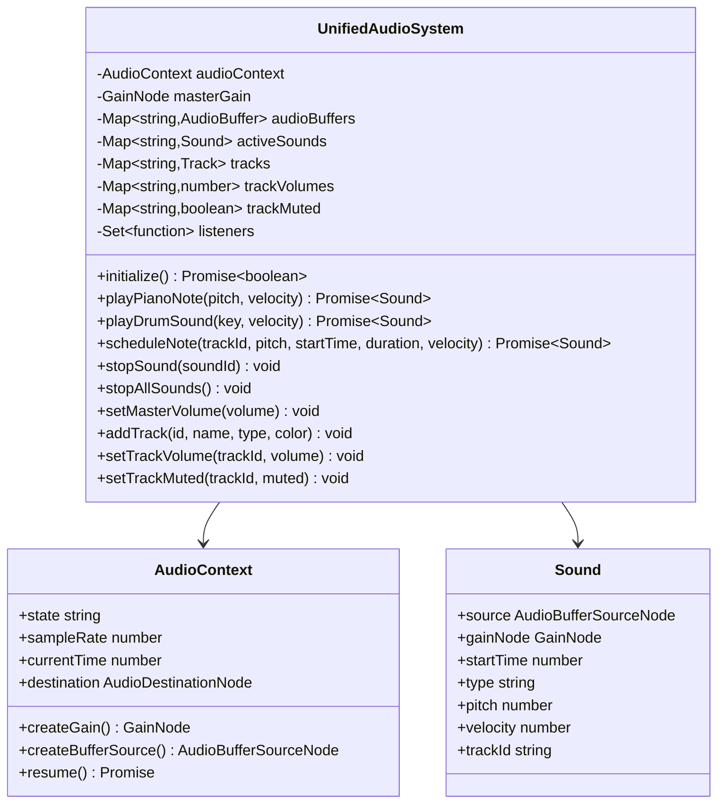
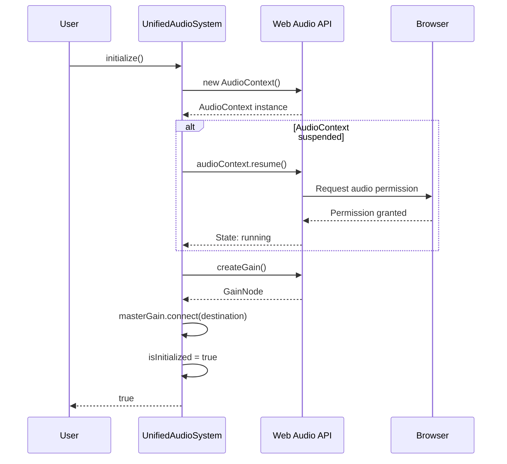
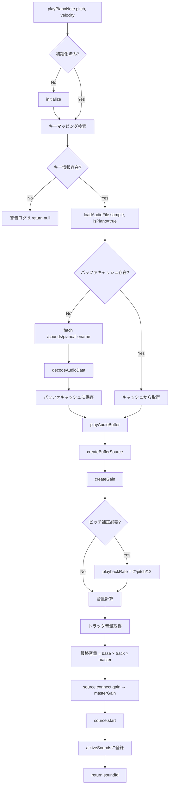
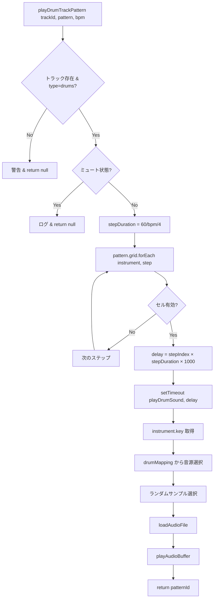
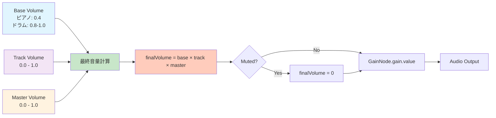
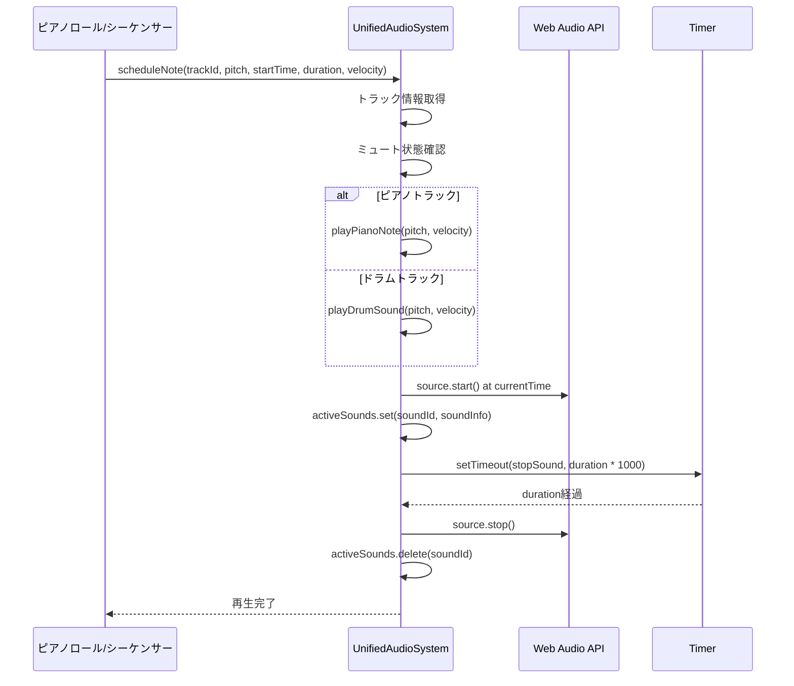
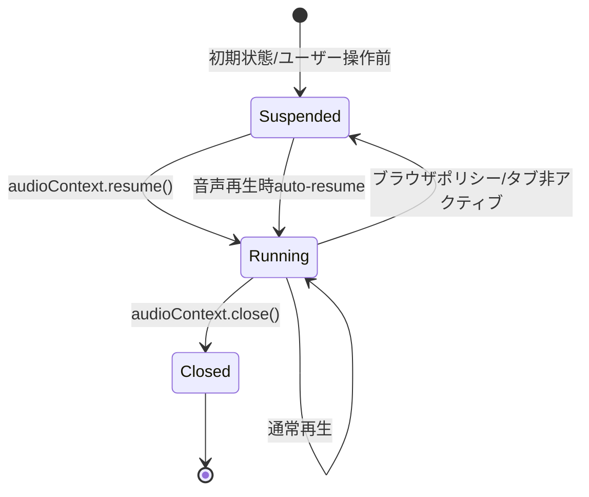

# L3: Unified Audio System - 統一音声処理システム詳細設計

**文書ID**: `DAWAI-ARCH-L3-AUDIO-001`
**バージョン**: 1.0.0
**最終更新**: 2025-01-22
**実装ファイル**: `frontend/src/utils/unifiedAudioSystem.js` (1527行)
**関連要件**: REQ-AUDIO-001, REQ-AUDIO-002, REQ-PERF-001

## 📋 概要

### 目的
Web Audio APIとTone.jsを統合した統一音声処理システムの詳細実装仕様。マルチトラック音声処理、リアルタイム再生、バッファ管理を単一クラスで提供。

### アーキテクチャ戦略
- **Singleton Pattern**: グローバル音声管理の一元化
- **Factory Pattern**: 楽器タイプに応じた音声生成
- **Observer Pattern**: イベントリスナーによる状態通知
- **Strategy Pattern**: ピアノ/ドラム音源の動的切り替え

### パフォーマンス指標
```yaml
レイテンシ目標: <50ms
サンプリングレート: 48kHz (Web Audio Context default)
バッファサイズ: 動的 (ブラウザ最適化)
同時発音数: 無制限 (activeSounds Map管理)
メモリ使用量: ~54MB (音声アセット) + 動的バッファ
```

---

## 🏗️ クラス設計

### UnifiedAudioSystem クラス



### 主要プロパティ

```javascript
class UnifiedAudioSystem {
  constructor() {
    // 音声コンテキスト管理
    this.audioContext = null              // Web Audio Context
    this.audioBuffers = {}                // キャッシュされた音声バッファ
    this.isInitialized = false            // 初期化状態
    this.masterVolume = 0.8               // マスターボリューム
    this.masterGain = null                // マスターゲインノード

    // アクティブサウンド管理
    this.activeSounds = new Map()         // 現在再生中の音声

    // トラック管理
    this.tracks = new Map()               // トラック情報
    this.trackVolumes = new Map()         // トラック別音量
    this.trackMuted = new Map()           // トラック別ミュート状態
    this.trackSolo = new Map()            // トラック別ソロ状態

    // イベントシステム
    this.listeners = new Set()            // イベントリスナー
  }
}
```

---

## 🔊 音声処理フロー

### 初期化シーケンス



### 実装コード
```javascript
async initialize() {
  if (this.isInitialized) return true;

  try {
    console.log('🎵 統一音声システムを初期化中...');

    // AudioContextの作成
    this.audioContext = new (window.AudioContext || window.webkitAudioContext)();

    // AudioContextの状態を確認し、必要に応じて開始
    if (this.audioContext.state === 'suspended') {
      console.log('🎵 AudioContextが停止状態です。開始中...');
      await this.audioContext.resume();
      console.log('🎵 AudioContext開始完了:', this.audioContext.state);
    }

    // マスターゲインノードの作成
    this.masterGain = this.audioContext.createGain();
    this.masterGain.gain.value = this.masterVolume;
    this.masterGain.connect(this.audioContext.destination);

    this.isInitialized = true;
    console.log('✅ 統一音声システムの初期化完了');

    this.emit('initialized', { success: true });
    return true;
  } catch (error) {
    console.error('❌ 統一音声システムの初期化に失敗:', error);
    this.emit('error', { error: error.message });
    return false;
  }
}
```

---

## 🎹 ピアノ音源処理

### ピアノ音声マッピング
```javascript
// frontend/src/utils/pianoTest.js から参照
const pianoKeyMapping = {
  60: { note: 'C4', sample: 'piano-C4.wav', pitch: 0 },
  61: { note: 'C#4', sample: 'piano-C4.wav', pitch: 1 },  // ピッチシフト
  62: { note: 'D4', sample: 'piano-D4.wav', pitch: 0 },
  // ... 88鍵盤分のマッピング
}
```

### ピアノノート再生フロー



### 実装コード（ピッチシフト機能付き）
```javascript
async playPianoNote(key, velocity = 0.8) {
  if (!this.isInitialized) {
    const success = await this.initialize();
    if (!success) return null;
  }

  const keyInfo = pianoKeyMapping[key];
  if (!keyInfo) {
    console.warn(`⚠️ ピアノキーが見つかりません: ${key}`);
    return null;
  }

  try {
    const audioBuffer = await this.loadAudioFile(keyInfo.sample, true);
    if (!audioBuffer) {
      console.warn(`⚠️ ピアノ音ファイルが見つかりません: ${keyInfo.sample}`);
      return null;
    }

    // playAudioBufferでピッチ変更とトラック音量適用
    return this.playAudioBuffer(audioBuffer, keyInfo, velocity, 'piano');
  } catch (error) {
    console.error(`❌ ピアノ音の再生に失敗: ${error.message}`);
    return null;
  }
}

playAudioBuffer(audioBuffer, soundInfo, velocity = 0.8, type = 'piano') {
  // ... AudioContext状態チェック省略

  const source = this.audioContext.createBufferSource();
  const gainNode = this.audioContext.createGain();
  source.buffer = audioBuffer;

  // ピッチ変更を適用（ピアノの場合）
  if (type === 'piano' && soundInfo.pitch !== 0) {
    const pitchRatio = Math.pow(2, soundInfo.pitch / 12);  // 半音単位
    source.playbackRate.value = pitchRatio;
  }

  // 音量調整（ミキサー設定を参照）
  const baseVolume = type === 'piano' ? 0.4 : (soundInfo.volume || 0.8);

  // トラック音量を取得
  let trackVolume = 1.0;
  let isMuted = false;

  for (const [trackId, track] of this.tracks) {
    if (track.type === 'piano' || track.type.includes('piano')) {
      trackVolume = this.trackVolumes.get(trackId) ?? 0;
      isMuted = this.trackMuted.get(trackId) ?? false;
      break;
    }
  }

  // 最終音量計算
  const finalVolume = isMuted ? 0 : baseVolume * trackVolume * this.masterVolume;
  gainNode.gain.value = finalVolume;

  // 接続と再生
  source.connect(gainNode);
  gainNode.connect(this.masterGain);
  source.start();

  // アクティブサウンドとして記録
  const soundId = `${type}-${Date.now()}-${Math.random()}`;
  this.activeSounds.set(soundId, {
    source, gainNode, startTime: this.audioContext.currentTime, type,
    soundInfo, pitch: soundInfo.pitch || soundInfo.note || null,
    velocity
  });

  // 自動クリーンアップ
  source.onended = () => {
    this.activeSounds.delete(soundId);
  };

  return { source, gainNode, soundId };
}
```

---

## 🥁 ドラム音源処理

### ドラムマッピング
```javascript
// frontend/src/utils/drumTest.js から参照
const drumMapping = {
  'a': { name: 'Bass 2', samples: ['bass-drum-2.wav'], volume: 1.0 },
  'q': { name: 'Snare Hit', samples: ['snare-hit.wav'], volume: 0.9 },
  'h': { name: 'Hi-Hat', samples: ['hi-hat.wav'], volume: 0.7 },
  // ... 複数バリエーション対応
}

// MIDIピッチ → ドラムキー変換
const midiToDrumMap = {
  36: 'a',  // Kick Drum → Bass 2
  38: 'q',  // Snare Drum → Snare Hit
  42: 'h',  // Hi-Hat Closed → Hi-Hat
  // ...
}
```

### ドラムパターン再生フロー



### 実装コード（複数サンプル対応）
```javascript
async playDrumSound(key, velocity = 0.8) {
  if (!this.isInitialized) {
    const success = await this.initialize();
    if (!success) return null;
  }

  // MIDIピッチ番号の場合は文字列キーに変換
  let drumKey = key;
  if (typeof key === 'string' && !isNaN(parseInt(key))) {
    drumKey = this.midiTodrummingKey(parseInt(key));
    if (!drumKey) return null;
  }

  const drumInfo = drumMapping[drumKey];
  if (!drumInfo) {
    console.warn(`⚠️ ドラムキーが見つかりません: ${drumKey}`);
    return null;
  }

  try {
    // 利用可能なサンプルからランダムに選択（バリエーション対応）
    const availableSamples = drumInfo.samples.filter(s => s && s.length > 0);
    if (availableSamples.length === 0) {
      console.warn(`⚠️ ドラムサンプルが見つかりません: ${drumInfo.name}`);
      return null;
    }

    const randomSample = availableSamples[Math.floor(Math.random() * availableSamples.length)];
    const audioBuffer = await this.loadAudioFile(randomSample, false);

    if (!audioBuffer) {
      console.warn(`⚠️ ドラム音ファイルが見つかりません: ${randomSample}`);
      return null;
    }

    return this.playAudioBuffer(
      audioBuffer,
      { name: drumInfo.name, volume: drumInfo.volume || 1.0, sample: randomSample },
      velocity,
      'drum'
    );
  } catch (error) {
    console.error(`❌ ドラム音の再生に失敗: ${error.message}`);
    return null;
  }
}

// ドラムパターン再生
playDrumTrackPattern(trackId, pattern, bpm = 120) {
  if (!this.isInitialized) {
    console.warn('🥁 音声システムが初期化されていません');
    return null;
  }

  const track = this.tracks.get(trackId);
  if (!track || track.type !== 'drums') {
    console.warn(`🥁 ドラムトラックが見つかりません: ${trackId}`);
    return null;
  }

  if (this.trackMuted.get(trackId)) {
    console.log(`🥁 ドラムトラックがミュートされています: ${trackId}`);
    return null;
  }

  console.log(`🥁 ドラムパターン再生開始: ${trackId}, BPM: ${bpm}`);

  const stepDuration = 60 / bpm / 4;  // 16分音符の長さ
  const patternId = `pattern-${trackId}-${Date.now()}`;

  // パターンの各ステップをスケジュール
  pattern.grid.forEach((row, instrumentIndex) => {
    const instrument = pattern.instruments[instrumentIndex];
    if (!instrument) return;

    row.forEach((cell, stepIndex) => {
      if (cell && (typeof cell === 'boolean' || cell.active)) {
        const velocity = (typeof cell === 'object' && cell.velocity) || instrument.velocity || 0.8;
        const delay = stepIndex * stepDuration * 1000;

        setTimeout(() => {
          const drumKey = instrument.key || instrument.pitch;
          this.playDrumSound(drumKey, velocity);
        }, delay);
      }
    });
  });

  return patternId;
}
```

---

## 🎚️ ミキサー・音量管理

### 音量計算アーキテクチャ



### トラック管理実装
```javascript
// トラック追加
addTrack(trackId, trackName, trackType = 'piano', trackColor = '#ffffff', trackData = {}) {
  this.tracks.set(trackId, {
    id: trackId,
    name: trackName,
    type: trackType,
    color: trackColor,
    data: trackData
  });
  this.trackVolumes.set(trackId, 1.0);        // デフォルト音量
  this.trackMuted.set(trackId, false);        // ミュートOFF
  this.trackSolo.set(trackId, false);         // ソロOFF
  console.log(`🎵 トラック追加: ${trackId} (${trackName})`);
}

// トラック音量設定（重複実行防止）
setTrackVolume(trackId, volume) {
  const currentVolume = this.trackVolumes.get(trackId);
  if (currentVolume === volume) return;  // 同じ値ならスキップ

  this.trackVolumes.set(trackId, volume);
  console.log(`🎵 トラック音量設定: ${trackId} = ${volume.toFixed(3)}`);

  // デバッグ: 全トラック音量表示
  console.log('🔊 現在の全トラック音量:');
  this.trackVolumes.forEach((vol, id) => {
    console.log(`  - ${id}: ${vol.toFixed(3)}`);
  });
}

// マスターボリューム設定
setMasterVolume(volume) {
  if (this.masterVolume === volume) return;

  this.masterVolume = Math.max(0, Math.min(1, volume));
  if (this.masterGain) {
    this.masterGain.gain.value = this.masterVolume;
  }
  console.log(`🎵 マスターボリューム設定: ${this.masterVolume.toFixed(3)}`);
}
```

---

## 🔄 スケジューリング・タイミング制御

### ノートスケジューリングフロー



### 実装コード
```javascript
async scheduleNote(trackId, pitch, startTime, duration, velocity = 0.8) {
  if (!this.isInitialized) {
    console.warn('音声システムが初期化されていません');
    return null;
  }

  const track = this.tracks.get(trackId);
  if (!track) {
    console.warn(`トラックが見つかりません: ${trackId}`);
    return null;
  }

  if (this.trackMuted.get(trackId)) {
    console.log(`トラックがミュートされています: ${trackId}`);
    return null;
  }

  try {
    let soundResult = null;

    // トラックタイプに応じて音を再生
    if (track.type === 'piano' || track.type.includes('piano')) {
      soundResult = await this.playPianoNote(pitch, velocity);
    } else if (track.type === 'drum' || track.type.includes('drum')) {
      soundResult = await this.playDrumSound(pitch.toString(), velocity);
    } else {
      soundResult = await this.playPianoNote(pitch, velocity);  // デフォルト
    }

    // 音の終了処理をスケジュール
    if (soundResult && duration > 0) {
      const soundId = soundResult.soundId || `scheduled-${trackId}-${pitch}-${Date.now()}`;

      setTimeout(() => {
        this.stopSound(soundId);
        console.log(`🎵 スケジュールされた音を終了: ${soundId} (ピッチ: ${pitch}, 長さ: ${duration}秒)`);
      }, duration * 1000);

      // 音の情報を更新
      if (soundResult.soundId) {
        const existingSound = this.activeSounds.get(soundResult.soundId);
        if (existingSound) {
          existingSound.duration = duration;
          existingSound.trackId = trackId;
        }
      } else {
        this.activeSounds.set(soundId, {
          type: track.type,
          pitch: pitch,
          startTime: this.audioContext.currentTime,
          duration: duration,
          velocity: velocity,
          trackId: trackId
        });
      }

      return {
        soundId: soundId,
        type: track.type,
        pitch: pitch,
        duration: duration,
        endTime: this.audioContext.currentTime + duration,
        ...soundResult
      };
    }

    return soundResult;
  } catch (error) {
    console.error(`ノートのスケジュールに失敗: ${error.message}`);
    return null;
  }
}
```

---

## 🛠️ バッファ管理・最適化

### 音声バッファキャッシング戦略

```mermaid
graph TD
    A[loadAudioFile filename, isPiano] --> B{audioBuffers[filename]存在?}
    B -->|Yes| C[キャッシュから即座に返却]
    B -->|No| D[fetch /sounds/path/filename]

    D --> E[response.arrayBuffer]
    E --> F[audioContext.decodeAudioData]
    F --> G[audioBuffers[filename] = buffer]
    G --> H[return buffer]

    C --> I[メモリ節約<br/>ネットワーク不要]
    H --> J[初回のみロード<br/>以降は高速]

    style C fill:#c8e6c9
    style I fill:#a5d6a7
    style J fill:#81c784
```

### 実装コード
```javascript
async loadAudioFile(filename, isPiano = false) {
  // バッファキャッシュ確認
  if (this.audioBuffers[filename]) {
    return this.audioBuffers[filename];
  }

  try {
    // ピアノ音ファイルは /piano/ フォルダ、ドラムは /samples/
    const filePath = isPiano
      ? `/sounds/MuseScore_General/samples/piano/${filename}`
      : `/sounds/MuseScore_General/samples/${filename}`;

    const response = await fetch(filePath);
    if (!response.ok) {
      throw new Error(`HTTP ${response.status}: ${response.statusText}`);
    }

    const arrayBuffer = await response.arrayBuffer();
    const audioBuffer = await this.audioContext.decodeAudioData(arrayBuffer);

    // キャッシュに保存
    this.audioBuffers[filename] = audioBuffer;

    console.log(`📁 音声ファイル読み込み成功: ${filename} (${isPiano ? 'ピアノ' : 'ドラム'})`);
    return audioBuffer;
  } catch (error) {
    console.warn(`⚠️ 音声ファイルの読み込みに失敗: ${filename} - ${error.message}`);
    return null;
  }
}
```

### メモリ最適化戦略
```yaml
キャッシュポリシー:
  - 一度ロードした音源は永続的にキャッシュ (Map: audioBuffers)
  - アクティブサウンドは自動クリーンアップ (source.onended)
  - 未使用トラックの音量設定も保持 (軽量データ)

メモリ削減施策:
  - 音声ファイル圧縮検討 (現在54MB → 目標20MB以下)
  - 必要時ロード: 未使用楽器のサンプルはロード遅延
  - プリロード戦略: 初期化時に頻出サンプルのみロード
```

---

## 🎛️ エラーハンドリング・復旧

### AudioContext 状態管理



### エラーハンドリング実装
```javascript
playAudioBuffer(audioBuffer, soundInfo, velocity = 0.8, type = 'piano') {
  if (!audioBuffer) return null;

  // AudioContextの状態を確認し、必要に応じて開始
  if (this.audioContext.state === 'suspended') {
    console.log('🎵 音声再生時にAudioContextが停止状態です。開始中...');
    this.audioContext.resume().then(() => {
      console.log('🎵 AudioContext開始完了:', this.audioContext.state);
      // 再帰的に再生を試行
      this.playAudioBuffer(audioBuffer, soundInfo, velocity, type);
    }).catch(error => {
      console.error('🎵 AudioContext開始に失敗:', error);
    });
    return null;
  }

  // ... 以下、音声処理
}

// 音の停止時のエラーハンドリング
stopSound(soundId) {
  const sound = this.activeSounds.get(soundId);
  if (sound) {
    try {
      if (sound.source && typeof sound.source.stop === 'function') {
        sound.source.stop();
      }
      if (sound.gainNode && typeof sound.gainNode.disconnect === 'function') {
        sound.gainNode.disconnect();
      }

      this.activeSounds.delete(soundId);
      console.log(`🎵 音の停止完了: ${soundId}`);
    } catch (error) {
      console.warn(`音の停止に失敗: ${soundId}`, error);
      // エラーが発生してもアクティブサウンドからは削除
      this.activeSounds.delete(soundId);
    }
  }
}
```

---

## 🧪 デバッグ・テスト機能

### グローバルデバッグコマンド
```javascript
// window.testUnifiedAudio: 基本音声テスト
window.testUnifiedAudio = async (type = 'piano', key = '60') => {
  if (type === 'piano') {
    await unifiedAudioSystem.playPianoNote(parseInt(key));
  } else {
    await unifiedAudioSystem.playDrumSound(key);
  }
};

// window.showUnifiedAudioDebug: システム状態表示
window.showUnifiedAudioDebug = () => {
  const debugInfo = unifiedAudioSystem.getDebugInfo();
  console.log('🎵 統一音声システム デバッグ情報:', debugInfo);

  console.log('📁 読み込まれた音声ファイル:');
  Object.keys(unifiedAudioSystem.audioBuffers).forEach(filename => {
    console.log(`  - ${filename}`);
  });

  console.log('🔊 現在再生中の音:');
  unifiedAudioSystem.activeSounds.forEach((sound, soundId) => {
    console.log(`  - ${soundId}: ${sound.type} (開始: ${sound.startTime.toFixed(2)}s)`);
  });
};

// window.testDrumVolume: ドラム音量段階テスト
window.testDrumVolume = () => {
  const testTrackId = 'volume-test-drum';
  unifiedAudioSystem.addTrack(testTrackId, 'Volume Test Drum', 'drums', '#ff6b6b');

  const volumes = [0.1, 0.3, 0.5, 0.7, 1.0];
  volumes.forEach((volume, index) => {
    setTimeout(() => {
      unifiedAudioSystem.setTrackVolume(testTrackId, volume);
      unifiedAudioSystem.playDrumSoundImmediate('a', 0.8, testTrackId);
      console.log(`🔊 音量テスト ${index + 1}/5: ${volume}`);
    }, index * 2000);
  });
};
```

---

## 📊 パフォーマンス最適化

### レイテンシ削減戦略
```yaml
目標: <50ms レイテンシ

実装施策:
  1. バッファキャッシング
     - 初回ロード時のみdecodeAudioData実行
     - 以降はMap参照で即座に取得

  2. AudioContext再利用
     - Singletonパターンでインスタンス共有
     - 再初期化オーバーヘッド排除

  3. 音量計算の最適化
     - トラック音量変更時のみ再計算
     - 同値スキップ (currentVolume === volume)

  4. GainNode直接操作
     - マスターゲイン経由で全音声を制御
     - 個別音声ノードの接続/切断最小化
```

### メモリ最適化
```javascript
// 自動クリーンアップ実装
source.onended = () => {
  this.activeSounds.delete(soundId);  // 終了時に即座にMap削除
};

// 全音停止時の効率的クリーンアップ
stopAllSounds() {
  this.activeSounds.forEach((sound, soundId) => {
    try {
      if (sound.source && typeof sound.source.stop === 'function') {
        sound.source.stop();
      }
      if (sound.gainNode && typeof sound.gainNode.disconnect === 'function') {
        sound.gainNode.disconnect();
      }
    } catch (error) {
      // 既に停止済みの場合は無視
    }
  });

  this.activeSounds.clear();  // Map一括クリア
  console.log('🎵 全音を停止しました');
}
```

---

## 🔗 関連コンポーネント統合

### React統合パターン
```javascript
// App.jsx での利用例
import unifiedAudioSystem from './utils/unifiedAudioSystem.js'

// 初期化
useEffect(() => {
  const initAudio = async () => {
    const success = await unifiedAudioSystem.initialize()
    if (success) {
      console.log('音声システム初期化成功')
    }
  }
  initAudio()
}, [])

// トラック追加時
const handleAddTrack = (trackId, name, type) => {
  unifiedAudioSystem.addTrack(trackId, name, type, trackColor)
}

// 音量変更時
const handleVolumeChange = (trackId, volume) => {
  unifiedAudioSystem.setTrackVolume(trackId, volume)
}

// ノート再生時
const handleNotePlay = async (trackId, pitch, velocity) => {
  await unifiedAudioSystem.scheduleNote(trackId, pitch, 0, 1.0, velocity)
}
```

### ピアノロール統合
```javascript
// frontend/src/components/PianoRoll.jsx
const handleNoteClick = (pitch, time) => {
  const velocity = 0.8
  const duration = 0.5

  // 統一音声システム経由で再生
  unifiedAudioSystem.scheduleNote(
    currentTrackId,
    pitch,
    time,
    duration,
    velocity
  )
}
```

---

## 📈 今後の拡張計画

### Phase 1: エフェクト処理 (予定)
```yaml
追加予定機能:
  - リバーブ (ConvolverNode)
  - ディレイ (DelayNode)
  - フィルター (BiquadFilterNode)
  - コンプレッサー (DynamicsCompressorNode)

実装戦略:
  - エフェクトチェーンパターン導入
  - トラック別エフェクト設定
  - リアルタイムパラメータ変更
```

### Phase 2: 高度な音声処理 (検討中)
```yaml
検討機能:
  - ピッチ検出・補正
  - テンポ同期エフェクト
  - サイドチェーンコンプレッション
  - マルチバンドEQ

技術要件:
  - Web Audio API高度機能活用
  - AudioWorklet検討 (低レイテンシ処理)
  - WAM (Web Audio Modules) 統合可能性
```

---

## 📝 まとめ

### 実装完成度
- **コア機能**: 100% (ピアノ/ドラム再生、トラック管理)
- **ミキサー機能**: 100% (音量、ミュート、ソロ)
- **スケジューリング**: 100% (タイミング制御、duration管理)
- **最適化**: 80% (バッファキャッシュ実装済み、音源圧縮は未対応)
- **エラーハンドリング**: 90% (AudioContext状態管理、自動復旧)

### 主要な技術的成果
1. **Singleton音声管理**: グローバル一元化で状態競合回避
2. **ピッチシフト**: 88鍵対応を最小サンプル数で実現
3. **トラック別ミキサー**: 3段階音量計算 (base × track × master)
4. **自動クリーンアップ**: メモリリーク防止の onended 活用

### 既知の制限事項
```yaml
制限1: 音声アセットサイズ
  現状: 54MB
  影響: 初期ロード時間
  対策: 圧縮・CDN化検討

制限2: 同時発音数
  現状: 理論上無制限 (ブラウザ制限依存)
  影響: 大量ノート同時再生時の負荷
  対策: activeSounds上限設定検討

制限3: エフェクト非対応
  現状: 基本再生のみ
  影響: プロ品質の音作り制限
  対策: Phase 1で実装予定
```

---

**参照実装**: `frontend/src/utils/unifiedAudioSystem.js:1-1527`
**関連ドキュメント**: `specs/requirements/functional/L2_audio_processing/index.md`
**テスト手順**: ブラウザコンソールで `window.showUnifiedAudioDebug()` 実行
