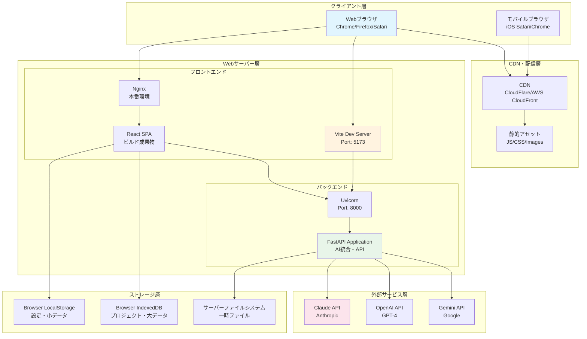

# デプロイメントアーキテクチャ (L2)

**Document ID**: PA-L2-DEPLOY-001
**Version**: 1.0.0
**Last Updated**: 2025-10-13
**Parent**: [L1: システムアーキテクチャ](../logical/L1_system.md)
**Implementation Status**: ✅ Current Deployment

## 🏗️ 物理アーキテクチャ概要

DAWAIプロジェクトのデプロイメント構成、インフラストラクチャ、本番環境設定を定義します。

## 🌐 デプロイメント構成図



## 🔧 開発環境

### ローカル開発構成

```yaml
開発サーバー:
  フロントエンド:
    - ツール: Vite Dev Server
    - ポート: 5173 (固定)
    - ホスト: localhost / 127.0.0.1
    - HMR: 有効
    - ソースマップ: 有効

  バックエンド:
    - ツール: Uvicorn
    - ポート: 8000
    - ホスト: 127.0.0.1 (セキュリティ考慮)
    - リロード: 有効 (開発時)
    - ワーカー: 1

システム要件:
  OS: Windows 10/11, macOS 12+, Linux
  Node.js: 18.x以上
  Python: 3.11以上
  RAM: 8GB以上推奨
  ストレージ: 10GB以上（node_modules含む）
```

### 開発環境セットアップ

```bash
# 1. フロントエンドセットアップ
cd DAWAI_server/frontend
npm install
npm run dev  # ポート5173で起動

# 2. バックエンドセットアップ
cd DAWAI_server/backend/ai_agent
pip install -r requirements.txt
python main.py  # ポート8000で起動

# 3. 環境変数設定
cp .env.example .env
# .envファイルを編集してAPIキーを設定
```

### 環境変数設定

**フロントエンド** (`.env`):
```bash
# Vite環境変数
VITE_API_BASE_URL=http://localhost:8000
VITE_DEBUG=true
VITE_LOG_LEVEL=DEBUG
```

**バックエンド** (`.env`):
```bash
# AIプロバイダーAPIキー
ANTHROPIC_API_KEY=sk-ant-...
OPENAI_API_KEY=sk-...
GEMINI_API_KEY=...

# サーバー設定
API_HOST=127.0.0.1
API_PORT=8000
ENV=development

# CORS設定
ALLOWED_ORIGINS=http://localhost:5173,http://localhost:3000
```

## 🚀 本番環境

### 本番環境構成

```yaml
サーバー構成:
  タイプ: VPS / クラウドインスタンス
  推奨スペック:
    - CPU: 4コア以上
    - RAM: 16GB以上
    - ストレージ: 50GB SSD以上
    - ネットワーク: 1Gbps以上

  OS: Ubuntu 22.04 LTS / Amazon Linux 2

Webサーバー:
  - Nginx 1.24+
  - リバースプロキシ設定
  - SSL/TLS: Let's Encrypt
  - HTTP/2有効化

アプリケーションサーバー:
  フロントエンド:
    - 静的ファイル配信: Nginx
    - ビルド: `npm run build`
    - 配置先: `/var/www/dawai/dist/`

  バックエンド:
    - サーバー: Uvicorn
    - プロセス管理: systemd / Supervisor
    - ワーカー: 4-8 (CPU数に応じて)
    - ポート: 8000 (内部のみ)
```

### Nginx設定例

```nginx
# /etc/nginx/sites-available/dawai
server {
    listen 80;
    listen [::]:80;
    server_name dawai.example.com;

    # HTTPSリダイレクト
    return 301 https://$server_name$request_uri;
}

server {
    listen 443 ssl http2;
    listen [::]:443 ssl http2;
    server_name dawai.example.com;

    # SSL証明書
    ssl_certificate /etc/letsencrypt/live/dawai.example.com/fullchain.pem;
    ssl_certificate_key /etc/letsencrypt/live/dawai.example.com/privkey.pem;

    # セキュリティヘッダー
    add_header Strict-Transport-Security "max-age=31536000; includeSubDomains" always;
    add_header X-Frame-Options "SAMEORIGIN" always;
    add_header X-Content-Type-Options "nosniff" always;
    add_header X-XSS-Protection "1; mode=block" always;

    # フロントエンド（静的ファイル）
    root /var/www/dawai/dist;
    index index.html;

    location / {
        try_files $uri $uri/ /index.html;
    }

    # バックエンドAPI（リバースプロキシ）
    location /api/ {
        proxy_pass http://127.0.0.1:8000;
        proxy_http_version 1.1;
        proxy_set_header Upgrade $http_upgrade;
        proxy_set_header Connection 'upgrade';
        proxy_set_header Host $host;
        proxy_cache_bypass $http_upgrade;

        # タイムアウト設定（ストリーミング対応）
        proxy_read_timeout 300s;
        proxy_connect_timeout 75s;

        # バッファリング無効化（ストリーミング対応）
        proxy_buffering off;
        proxy_cache off;
    }

    # 静的アセットのキャッシュ
    location ~* \.(js|css|png|jpg|jpeg|gif|ico|svg|woff|woff2|ttf|eot)$ {
        expires 1y;
        add_header Cache-Control "public, immutable";
    }

    # ログ設定
    access_log /var/log/nginx/dawai_access.log;
    error_log /var/log/nginx/dawai_error.log;

    # ファイルアップロード上限
    client_max_body_size 50M;

    # Gzip圧縮
    gzip on;
    gzip_types text/plain text/css application/json application/javascript text/xml application/xml application/xml+rss text/javascript;
}
```

### systemd設定例

```ini
# /etc/systemd/system/dawai-backend.service
[Unit]
Description=DAWAI FastAPI Backend
After=network.target

[Service]
Type=simple
User=dawai
WorkingDirectory=/opt/dawai/backend/ai_agent
Environment="PATH=/opt/dawai/venv/bin"
Environment="ANTHROPIC_API_KEY=..."
Environment="OPENAI_API_KEY=..."
Environment="GEMINI_API_KEY=..."
ExecStart=/opt/dawai/venv/bin/uvicorn main:app --host 127.0.0.1 --port 8000 --workers 4
Restart=always
RestartSec=10

[Install]
WantedBy=multi-user.target
```

### デプロイスクリプト

```bash
#!/bin/bash
# deploy.sh - 本番環境デプロイスクリプト

set -e

# 変数
APP_DIR="/opt/dawai"
FRONTEND_DIR="$APP_DIR/frontend"
BACKEND_DIR="$APP_DIR/backend/ai_agent"
NGINX_DIR="/var/www/dawai"

# 1. ソースコード更新
cd $APP_DIR
git pull origin main

# 2. フロントエンドビルド
cd $FRONTEND_DIR
npm install --production
npm run build

# 3. ビルド成果物をNginx配置先にコピー
sudo rm -rf $NGINX_DIR/dist
sudo cp -r dist $NGINX_DIR/

# 4. バックエンド依存関係更新
cd $BACKEND_DIR
source /opt/dawai/venv/bin/activate
pip install -r requirements.txt

# 5. サービス再起動
sudo systemctl restart dawai-backend
sudo systemctl reload nginx

# 6. 動作確認
sleep 5
curl -f http://localhost:8000/health || echo "Backend health check failed!"
curl -f https://dawai.example.com/health || echo "Frontend health check failed!"

echo "Deployment completed successfully!"
```

## 🔐 セキュリティ設定

### HTTPS/SSL設定

```bash
# Let's Encrypt証明書取得
sudo certbot --nginx -d dawai.example.com

# 自動更新設定
sudo crontab -e
# 毎日午前2時に証明書更新チェック
0 2 * * * certbot renew --quiet
```

### ファイアウォール設定

```bash
# UFW設定例
sudo ufw default deny incoming
sudo ufw default allow outgoing
sudo ufw allow ssh
sudo ufw allow 80/tcp
sudo ufw allow 443/tcp
sudo ufw enable
```

### CORS設定（本番環境）

**バックエンド** (`main.py`):
```python
# 本番環境専用CORS設定
import os

ALLOWED_ORIGINS = os.getenv("ALLOWED_ORIGINS", "").split(",")

app.add_middleware(
    CORSMiddleware,
    allow_origins=ALLOWED_ORIGINS,  # 環境変数から取得
    allow_credentials=True,
    allow_methods=["GET", "POST", "OPTIONS"],
    allow_headers=["Content-Type", "Authorization"],
    max_age=3600
)
```

## 📊 監視・ロギング

### ログ管理

```yaml
ログ配置:
  Nginx:
    - アクセスログ: /var/log/nginx/dawai_access.log
    - エラーログ: /var/log/nginx/dawai_error.log

  FastAPI:
    - アプリケーションログ: /var/log/dawai/backend.log
    - エラーログ: /var/log/dawai/error.log

  システム:
    - systemdログ: `journalctl -u dawai-backend`

ログローテーション:
  - ツール: logrotate
  - 保持期間: 30日
  - 圧縮: gzip
```

**logrotate設定** (`/etc/logrotate.d/dawai`):
```
/var/log/dawai/*.log {
    daily
    missingok
    rotate 30
    compress
    delaycompress
    notifempty
    create 0640 dawai dawai
    sharedscripts
    postrotate
        systemctl reload dawai-backend > /dev/null 2>&1 || true
    endscript
}
```

### 監視設定

```yaml
推奨監視項目:
  サーバーリソース:
    - CPU使用率: < 80%
    - メモリ使用率: < 85%
    - ディスク使用率: < 80%
    - ネットワーク帯域

  アプリケーション:
    - API応答時間: < 3秒
    - エラーレート: < 1%
    - HTTPステータスコード分布
    - アクティブコネクション数

  外部API:
    - Claude API応答時間
    - OpenAI API応答時間
    - Gemini API応答時間
    - API呼び出し失敗率

監視ツール（推奨）:
  - Prometheus + Grafana
  - New Relic
  - Datadog
  - Sentry (エラートラッキング)
```

## 🔄 バックアップ・リカバリ

### バックアップ戦略

```yaml
バックアップ対象:
  1. ソースコード: Git リモートリポジトリ
  2. 設定ファイル: /opt/dawai/config/
  3. ログファイル: 30日分保持
  4. ユーザーデータ: LocalStorage/IndexedDB（ブラウザ側）

バックアップ頻度:
  - ソースコード: プッシュ毎（Git）
  - 設定ファイル: 毎日
  - ログ: リアルタイム

リカバリ手順:
  1. ソースコードリストア: `git clone <repository>`
  2. 設定ファイルリストア: `/opt/dawai/config/` からコピー
  3. 依存関係インストール: `npm install`, `pip install`
  4. サービス起動: `systemctl start dawai-backend`
```

## 🚨 トラブルシューティング

### 一般的な問題と解決策

#### 1. フロントエンド: ポート5173が使用中

```bash
# プロセス確認
lsof -i :5173

# プロセス終了
kill -9 <PID>

# Vite再起動
npm run dev
```

#### 2. バックエンド: API応答なし

```bash
# サービス状態確認
systemctl status dawai-backend

# ログ確認
journalctl -u dawai-backend -n 100

# サービス再起動
systemctl restart dawai-backend
```

#### 3. CORS エラー

```bash
# CORS設定確認
grep -A 10 "CORSMiddleware" /opt/dawai/backend/ai_agent/main.py

# 許可オリジン追加
export ALLOWED_ORIGINS="https://dawai.example.com"
systemctl restart dawai-backend
```

#### 4. SSL証明書エラー

```bash
# 証明書有効期限確認
certbot certificates

# 証明書更新
certbot renew

# Nginx再起動
systemctl reload nginx
```

## 📈 スケーリング戦略

### 垂直スケーリング

```yaml
段階的スペック増強:
  Phase 1（初期）:
    - CPU: 2コア
    - RAM: 8GB
    - 同時接続: ~50ユーザー

  Phase 2（成長期）:
    - CPU: 4コア
    - RAM: 16GB
    - 同時接続: ~200ユーザー

  Phase 3（拡大期）:
    - CPU: 8コア
    - RAM: 32GB
    - GPU: T4以上（DiffSinger用）
    - 同時接続: ~500ユーザー
```

### 水平スケーリング（将来）

```yaml
マルチサーバー構成:
  ロードバランサー:
    - Nginx / HAProxy
    - ヘルスチェック有効化
    - セッションアフィニティ

  バックエンドサーバー:
    - 複数インスタンス
    - ステートレス設計
    - 共有セッションストレージ（Redis）

  データベース（将来）:
    - PostgreSQL / MySQL
    - レプリケーション構成
    - バックアップ戦略
```

## 🔗 関連ドキュメント

- **[L1: システムアーキテクチャ](../logical/L1_system.md)** - 論理アーキテクチャ
- **[L2: フロントエンド詳細](../logical/L2_frontend/index.md)** - React実装
- **[L2: バックエンド詳細](../logical/L2_backend/index.md)** - FastAPI実装
- **[L2: 開発ガイドライン](../logical/L2_development_guidelines.md)** - 品質基準

---

**実装ファイル参照**:
- **Nginx設定**: `/etc/nginx/sites-available/dawai`
- **systemd設定**: `/etc/systemd/system/dawai-backend.service`
- **デプロイスクリプト**: `DAWAI_server/scripts/deploy.sh` (作成推奨)
- **環境変数**: `DAWAI_server/backend/ai_agent/.env`
