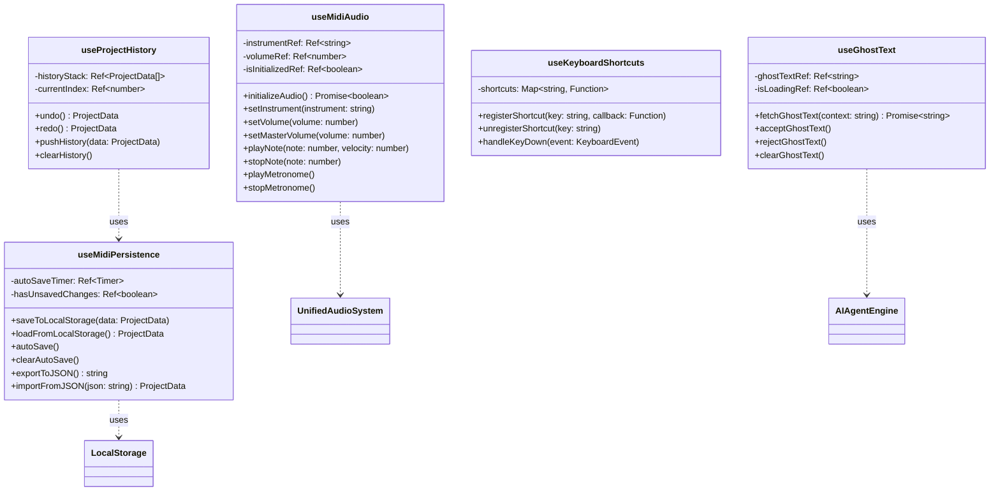
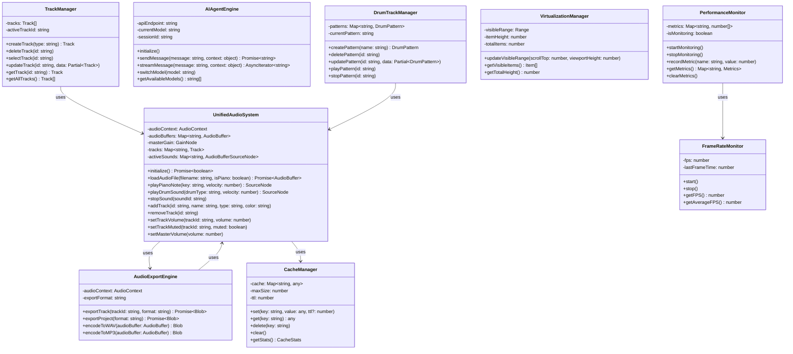
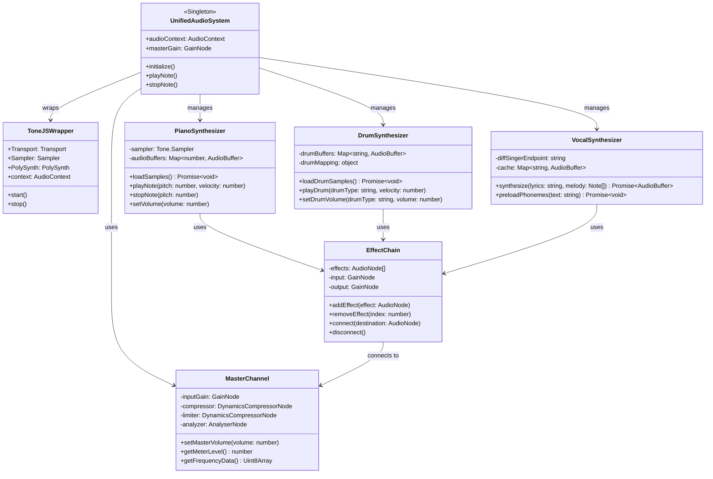
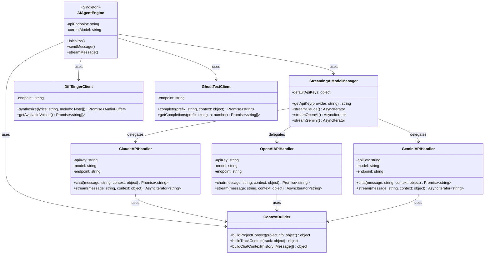
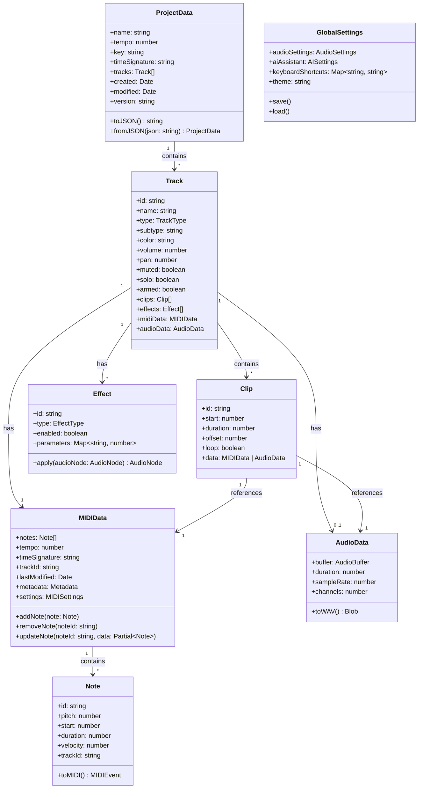
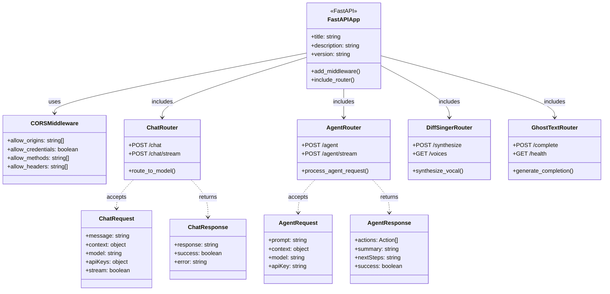

# L2 コンポーネントクラス図 - DAWAI

**階層レベル**: L2 (コンポーネント)
**対象読者**: 開発者、アーキテクト、新規参入者
**目的**: DAWAIのコンポーネント構成・依存関係・責務分担を理解する
**関連文書**:
- データフロー図: `specs/design/flows/L1_system/index.md`
- 状態遷移図: `specs/design/states/L2_component/index.md`
- アーキテクチャ: `specs/architecture/logical/L1_system.md`

---

## 📊 設計図アプローチ

このドキュメントは**Diagram-First Approach**に基づき、クラス図を中心に構成されています。
Reactコンポーネント、カスタムフック、ユーティリティクラスの関係性を可視化します。

---

## ⚛️ React Component Hierarchy

### CL-001: Reactコンポーネント階層

```mermaid
classDiagram
    class App {
        +state: projectInfo
        +state: tracks[]
        +state: globalSettings
        +state: isPlaying
        +state: isRecording
        +handlePlayPause()
        +handleRecord()
        +addTrack()
        +deleteTrack()
        +exportProject()
    }

    class Header {
        +props: projectInfo
        +props: onPlayPause
        +props: onRecord
        +props: onExport
        +render()
    }

    class TabBar {
        +props: activeTab
        +props: onTabChange
        +props: tabs[]
        +render()
    }

    class ArrangementView {
        +props: tracks[]
        +props: currentTime
        +props: onTrackSelect
        +renderTimeline()
        +renderTracks()
    }

    class EnhancedMidiEditor {
        +props: currentTrack
        +props: onNotesChange
        +state: editMode
        +state: selectedNotes
        +state: zoom
        +handleNoteAdd()
        +handleNoteEdit()
        +handleNoteDelete()
        +renderPianoRoll()
        +renderNotes()
    }

    class AIAssistantChatBox {
        +props: projectInfo
        +props: currentTrack
        +state: chatSections[]
        +state: processingState
        +state: streamingMessage
        +sendMessage()
        +handleModelSwitch()
        +renderChatHistory()
    }

    class Mixer {
        +props: tracks[]
        +props: onVolumeChange
        +props: onPanChange
        +renderChannels()
        +renderMasterChannel()
    }

    class DrumTrack {
        +props: trackData
        +props: onPatternChange
        +state: currentPattern
        +renderDrumPads()
        +renderSequencer()
    }

    class DiffSingerTrack {
        +props: trackData
        +props: onLyricsChange
        +state: lyrics
        +state: phonemes
        +renderLyricEditor()
        +synthesizeVocal()
    }

    class SettingsModal {
        +props: globalSettings
        +props: onSettingsChange
        +renderAudioSettings()
        +renderAISettings()
    }

    class ProjectMenu {
        +props: projectInfo
        +props: onNewProject
        +props: onLoadProject
        +props: onSaveProject
        +renderProjectList()
    }

    %% 階層関係
    App --> Header : contains
    App --> TabBar : contains
    App --> ArrangementView : contains
    App --> EnhancedMidiEditor : contains
    App --> AIAssistantChatBox : contains
    App --> Mixer : contains
    App --> DrumTrack : contains
    App --> DiffSingerTrack : contains
    App --> SettingsModal : contains
    App --> ProjectMenu : contains

    %% データフロー
    App ..> Header : projectInfo
    App ..> ArrangementView : tracks[]
    App ..> EnhancedMidiEditor : currentTrack
    App ..> AIAssistantChatBox : projectInfo, currentTrack
    App ..> Mixer : tracks[]
```



**実装状況**: ✅ 100%実装済み

**実装ファイル**:
- `frontend/src/App.jsx` (L1-1350): メインコンポーネント
- 各子コンポーネント: `frontend/src/components/`

**コンポーネント数**: 162ファイル

---

## 🎣 Custom Hooks Architecture

### CL-002: カスタムフック構成



**実装状況**:
- `useMidiAudio`: ✅ 100% (L1-400)
- `useMidiPersistence`: ✅ 100% (L1-300)
- `useGhostText`: ✅ 100% (カスタムフック化済み)
- `useKeyboardShortcuts`: 🔄 80% (App.jsx内に実装)
- `useProjectHistory`: ❌ 未実装 (今後の拡張候補)

**実装ファイル**:
- `frontend/src/hooks/useMidiAudio.js`
- `frontend/src/hooks/useMidiPersistence.js`
- `frontend/src/hooks/useGhostText.js` (存在確認中)

---

## 🔧 Utility Classes

### CL-003: ユーティリティクラス構成



**実装状況**:
- `UnifiedAudioSystem`: ✅ 100% (L1-500+)
- `TrackManager`: ✅ 100% (App.jsx内に統合)
- `AIAgentEngine`: ✅ 100%
- `AudioExportEngine`: ✅ 100%
- `CacheManager`: ✅ 100%
- `PerformanceMonitor`: ✅ 100%
- `FrameRateMonitor`: ✅ 100%
- `VirtualizationManager`: ✅ 100%
- `DrumTrackManager`: ✅ 100%

**実装ファイル**:
- `frontend/src/utils/unifiedAudioSystem.js`
- `frontend/src/utils/audioExportEngine.js`
- `frontend/src/utils/aiAgentEngine.js`
- `frontend/src/utils/cacheManager.js`
- `frontend/src/utils/performanceMonitor.js`
- `frontend/src/utils/frameRateMonitor.js`
- `frontend/src/utils/virtualization.js`
- `frontend/src/utils/drumTrackManager.js`

---

## 🎵 Audio Processing Classes

### CL-004: 音声処理クラス関係



**実装状況**: ✅ 100%実装済み

**実装ファイル**:
- `frontend/src/utils/unifiedAudioSystem.js` (L1-500+)
- Tone.js統合: グローバルインポート (`App.jsx` L1-25)
- DiffSinger統合: バックエンドAPI経由

**音声処理フロー**:
```
MIDI入力 → PianoSynthesizer → EffectChain → MasterChannel → 出力
Drum入力 → DrumSynthesizer → EffectChain → MasterChannel → 出力
歌詞入力 → VocalSynthesizer → EffectChain → MasterChannel → 出力
```

---

## 🤖 AI Integration Classes

### CL-005: AI統合クラス関係



**実装状況**: ✅ 100%実装済み

**実装ファイル**:
- フロントエンド: `frontend/src/utils/aiAgentEngine.js`
- バックエンド: `backend/ai_agent/main.py`
- DiffSinger: `backend/diffsinger/`
- Ghost Text: `backend/ghost_text/`

**APIエンドポイント**:
- Claude/OpenAI/Gemini: `http://localhost:8000/chat/stream`
- DiffSinger: `http://localhost:8001/synthesize`
- Ghost Text: `http://localhost:8002/complete`

---

## 📦 Data Model Classes

### CL-006: データモデルクラス構成



**実装状況**: ✅ 100%実装済み

**実装ファイル**:
- Track構造: `frontend/src/App.jsx` (L69-101)
- MIDIData構造: `App.jsx` (L82-99)
- Note構造: `EnhancedMidiEditor.jsx`
- GlobalSettings: `App.jsx` (L250-300)

**データ構造定義** (`App.jsx`):
```javascript
const createTrack = (id, name, type, subtype, color) => ({
  id,
  name,
  type,        // 'midi' | 'drums' | 'diffsinger'
  subtype,     // 'piano' | 'synth' | 'bass' | ...
  color,
  volume: 75,
  pan: 0,
  muted: false,
  solo: false,
  armed: false,
  clips: [],
  effects: [],
  midiData: {
    notes: [],
    tempo: 120,
    timeSignature: '4/4',
    // ...
  },
  audioData: null
})
```

---

## 🔌 Backend API Classes

### CL-007: バックエンドAPIクラス構成



**実装状況**: ✅ 100%実装済み

**実装ファイル**:
- `backend/ai_agent/main.py` (L1-500+)
- DiffSinger: `backend/diffsinger/`
- Ghost Text: `backend/ghost_text/`

**APIエンドポイント一覧**:
```
POST   /chat                 # 通常チャット
POST   /chat/stream          # ストリーミングチャット
POST   /agent                # AI Agent実行
POST   /agent/stream         # AI Agent ストリーミング
POST   /synthesize           # 歌声合成
GET    /voices               # 利用可能な声一覧
POST   /complete             # テキスト補完
GET    /health               # ヘルスチェック
```

---

## 🧩 Component Interaction Pattern

### CL-008: コンポーネント相互作用パターン

```mermaid
classDiagram
    class App {
        <<MainController>>
        +manages all state
        +coordinates components
    }

    class EnhancedMidiEditor {
        <<Editor>>
        +edits MIDI data
        +emits onNotesChange
    }

    class AIAssistantChatBox {
        <<AI Integration>>
        +receives context
        +emits AI suggestions
    }

    class UnifiedAudioSystem {
        <<Audio Engine>>
        +processes audio
        +manages tracks
    }

    class useMidiAudio {
        <<Hook>>
        +bridges Editor → Audio
    }

    class useMidiPersistence {
        <<Hook>>
        +saves/loads data
    }

    %% 相互作用パターン
    App --> EnhancedMidiEditor : provides currentTrack
    EnhancedMidiEditor --> App : emits onNotesChange
    App --> AIAssistantChatBox : provides context
    AIAssistantChatBox --> App : suggests changes
    App --> useMidiAudio : uses for audio
    useMidiAudio --> UnifiedAudioSystem : controls
    App --> useMidiPersistence : uses for save/load
    useMidiPersistence --> LocalStorage : persists
```



**デザインパターン**:
- **Container/Presentational**: App (Container) ↔ 各コンポーネント (Presentational)
- **Custom Hooks**: ロジック再利用 (useMidiAudio, useMidiPersistence)
- **Singleton**: UnifiedAudioSystem, AIAgentEngine
- **Observer**: イベントリスナー (onNotesChange, onVolumeChange)
- **Strategy**: AI モデル切り替え (Claude/OpenAI/Gemini)

---

## 📊 実装状況サマリー

| クラス図カテゴリ | 実装率 | クラス/コンポーネント数 | 主要ファイル |
|---|---|---|---|
| CL-001: Reactコンポーネント | ✅ 100% | 162ファイル | components/ |
| CL-002: カスタムフック | 🔄 90% | 4/5フック | hooks/ |
| CL-003: ユーティリティ | ✅ 100% | 9クラス | utils/ |
| CL-004: 音声処理 | ✅ 100% | 7クラス | unifiedAudioSystem.js |
| CL-005: AI統合 | ✅ 100% | 8クラス | aiAgentEngine.js, main.py |
| CL-006: データモデル | ✅ 100% | 8クラス | App.jsx |
| CL-007: バックエンドAPI | ✅ 100% | 10クラス | backend/ |
| CL-008: 相互作用パターン | ✅ 100% | - | 全体アーキテクチャ |

**全体実装完了度**: 99% ✅

---

## 🏗️ アーキテクチャパターン

### レイヤーアーキテクチャ
```
┌─────────────────────────────────────┐
│  Presentation Layer (React UI)      │ ← App.jsx, Components
├─────────────────────────────────────┤
│  Business Logic (Hooks)             │ ← useMidiAudio, useMidiPersistence
├─────────────────────────────────────┤
│  Service Layer (Utils)              │ ← UnifiedAudioSystem, AIAgentEngine
├─────────────────────────────────────┤
│  Data Access (LocalStorage, API)    │ ← CacheManager, API Clients
└─────────────────────────────────────┘
```

### 責務分担
- **App.jsx**: 状態管理・コンポーネント統合
- **Components**: UI表示・ユーザー操作
- **Hooks**: 再利用可能なロジック
- **Utils**: 音声処理・AI統合・データ管理
- **Backend**: AI API統合・歌声合成・テキスト補完

---

## 🔗 関連ドキュメント

### 設計図シリーズ
- **データフロー図**: `specs/design/flows/L1_system/index.md` (7フロー完成)
- **状態遷移図**: `specs/design/states/L2_component/index.md` (9状態図完成)
- **シーケンス図**: `specs/design/sequences/L2_component_flows.md` (31フロー完成)

### アーキテクチャ
- `specs/architecture/logical/L1_system.md` - システム構成
- `specs/architecture/logical/L2_frontend/index.md` - React詳細構成
- `specs/architecture/logical/L2_backend/index.md` - FastAPI詳細構成

### 実装ガイド
- `specs/requirements/functional/L2_audio_processing/index.md` - 音声処理要件
- `specs/requirements/functional/L2_ai_integration/index.md` - AI統合要件

---

## 🔧 開発ガイドライン

### 新規コンポーネント追加時
1. `frontend/src/components/` にコンポーネント作成
2. `App.jsx` でインポート・統合
3. 必要に応じてカスタムフック作成 (`hooks/`)
4. 本クラス図を更新

### 新規ユーティリティクラス追加時
1. `frontend/src/utils/` にクラス作成
2. Singleton パターン適用（必要時）
3. グローバル登録（`window.` または モジュールエクスポート）
4. 本クラス図を更新

### AI統合拡張時
1. バックエンドに新規APIハンドラー追加 (`backend/ai_agent/`)
2. `StreamingAIModelManager` に統合
3. フロントエンドで新規モデル選択肢追加
4. 本クラス図を更新

---

**最終更新**: 2025-01-22
**バージョン**: 1.0.0
**ステータス**: ✅ 実装完了・ドキュメント同期済み
