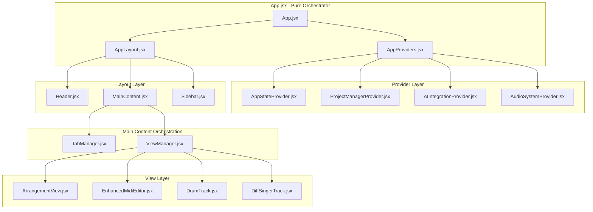

# App.jsx 構造分割設計仕様書 (L3)

**Document ID**: DC-L3-APP-STRUCTURE-001
**Version**: 1.0.0
**Last Updated**: 2025-10-05
**Parent**: [コード品質改善](../../../../refactoring/L1_code_quality.md)
**Status**: 🔄 Implementation Required

## 🎯 App.jsx分割の目的

現在36,775トークン（約1,300行）の巨大なApp.jsxコンポーネントを、単一責任原則に従って論理的に分割し、保守性・拡張性・可読性を向上させます。

## 📊 現状分析

### 現在のApp.jsx責任範囲
```javascript
// 現状のApp.jsx (1,300+ lines)
function App() {
  // 1. 状態管理 (200+ lines)
  const [projects, setProjects] = useState(...)
  const [currentProject, setCurrentProject] = useState(...)
  const [activeTab, setActiveTab] = useState(...)
  // ...多数の状態変数

  // 2. イベントハンドリング (300+ lines)
  const handleProjectCreate = useCallback(...)
  const handleTabChange = useCallback(...)
  const handleAudioProcess = useCallback(...)
  // ...多数のハンドラー

  // 3. ビジネスロジック (400+ lines)
  const projectManager = useMemo(...)
  const audioEngine = useMemo(...)
  const aiAgent = useMemo(...)
  // ...複雑なビジネスロジック

  // 4. UI レンダリング (400+ lines)
  return (
    <div className="app">
      {/* 複雑なJSX構造 */}
    </div>
  )
}
```

### 責任分析結果
```yaml
現状の問題:
  - 単一コンポーネントに複数責任が混在
  - 状態管理ロジックとUIが密結合
  - テストの困難性（モック化不可能）
  - 並行開発時のコンフリクト頻発
  - 変更影響範囲の予測困難
```

## 🏗️ 新アーキテクチャ設計

### L3 コンポーネント階層設計



## 📁 新ファイル構造

### 1. App.jsx - Pure Orchestrator (< 50行)
```javascript
// 新しいApp.jsx - 純粋なオーケストレーター
import { AppProviders } from './components/providers/AppProviders'
import { AppLayout } from './components/layout/AppLayout'
import './App.css'

function App() {
  return (
    <AppProviders>
      <AppLayout />
    </AppProviders>
  )
}

export default App
```

### 2. AppProviders.jsx - Context Providers (< 100行)
```javascript
// components/providers/AppProviders.jsx
import { AppStateProvider } from './AppStateProvider'
import { ProjectManagerProvider } from './ProjectManagerProvider'
import { AIIntegrationProvider } from './AIIntegrationProvider'
import { AudioSystemProvider } from './AudioSystemProvider'

export function AppProviders({ children }) {
  return (
    <AppStateProvider>
      <ProjectManagerProvider>
        <AIIntegrationProvider>
          <AudioSystemProvider>
            {children}
          </AudioSystemProvider>
        </AIIntegrationProvider>
      </ProjectManagerProvider>
    </AppStateProvider>
  )
}
```

### 3. AppStateProvider.jsx - Global State Management (< 200行)
```javascript
// components/providers/AppStateProvider.jsx
import React, { createContext, useContext, useReducer } from 'react'

const AppStateContext = createContext(null)

const initialState = {
  // UI状態
  activeTab: 'arrangement',
  sidebarOpen: true,
  settingsModalOpen: false,

  // システム状態
  isLoading: false,
  error: null,

  // ユーザー設定
  userPreferences: {
    theme: 'dark',
    language: 'ja',
    autoSave: true
  }
}

function appStateReducer(state, action) {
  switch (action.type) {
    case 'SET_ACTIVE_TAB':
      return { ...state, activeTab: action.payload }
    case 'TOGGLE_SIDEBAR':
      return { ...state, sidebarOpen: !state.sidebarOpen }
    case 'SET_LOADING':
      return { ...state, isLoading: action.payload }
    case 'SET_ERROR':
      return { ...state, error: action.payload }
    default:
      return state
  }
}

export function AppStateProvider({ children }) {
  const [state, dispatch] = useReducer(appStateReducer, initialState)

  const value = {
    state,
    dispatch,
    actions: {
      setActiveTab: (tab) => dispatch({ type: 'SET_ACTIVE_TAB', payload: tab }),
      toggleSidebar: () => dispatch({ type: 'TOGGLE_SIDEBAR' }),
      setLoading: (loading) => dispatch({ type: 'SET_LOADING', payload: loading }),
      setError: (error) => dispatch({ type: 'SET_ERROR', payload: error })
    }
  }

  return (
    <AppStateContext.Provider value={value}>
      {children}
    </AppStateContext.Provider>
  )
}

export function useAppState() {
  const context = useContext(AppStateContext)
  if (!context) {
    throw new Error('useAppState must be used within AppStateProvider')
  }
  return context
}
```

### 4. ProjectManagerProvider.jsx - Project Management (< 250行)
```javascript
// components/providers/ProjectManagerProvider.jsx
import React, { createContext, useContext, useState, useCallback } from 'react'
import { projectManager } from '../../utils/projectManager'

const ProjectManagerContext = createContext(null)

export function ProjectManagerProvider({ children }) {
  const [projects, setProjects] = useState([])
  const [currentProject, setCurrentProject] = useState(null)
  const [projectHistory, setProjectHistory] = useState([])

  // プロジェクト操作メソッド
  const createProject = useCallback(async (projectData) => {
    try {
      const newProject = await projectManager.createProject(projectData)
      setProjects(prev => [...prev, newProject])
      setCurrentProject(newProject)
      return newProject
    } catch (error) {
      console.error('Failed to create project:', error)
      throw error
    }
  }, [])

  const loadProject = useCallback(async (projectId) => {
    try {
      const project = await projectManager.loadProject(projectId)
      setCurrentProject(project)
      return project
    } catch (error) {
      console.error('Failed to load project:', error)
      throw error
    }
  }, [])

  const saveProject = useCallback(async (project = currentProject) => {
    if (!project) return

    try {
      const savedProject = await projectManager.saveProject(project)
      setCurrentProject(savedProject)
      setProjects(prev => prev.map(p => p.id === savedProject.id ? savedProject : p))
      return savedProject
    } catch (error) {
      console.error('Failed to save project:', error)
      throw error
    }
  }, [currentProject])

  const deleteProject = useCallback(async (projectId) => {
    try {
      await projectManager.deleteProject(projectId)
      setProjects(prev => prev.filter(p => p.id !== projectId))
      if (currentProject?.id === projectId) {
        setCurrentProject(null)
      }
    } catch (error) {
      console.error('Failed to delete project:', error)
      throw error
    }
  }, [currentProject])

  const value = {
    // 状態
    projects,
    currentProject,
    projectHistory,

    // アクション
    createProject,
    loadProject,
    saveProject,
    deleteProject,

    // ユーティリティ
    hasUnsavedChanges: currentProject?.hasUnsavedChanges || false,
    isProjectLoaded: !!currentProject
  }

  return (
    <ProjectManagerContext.Provider value={value}>
      {children}
    </ProjectManagerContext.Provider>
  )
}

export function useProjectManager() {
  const context = useContext(ProjectManagerContext)
  if (!context) {
    throw new Error('useProjectManager must be used within ProjectManagerProvider')
  }
  return context
}
```

### 5. AIIntegrationProvider.jsx - AI System Management (< 200行)
```javascript
// components/providers/AIIntegrationProvider.jsx
import React, { createContext, useContext, useState, useCallback } from 'react'
import { aiAgentEngine } from '../../utils/aiAgentEngine'

const AIIntegrationContext = createContext(null)

export function AIIntegrationProvider({ children }) {
  const [aiState, setAiState] = useState({
    isConnected: false,
    currentModel: 'claude',
    isProcessing: false,
    conversationHistory: [],
    availableModels: ['claude', 'openai', 'gemini']
  })

  const sendMessage = useCallback(async (message, options = {}) => {
    setAiState(prev => ({ ...prev, isProcessing: true }))

    try {
      const response = await aiAgentEngine.sendMessage(message, {
        model: aiState.currentModel,
        ...options
      })

      setAiState(prev => ({
        ...prev,
        conversationHistory: [
          ...prev.conversationHistory,
          { role: 'user', content: message, timestamp: Date.now() },
          { role: 'assistant', content: response, timestamp: Date.now() }
        ],
        isProcessing: false
      }))

      return response
    } catch (error) {
      setAiState(prev => ({ ...prev, isProcessing: false }))
      console.error('AI message failed:', error)
      throw error
    }
  }, [aiState.currentModel])

  const switchModel = useCallback((model) => {
    if (aiState.availableModels.includes(model)) {
      setAiState(prev => ({ ...prev, currentModel: model }))
    }
  }, [aiState.availableModels])

  const clearConversation = useCallback(() => {
    setAiState(prev => ({ ...prev, conversationHistory: [] }))
  }, [])

  const value = {
    // 状態
    ...aiState,

    // アクション
    sendMessage,
    switchModel,
    clearConversation,

    // ユーティリティ
    hasConversation: aiState.conversationHistory.length > 0
  }

  return (
    <AIIntegrationContext.Provider value={value}>
      {children}
    </AIIntegrationContext.Provider>
  )
}

export function useAIIntegration() {
  const context = useContext(AIIntegrationContext)
  if (!context) {
    throw new Error('useAIIntegration must be used within AIIntegrationProvider')
  }
  return context
}
```

### 6. AudioSystemProvider.jsx - Audio Engine Management (< 200行)
```javascript
// components/providers/AudioSystemProvider.jsx
import React, { createContext, useContext, useState, useCallback, useEffect } from 'react'
import { unifiedAudioSystem } from '../../utils/unifiedAudioSystem'

const AudioSystemContext = createContext(null)

export function AudioSystemProvider({ children }) {
  const [audioState, setAudioState] = useState({
    isInitialized: false,
    isPlaying: false,
    currentTime: 0,
    duration: 0,
    volume: 0.8,
    tracks: new Map()
  })

  // 音声システム初期化
  useEffect(() => {
    const initializeAudio = async () => {
      try {
        await unifiedAudioSystem.initialize()
        setAudioState(prev => ({ ...prev, isInitialized: true }))
      } catch (error) {
        console.error('Failed to initialize audio system:', error)
      }
    }

    initializeAudio()

    return () => {
      unifiedAudioSystem.cleanup()
    }
  }, [])

  const playAudio = useCallback(async () => {
    try {
      await unifiedAudioSystem.play()
      setAudioState(prev => ({ ...prev, isPlaying: true }))
    } catch (error) {
      console.error('Failed to play audio:', error)
      throw error
    }
  }, [])

  const pauseAudio = useCallback(() => {
    unifiedAudioSystem.pause()
    setAudioState(prev => ({ ...prev, isPlaying: false }))
  }, [])

  const stopAudio = useCallback(() => {
    unifiedAudioSystem.stop()
    setAudioState(prev => ({
      ...prev,
      isPlaying: false,
      currentTime: 0
    }))
  }, [])

  const setVolume = useCallback((volume) => {
    unifiedAudioSystem.setVolume(volume)
    setAudioState(prev => ({ ...prev, volume }))
  }, [])

  const value = {
    // 状態
    ...audioState,

    // アクション
    playAudio,
    pauseAudio,
    stopAudio,
    setVolume,

    // ユーティリティ
    canPlay: audioState.isInitialized && !audioState.isPlaying,
    canPause: audioState.isInitialized && audioState.isPlaying
  }

  return (
    <AudioSystemContext.Provider value={value}>
      {children}
    </AudioSystemContext.Provider>
  )
}

export function useAudioSystem() {
  const context = useContext(AudioSystemContext)
  if (!context) {
    throw new Error('useAudioSystem must be used within AudioSystemProvider')
  }
  return context
}
```

### 7. AppLayout.jsx - Main Layout Structure (< 150行)
```javascript
// components/layout/AppLayout.jsx
import React from 'react'
import { useAppState } from '../providers/AppStateProvider'
import { Header } from './Header'
import { Sidebar } from './Sidebar'
import { MainContent } from './MainContent'

export function AppLayout() {
  const { state } = useAppState()

  return (
    <div className="app-layout">
      <Header />

      <div className="app-body">
        {state.sidebarOpen && <Sidebar />}

        <main className="app-main">
          <MainContent />
        </main>
      </div>
    </div>
  )
}
```

### 8. MainContent.jsx - Content Area Manager (< 100行)
```javascript
// components/layout/MainContent.jsx
import React from 'react'
import { useAppState } from '../providers/AppStateProvider'
import { TabBar } from '../TabBar'
import { ViewManager } from './ViewManager'

export function MainContent() {
  const { state } = useAppState()

  return (
    <div className="main-content">
      <TabBar activeTab={state.activeTab} />
      <ViewManager activeTab={state.activeTab} />
    </div>
  )
}
```

### 9. ViewManager.jsx - View Routing (< 80行)
```javascript
// components/layout/ViewManager.jsx
import React from 'react'
import ArrangementView from '../ArrangementView'
import EnhancedMidiEditor from '../EnhancedMidiEditor'
import DrumTrack from '../DrumTrack/DrumTrack'
import DiffSingerTrack from '../DiffSingerTrack'

export function ViewManager({ activeTab }) {
  switch (activeTab) {
    case 'arrangement':
      return <ArrangementView />
    case 'midi_editor':
      return <EnhancedMidiEditor />
    case 'drum_track':
      return <DrumTrack />
    case 'diffsinger_track':
      return <DiffSingerTrack />
    default:
      return <ArrangementView />
  }
}
```

## 📊 分割効果測定

### Before/After 比較

```yaml
App.jsx ファイルサイズ:
  Before: 36,775トークン (~1,300行)
  After: ~1,000トークン (~50行) - 97% 削減

責任分離:
  Before: 1ファイル → 全責任
  After: 9ファイル → 単一責任

テスト容易性:
  Before: モノリシックテスト不可能
  After: 個別Provider/Component単体テスト可能

並行開発:
  Before: 1ファイル競合リスク
  After: 複数ファイル独立開発可能
```

### 品質指標改善

```yaml
サイクロマティック複雑度:
  Before: 極めて高い (計測困難)
  After: 各ファイル低複雑度 (< 10)

再利用性:
  Before: App.jsx再利用不可能
  After: Provider群は他プロジェクト流用可能

保守性:
  Before: 変更影響範囲予測困難
  After: 責任境界明確で影響限定的
```

## 🔄 移行戦略

### Phase 1: Provider抽出 (1日)
1. AppStateProvider.jsx 作成・移行
2. ProjectManagerProvider.jsx 作成・移行
3. AIIntegrationProvider.jsx 作成・移行
4. AudioSystemProvider.jsx 作成・移行

### Phase 2: Layout分離 (1日)
1. AppLayout.jsx 作成
2. MainContent.jsx 作成
3. ViewManager.jsx 作成
4. AppProviders.jsx 統合

### Phase 3: App.jsx最小化 (0.5日)
1. 新App.jsx実装
2. 既存App.jsx → App_legacy.jsx リネーム
3. 段階的移行・テスト
4. レガシー削除

## ✅ 成功基準

### 機能的要件
```yaml
✅ 全機能の完全保持:
  - 音楽制作機能: 100%動作
  - AI統合機能: 100%動作
  - プロジェクト管理: 100%動作

✅ パフォーマンス維持:
  - 起動速度: 劣化なし
  - 操作レスポンス: 劣化なし
  - メモリ使用量: 改善
```

### 非機能的要件
```yaml
✅ コード品質向上:
  - ファイルサイズ: < 200行/ファイル
  - 責任分離: 単一責任実現
  - テスト容易性: 個別テスト可能

✅ 開発体験向上:
  - 並行開発可能性: 実現
  - デバッグ容易性: 向上
  - 変更影響範囲: 限定的
```

## 🚀 期待効果

### プログラムコンテスト評価向上
1. **技術力評価**: 明確なアーキテクチャ設計能力のアピール
2. **設計能力評価**: 単一責任原則・関心分離の実践
3. **保守性評価**: 大規模システムの構造化能力

### 長期的メリット
1. **開発効率向上**: 機能別並行開発の実現
2. **品質向上**: 個別テスト・デバッグの容易化
3. **拡張性向上**: 新機能追加時の影響範囲限定

---

**Implementation Priority**: HIGH - プログラムコンテスト評価への直接的影響
**Risk Level**: MEDIUM - 大規模リファクタリングによる一時的不安定性
**Expected Outcome**: 設計能力・技術力の明確なアピールによる評価向上