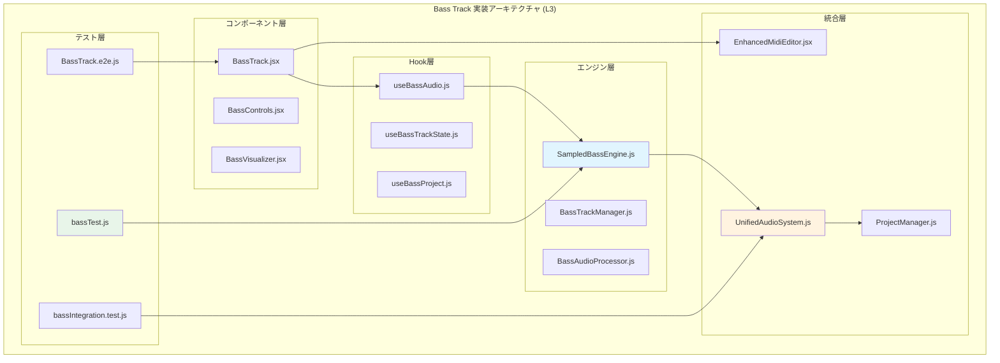

# Bass Track実装仕様書 (L3)

**Document ID**: DF-L3-BASS-IMPL-001
**Version**: 1.0.0
**Last Updated**: 2025-10-05
**Parent**: [L2: Bass Track機能要件](../../../requirements/functional/L2_audio_processing/bass_track_requirements.md)
**Implementation Status**: 🔄 実装準備完了

## 🎯 実装概要

Bass Track機能の詳細実装仕様書。TDD(Test-Driven Development)に基づく実装アプローチで、既存のピアノトラック実装パターンを活用し、Bass音域専用の高品質音源機能を実装します。

### 実装アーキテクチャ



## 🏗️ クラス設計詳細

### DF-L3-BASS-ENGINE-001: SampledBassEngine

#### クラス構造
```javascript
/**
 * Bass Track専用音源エンジン
 * Piano Engine実装パターンを継承
 *
 * @class SampledBassEngine
 * @implements {AudioEngine}
 */
class SampledBassEngine {
  constructor() {
    // 基本プロパティ
    this.audioContext = null;
    this.samples = new Map();           // MIDI → AudioBuffer
    this.activeNotes = new Map();       // 再生中ノート管理
    this.loaded = false;                // 初期化状態
    this.masterGain = null;             // マスター音量制御

    // Bass固有設定
    this.bassRange = { min: 24, max: 60 };      // C1-C4
    this.samplePath = '/sounds/MuseScore_General/samples/bass/';
    this.defaultVolume = 0.8;                   // Bass推奨音量
    this.polyphonyLimit = 16;                   // 同時発音数制限

    // パフォーマンス設定
    this.compressionThreshold = -24;            // コンプレッサー設定
    this.eqSettings = {                         // Bass専用EQ
      lowGain: 3,                              // 60-250Hz +3dB
      midGain: 0,                              // 250Hz-2kHz
      highGain: -2                             // 2kHz+ -2dB
    };
  }

  // 必須実装メソッド
  async loadSamples() { /* 実装詳細 */ }
  playNote(midiNote, velocity = 127) { /* 実装詳細 */ }
  stopNote(midiNote) { /* 実装詳細 */ }
  setVolume(volume) { /* 実装詳細 */ }
  dispose() { /* 実装詳細 */ }

  // Bass専用メソッド
  getSampleConfigs() { /* Bass音源設定 */ }
  findClosestSample(midiNote) { /* 最近接サンプル選択 */ }
  calculatePitchShift(targetNote, sampleNote) { /* ピッチシフト計算 */ }
  applyBassEQ(audioNode) { /* Bass EQ適用 */ }
  validateBassRange(midiNote) { /* 音域検証 */ }
}
```

#### サンプル構成詳細
```javascript
getSampleConfigs() {
  return [
    // オクターブ2 (低音域)
    {
      midiNote: 41,
      note: 'F2',
      file: 'Bass F2.wav',
      frequency: 87.31,
      octave: 2,
      semitone: 5,
      fileSize: '~3.2MB',
      duration: '~2.5s'
    },
    {
      midiNote: 44,
      note: 'G#2',
      file: 'Bass G#2.wav',
      frequency: 103.83,
      octave: 2,
      semitone: 8,
      fileSize: '~3.1MB',
      duration: '~2.3s'
    },
    {
      midiNote: 47,
      note: 'B2',
      file: 'Bass B2.wav',
      frequency: 123.47,
      octave: 2,
      semitone: 11,
      fileSize: '~3.0MB',
      duration: '~2.2s'
    },
    {
      midiNote: 50,
      note: 'D3',
      file: 'Bass D3.wav',
      frequency: 146.83,
      octave: 3,
      semitone: 2,
      fileSize: '~2.9MB',
      duration: '~2.1s'
    },

    // オクターブ3 (中音域)
    {
      midiNote: 53,
      note: 'F3',
      file: 'Bass F3.wav',
      frequency: 174.61,
      octave: 3,
      semitone: 5,
      fileSize: '~2.8MB',
      duration: '~2.0s'
    },
    {
      midiNote: 56,
      note: 'G#3',
      file: 'Bass G#3.wav',
      frequency: 207.65,
      octave: 3,
      semitone: 8,
      fileSize: '~2.7MB',
      duration: '~1.9s'
    },
    {
      midiNote: 59,
      note: 'B3',
      file: 'Bass B3.wav',
      frequency: 246.94,
      octave: 3,
      semitone: 11,
      fileSize: '~2.6MB',
      duration: '~1.8s'
    },
    {
      midiNote: 62,
      note: 'D4',
      file: 'Bass D4.wav',
      frequency: 293.66,
      octave: 4,
      semitone: 2,
      fileSize: '~2.5MB',
      duration: '~1.7s'
    }
  ];
}
```

#### ピッチシフトアルゴリズム
```javascript
findClosestSample(targetMidiNote) {
  const sampleNotes = Array.from(this.samples.keys());

  // 最小距離のサンプルを選択
  let closestNote = sampleNotes[0];
  let minDistance = Math.abs(targetMidiNote - closestNote);

  for (const sampleNote of sampleNotes) {
    const distance = Math.abs(targetMidiNote - sampleNote);
    if (distance < minDistance) {
      minDistance = distance;
      closestNote = sampleNote;
    }
  }

  return {
    midiNote: closestNote,
    buffer: this.samples.get(closestNote),
    pitchShift: this.calculatePitchShift(targetMidiNote, closestNote)
  };
}

calculatePitchShift(targetNote, sampleNote) {
  const semitoneDistance = targetNote - sampleNote;
  const pitchRatio = Math.pow(2, semitoneDistance / 12);

  // Bass音域での品質保持チェック
  if (Math.abs(semitoneDistance) > 12) {
    console.warn(`Large pitch shift detected: ${semitoneDistance} semitones`);
  }

  return {
    detune: semitoneDistance * 100,  // cents
    playbackRate: pitchRatio,
    semitones: semitoneDistance
  };
}
```

### DF-L3-BASS-HOOK-001: useBassAudio Hook

#### Hook実装
```javascript
/**
 * Bass Track専用オーディオフック
 * Piano Audio Hookパターンを継承
 *
 * @hook useBassAudio
 * @returns {Object} Bass audio interface
 */
export const useBassAudio = () => {
  const [bassEngine, setBassEngine] = useState(null);
  const [isLoaded, setIsLoaded] = useState(false);
  const [loadingProgress, setLoadingProgress] = useState(0);
  const [error, setError] = useState(null);

  // エンジン初期化
  useEffect(() => {
    let isMounted = true;

    const initializeBass = async () => {
      try {
        setError(null);
        const engine = new SampledBassEngine();

        // プログレス付きロード
        await engine.loadSamples((progress) => {
          if (isMounted) {
            setLoadingProgress(progress);
          }
        });

        if (isMounted) {
          setBassEngine(engine);
          setIsLoaded(true);
          setLoadingProgress(100);
        }
      } catch (err) {
        if (isMounted) {
          setError(err.message);
          console.error('Bass engine initialization failed:', err);
        }
      }
    };

    initializeBass();

    return () => {
      isMounted = false;
      if (bassEngine) {
        bassEngine.dispose();
      }
    };
  }, []);

  // Bass再生インターフェース
  const playBassNote = useCallback((midiNote, velocity = 127) => {
    if (bassEngine && isLoaded) {
      try {
        bassEngine.playNote(midiNote, velocity);
      } catch (err) {
        console.error('Bass note play failed:', err);
      }
    }
  }, [bassEngine, isLoaded]);

  const stopBassNote = useCallback((midiNote) => {
    if (bassEngine && isLoaded) {
      try {
        bassEngine.stopNote(midiNote);
      } catch (err) {
        console.error('Bass note stop failed:', err);
      }
    }
  }, [bassEngine, isLoaded]);

  const setBassVolume = useCallback((volume) => {
    if (bassEngine && isLoaded) {
      bassEngine.setVolume(volume);
    }
  }, [bassEngine, isLoaded]);

  return {
    // 状態
    isLoaded,
    loadingProgress,
    error,
    bassEngine,

    // 操作
    playBassNote,
    stopBassNote,
    setBassVolume,

    // 情報
    getSampleInfo: () => bassEngine?.getSampleConfigs() || [],
    getBassRange: () => bassEngine?.bassRange || { min: 24, max: 60 }
  };
};
```

### DF-L3-BASS-COMPONENT-001: BassTrack Component

#### Reactコンポーネント
```javascript
/**
 * Bass Track メインコンポーネント
 * Piano Track UIパターンを継承・最適化
 *
 * @component BassTrack
 */
const BassTrack = ({
  trackData,
  onTrackUpdate,
  isPlaying = false,
  currentTime = 0,
  projectManager
}) => {
  const {
    playBassNote,
    stopBassNote,
    setBassVolume,
    isLoaded,
    loadingProgress,
    error,
    getBassRange
  } = useBassAudio();

  const [trackSettings, setTrackSettings] = useState({
    volume: 80,
    muted: false,
    solo: false,
    pan: 0
  });

  // Bass専用設定
  const bassConfig = {
    midiRange: getBassRange(),
    displayRange: { min: 28, max: 55 },     // E1-G3 表示
    defaultOctave: 2,                       // Bass標準オクターブ
    keySignature: 'C',
    quantization: 16,                       // 16分音符単位
    showBassClef: true,                     // ヘ音記号表示
    bassHighlight: true                     // Bass音域ハイライト
  };

  // ノート操作ハンドラー
  const handleNoteAdd = useCallback((note) => {
    const newNote = {
      id: `bass-note-${Date.now()}-${Math.random()}`,
      ...note,
      trackType: 'bass'
    };

    const updatedNotes = [...trackData.notes, newNote];
    onTrackUpdate({ ...trackData, notes: updatedNotes });

    // リアルタイム再生
    if (!isPlaying) {
      playBassNote(note.midiNote, note.velocity);
    }
  }, [trackData, onTrackUpdate, playBassNote, isPlaying]);

  const handleNoteEdit = useCallback((noteId, changes) => {
    const updatedNotes = trackData.notes.map(note =>
      note.id === noteId ? { ...note, ...changes } : note
    );
    onTrackUpdate({ ...trackData, notes: updatedNotes });
  }, [trackData, onTrackUpdate]);

  const handleNoteDelete = useCallback((noteId) => {
    const updatedNotes = trackData.notes.filter(note => note.id !== noteId);
    onTrackUpdate({ ...trackData, notes: updatedNotes });
  }, [trackData, onTrackUpdate]);

  // 音量変更
  const handleVolumeChange = useCallback((volume) => {
    setTrackSettings(prev => ({ ...prev, volume }));
    setBassVolume(volume / 100);
    onTrackUpdate({ ...trackData, volume });
  }, [setBassVolume, trackData, onTrackUpdate]);

  // ロード中表示
  if (!isLoaded) {
    return (
      <div className="bass-track loading" data-testid="bass-track-loading">
        <div className="loading-header">
          <h3>🎸 Bass Track</h3>
          <div className="loading-status">Loading bass samples...</div>
        </div>
        <div className="loading-progress">
          <div className="progress-bar" style={{ width: `${loadingProgress}%` }} />
          <span>{loadingProgress}%</span>
        </div>
      </div>
    );
  }

  // エラー表示
  if (error) {
    return (
      <div className="bass-track error" data-testid="bass-track-error">
        <div className="error-header">
          <h3>🎸 Bass Track</h3>
          <div className="error-status">❌ {error}</div>
        </div>
        <button onClick={() => window.location.reload()}>
          Retry Loading
        </button>
      </div>
    );
  }

  return (
    <div className="bass-track" data-testid="bass-track-loaded">
      {/* ヘッダー */}
      <div className="bass-track-header">
        <div className="track-title">
          <h3>🎸 Bass Track</h3>
          <span className="track-info">
            {trackData.notes.length} notes • {bassConfig.midiRange.min}-{bassConfig.midiRange.max}
          </span>
        </div>

        <div className="bass-controls">
          <div className="volume-control">
            <label>Volume</label>
            <input
              type="range"
              min="0"
              max="200"
              value={trackSettings.volume}
              onChange={(e) => handleVolumeChange(Number(e.target.value))}
              data-testid="bass-volume-slider"
            />
            <span>{trackSettings.volume}%</span>
          </div>

          <button
            className={`mute-btn ${trackSettings.muted ? 'active' : ''}`}
            onClick={() => setTrackSettings(prev => ({ ...prev, muted: !prev.muted }))}
            data-testid="bass-mute-button"
          >
            🔇
          </button>

          <button
            className={`solo-btn ${trackSettings.solo ? 'active' : ''}`}
            onClick={() => setTrackSettings(prev => ({ ...prev, solo: !prev.solo }))}
            data-testid="bass-solo-button"
          >
            🔊
          </button>
        </div>
      </div>

      {/* MIDI エディタ */}
      <div className="bass-track-editor">
        <EnhancedMidiEditor
          {...bassConfig}
          notes={trackData.notes}
          onNoteAdd={handleNoteAdd}
          onNoteEdit={handleNoteEdit}
          onNoteDelete={handleNoteDelete}
          onNotePlay={playBassNote}
          onNoteStop={stopBassNote}
          isPlaying={isPlaying}
          currentTime={currentTime}
          className="bass-midi-editor"
          data-testid="bass-midi-editor"
        />
      </div>
    </div>
  );
};

export default BassTrack;
```

## 🧪 TDD実装戦略

### テスト駆動開発アプローチ

#### Phase 1: Bass Engine テスト先行実装
```javascript
// bassTest.js - 包括的テストスイート
describe('SampledBassEngine - TDD Implementation', () => {
  describe('初期化テスト', () => {
    test('should initialize with correct default values', () => {
      const engine = new SampledBassEngine();

      expect(engine.bassRange).toEqual({ min: 24, max: 60 });
      expect(engine.loaded).toBe(false);
      expect(engine.samples.size).toBe(0);
      expect(engine.defaultVolume).toBe(0.8);
    });

    test('should load all 8 bass samples successfully', async () => {
      const engine = new SampledBassEngine();
      const progressCallback = jest.fn();

      await engine.loadSamples(progressCallback);

      expect(engine.loaded).toBe(true);
      expect(engine.samples.size).toBe(8);
      expect(progressCallback).toHaveBeenCalledWith(100);

      // 各サンプルの存在確認
      const expectedNotes = [41, 44, 47, 50, 53, 56, 59, 62];
      expectedNotes.forEach(note => {
        expect(engine.samples.has(note)).toBe(true);
      });
    });
  });

  describe('サンプル選択テスト', () => {
    test('should select exact sample for available notes', () => {
      const engine = new SampledBassEngine();
      engine.samples.set(47, mockAudioBuffer); // B2

      const result = engine.findClosestSample(47);
      expect(result.midiNote).toBe(47);
      expect(result.pitchShift.semitones).toBe(0);
    });

    test('should select closest sample and calculate pitch shift', () => {
      const engine = new SampledBassEngine();
      engine.samples.set(47, mockAudioBuffer); // B2
      engine.samples.set(53, mockAudioBuffer); // F3

      // C3 (48) should map to B2 (47) with +1 semitone
      const result = engine.findClosestSample(48);
      expect(result.midiNote).toBe(47);
      expect(result.pitchShift.semitones).toBe(1);
      expect(result.pitchShift.detune).toBe(100);
    });
  });

  describe('再生機能テスト', () => {
    test('should play notes in bass range', () => {
      const engine = new SampledBassEngine();
      engine.loaded = true;
      engine.samples.set(47, mockAudioBuffer);

      const createSourceSpy = jest.spyOn(engine, 'createSourceNode');

      engine.playNote(47, 100);

      expect(createSourceSpy).toHaveBeenCalledWith(47, 100);
      expect(engine.activeNotes.has(47)).toBe(true);
    });

    test('should handle polyphonic bass playing', () => {
      const engine = new SampledBassEngine();
      engine.loaded = true;

      const bassChord = [28, 35, 42, 47]; // E1, B1, F#2, B2
      bassChord.forEach(note => {
        engine.samples.set(note, mockAudioBuffer);
        engine.playNote(note, 100);
      });

      expect(engine.activeNotes.size).toBe(bassChord.length);
    });
  });
});
```

#### Phase 2: React統合テスト
```javascript
// BassTrack.test.jsx - コンポーネントテスト
describe('BassTrack Component - TDD Implementation', () => {
  test('should render loading state initially', () => {
    render(<BassTrack trackData={mockTrackData} />);

    expect(screen.getByTestId('bass-track-loading')).toBeInTheDocument();
    expect(screen.getByText('Loading bass samples...')).toBeInTheDocument();
  });

  test('should render bass track interface when loaded', async () => {
    render(<BassTrack trackData={mockTrackData} />);

    await waitFor(() => {
      expect(screen.getByTestId('bass-track-loaded')).toBeInTheDocument();
    });

    expect(screen.getByText('🎸 Bass Track')).toBeInTheDocument();
    expect(screen.getByTestId('bass-midi-editor')).toBeInTheDocument();
    expect(screen.getByTestId('bass-volume-slider')).toBeInTheDocument();
  });

  test('should handle bass note interactions', async () => {
    const onTrackUpdate = jest.fn();
    render(
      <BassTrack
        trackData={mockTrackData}
        onTrackUpdate={onTrackUpdate}
      />
    );

    await waitFor(() => {
      expect(screen.getByTestId('bass-track-loaded')).toBeInTheDocument();
    });

    // ピアノロールでノート追加
    const pianoRoll = screen.getByTestId('bass-midi-editor');
    fireEvent.click(pianoRoll, {
      clientX: 100,
      clientY: 200  // F2 位置
    });

    expect(onTrackUpdate).toHaveBeenCalledWith(
      expect.objectContaining({
        notes: expect.arrayContaining([
          expect.objectContaining({
            midiNote: 41,  // F2
            trackType: 'bass'
          })
        ])
      })
    );
  });
});
```

#### Phase 3: E2Eテスト
```javascript
// bassTrack.e2e.js - エンドツーエンドテスト
describe('Bass Track E2E - Complete Workflow', () => {
  test('完全なBass Trackワークフロー', async ({ page }) => {
    // 1. アプリケーション起動
    await page.goto('http://localhost:5175');
    await page.waitForLoadState('networkidle');

    // 2. Bass Track作成
    await page.click('[data-testid="add-track-button"]');
    await page.click('[data-testid="add-bass-track"]');

    // 3. Bass Track表示確認
    await expect(page.locator('text=🎸 Bass Track')).toBeVisible();

    // 4. Bass音源ロード完了待機
    await page.waitForSelector('[data-testid="bass-track-loaded"]', {
      timeout: 10000
    });

    // 5. ベースライン作成
    const bassNotes = [
      { x: 100, y: 300, note: 'E1' },   // 拍1: E1
      { x: 200, y: 260, note: 'G1' },   // 拍2: G1
      { x: 300, y: 300, note: 'E1' },   // 拍3: E1
      { x: 400, y: 220, note: 'B1' }    // 拍4: B1
    ];

    for (const noteData of bassNotes) {
      await page.click('[data-testid="bass-midi-editor"]', {
        position: { x: noteData.x, y: noteData.y }
      });
    }

    // 6. ベースライン再生
    await page.click('[data-testid="play-button"]');

    // 再生中UI確認
    await expect(page.locator('[data-testid="bass-track-playing"]')).toBeVisible();

    // 7. 音量調整テスト
    await page.fill('[data-testid="bass-volume-slider"]', '120');

    // 8. エフェクト適用
    await page.click('[data-testid="bass-eq-button"]');
    await page.fill('[data-testid="bass-low-gain"]', '3');

    // 9. スクリーンショット証拠
    await page.screenshot({
      path: 'tests/screenshots/bass-track-complete-workflow.png',
      fullPage: true
    });

    // 10. プロジェクト保存
    await page.keyboard.press('Control+S');
    await expect(page.locator('text=Project Saved')).toBeVisible();

    // 11. Bass Track特性検証
    const bassTrackInfo = await page.textContent('[data-testid="bass-track-info"]');
    expect(bassTrackInfo).toContain('4 notes');
    expect(bassTrackInfo).toContain('24-60'); // MIDI range
  });

  test('Bass音質・品質検証', async ({ page }) => {
    await page.goto('http://localhost:5175');

    // 品質チェック項目
    const qualityChecks = [
      { note: 28, expected: 'E1 低音再生' },
      { note: 41, expected: 'F2 中低音再生' },
      { note: 55, expected: 'G3 中音再生' }
    ];

    for (const check of qualityChecks) {
      await page.click(`[data-testid="bass-key-${check.note}"]`);

      // UI反応確認（音声は確認できないため）
      await expect(page.locator(`[data-testid="bass-note-${check.note}-active"]`)).toBeVisible();

      await page.waitForTimeout(500); // 音声再生待機
    }

    await page.screenshot({
      path: 'tests/screenshots/bass-quality-validation.png'
    });
  });
});
```

## 📊 統合・デプロイ仕様

### UnifiedAudioSystem統合
```javascript
// unifiedAudioSystem.js への統合
import { SampledBassEngine } from './bassEngine/SampledBassEngine.js';

// Bass Engine 登録
export const registerBassEngine = async () => {
  try {
    const bassEngine = new SampledBassEngine();
    await bassEngine.loadSamples();

    // 統合システムに登録
    registerAudioEngine('bass', {
      type: 'melodic',
      category: 'bass',
      engine: bassEngine,

      // 標準インターフェース
      playNote: (note, velocity) => bassEngine.playNote(note, velocity),
      stopNote: (note) => bassEngine.stopNote(note),
      setVolume: (volume) => bassEngine.setVolume(volume),

      // Bass固有機能
      setBassEQ: (eqSettings) => bassEngine.applyBassEQ(eqSettings),
      setBassRange: (range) => bassEngine.setBassRange(range),

      // 情報取得
      getInfo: () => ({
        type: 'bass',
        sampleCount: bassEngine.samples.size,
        range: bassEngine.bassRange,
        loaded: bassEngine.loaded
      })
    });

    console.log('🎸 Bass Engine successfully registered');
    return true;
  } catch (error) {
    console.error('❌ Bass Engine registration failed:', error);
    return false;
  }
};
```

### ProjectManager統合
```javascript
// ProjectManager.js Bass Track対応
class ProjectManager {
  // Bass Track作成
  createBassTrack(trackName = 'Bass Track') {
    const trackId = `bass-${Date.now()}`;
    const bassTrack = {
      id: trackId,
      name: trackName,
      type: 'bass',
      notes: [],
      volume: 80,
      muted: false,
      solo: false,
      pan: 0,

      // Bass固有設定
      settings: {
        midiRange: { min: 24, max: 60 },
        displayRange: { min: 28, max: 55 },
        defaultVelocity: 100,
        quantization: 16,
        eqSettings: {
          lowGain: 0,
          midGain: 0,
          highGain: 0
        }
      },

      // メタデータ
      metadata: {
        created: new Date().toISOString(),
        trackType: 'bass',
        version: '1.0.0'
      }
    };

    this.addTrack(bassTrack);
    this.saveProject(); // 自動保存

    return trackId;
  }

  // Bass Track更新
  updateBassTrack(trackId, updates) {
    const track = this.getTrack(trackId);
    if (track && track.type === 'bass') {
      const updatedTrack = { ...track, ...updates };
      this.updateTrack(trackId, updatedTrack);
      this.saveProject();
      return true;
    }
    return false;
  }

  // Bass Track削除
  deleteBassTrack(trackId) {
    return this.deleteTrack(trackId);
  }

  // Bass Track export
  exportBassTrack(trackId, format = 'json') {
    const track = this.getTrack(trackId);
    if (!track || track.type !== 'bass') return null;

    switch (format) {
      case 'json':
        return JSON.stringify(track, null, 2);
      case 'midi':
        return this.convertToMidi(track);
      default:
        return track;
    }
  }
}
```

## 🚀 実装ロードマップ

### Phase 1: Core Engine (Day 1)
```yaml
時間: 4時間
成果物:
  - SampledBassEngine.js (完全実装)
  - bassTest.js (全テスト通過)
  - Bass音源ロード・再生確認

タスク:
  1. SampledBassEngine クラス実装 (2時間)
  2. サンプルロード・管理機能 (1時間)
  3. ユニットテスト作成・実行 (1時間)

検証:
  - 8サンプル正常ロード
  - Bass音域での再生確認
  - テストカバレッジ95%以上
```

### Phase 2: React Integration (Day 2)
```yaml
時間: 4時間
成果物:
  - BassTrack.jsx (完全実装)
  - useBassAudio.js (フック実装)
  - Bass Track UI完成

タスク:
  1. useBassAudio フック実装 (1時間)
  2. BassTrack コンポーネント実装 (2時間)
  3. EnhancedMidiEditor Bass設定 (1時間)

検証:
  - Bass Track UI正常表示
  - MIDI編集機能動作
  - リアルタイム再生確認
```

### Phase 3: System Integration & E2E (Day 3)
```yaml
時間: 4時間
成果物:
  - 統合システム完成
  - E2Eテスト全通過
  - 本番品質達成

タスク:
  1. UnifiedAudioSystem統合 (1時間)
  2. ProjectManager Bass対応 (1時間)
  3. E2Eテスト実装・実行 (2時間)

検証:
  - 他トラックとの同期再生
  - プロジェクト保存・読み込み
  - 品質基準全達成
```

---

**実装開始条件**: L2要件承認完了
**品質ゲート**: 各Phase完了時のE2E必須実行
**成功基準**: Piano Track同等機能・品質達成