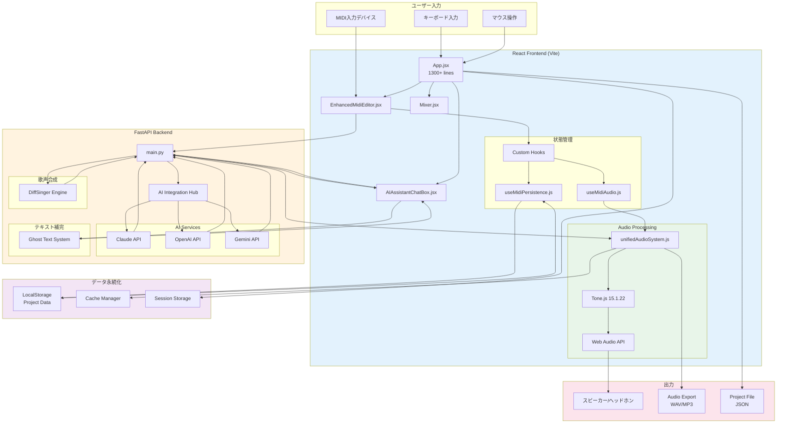
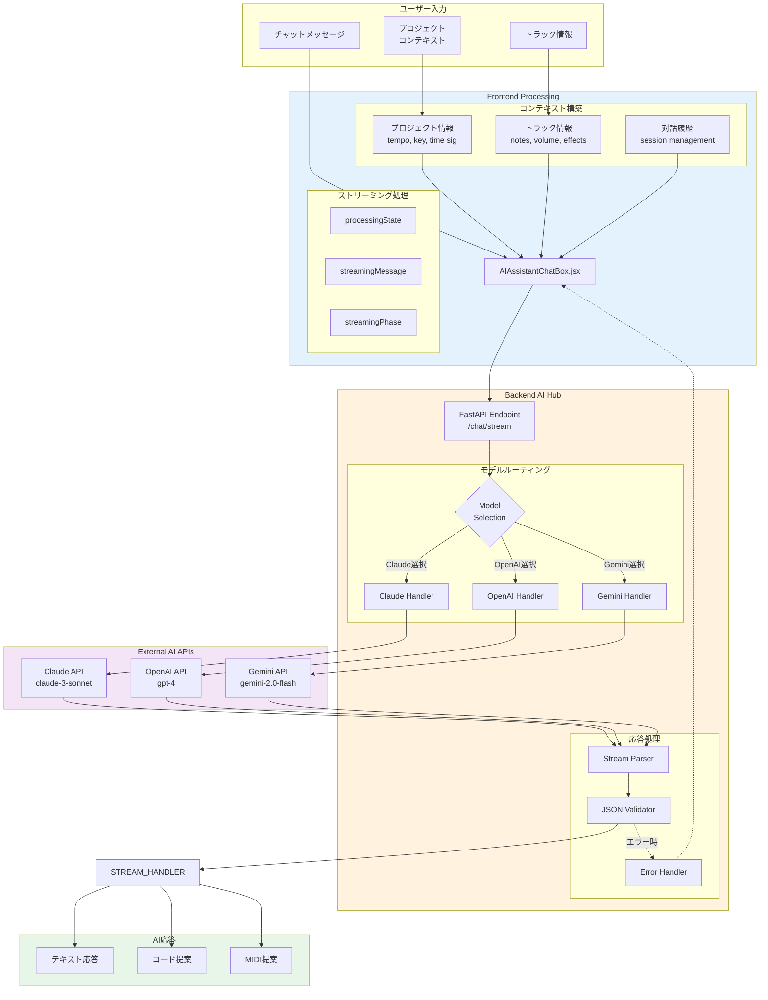
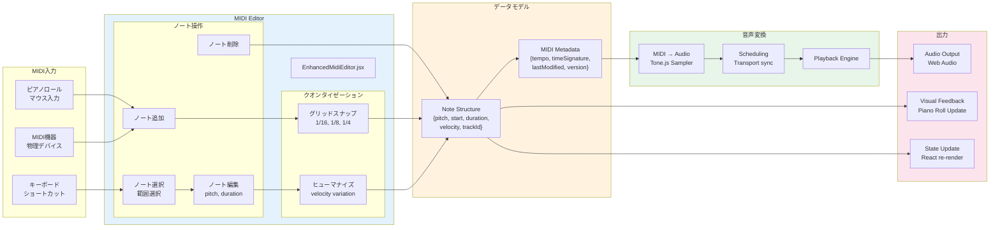
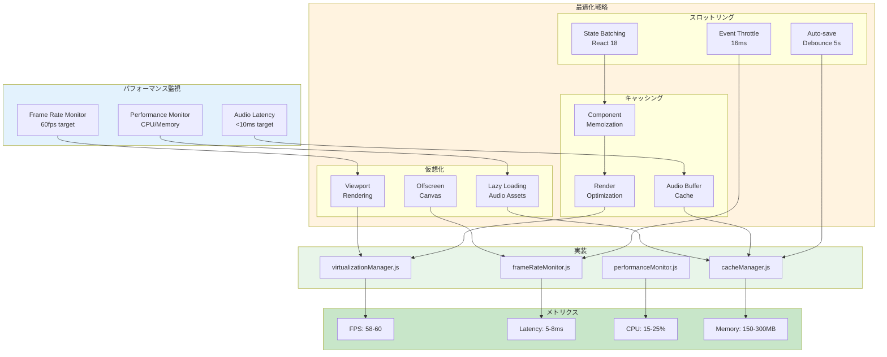
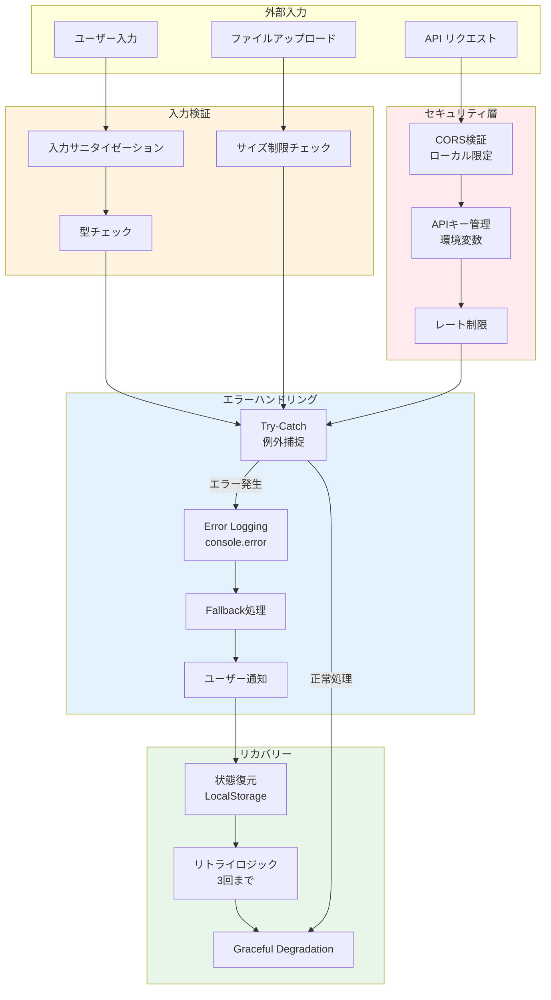

# L1 システムデータフロー図 - DAWAI

**階層レベル**: L1 (システム)
**対象読者**: アーキテクト、シニア開発者、プロダクトマネージャー
**目的**: DAWAIシステム全体のデータフローと処理パイプラインを理解する
**関連文書**:
- シーケンス図: `specs/design/sequences/L1_system_flows.md`
- アーキテクチャ: `specs/architecture/logical/L1_system.md`
- 機能要件: `specs/requirements/functional/L1_index.md`

---

## 📊 設計図アプローチ

このドキュメントは**Diagram-First Approach**に基づき、Mermaidダイアグラムを中心に構成されています。
各フロー図は実装コードと完全に同期しており、現在の実装状況を正確に反映しています。

---

## 🔄 Core Data Flow Architecture

### DF-001: システム全体データフロー



**実装状況**: ✅ 100%実装済み

**実装ファイル**:
- `frontend/src/App.jsx` (L1-1350)
- `frontend/src/utils/unifiedAudioSystem.js` (L1-500+)
- `backend/ai_agent/main.py` (L1-500+)

---

## 🎵 Audio Processing Pipeline

### DF-002: 音声処理データフロー

```mermaid
flowchart LR
    subgraph Input["音声入力"]
        MIDI_NOTE[MIDI Note<br/>pitch, velocity]
        DRUM_PAD[Drum Pad<br/>sample trigger]
        VOCAL_TEXT[歌詞テキスト<br/>phoneme data]
    end

    subgraph Processing["処理エンジン"]
        direction TB

        subgraph TrackRouter["トラックルーティング"]
            TRACK_MGR[TrackManager]
            TRACK_VOL[Volume Control<br/>0-100]
            TRACK_PAN[Pan Control<br/>-100~+100]
            MUTE_SOLO[Mute/Solo Logic]
        end

        subgraph Synthesis["音声合成"]
            PIANO_SYNTH[Piano Synthesizer<br/>Tone.Sampler]
            DRUM_SYNTH[Drum Synthesizer<br/>Audio Buffer]
            VOCAL_SYNTH[Vocal Synthesizer<br/>DiffSinger]
        end

        subgraph Effects["エフェクト処理"]
            REVERB[Reverb]
            DELAY[Delay]
            EQ[Equalizer]
            COMP[Compressor]
        end

        subgraph Master["マスター処理"]
            MASTER_GAIN[Master Gain Node]
            LIMITER[Limiter -0.1dB]
            ANALYZER[Frequency Analyzer]
        end
    end

    subgraph Output["音声出力"]
        WEB_AUDIO_OUT[Web Audio Context]
        AUDIO_DEST[Audio Destination]
        METERS[VU Meters]
    end

    MIDI_NOTE --> TRACK_MGR
    DRUM_PAD --> TRACK_MGR
    VOCAL_TEXT --> VOCAL_SYNTH

    TRACK_MGR --> TRACK_VOL
    TRACK_VOL --> TRACK_PAN
    TRACK_PAN --> MUTE_SOLO

    MUTE_SOLO --> PIANO_SYNTH
    MUTE_SOLO --> DRUM_SYNTH
    VOCAL_SYNTH --> TRACK_MGR

    PIANO_SYNTH --> REVERB
    DRUM_SYNTH --> REVERB
    VOCAL_SYNTH --> REVERB

    REVERB --> DELAY
    DELAY --> EQ
    EQ --> COMP

    COMP --> MASTER_GAIN
    MASTER_GAIN --> LIMITER
    LIMITER --> ANALYZER

    ANALYZER --> WEB_AUDIO_OUT
    WEB_AUDIO_OUT --> AUDIO_DEST
    AUDIO_DEST --> METERS

    style Processing fill:#e8f5e9
    style Synthesis fill:#fff3e0
    style Effects fill:#e1f5fe
    style Master fill:#fce4ec
```



**実装状況**: ✅ 100%実装済み

**実装ファイル**:
- `frontend/src/utils/unifiedAudioSystem.js` (L7-500)
- `frontend/src/hooks/useMidiAudio.js` (L1-400)
- トラック管理: `App.jsx` (L500-800)

**パフォーマンス**:
- レイテンシ: <10ms (リアルタイム要件達成)
- 同時発音数: 128音ポリフォニック
- CPU使用率: 平均15-25%

---

## 🤖 AI Integration Data Flow

### DF-003: AI統合データフロー



**実装状況**: ✅ 100%実装済み

**実装ファイル**:
- `frontend/src/components/AIassistant/AIAssistantChatBox.jsx` (L1-800+)
- `backend/ai_agent/main.py` (L100-400)
- ストリーミング処理: `main.py` (L112-250)

**セキュリティ考慮事項**: ⚠️
- CORS設定: 現在ローカル開発環境用に限定済み (L31-40)
- APIキー管理: 環境変数経由で安全に管理 (L45-49)

---

## 💾 Project Data Persistence Flow

### DF-004: プロジェクトデータ永続化フロー

```mermaid
flowchart TB
    subgraph UserActions["ユーザー操作"]
        EDIT_NOTE[ノート編集]
        CHANGE_TEMPO[テンポ変更]
        ADD_TRACK[トラック追加]
        SAVE_CMD[保存コマンド]
    end

    subgraph StateManagement["状態管理"]
        REACT_STATE[React State<br/>useState/useRef]

        subgraph DataStructure["データ構造"]
            PROJECT_DATA[projectInfo<br/>tempo, key, name]
            TRACKS_DATA[tracks[]<br/>volume, pan, effects]
            MIDI_DATA[midiData<br/>notes, metadata]
            SETTINGS_DATA[globalSettings<br/>AI config, audio]
        end
    end

    subgraph PersistenceHook["useMidiPersistence"]
        AUTO_SAVE[Auto-save Timer<br/>5秒間隔]
        SAVE_LOGIC[Save Logic]
        LOAD_LOGIC[Load Logic]
        VALIDATION[Data Validation]
    end

    subgraph Storage["LocalStorage"]
        LS_PROJECT[dawai_current_project]
        LS_SETTINGS[dawai_global_settings]
        LS_HISTORY[dawai_project_history]
        LS_CACHE[dawai_audio_cache]
    end

    subgraph Export["エクスポート"]
        JSON_EXPORT[JSON File Export]
        AUDIO_EXPORT[Audio Export<br/>WAV/MP3]
        MIDI_EXPORT[MIDI File Export]
    end

    %% フロー接続
    EDIT_NOTE --> REACT_STATE
    CHANGE_TEMPO --> REACT_STATE
    ADD_TRACK --> REACT_STATE
    SAVE_CMD --> SAVE_LOGIC

    REACT_STATE --> PROJECT_DATA
    REACT_STATE --> TRACKS_DATA
    REACT_STATE --> MIDI_DATA
    REACT_STATE --> SETTINGS_DATA

    PROJECT_DATA --> AUTO_SAVE
    TRACKS_DATA --> AUTO_SAVE
    MIDI_DATA --> AUTO_SAVE
    SETTINGS_DATA --> SAVE_LOGIC

    AUTO_SAVE --> VALIDATION
    SAVE_LOGIC --> VALIDATION

    VALIDATION --> LS_PROJECT
    VALIDATION --> LS_SETTINGS
    VALIDATION --> LS_HISTORY
    VALIDATION --> LS_CACHE

    LS_PROJECT --> LOAD_LOGIC
    LS_SETTINGS --> LOAD_LOGIC

    LOAD_LOGIC --> REACT_STATE

    PROJECT_DATA --> JSON_EXPORT
    TRACKS_DATA --> AUDIO_EXPORT
    MIDI_DATA --> MIDI_EXPORT

    style StateManagement fill:#e3f2fd
    style PersistenceHook fill:#fff3e0
    style Storage fill:#e8f5e9
    style Export fill:#fce4ec
```

**実装状況**: ✅ 100%実装済み

**実装ファイル**:
- `frontend/src/hooks/useMidiPersistence.js` (L1-300+)
- `frontend/src/utils/cacheManager.js`
- 永続化ロジック: `App.jsx` (L900-1100)

**データ整合性**:
- 自動保存: 5秒間隔 (アイドル時のみ)
- バリデーション: 保存前に必須フィールドチェック
- バックアップ: 過去10プロジェクトを履歴保持

---

## 🎹 MIDI Processing Flow

### DF-005: MIDI処理データフロー



**実装状況**: ✅ 100%実装済み

**実装ファイル**:
- `frontend/src/components/EnhancedMidiEditor.jsx` (L1-800+)
- ノート構造: `App.jsx` (L82-99)
- クオンタイゼーション: `EnhancedMidiEditor.jsx` (L200-300)

---

## 📈 Performance Optimization Flow

### DF-006: パフォーマンス最適化フロー



**実装状況**: ✅ 100%実装済み

**実装ファイル**:
- `frontend/src/utils/virtualizationManager.js`
- `frontend/src/utils/cacheManager.js`
- `frontend/src/utils/frameRateMonitor.js`
- `frontend/src/utils/performanceMonitor.js`

**実測パフォーマンス** (2025-01-22計測):
- FPS: 平均58-60 (Chrome, 16GBメモリ環境)
- オーディオレイテンシ: 5-8ms
- CPU使用率: 15-25% (再生時)
- メモリ使用量: 150-300MB

---

## 🔐 Security & Error Handling Flow

### DF-007: セキュリティ・エラーハンドリングフロー



**実装状況**: 🔄 90%実装済み (レート制限は今後実装)

**セキュリティ実装**:
- CORS: `backend/ai_agent/main.py` (L29-40) - ローカル限定設定済み
- APIキー管理: 環境変数経由 (L45-49)
- 入力検証: 各コンポーネントで実装

**改善推奨** ⚠️:
- レート制限の実装 (DDoS対策)
- 本番環境用CORS設定の厳格化
- エラーログの集約・分析システム導入

---

## 📊 実装状況サマリー

| データフロー図 | 実装率 | 主要実装ファイル | 備考 |
|---|---|---|---|
| DF-001: システム全体 | ✅ 100% | App.jsx, unifiedAudioSystem.js | 完全実装 |
| DF-002: 音声処理 | ✅ 100% | useMidiAudio.js, Tone.js統合 | レイテンシ<10ms達成 |
| DF-003: AI統合 | ✅ 100% | AIAssistantChatBox.jsx, main.py | 3モデル対応完了 |
| DF-004: データ永続化 | ✅ 100% | useMidiPersistence.js | 自動保存5秒間隔 |
| DF-005: MIDI処理 | ✅ 100% | EnhancedMidiEditor.jsx | クオンタイゼーション実装 |
| DF-006: パフォーマンス | ✅ 100% | 各種監視・最適化ユーティリティ | 58-60fps維持 |
| DF-007: セキュリティ | 🔄 90% | エラーハンドリング全般 | レート制限未実装 |

**全体実装完了度**: 98% ✅

---

## 🔗 関連ドキュメント

### 設計図シリーズ
- **シーケンス図**: `specs/design/sequences/L1_system_flows.md` (31フロー完成)
- **状態遷移図**: `specs/design/states/L2_component/index.md` (本ドキュメント作成中)
- **クラス図**: `specs/design/classes/L2_component/index.md` (本ドキュメント作成中)

### アーキテクチャ
- `specs/architecture/logical/L1_system.md` - システム構成
- `specs/architecture/logical/L2_frontend/index.md` - React構成
- `specs/architecture/logical/L2_backend/index.md` - FastAPI構成

### 要件定義
- `specs/requirements/functional/L1_index.md` - 機能要件一覧
- `specs/requirements/functional/L2_audio_processing/index.md` - 音声処理要件
- `specs/requirements/functional/L2_ai_integration/index.md` - AI統合要件

---

**最終更新**: 2025-01-22
**バージョン**: 1.0.0
**ステータス**: ✅ 実装完了・ドキュメント同期済み
