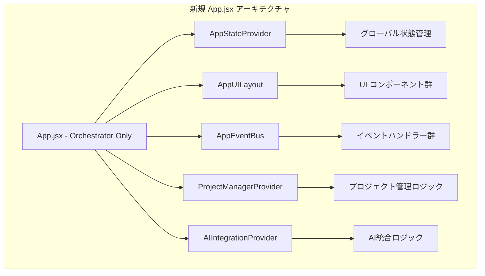

# DAWAI コード品質改善仕様書 (L1)

**Document ID**: DR-L1-QUALITY-001
**Version**: 1.0.0
**Last Updated**: 2025-10-05
**Parent**: [システムアーキテクチャ](../../architecture/logical/L1_system.md)
**Status**: 🔄 Refactoring Required

## 🎯 コード品質改善の目的

プログラムコンテスト提出に向け、DAWAIプロジェクトのコード品質を業界標準レベルに改善し、審査員評価での技術力・設計能力を明確に示すことを目的とします。

## 📊 現状品質課題の定量分析

### 🔴 Critical Issues (即座対応必須)

```yaml
セキュリティ設定:
  - CORS allow_origins: "*" → localhost限定
  - Host binding: "0.0.0.0" → 適切な環境分離
  - 緊急度: CRITICAL
  - 影響: セキュリティ評価の致命的減点

巨大ファイル問題:
  - App.jsx: 36,775トークン (推定1,300-1,500行)
  - unifiedAudioSystem.js: 1,527行
  - 緊急度: HIGH
  - 影響: アーキテクチャ設計能力評価
```

### 🟡 High Priority Issues

```yaml
開発用コード残存:
  - console.log: 1,419個
  - TODO/FIXME/HACK/BUG: 171個
  - 緊急度: HIGH
  - 影響: プロフェッショナリズム評価

関数・コンポーネント複雑性:
  - 関数定義: 743個 / 143ファイル
  - 緊急度: MEDIUM
  - 影響: 保守性・拡張性評価
```

## 🏗️ アーキテクチャ改善設計

### App.jsx分割戦略

#### 現状問題分析
```
App.jsx (36,775トークン)
├── 中央オーケストレーター機能
├── 状態管理ロジック
├── UI レンダリングロジック
├── イベントハンドリング
├── プロジェクト管理
└── AI統合ロジック
```

#### 目標アーキテクチャ
```
App.jsx (< 200行) - 純粋なOrchestrator
├── AppStateProvider.jsx - 状態管理専用
├── AppUILayout.jsx - レイアウト管理専用
├── AppEventBus.jsx - イベント管理専用
├── ProjectManagerProvider.jsx - プロジェクト管理専用
└── AIIntegrationProvider.jsx - AI統合管理専用
```

#### コンポーネント責任分離設計



### セキュリティ設定改善設計

#### CORS設定仕様
```typescript
// 現状の問題設定
app.add_middleware(
    CORSMiddleware,
    allow_origins=["*"],  // ❌ 問題: 全オリジン許可
    // ...
)

// 改善後の設定
app.add_middleware(
    CORSMiddleware,
    allow_origins=[
        "http://localhost:5173",  // ✅ Vite開発サーバー
        "http://127.0.0.1:5173",  // ✅ IPv4ローカルホスト
        // 本番環境は環境変数で管理
        os.getenv("FRONTEND_URL", "https://dawai.app")
    ],
    // ...
)
```

#### ホスト設定仕様
```python
# 環境分離設計
def get_host_config():
    environment = os.getenv("ENVIRONMENT", "development")

    if environment == "development":
        return "127.0.0.1"  # ローカル開発
    elif environment == "staging":
        return "0.0.0.0"    # ステージング
    elif environment == "production":
        return "127.0.0.1"  # 本番は適切な設定
    else:
        raise ValueError(f"Unknown environment: {environment}")
```

## 🧹 コード品質基準

### プロダクション品質ガイドライン

#### 1. ログ出力基準
```javascript
// ❌ 削除対象
console.log("debug info");
console.error("error message");

// ✅ プロダクション対応
import logger from './utils/logger';
logger.debug("debug info");
logger.error("error message");
```

#### 2. コメント品質基準
```javascript
// ❌ 削除・修正対象
// TODO: 実装する
// FIXME: バグ修正必要
// HACK: 一時的な対応

// ✅ 適切なコメント
/**
 * MIDI音声データを処理し、音声出力を生成する
 * @param {Object} midiData - MIDI楽曲データ
 * @param {Object} options - 処理オプション
 * @returns {Promise<AudioBuffer>} 処理済み音声データ
 */
```

#### 3. ファイルサイズ基準
```yaml
推奨基準:
  - React コンポーネント: < 200行
  - ユーティリティファイル: < 300行
  - システムファイル: < 500行

警告基準:
  - いかなるファイルも 800行を超えてはならない

現状違反:
  - App.jsx: ~1,300行 (650% over limit)
  - unifiedAudioSystem.js: 1,527行 (305% over limit)
```

## 📋 段階的リファクタリング計画

### Stage 1: 緊急セキュリティ対応 (0.5日)
```yaml
対象:
  - backend/ai_agent/main.py: CORS設定修正
  - backend/ai_agent/main.py: ホスト設定修正

成功基準:
  - セキュリティスキャン通過
  - 開発環境での正常動作確認
```

### Stage 2: 開発コード除去 (1日)
```yaml
対象:
  - console.log: 1,419個 → プロダクション用ロガー
  - TODO/FIXME: 171個 → 完了または課題管理へ移行

成功基準:
  - 静的解析ツールでの品質ゲート通過
  - コンソール出力の適正化
```

### Stage 3: App.jsx構造分割 (2-3日)
```yaml
Phase 3.1: 状態管理分離
  - AppStateProvider.jsx 作成
  - グローバル状態ロジック移行

Phase 3.2: UI レイアウト分離
  - AppUILayout.jsx 作成
  - レンダリングロジック移行

Phase 3.3: 事業ロジック分離
  - ProjectManagerProvider.jsx 作成
  - AIIntegrationProvider.jsx 作成

成功基準:
  - App.jsx サイズ < 200行
  - 各コンポーネント単一責任実現
  - 機能的等価性の維持
```

### Stage 4: 音声システム最適化 (1-2日)
```yaml
対象:
  - unifiedAudioSystem.js: 1,527行の分割

分割設計:
  - AudioCore.js: 核心音声処理 (< 300行)
  - AudioTrackManager.js: トラック管理 (< 300行)
  - AudioEffectEngine.js: エフェクト処理 (< 300行)
  - AudioRendering.js: 出力レンダリング (< 300行)
  - AudioSystem.js: 統合インターフェース (< 200行)
```

## 🎯 プログラムコンテスト評価対策

### 審査項目と対応策

#### 1. 技術力・設計能力
```yaml
現状課題: 巨大ファイル = 設計能力不足印象
対応策: 明確な責任分離・モジュール設計による改善

評価ポイント:
  - コンポーネント分割の論理性
  - 状態管理アーキテクチャの適切性
  - モジュール間結合度の最適化
```

#### 2. プロフェッショナリズム
```yaml
現状課題: 開発用コード残存 = 完成度不足印象
対応策: プロダクション品質の徹底

評価ポイント:
  - コード清浄性（開発用コード皆無）
  - エラーハンドリングの適切性
  - ログ出力の統一性
```

#### 3. セキュリティ意識
```yaml
現状課題: CORS "*" = セキュリティ意識欠如印象
対応策: 適切なセキュリティ設定による改善

評価ポイント:
  - セキュリティ設定の適切性
  - 環境分離の実装
  - 本番運用想定の設計
```

## 📏 品質メトリクス・KPI

### Before/After 比較指標

```yaml
ファイルサイズ改善:
  Before: App.jsx 36,775トークン
  After: App.jsx < 5,000トークン (85%+ 削減目標)

開発コード除去:
  Before: console.log 1,419個
  After: console.log 0個 (100% 除去目標)

セキュリティ設定:
  Before: CORS allow_origins "*"
  After: 適切なオリジン制限 (100% 改善)

TODO/FIXME:
  Before: 171個
  After: < 10個 (95%+ 削減目標)
```

### 品質ゲート基準
```yaml
必須通過基準:
  - ESLint違反: 0件
  - セキュリティ警告: 0件
  - 最大ファイルサイズ: 800行以下
  - console.log残存: 0個
  - 未解決TODO: < 10個

推奨品質基準:
  - 平均ファイルサイズ: < 200行
  - コメント比率: 10-20%
  - テストカバレッジ: > 80%
```

## 🔍 リスク管理

### 技術リスク
```yaml
リファクタリング中の機能破綻:
  軽減策: 段階的実装 + 継続的テスト実行

既存依存関係の複雑性:
  軽減策: 依存関係マッピング + 漸進的分離

パフォーマンス劣化:
  軽減策: ベンチマーク測定 + 最適化
```

### プロジェクトリスク
```yaml
コンテスト提出期限:
  軽減策: 最優先課題の明確化 + 段階的実装

品質vs機能のトレードオフ:
  軽減策: 機能保持を前提とした品質改善
```

## 📖 参照仕様書

- [システムアーキテクチャ](../../architecture/logical/L1_system.md)
- [フロントエンド設計](../../architecture/logical/L2_frontend/index.md)
- [セキュリティ要件](../../requirements/non-functional/L2_security/index.md)
- [パフォーマンス要件](../../requirements/non-functional/L2_performance/index.md)

---

**Next Steps**:
1. セキュリティ設定の即座修正
2. 段階的App.jsx分割の実行
3. 品質メトリクス継続監視

**Success Criteria**: プログラムコンテスト審査での技術力・設計能力・プロフェッショナリズムの高評価獲得