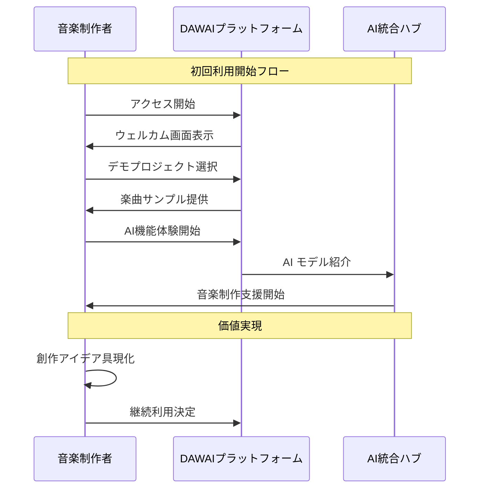
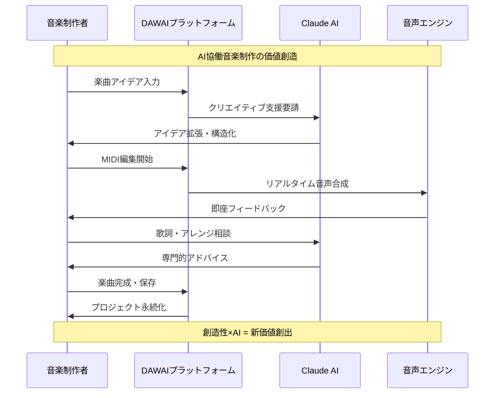
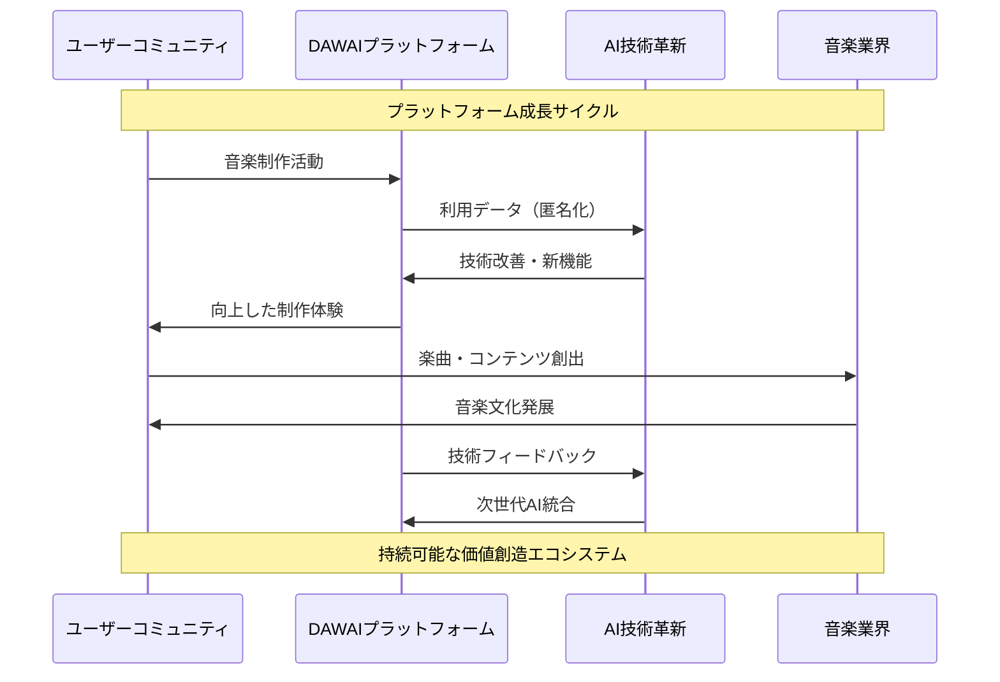
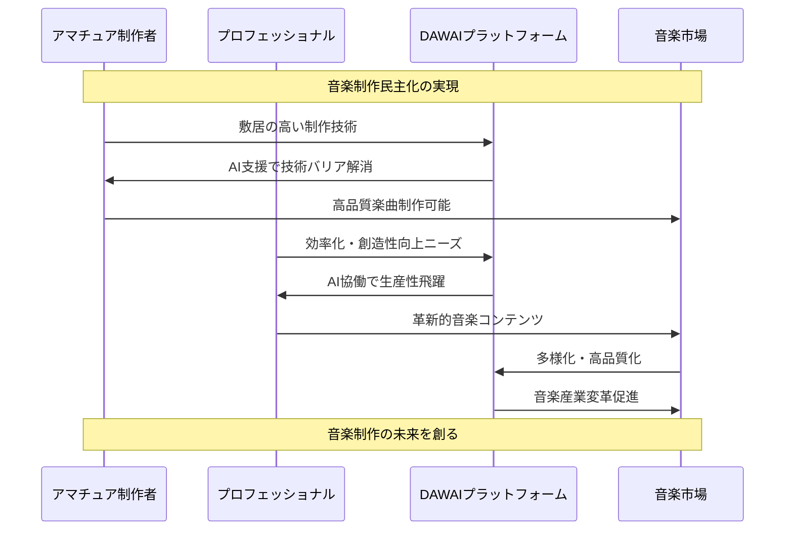
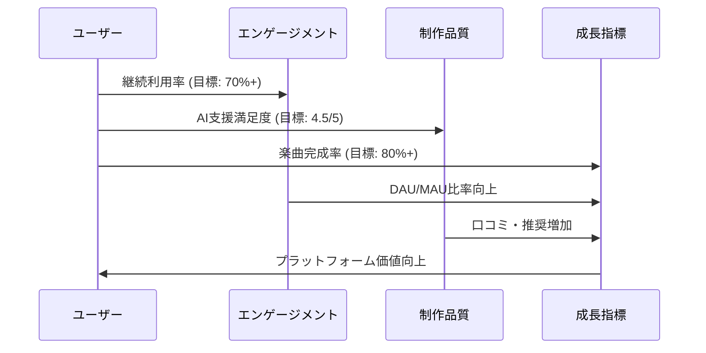

# L0 ビジネスフローシーケンス - DAWAI

**階層レベル**: L0 (ビジネス・概要)
**対象読者**: エグゼクティブ、プロダクトマネージャー、ビジネスステークホルダー
**目的**: DAWAIプラットフォームの主要ビジネスフローを理解する
**関連文書**: `specs/overview/index.md`, `specs/overview/business_context.md`

## 🎯 ビジネスフロー概要

DAWAIは音楽制作者とAI技術を結びつけ、創造性とテクノロジーが融合した新しい音楽制作体験を提供します。

### 主要ステークホルダー
- **音楽制作者**: メインユーザー（アマチュア〜プロフェッショナル）
- **AI プロバイダー**: Claude, OpenAI, Google Gemini
- **プラットフォーム**: DAWAIシステム本体

## 📊 Core Business Sequences

### BF-001: 音楽制作者オンボーディングフロー

### BF-002: AI支援音楽制作フロー

### BF-003: プラットフォーム価値循環フロー

## 🚀 ビジネス価値提案フロー

### BF-004: 市場インパクト創出フロー

## 📈 ビジネス成果指標

### 主要KPIフロー

## 🎵 音楽制作革新のビジョン

DAWAIは以下のビジネス価値を実現します：

### 価値提案
1. **アクセシビリティ**: 技術バリアの解消
2. **クリエイティビティ**: AI協働による創造性拡張
3. **エフィシエンシー**: 制作プロセスの効率化
4. **イノベーション**: 音楽制作手法の革新

### 市場インパクト
- 音楽制作人口の拡大 (Amateur → Semi-Pro 移行)
- 制作品質の底上げ (AI支援による技術補完)
- 新しい音楽ジャンル・手法の創出
- 音楽産業のデジタル変革加速

---

**次のレベル**: システムレベルのフローは `specs/design/sequences/L1_system_flows.md` を参照してください。

**関連文書**:
- `specs/overview/index.md` - システム全体概要
- `specs/overview/business_context.md` - ビジネス詳細分析
- `specs/requirements/functional/L1_index.md` - 機能要件一覧