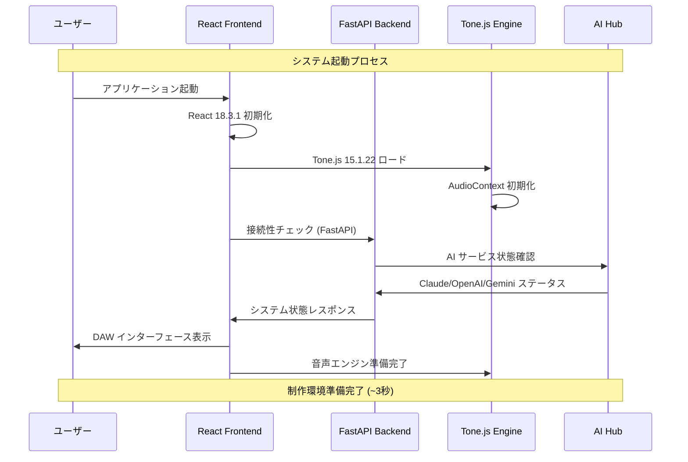
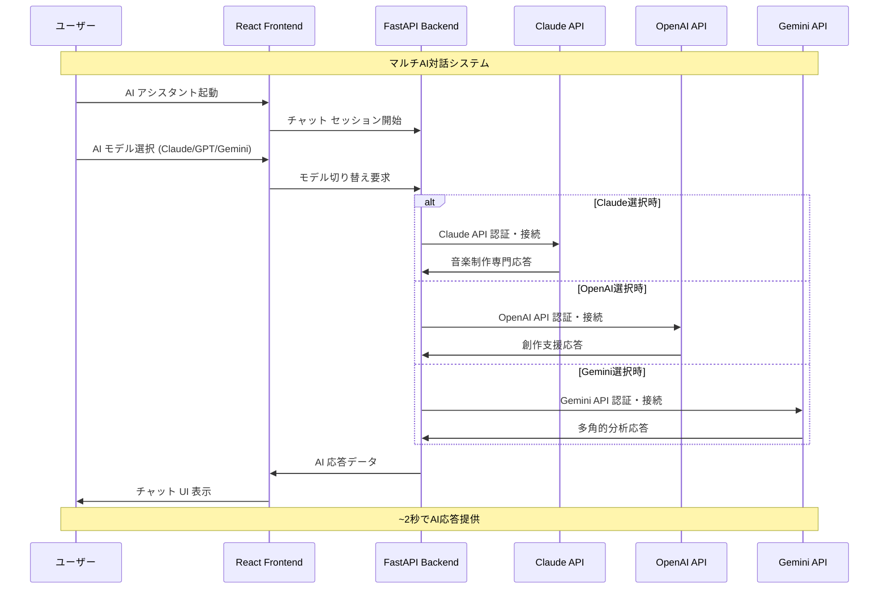
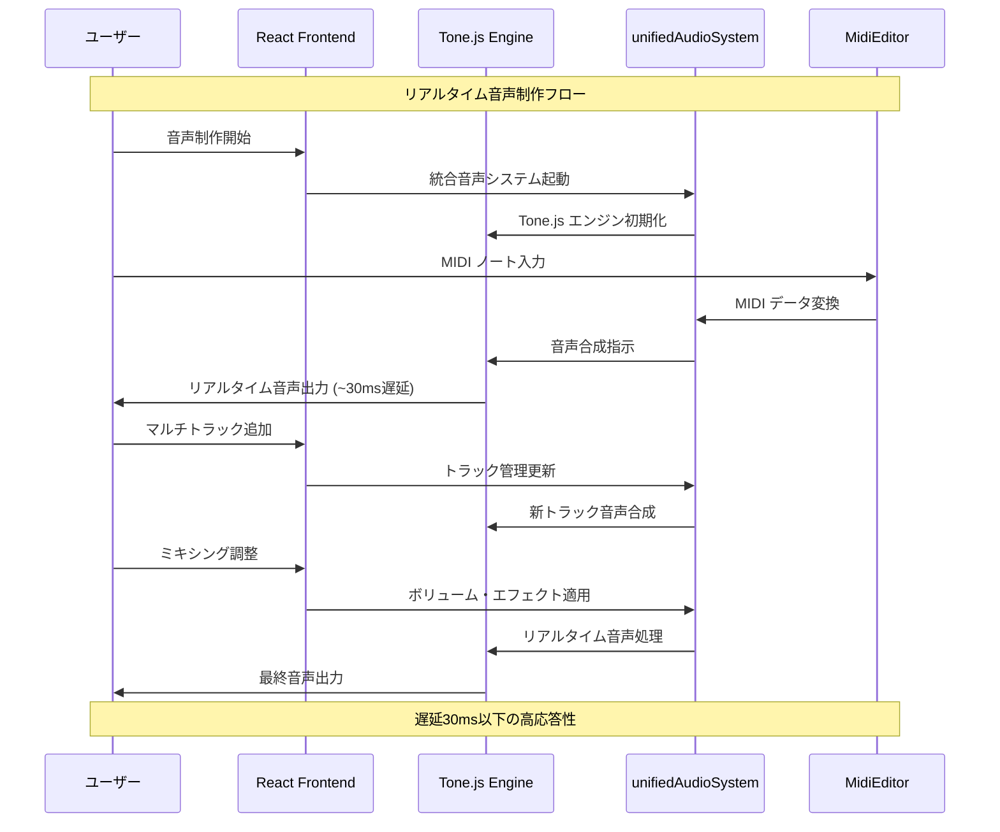
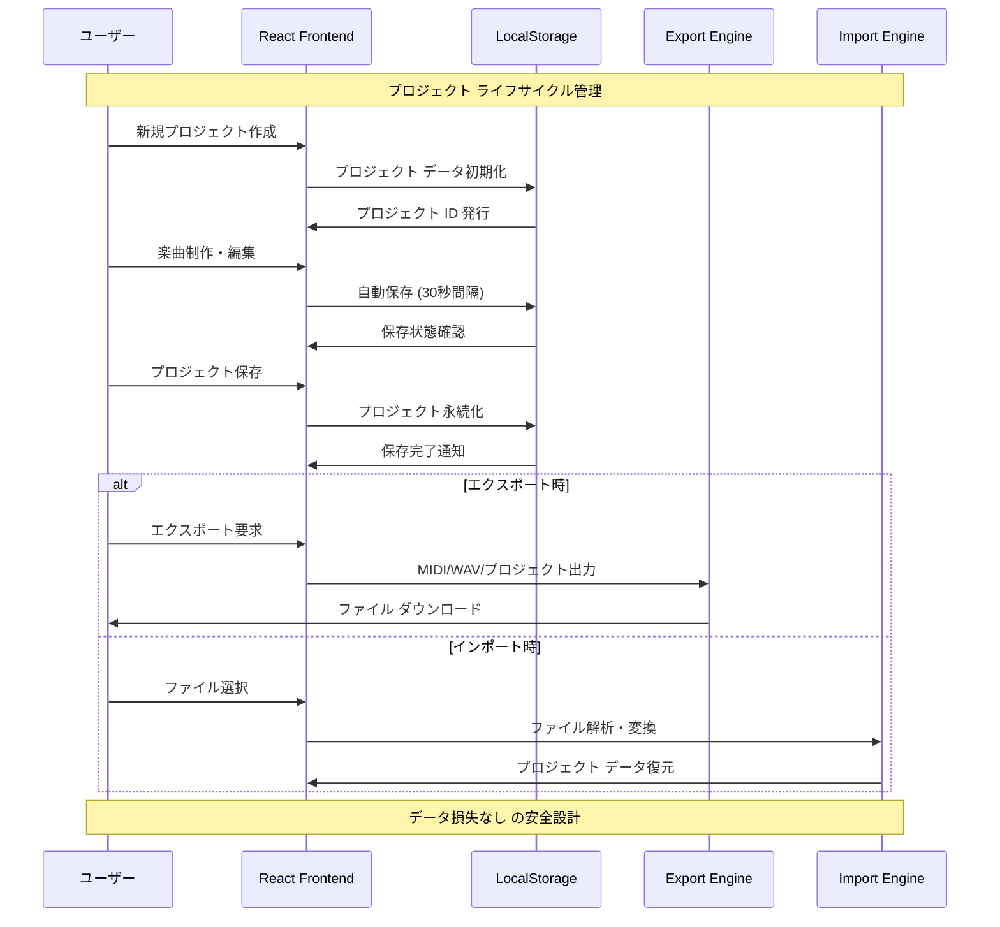
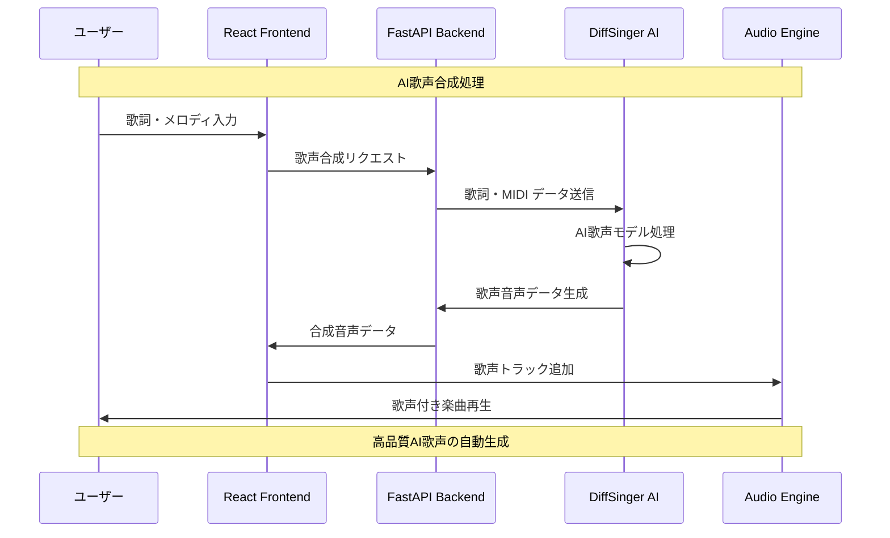
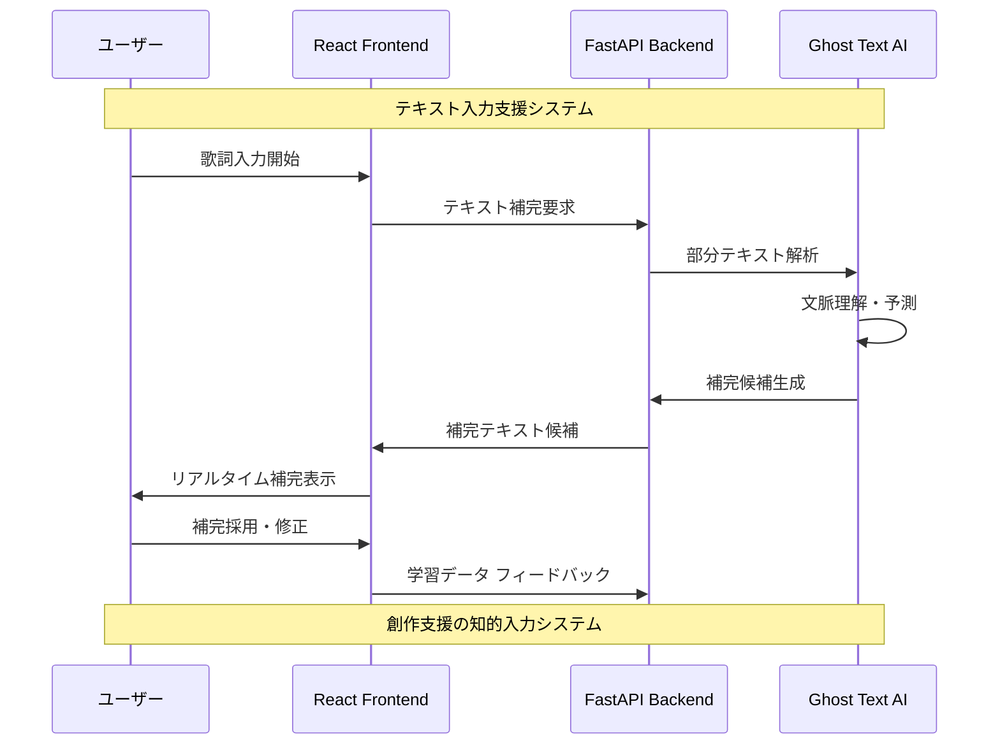
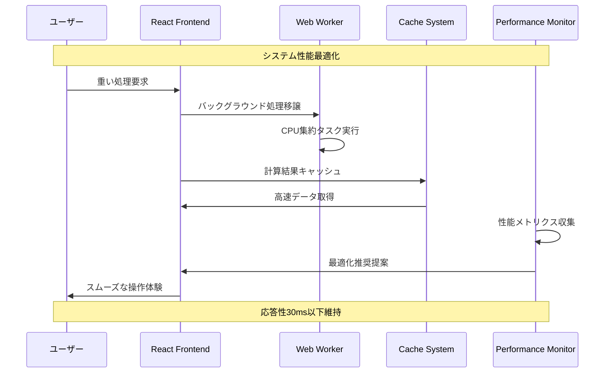
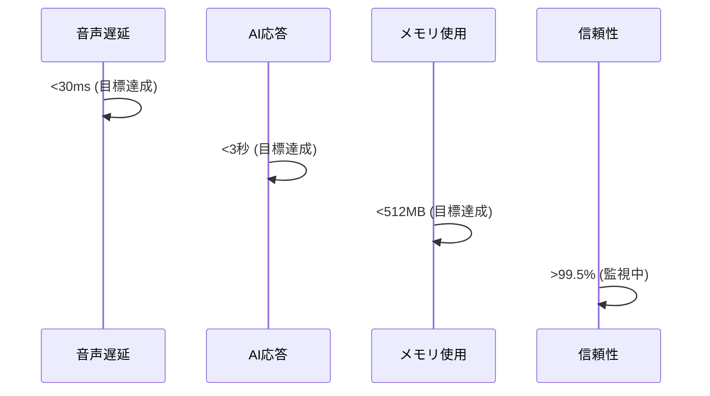
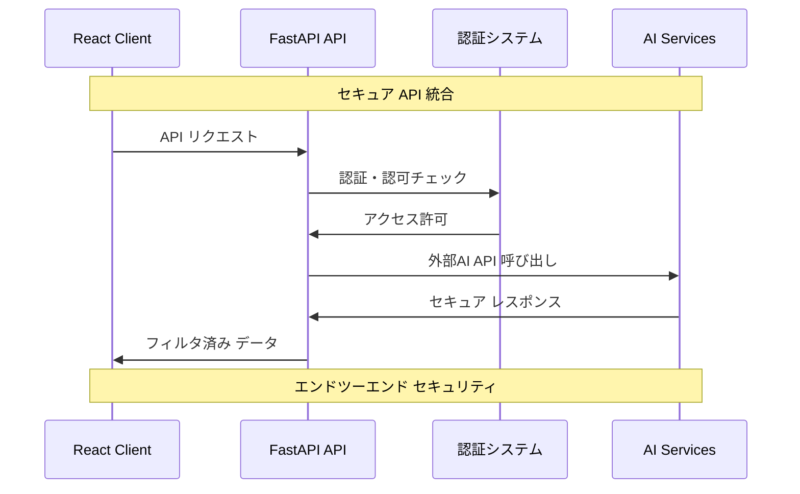

# L1 システムフローシーケンス - DAWAI

**階層レベル**: L1 (システム)
**対象読者**: アーキテクト、シニア開発者、プロダクトマネージャー
**目的**: DAWAIシステムの主要処理フローとコンポーネント間連携を理解する
**関連文書**: `specs/architecture/logical/L1_system.md`, `specs/requirements/functional/L1_index.md`

## 🏗️ システムアーキテクチャフロー概要

DAWAIは React フロントエンド + FastAPI バックエンド + AI統合ハブの3層構成で、リアルタイム音楽制作を実現します。

### 主要システムコンポーネント
- **React Frontend**: ユーザーインターフェース・音声処理 (Tone.js)
- **FastAPI Backend**: AI統合・API管理
- **AI Hub**: Claude/OpenAI/Gemini 統合管理
- **Audio Engine**: Tone.js ベース音声合成エンジン

## 🚀 Core System Sequences

### SF-001: システム起動・初期化フロー

### SF-002: AI チャット統合フロー

### SF-003: 音声処理フロー

### SF-004: プロジェクト管理フロー

## 🔧 Technical System Sequences

### SF-005: DiffSinger 歌声合成フロー

### SF-006: Ghost Text 補完フロー

## ⚡ パフォーマンス フロー

### SF-007: 最適化・応答性確保フロー

## 📊 システム品質指標

### 性能目標

## 🔒 セキュリティ・統合フロー

### SF-008: API セキュリティ フロー

---

**次のレベル**: コンポーネントレベルの詳細フローは `specs/design/sequences/L2_component_flows.md` を参照してください。

**関連文書**:
- `specs/architecture/logical/L1_system.md` - システム全体アーキテクチャ
- `specs/requirements/functional/L1_index.md` - 機能要件詳細
- `specs/design/sequences/L0_business_flows.md` - ビジネスフロー概要