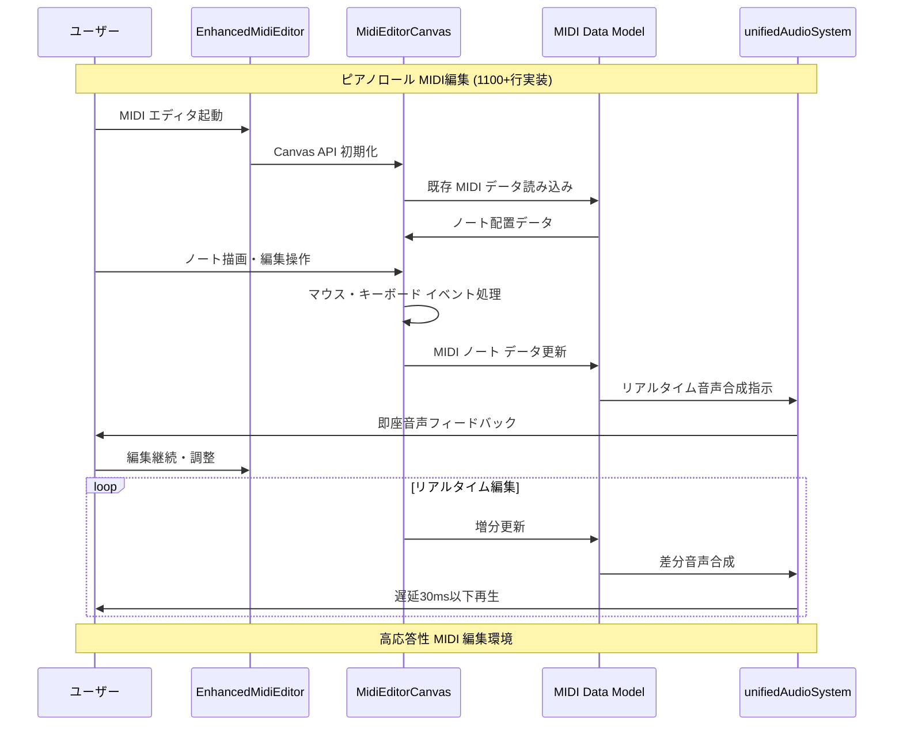
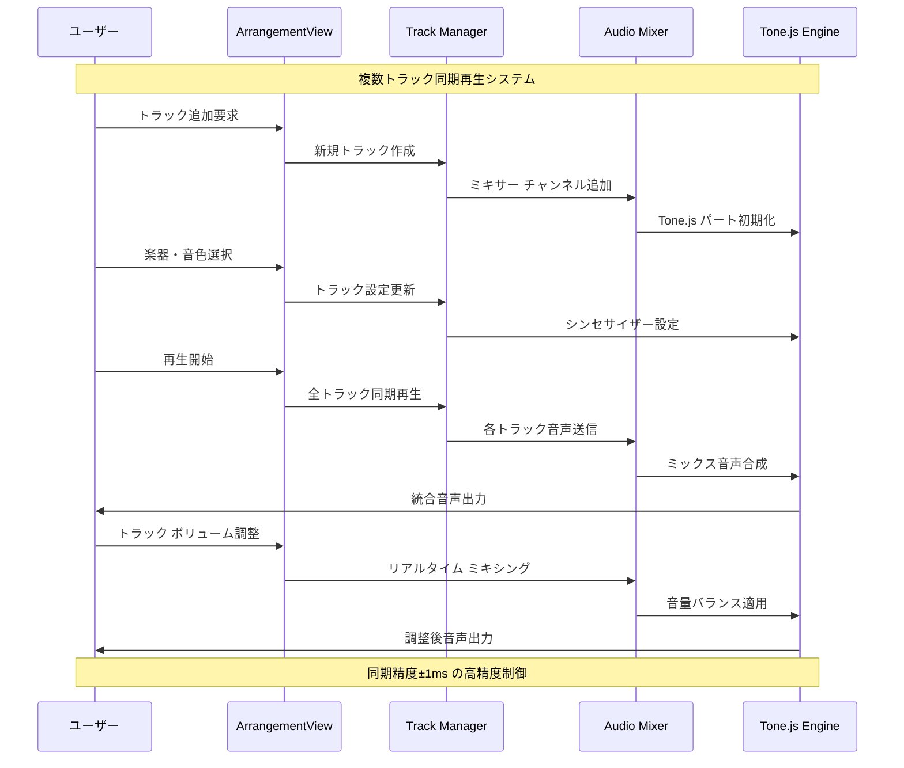
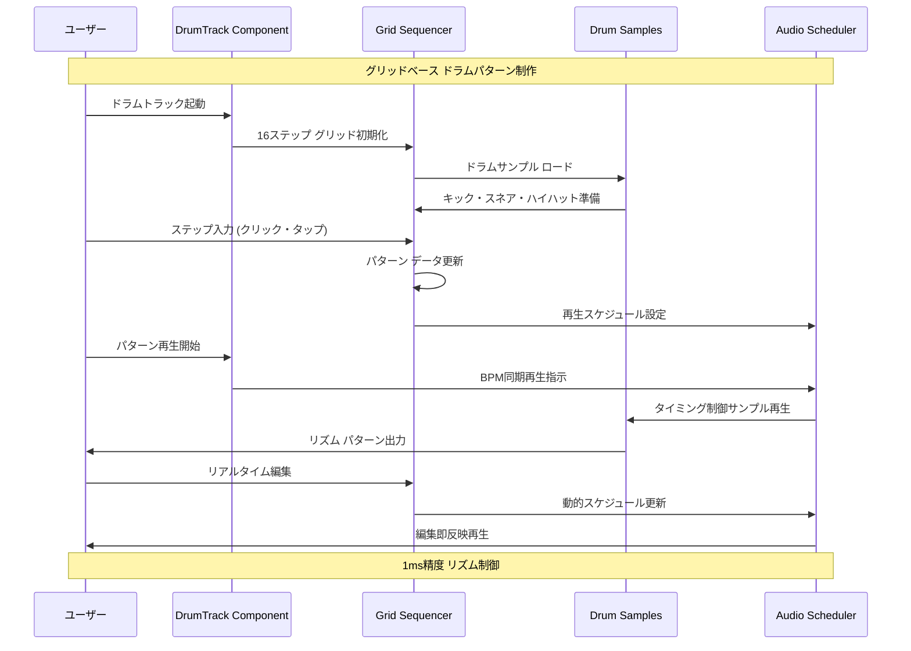
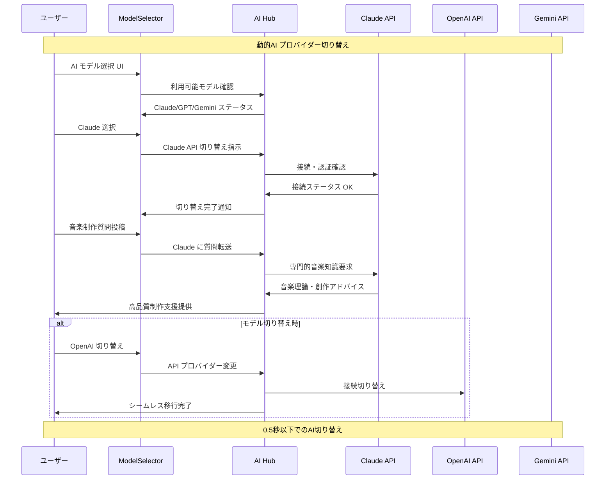
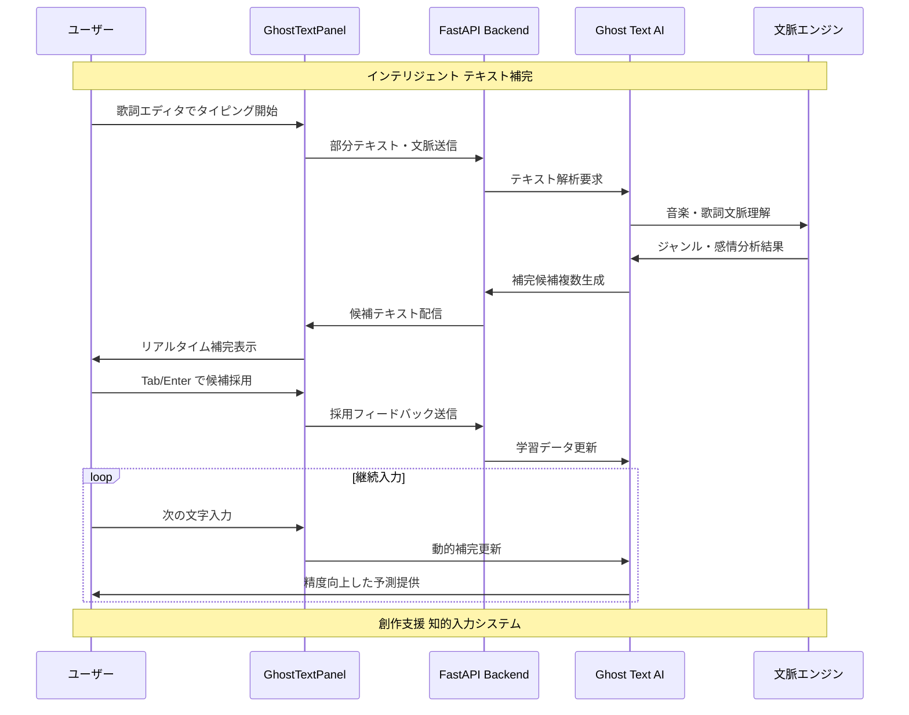
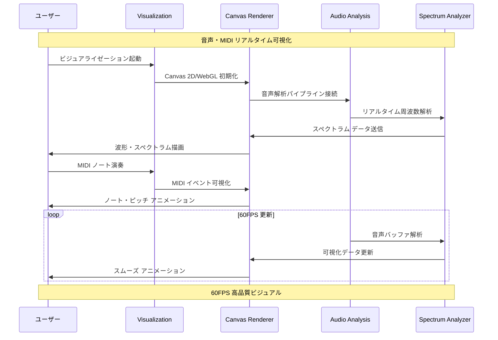
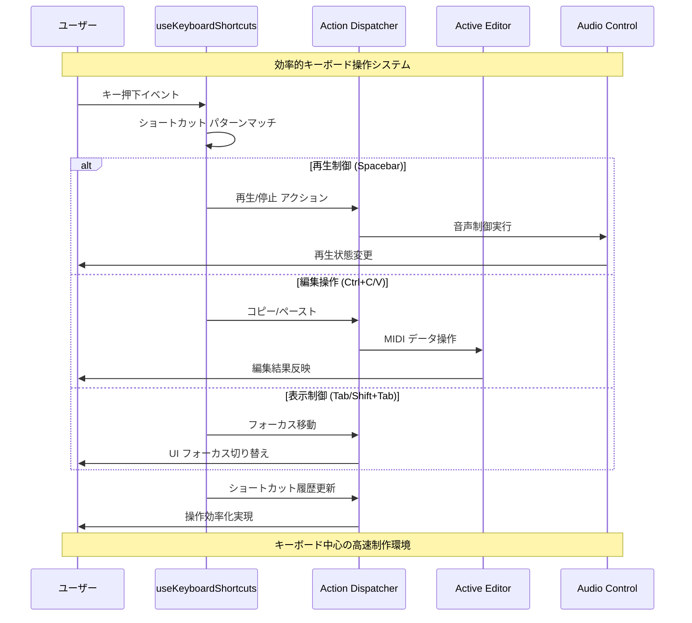

# L2 コンポーネントフローシーケンス - DAWAI

**階層レベル**: L2 (コンポーネント)
**対象読者**: 開発者、専門領域担当者
**目的**: DAWAI主要コンポーネントの詳細処理フローと内部連携を理解する
**関連文書**: `specs/requirements/functional/L2_audio_processing/`, `specs/requirements/functional/L2_ai_integration/`

## 🎵 Audio Processing Component Flows

### CF-001: MIDI編集コンポーネントフロー



### CF-002: マルチトラック管理フロー



### CF-003: ドラムシーケンサーフロー



## 🤖 AI Integration Component Flows

### CF-004: マルチAI切り替えフロー



### CF-005: DiffSinger歌声合成フロー

```mermaid
sequenceDiagram
    participant User as ユーザー
    participant Singer as DiffSingerTrack
    parameter Lyrics as 歌詞エディタ
    participant API as FastAPI Backend
    participant DiffSinger as DiffSinger AI
    participant Audio as Audio Pipeline

    Note over User, Audio: AI歌声合成パイプライン

    User->>Singer: DiffSinger トラック作成
    Singer->>Lyrics: 歌詞入力 UI 表示
    User->>Lyrics: 歌詞・発音記号入力

    User->>Singer: メロディ MIDI 指定
    Singer->>API: 歌詞・MIDI データ送信
    API->>DiffSinger: 歌声合成要求

    DiffSinger->>DiffSinger: ニューラル歌声モデル処理
    DiffSinger->>API: 高品質歌声 WAV 生成
    API->>Singer: 合成音声データ受信

    Singer->>Audio: 歌声トラック統合
    Audio->>User: 楽曲＋歌声 統合再生

    User->>Singer: 歌声調整 (ピッチ・タイミング)
    Singer->>API: パラメータ調整要求
    API->>DiffSinger: 再合成実行
    DiffSinger->>User: 調整後歌声提供

    Note over User, Audio: 人間レベル歌声品質実現
```

### CF-006: Ghost Text補完フロー



## 🎛️ UI Component Flows

### CF-007: リアルタイムビジュアライゼーション



### CF-008: キーボードショートカットフロー



## 📊 Data Flow & State Management

### CF-009: プロジェクト永続化フロー

```mermaid
sequenceDiagram
    participant User as ユーザー
    participant Persistence as useMidiPersistence
    participant LocalStorage as LocalStorage
    parameter Sync as Auto Sync
    participant Export as Export Engine

    Note over User, Export: プロジェクト データ永続化システム

    User->>Persistence: プロジェクト作業開始
    Persistence->>LocalStorage: 既存データ復元
    LocalStorage->>User: 前回セッション復元

    User->>Persistence: MIDI・設定変更
    Persistence->>Sync: 変更検知・自動保存開始
    Sync->>LocalStorage: 30秒間隔データ保存
    LocalStorage->>Persistence: 保存完了確認

    User->>Persistence: 手動保存実行
    Persistence->>LocalStorage: 即座完全保存
    LocalStorage->>User: 保存ステータス表示

    User->>Export: プロジェクト エクスポート
    Export->>LocalStorage: 全データ取得
    LocalStorage->>Export: プロジェクトJSON生成
    Export->>User: ファイル ダウンロード提供

    Note over User, Export: データ損失ゼロの安全設計
```

---

**次のレベル**: 実装詳細レベルのフローは `specs/design/sequences/L3_implementation_flows.md` を参照してください。

**関連文書**:
- `specs/requirements/functional/L2_audio_processing/index.md` - 音声処理詳細要件
- `specs/requirements/functional/L2_ai_integration/index.md` - AI統合詳細要件
- `specs/design/sequences/L1_system_flows.md` - システムレベルフロー