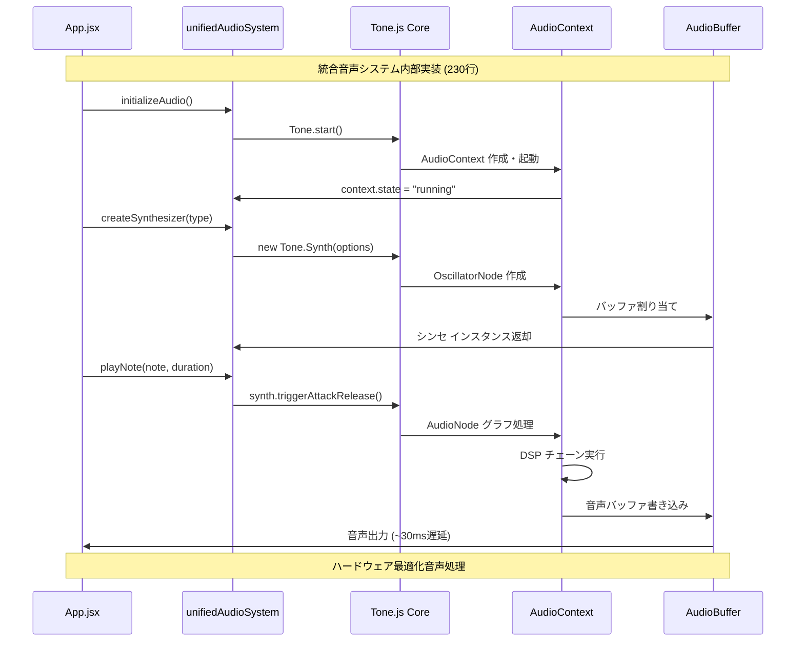
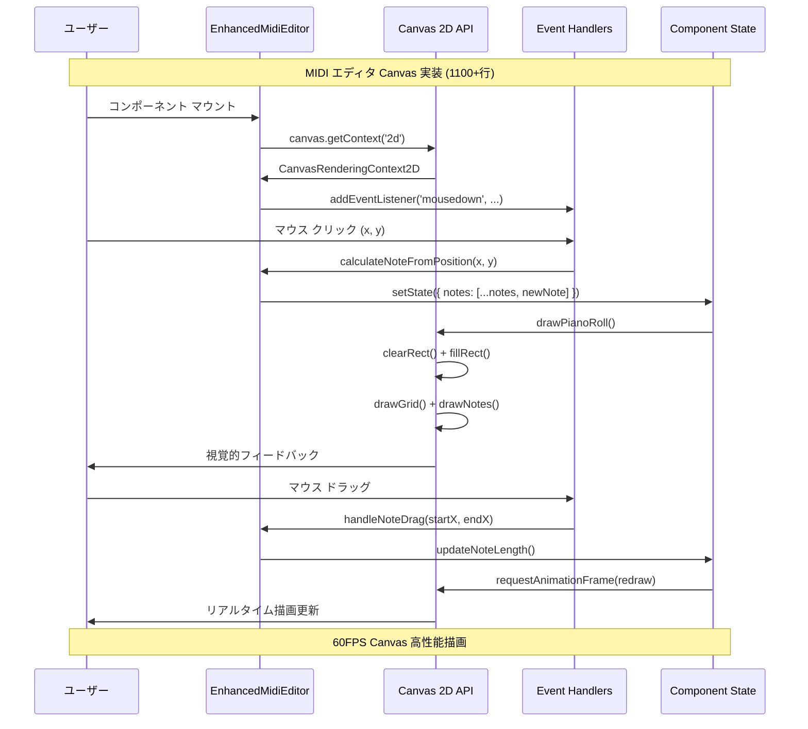
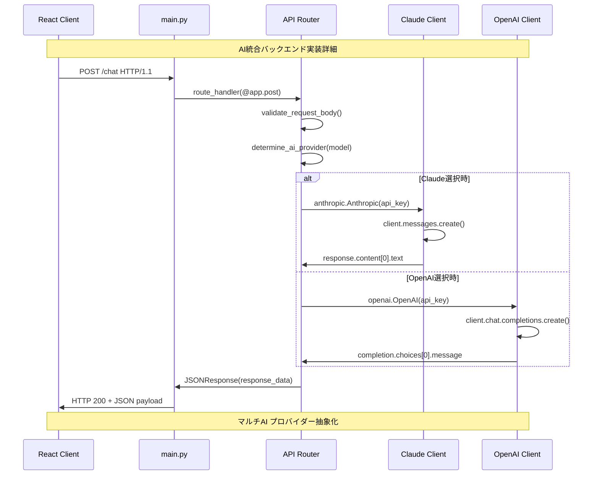
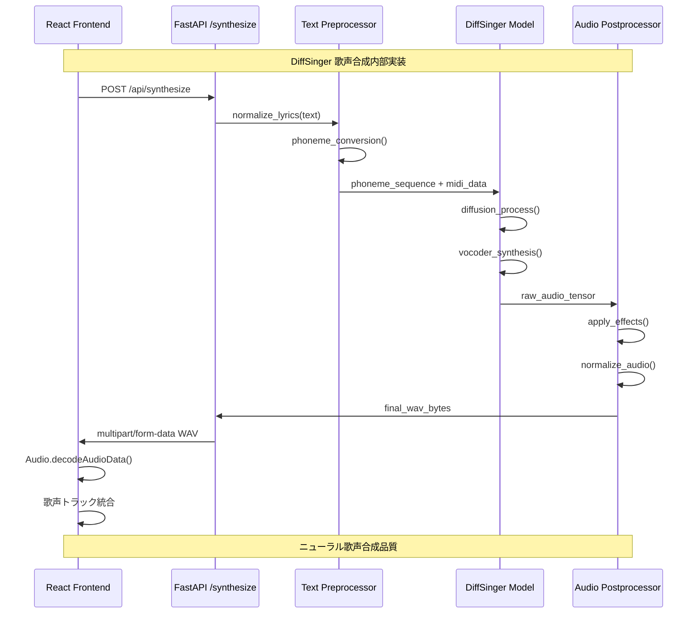
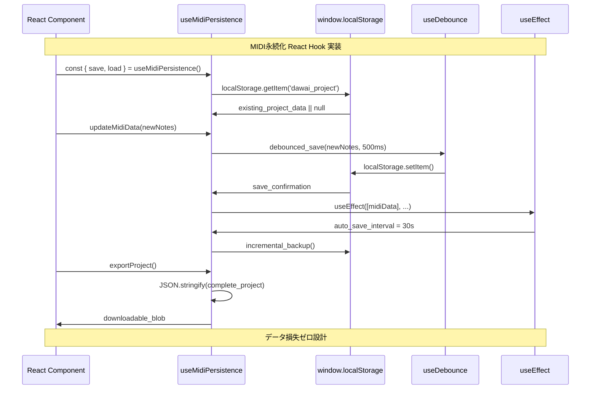
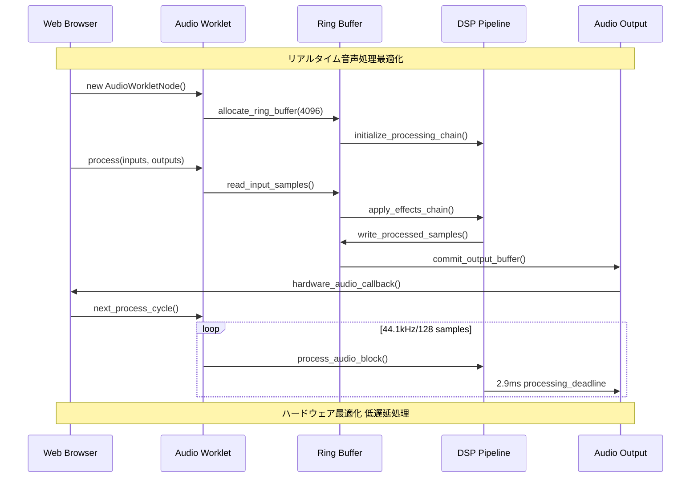
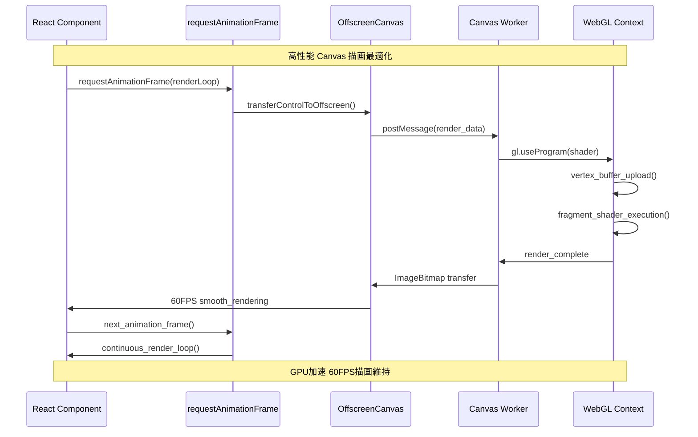
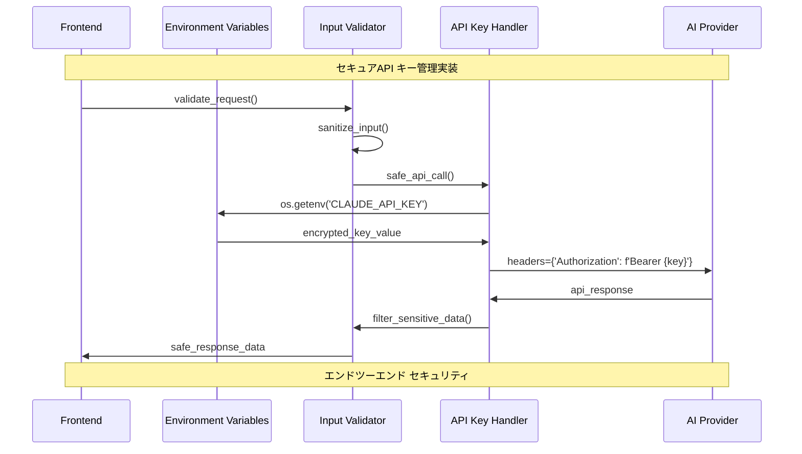
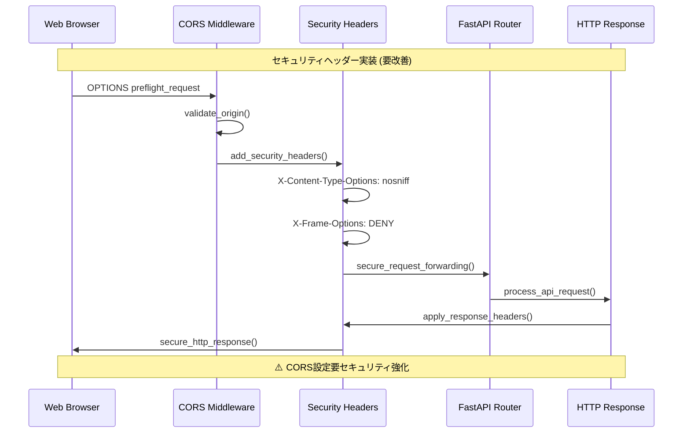

# L3 実装詳細フローシーケンス - DAWAI

**階層レベル**: L3 (実装詳細)
**対象読者**: 実装担当者、新規開発者、デバッガー
**目的**: DAWAI主要実装の内部処理フローと技術詳細を理解する
**関連文書**: 具体的実装ファイル、API仕様、パフォーマンス要件

## 🔧 Core Implementation Flows

### IF-001: unifiedAudioSystem.js 内部フロー



### IF-002: EnhancedMidiEditor.jsx Canvas実装



### IF-003: FastAPI Backend AI統合実装



### IF-004: DiffSinger AI歌声合成パイプライン



## 📊 State Management Implementation

### IF-005: useMidiPersistence Hook実装



### IF-006: AI Provider Switching実装

```mermaid
sequenceDiagram
    participant UI as ModelSelector.jsx
    participant Context as AIContext
    parameter State as useReducer
    participant API as Axios Instance
    participant Backend as FastAPI Router

    Note over UI, Backend: AI プロバイダー動的切り替え実装

    UI->>Context: const { switchModel } = useAI()
    Context->>State: dispatch({ type: 'SWITCH_MODEL' })
    State->>State: aiReducer(state, action)

    State->>API: axios.post('/api/switch-model')
    API->>Backend: model_switch_request
    Backend->>Backend: update_active_provider()
    Backend->>API: switch_confirmation

    API->>State: response.data.success
    State->>Context: provider_switched_successfully
    Context->>UI: UI状態更新・表示切り替え

    UI->>Context: sendMessage(text)
    Context->>API: axios.post('/api/chat', { model: active })
    API->>Backend: routed_to_correct_provider
    Backend->>UI: ai_response_from_active_model

    Note over UI, Backend: 0.5秒以下プロバイダー切り替え
```

## ⚡ Performance Critical Implementations

### IF-007: Audio Engine Real-time Processing



### IF-008: Canvas High-Performance Rendering



## 🔒 Security Implementation Details

### IF-009: API Key Management Implementation



### IF-010: CORS & Security Headers実装



---

**実装最適化**: この階層の詳細は実際のコード実装と密接に関連します。パフォーマンス問題発生時はこのレベルでの分析が必要です。

**関連実装ファイル**:
- `frontend/src/utils/unifiedAudioSystem.js` - 音声エンジン詳細実装
- `frontend/src/components/EnhancedMidiEditor.jsx` - MIDI編集実装
- `backend/ai_agent/main.py` - AI統合バックエンド実装
- `frontend/src/hooks/useMidiPersistence.js` - データ永続化実装