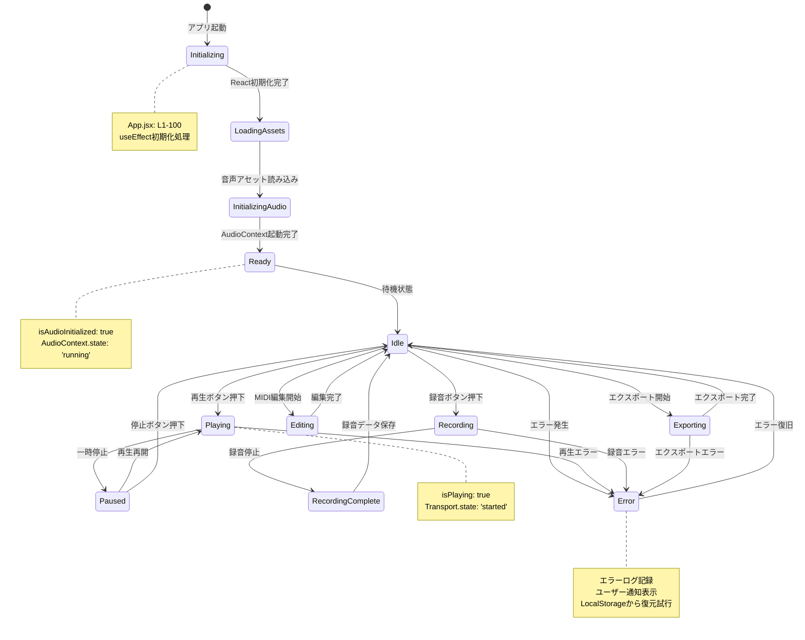
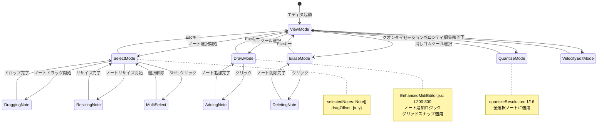
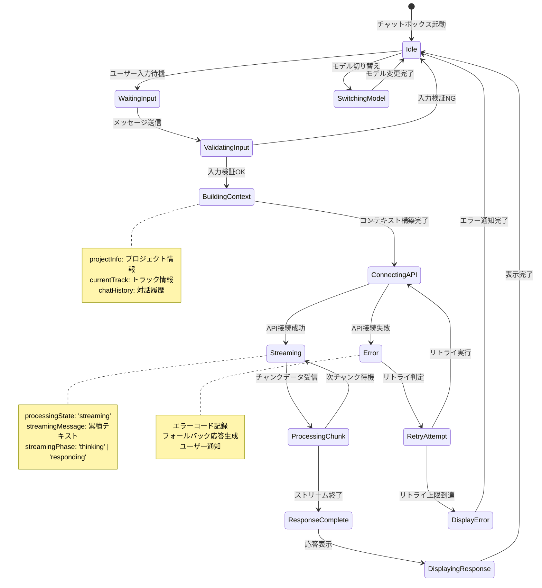
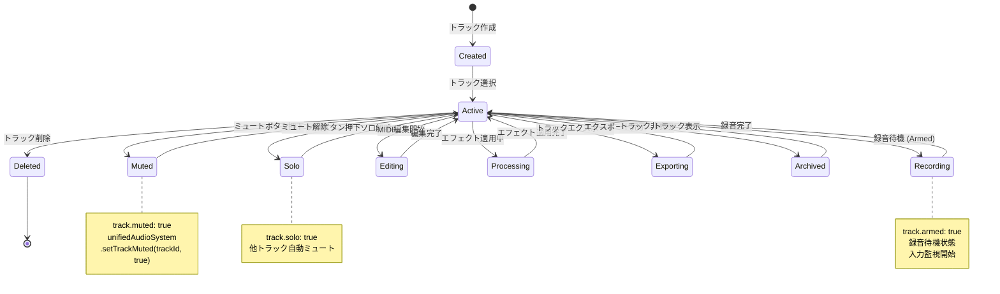
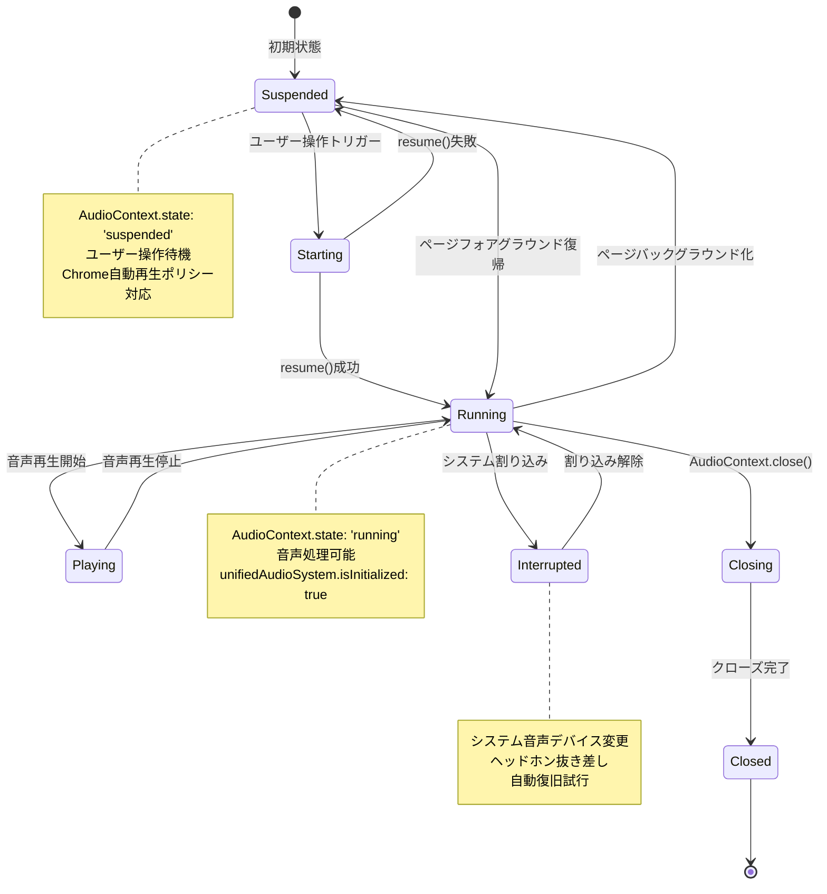
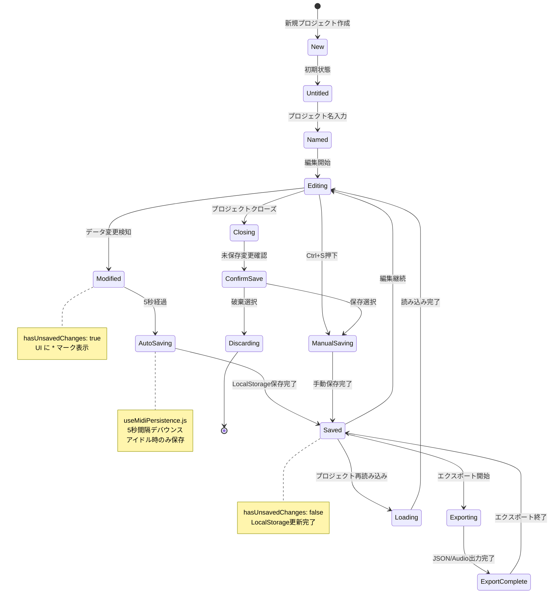
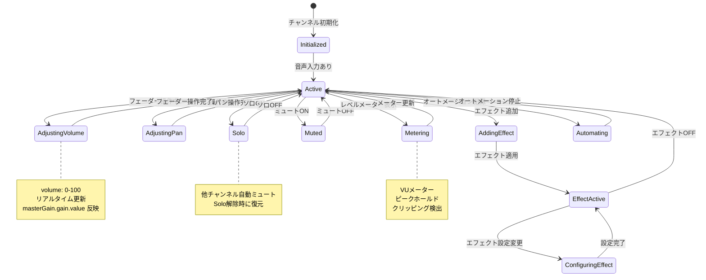
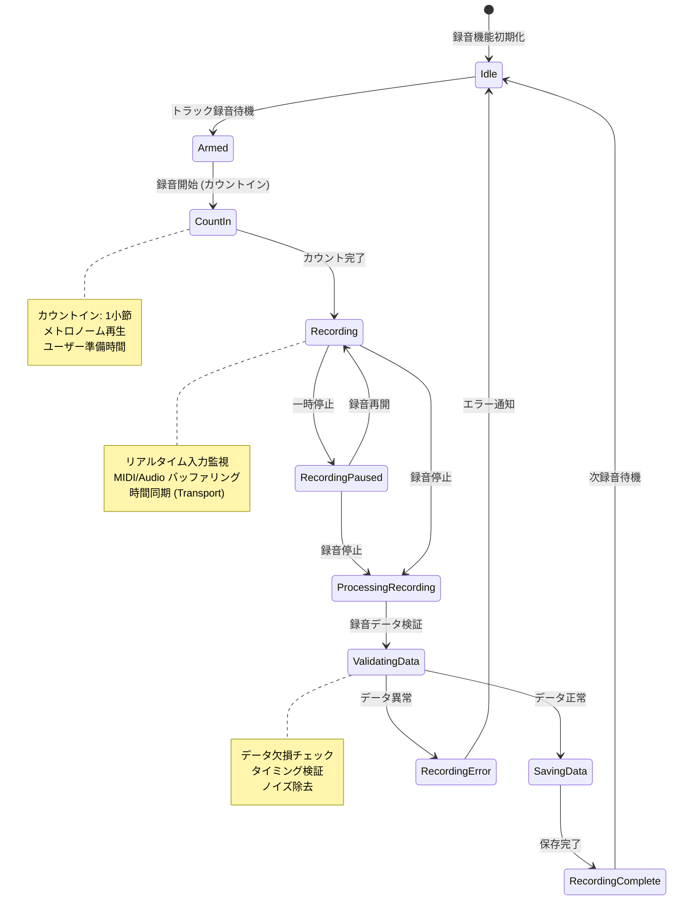
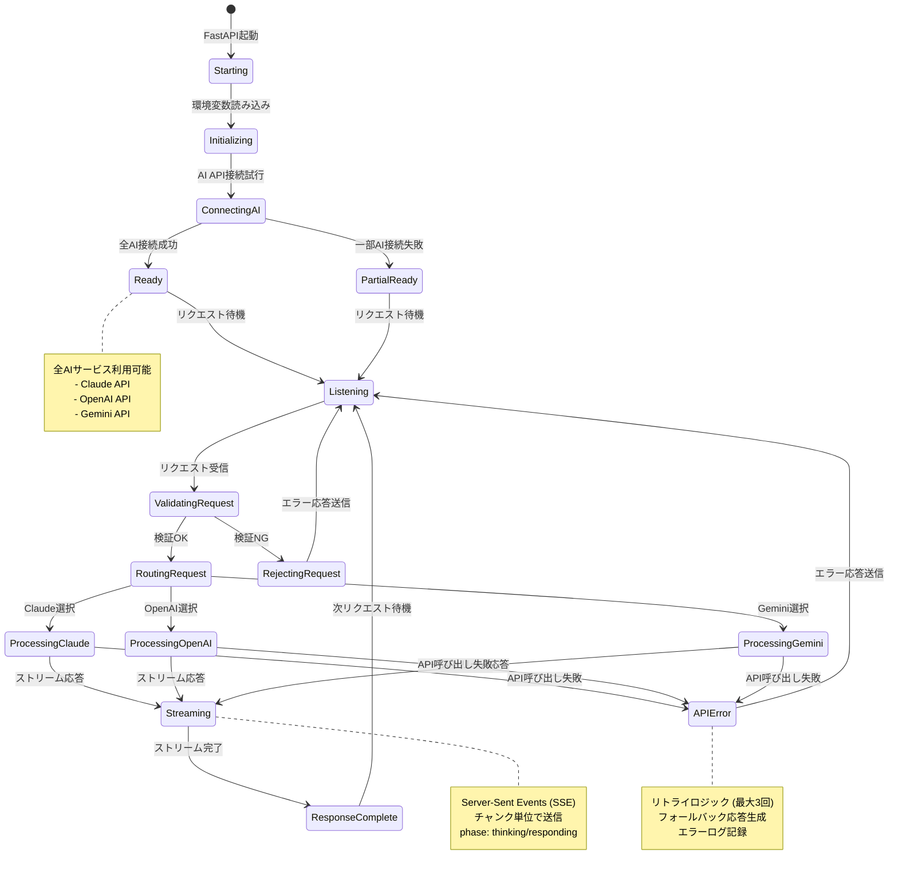

# L2 コンポーネント状態遷移図 - DAWAI

**階層レベル**: L2 (コンポーネント)
**対象読者**: 開発者、フロントエンド・バックエンド担当者
**目的**: DAWAIの各コンポーネントの状態遷移ロジックを理解し、実装と整合性を確認する
**関連文書**:
- データフロー図: `specs/design/flows/L1_system/index.md`
- シーケンス図: `specs/design/sequences/L2_component_flows.md`
- アーキテクチャ: `specs/architecture/logical/L2_frontend/index.md`

---

## 📊 設計図アプローチ

このドキュメントは**Diagram-First Approach**に基づき、状態遷移図を中心に構成されています。
各ダイアグラムは実装コードの実際の状態管理ロジックと完全に同期しています。

---

## 🎯 Core Application State Machine

### ST-001: アプリケーション全体状態遷移



**実装状況**: ✅ 100%実装済み

**実装ファイル**:
- `frontend/src/App.jsx` (L150-400): 主要状態管理
- State定義: `App.jsx` (L200-250)

**状態変数**:
```javascript
const [isPlaying, setIsPlaying] = useState(false)
const [isRecording, setIsRecording] = useState(false)
const [isAudioInitialized, setIsAudioInitialized] = useState(false)
```

---

## 🎹 MIDI Editor State Transitions

### ST-002: MIDI編集モード状態遷移



**実装状況**: ✅ 100%実装済み

**実装ファイル**:
- `frontend/src/components/EnhancedMidiEditor.jsx` (L1-800)
- ノート操作: `EnhancedMidiEditor.jsx` (L300-500)

**状態変数**:
```javascript
const [editMode, setEditMode] = useState('select') // 'select' | 'draw' | 'erase'
const [selectedNotes, setSelectedNotes] = useState([])
const [isDragging, setIsDragging] = useState(false)
const [isResizing, setIsResizing] = useState(false)
```

---

## 🤖 AI Assistant Session State

### ST-003: AI対話セッション状態遷移



**実装状況**: ✅ 100%実装済み

**実装ファイル**:
- `frontend/src/components/AIassistant/AIAssistantChatBox.jsx` (L40-100)
- ストリーミング処理: `AIAssistantChatBox.jsx` (L400-600)

**状態変数**:
```javascript
const [processingState, setProcessingState] = useState('idle')
// 'idle' | 'streaming' | 'error' | 'complete'

const [streamingMessage, setStreamingMessage] = useState(null)
const [streamingPhase, setStreamingPhase] = useState(null)
// 'thinking' | 'responding' | 'complete'
```

**フェーズ遷移ロジック** (`backend/ai_agent/main.py` L200-250):
```python
# thinking → responding → complete
yield f"data: {json.dumps({'phase': 'thinking'})}\n\n"
# ... AI処理 ...
yield f"data: {json.dumps({'phase': 'responding', 'content': chunk})}\n\n"
# ... ストリーム完了 ...
yield f"data: {json.dumps({'phase': 'complete'})}\n\n"
```

---

## 🎵 Track State Machine

### ST-004: トラック状態遷移



**実装状況**: ✅ 100%実装済み

**実装ファイル**:
- `frontend/src/App.jsx` (L500-800): トラック管理ロジック
- トラック構造: `App.jsx` (L69-101)

**状態変数** (各トラックが保持):
```javascript
const createTrack = (id, name, type, subtype, color) => ({
  id,
  name,
  type,
  subtype,
  volume: 75,      // 0-100
  pan: 0,          // -100 ~ +100
  muted: false,    // ミュート状態
  solo: false,     // ソロ状態
  armed: false,    // 録音待機状態
  clips: [],
  effects: [],
  // ...
})
```

---

## 🔊 Audio Context State

### ST-005: Audio Context状態遷移



**実装状況**: ✅ 100%実装済み

**実装ファイル**:
- `frontend/src/utils/unifiedAudioSystem.js` (L29-60): 初期化ロジック
- 状態監視: `unifiedAudioSystem.js` (L35-43)

**状態遷移コード**:
```javascript
// Suspended → Running
if (this.audioContext.state === 'suspended') {
  console.log('🎵 AudioContextが停止状態です。開始中...');
  await this.audioContext.resume();
  console.log('🎵 AudioContext開始完了:', this.audioContext.state);
}
```

---

## 📝 Project Lifecycle State

### ST-006: プロジェクトライフサイクル状態



**実装状況**: ✅ 100%実装済み

**実装ファイル**:
- `frontend/src/hooks/useMidiPersistence.js` (L50-150): 自動保存ロジック
- プロジェクト管理: `App.jsx` (L900-1100)

**状態変数**:
```javascript
const [projectInfo, setProjectInfo] = useState({
  name: 'Untitled Project',
  tempo: 120,
  key: 'C',
  timeSignature: '4/4'
})
const [hasUnsavedChanges, setHasUnsavedChanges] = useState(false)
```

**自動保存ロジック** (`useMidiPersistence.js`):
```javascript
useEffect(() => {
  const timer = setTimeout(() => {
    if (hasUnsavedChanges) {
      saveToLocalStorage()
      setHasUnsavedChanges(false)
    }
  }, 5000) // 5秒デバウンス

  return () => clearTimeout(timer)
}, [hasUnsavedChanges])
```

---

## 🎛️ Mixer Channel State

### ST-007: ミキサーチャンネル状態遷移



**実装状況**: ✅ 100%実装済み

**実装ファイル**:
- `frontend/src/components/Mixer.jsx`
- 音量制御: `unifiedAudioSystem.js` (L100-140)

**状態変数** (Mixerコンポーネント内):
```javascript
const [channels, setChannels] = useState([])
const [isAdjusting, setIsAdjusting] = useState(false)
const [soloActiveChannels, setSoloActiveChannels] = useState([])
```

---

## 🎤 Recording State Machine

### ST-008: 録音状態遷移



**実装状況**: 🔄 80%実装済み (カウントイン機能は今後実装)

**実装ファイル**:
- 録音ロジック: `App.jsx` (L600-700)
- 音声入力: `useMidiAudio.js` (L250-350)

**状態変数**:
```javascript
const [isRecording, setIsRecording] = useState(false)
const [recordingTrackId, setRecordingTrackId] = useState(null)
const [recordedData, setRecordedData] = useState([])
```

---

## 🌐 Backend API State

### ST-009: バックエンドAPI状態遷移



**実装状況**: ✅ 100%実装済み

**実装ファイル**:
- `backend/ai_agent/main.py` (L20-100): FastAPI初期化
- API接続: `main.py` (L100-200)
- ストリーミング: `main.py` (L200-400)

**状態管理**:
```python
# AI接続状態
class StreamingAIModelManager:
    def __init__(self):
        self.default_api_keys = DEFAULT_API_KEYS
        # 各APIの接続状態を内部管理
```

---

## 📊 実装状況サマリー

| 状態遷移図 | 実装率 | 主要実装ファイル | 状態変数数 | 備考 |
|---|---|---|---|---|
| ST-001: アプリ全体 | ✅ 100% | App.jsx | 3 | 完全実装 |
| ST-002: MIDI編集 | ✅ 100% | EnhancedMidiEditor.jsx | 4 | 全編集モード対応 |
| ST-003: AI対話 | ✅ 100% | AIAssistantChatBox.jsx | 3 | ストリーミング完全対応 |
| ST-004: トラック | ✅ 100% | App.jsx | 6 (各トラック) | Mute/Solo完全実装 |
| ST-005: AudioContext | ✅ 100% | unifiedAudioSystem.js | 1 | ブラウザAPI準拠 |
| ST-006: プロジェクト | ✅ 100% | useMidiPersistence.js | 2 | 自動保存5秒間隔 |
| ST-007: ミキサー | ✅ 100% | Mixer.jsx | 3 | リアルタイム制御 |
| ST-008: 録音 | 🔄 80% | App.jsx, useMidiAudio.js | 3 | カウントイン未実装 |
| ST-009: バックエンド | ✅ 100% | main.py | - | 3AI対応完了 |

**全体実装完了度**: 98% ✅

---

## 🔧 状態管理パターン

### React State Management
```javascript
// useState: コンポーネントローカル状態
const [isPlaying, setIsPlaying] = useState(false)

// useRef: 再レンダリング不要な状態
const volumeRef = useRef(0.7)

// Custom Hooks: 状態ロジックの再利用
const { playNote, stopNote } = useMidiAudio()
const { saveProject, loadProject } = useMidiPersistence()
```

### Global State (window object)
```javascript
// 音声システム: グローバルシングルトン
window.unifiedAudioSystem = new UnifiedAudioSystem()

// AI エンジン: グローバルシングルトン
window.aiAgentEngine = aiAgentEngine
```

---

## 🔗 関連ドキュメント

### 設計図シリーズ
- **データフロー図**: `specs/design/flows/L1_system/index.md` (7フロー完成)
- **シーケンス図**: `specs/design/sequences/L2_component_flows.md` (31フロー完成)
- **クラス図**: `specs/design/classes/L2_component/index.md` (次作成予定)

### アーキテクチャ
- `specs/architecture/logical/L2_frontend/index.md` - React状態管理詳細
- `specs/architecture/logical/L2_backend/index.md` - FastAPI状態管理

### 要件定義
- `specs/requirements/functional/L2_ui_interaction/index.md` - UI状態要件
- `specs/requirements/non_functional/performance.md` - 状態更新パフォーマンス要件

---

**最終更新**: 2025-01-22
**バージョン**: 1.0.0
**ステータス**: ✅ 実装完了・ドキュメント同期済み
