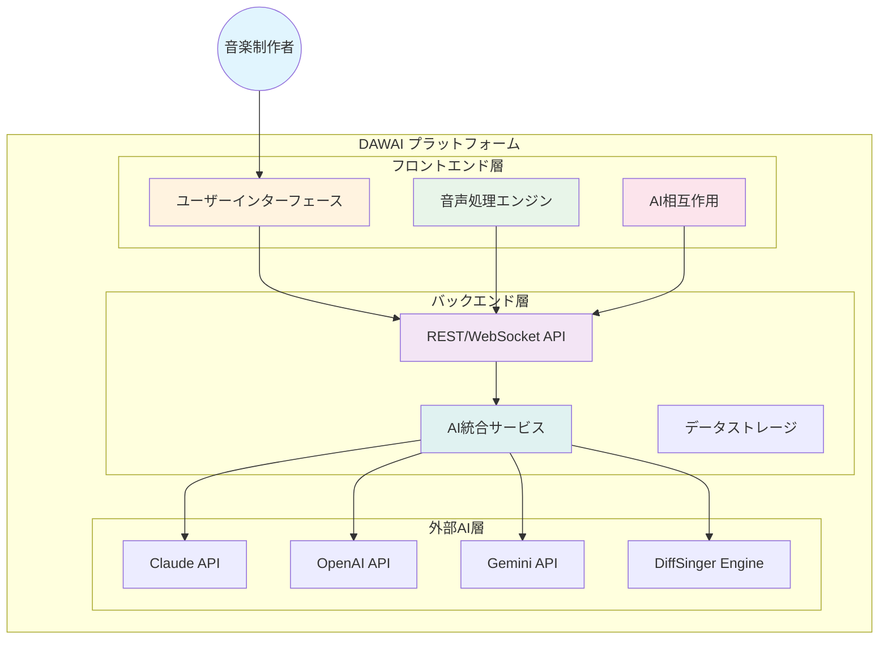

# DAWAI システム概要 (L0)

**Document ID**: DOC-L0-OVERVIEW-001
**Version**: 2.0.0
**Last Updated**: 2025-01-22
**Status**: Current Implementation Based

## 🎯 システムビジョン

**DAWAI** (Digital Audio Workstation with AI Integration) は、AI技術を統合したブラウザベースの音楽制作プラットフォームです。従来のDAWにAIアシスタント機能を組み込み、音楽制作者の創造性を拡張することを目的としています。

## 🏢 ビジネスコンテキスト

### ミッション
音楽制作者がAIとコラボレーションしながら、直感的かつ効率的に楽曲制作を行えるプラットフォームを提供する

### ビジョン
AIが音楽制作の新たな可能性を開き、誰もが高品質な音楽を創造できる世界を実現する

### 価値提案
- **AI統合作曲支援**: リアルタイムでの作曲・編曲アドバイス
- **智能歌声合成**: DiffSingerによる高品質AI歌声生成
- **ブラウザ完結**: インストール不要のクロスプラットフォーム対応
- **リアルタイム処理**: 低遅延での音声処理とAI応答

## 👥 主要ステークホルダー

### プライマリユーザー
- **音楽制作者**: 個人・プロの作曲家、編曲家
- **プロデューサー**: 楽曲プロデューサー、ミュージックディレクター
- **アマチュアミュージシャン**: 趣味で音楽制作を行うユーザー

### セカンダリユーザー
- **音楽教育者**: 音楽教育機関での教育ツールとして活用
- **開発者コミュニティ**: オープンソース貢献者、プラグイン開発者

## 🎼 システム全体像

### L0 システム構成概要

## 🔧 核心機能領域

### 1. 音声・MIDI処理
- **リアルタイム音声合成**: Tone.js基盤の高品質音声エンジン
- **MIDI編集**: ピアノロール、ドラムシーケンサー
- **マルチトラック対応**: 複数楽器の同時編集・再生

### 2. AI統合機能
- **対話型アシスタント**: 作曲・編曲支援チャット
- **歌声合成**: DiffSingerによるAI歌唱生成
- **テキスト補完**: Ghost Text機能による歌詞・楽譜支援

### 3. プロジェクト管理
- **楽曲プロジェクト**: セッション保存・読み込み
- **エクスポート機能**: WAV、MIDI、プロジェクトファイル
- **コラボレーション**: リアルタイム共同編集（将来機能）

## 📊 主要メトリクス

### パフォーマンス指標
- **音声遅延**: <50ms (リアルタイム処理)
- **AI応答時間**: <3秒 (平均)
- **同時ユーザー**: 1,000+ (想定)

### 品質指標
- **可用性**: 99.5% (年間)
- **音質**: 48kHz/24bit対応
- **ブラウザ対応**: Chrome, Firefox, Safari, Edge

## 🗺️ ナビゲーション

### 次レベル詳細
- **[要件定義 L1](../requirements/functional/L1_index.md)**: 機能要件一覧
- **[システム構成 L1](../architecture/logical/L1_system.md)**: 技術アーキテクチャ詳細
- **[ビジネスコンテキスト](business_context.md)**: 市場分析・競合分析

### 関連ドキュメント
- **[ナビゲーションガイド](navigation.md)**: 仕様書の効率的な読み方
- **[開発者向け概要](../../README.md)**: 技術的な導入ガイド

## 📋 ドキュメント管理

| 項目 | 値 |
|------|-----|
| 文書ID | DOC-L0-OVERVIEW-001 |
| 責任者 | プロダクトマネージャー |
| レビュー頻度 | 四半期 |
| 承認者 | CTO, CPO |
| 関連要件 | [全機能要件](../requirements/functional/) |

---

**注記**: このドキュメントは現在の実装に基づいた仕様書です。実装の変更に伴い、定期的に更新されます。