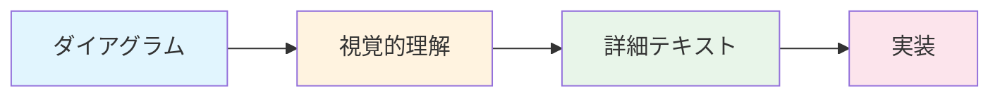
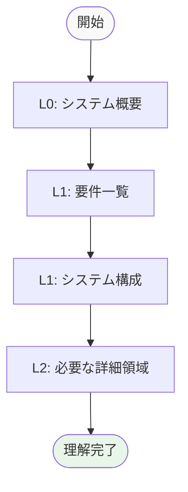
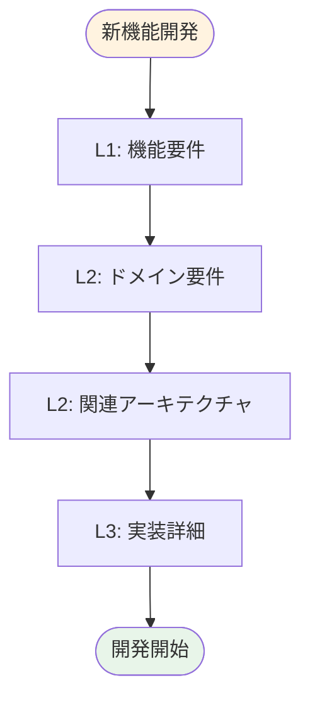
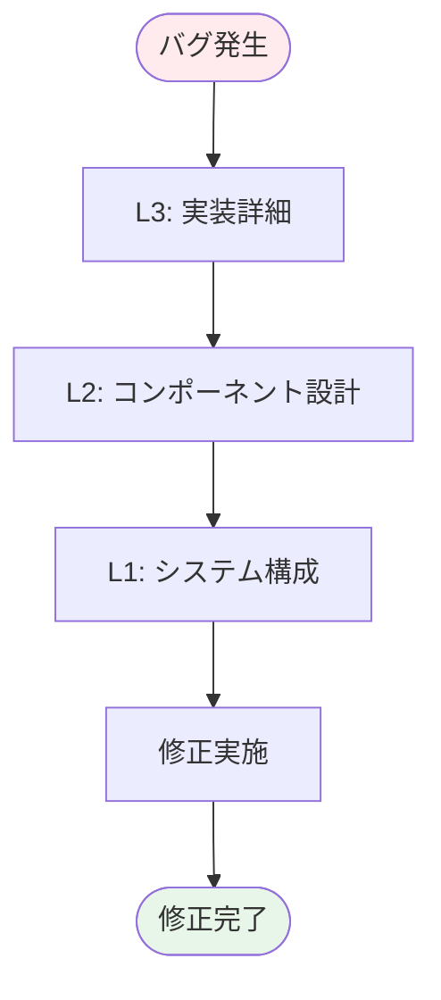

# DAWAI 階層型仕様書 ナビゲーションガイド

**Document ID**: DOC-L0-NAVIGATION-001
**Version**: 2.0.0
**Last Updated**: 2025-01-22
**Parent**: [システム概要](index.md)

## 🎯 このガイドの目的

DAWAI階層型仕様書2.0を効率的に読み進めるためのナビゲーションガイドです。Progressive Disclosure Patternを活用し、必要な情報のみを段階的に取得できます。

## 📚 階層構造の理解

### 階層レベル定義

| レベル | 対象読者 | 内容 | 詳細度 |
|--------|----------|------|---------|
| **L0** | 経営者・非技術者 | ビジネス概要・価値提案 | 概要レベル |
| **L1** | PM・設計者 | システム全体設計 | システムレベル |
| **L2** | 開発者 | コンポーネント設計 | モジュールレベル |
| **L3** | 実装者 | 詳細実装仕様 | 実装レベル |

### ダイアグラムファーストの原則



## 🗺️ 読み進め方パターン

### パターン1: 全体理解優先



**推奨対象**: 初めてDAWAIを理解する方、プロジェクト概要把握

### パターン2: 機能開発優先



**推奨対象**: 新機能開発者、機能拡張作業

### パターン3: バグ修正優先



**推奨対象**: バグ修正担当者、保守開発者

## 📋 タスク別読み進めガイド

### 新規参入者向け
1. **[L0: システム概要](index.md)** - DAWAI全体理解
2. **[L0: ビジネスコンテキスト](business_context.md)** - 事業背景理解
3. **[L1: システム構成](../architecture/logical/L1_system.md)** - 技術概要
4. **[開発環境構築](../../README.md)** - 実際の開発準備

### 機能開発者向け
1. **[L1: 機能要件一覧](../requirements/functional/L1_index.md)** - 開発対象特定
2. **[L2: ドメイン別要件](../requirements/functional/)** - 詳細要件理解
3. **[L2: アーキテクチャ設計](../architecture/logical/)** - 実装方針理解
4. **[L3: 実装詳細](../design/)** - コーディング仕様

### UI/UX開発者向け
1. **[L2: UI相互作用要件](../requirements/functional/L2_ui_interaction/)** - UI要件
2. **[L2: フロントエンド構成](../architecture/logical/L2_frontend/)** - React構成
3. **[L3: コンポーネント設計](../design/classes/)** - UI詳細設計

### AI機能開発者向け
1. **[L2: AI統合要件](../requirements/functional/L2_ai_integration/)** - AI要件
2. **[L2: バックエンド構成](../architecture/logical/L2_backend/)** - FastAPI構成
3. **[L3: AI実装詳細](../architecture/logical/L3_components/)** - AI統合詳細

## 🔍 効率的な検索方法

### ID体系による検索

| プレフィックス | 内容 | 例 |
|----------------|------|-----|
| `FR-` | 機能要件 | FR-AUDIO-001 |
| `NFR-` | 非機能要件 | NFR-PERF-001 |
| `LA-` | 論理アーキテクチャ | LA-L2-FRONTEND-001 |
| `PA-` | 物理アーキテクチャ | PA-L1-DEPLOY-001 |
| `DG-` | ダイアグラム | DG-SEQ-L2-LOGIN |
| `TC-` | テストケース | TC-FUNC-001 |

### キーワード検索

#### 機能別キーワード
- **音声処理**: `audio`, `tone.js`, `synthesis`
- **AI機能**: `ai`, `claude`, `diffsinger`, `ghost-text`
- **UI/UX**: `react`, `component`, `interaction`
- **データ**: `midi`, `project`, `storage`

#### 技術別キーワード
- **フロントエンド**: `react`, `vite`, `javascript`, `hooks`
- **バックエンド**: `fastapi`, `python`, `api`, `websocket`
- **AI統合**: `anthropic`, `openai`, `gemini`, `pytorch`

## 📊 ダイアグラム活用ガイド

### ダイアグラム種類と用途

| ダイアグラム | 用途 | レベル | 場所 |
|-------------|------|--------|------|
| **システム構成図** | 全体理解 | L0-L1 | overview/, architecture/ |
| **シーケンス図** | フロー理解 | L1-L3 | design/sequences/ |
| **状態遷移図** | 状態管理 | L2-L3 | design/states/ |
| **クラス図** | 構造理解 | L2-L3 | design/classes/ |
| **データフロー図** | データ流れ | L1-L2 | design/flows/ |

### ダイアグラム読み方のコツ

1. **上位から下位へ**: L0→L1→L2→L3の順で詳細化
2. **関連性重視**: 矢印・関係線の意味を理解
3. **色分け活用**: システム境界・責任領域の区別
4. **注釈確認**: 重要な補足情報を見落とさない

## ⚡ 時間効率化テクニック

### 15分で全体把握
1. **[システム概要](index.md)**: 5分
2. **システム構成図**: 5分
3. **[機能要件一覧](../requirements/functional/L1_index.md)**: 5分

### 30分で開発準備
1. **全体把握**: 15分（上記）
2. **関連アーキテクチャ**: 10分
3. **実装詳細特定**: 5分

### 60分で深い理解
1. **開発準備**: 30分（上記）
2. **詳細設計レビュー**: 20分
3. **テスト仕様確認**: 10分

## 🔄 継続的な活用方法

### 定期レビュー
- **週次**: 担当領域のL2-L3レベル
- **月次**: システム全体のL1レベル
- **四半期**: ビジネスコンテキストのL0レベル

### 更新タイミング
- **実装変更時**: 対応するL3-L2ドキュメント
- **機能追加時**: 要件からアーキテクチャまで
- **リリース時**: 全レベルの整合性確認

## 🆘 トラブルシューティング

### よくある質問

#### Q: どのレベルから読み始めるべき？
**A**: 目的に応じて選択
- **全体理解**: L0から順番に
- **機能開発**: L1要件から開始
- **バグ修正**: L3実装から逆算

#### Q: ダイアグラムが理解できない場合は？
**A**: 段階的アプローチ
1. より上位レベルのダイアグラムを確認
2. 関連するテキスト説明を読む
3. 具体的な実装コードを参照

#### Q: 情報が古い・不正確な場合は？
**A**: 整合性チェック
1. `specs/tools/sync_checker.py`を実行
2. 対応するGitコミット履歴を確認
3. 実装コードとの突合せ

## 📞 サポート

### ドキュメント改善提案
- **GitHub Issues**: 仕様書の問題報告
- **Pull Request**: 具体的な改善提案
- **Discord**: リアルタイム質問・議論

### 整合性検証ツール
```bash
# 仕様書整合性チェック
python specs/tools/sync_checker.py --full-check

# 特定領域のチェック
python specs/tools/sync_checker.py --area requirements
```

---

**次のステップ**:
[システム概要](index.md)から開始するか、目的に応じて適切なエントリーポイントを選択してください。