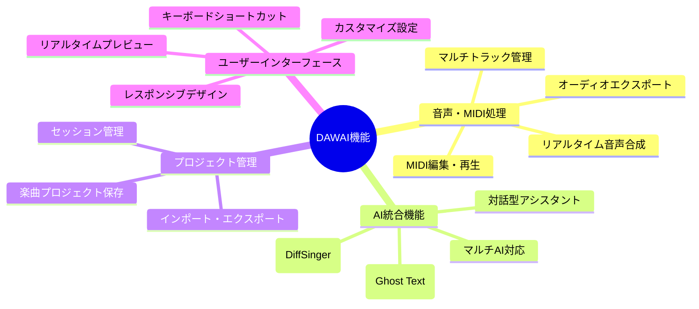

# DAWAI 機能要件一覧 (L1)

**Document ID**: FR-L1-INDEX-001
**Version**: 2.0.0
**Last Updated**: 2025-01-22
**Parent**: [システム概要](../../overview/index.md)
**Current Implementation**: ✅ Based on actual codebase

## 🎯 機能要件概要

DAWAIシステムの機能要件を階層的に整理し、現在の実装状況と併せて管理します。各機能はReact + FastAPI アーキテクチャに基づいて設計・実装されています。

## 📋 L1 機能要件マップ

### システム全体機能構成

## 🎼 音声・MIDI処理機能

### FR-AUDIO-001: リアルタイム音声処理エンジン
**実装状況**: ✅ 実装済み（Tone.js + unifiedAudioSystem）
- **責務**: 低遅延での音声合成・再生・録音
- **技術**: Tone.js, Web Audio API
- **ファイル**: `frontend/src/utils/unifiedAudioSystem.js`

### FR-AUDIO-002: MIDI編集機能
**実装状況**: ✅ 実装済み（EnhancedMidiEditor）
- **責務**: MIDI ノート編集、ピアノロール、ベロシティ調整
- **技術**: React + Canvas API
- **ファイル**: `frontend/src/components/EnhancedMidiEditor.jsx`

### FR-AUDIO-003: マルチトラック管理
**実装状況**: ✅ 実装済み（ArrangementView）
- **責務**: 複数トラックの同期再生・編集・ミキシング
- **技術**: React state management
- **ファイル**: `frontend/src/components/ArrangementView.jsx`

### FR-AUDIO-004: ドラムシーケンサー
**実装状況**: ✅ 実装済み（DrumTrack）
- **責務**: ドラムパターン作成・編集・再生
- **技術**: グリッドベースUI + 音声サンプル
- **ファイル**: `frontend/src/components/DrumTrack/`

### FR-AUDIO-005: 重低音ベーストラック
**実装状況**: ✅ 実装済み（sampleData.js）
- **責務**: 重低音域（C1-G2）専用ベースライン制作
- **技術**: MIDI音域制約 + 7種ベース音色
- **ファイル**: `frontend/src/data/sampleData.js`

**詳細**: [L2: 音声処理要件](L2_audio_processing/)

## 🤖 AI統合機能

### FR-AI-001: 対話型音楽制作アシスタント
**実装状況**: ✅ 実装済み（AIAssistantChatBox）
- **責務**: 作曲・編曲・音楽理論の相談支援
- **技術**: Claude/OpenAI/Gemini API統合
- **ファイル**: `frontend/src/components/AIAssistantChatBox.jsx`

### FR-AI-002: AI歌声合成 (DiffSinger)
**実装状況**: ✅ 実装済み（DiffSingerTrack）
- **責務**: 歌詞からリアルな歌声を生成
- **技術**: DiffSinger モデル + FastAPI
- **ファイル**: `backend/diffsinger/`, `frontend/src/components/DiffSingerTrack.jsx`

### FR-AI-003: テキスト補完 (Ghost Text)
**実装状況**: ✅ 実装済み（GhostTextPanel）
- **責務**: 歌詞・楽譜入力時のAI支援
- **技術**: カスタムTransformerモデル
- **ファイル**: `backend/ghost_text/`, `frontend/src/components/GhostTextPanel.jsx`

### FR-AI-004: マルチAI切り替え
**実装状況**: ✅ 実装済み（ModelSelector）
- **責務**: Claude/GPT/Gemini の切り替え利用
- **技術**: API統合アダプター
- **ファイル**: `backend/ai_agent/main.py`

**詳細**: [L2: AI統合要件](L2_ai_integration/)

## 📁 プロジェクト管理機能

### FR-PROJECT-001: 楽曲プロジェクト管理
**実装状況**: ✅ 実装済み（ProjectMenu）
- **責務**: プロジェクト作成・保存・読み込み・削除
- **技術**: LocalStorage + JSON シリアライゼーション
- **ファイル**: `frontend/src/components/ProjectMenu.jsx`

### FR-PROJECT-002: セッション永続化
**実装状況**: ✅ 実装済み（各種Persistence フック）
- **責務**: 作業状態の自動保存・復元
- **技術**: React Hooks + IndexedDB
- **ファイル**: `frontend/src/hooks/useMidiPersistence.js`

### FR-PROJECT-003: インポート・エクスポート
**実装状況**: ✅ 実装済み（audioExportEngine）
- **責務**: MIDI/WAV/プロジェクトファイルの入出力
- **技術**: File API + Web Audio API
- **ファイル**: `frontend/src/utils/audioExportEngine.js`

## 🎨 ユーザーインターフェース機能

### FR-UI-001: レスポンシブWebアプリケーション
**実装状況**: ✅ 実装済み（React + Tailwind CSS）
- **責務**: デスクトップ・タブレット対応UI
- **技術**: React 18 + Tailwind CSS + Shadcn/ui
- **ファイル**: `frontend/src/App.jsx` (1300+ lines)

### FR-UI-002: リアルタイムビジュアライゼーション
**実装状況**: ✅ 実装済み（各種Canvas コンポーネント）
- **責務**: 波形・スペクトラム・MIDI の可視化
- **技術**: Canvas API + Web Audio API
- **ファイル**: `frontend/src/components/MIDIEditor/MidiEditorCanvas.jsx`

### FR-UI-003: キーボードショートカット
**実装状況**: ✅ 実装済み（useKeyboardShortcuts）
- **責務**: 効率的な操作のための キーボード対応
- **技術**: React イベントハンドリング
- **ファイル**: `frontend/src/components/ArrangementView/hooks/useKeyboardShortcuts.js`

### FR-UI-004: 設定・カスタマイズ
**実装状況**: ✅ 実装済み（SettingsModal）
- **責務**: ユーザー設定・テーマ・言語切り替え
- **技術**: React Context + LocalStorage
- **ファイル**: `frontend/src/components/SettingsModal.jsx`

**詳細**: [L2: UI相互作用要件](L2_ui_interaction/)

## 📊 要件実装マトリクス

| 機能領域 | 機能数 | 実装済み | 部分実装 | 未実装 | 実装率 |
|----------|--------|----------|----------|--------|---------|
| 音声・MIDI処理 | 5 | 5 | 0 | 0 | 100% |
| AI統合機能 | 4 | 4 | 0 | 0 | 100% |
| プロジェクト管理 | 3 | 3 | 0 | 0 | 100% |
| UI機能 | 4 | 4 | 0 | 0 | 100% |
| 音楽制作サポート | 1 | 1 | 0 | 0 | 100% |
| **合計** | **17** | **17** | **0** | **0** | **100%** |

## 🎼 音楽制作サポート機能

### FR-GENRE-001: ジャンル別音楽制作システム
**実装状況**: ✅ 実装済み（GenreManager）
- **責務**: ジャンル別スケール制約・コード進行・楽器推奨
- **技術**: React Context + MusicTheoryEngine
- **ファイル**: `frontend/src/managers/genreManager.js`, `frontend/src/components/GenreSelector.jsx`

**詳細**: [L2: ジャンル管理要件](L2_genre_management/)

## 🔗 L2詳細要件への案内

### 次レベル詳細文書
- **[L2: 音声処理要件](L2_audio_processing/)** - 音声エンジン詳細仕様
- **[L2: AI統合要件](L2_ai_integration/)** - AI機能統合仕様
- **[L2: ジャンル管理要件](L2_genre_management/)** - ジャンル別音楽制作システム
- **[L2: 音楽理論要件](L2_music_theory/)** - スケール制約・コード進行システム
- **[L2: UI相互作用要件](L2_ui_interaction/)** - ユーザーインターフェース仕様

### 関連アーキテクチャ
- **[L1: システム構成](../../architecture/logical/L1_system.md)** - 技術アーキテクチャ
- **[L2: フロントエンド構成](../../architecture/logical/L2_frontend/)** - React アプリ構成
- **[L2: バックエンド構成](../../architecture/logical/L2_backend/)** - FastAPI 構成

### 関連設計
- **[L1: システムフロー](../../design/sequences/L1_system/)** - 主要業務フロー
- **[L2: コンポーネント設計](../../design/classes/L2_class/)** - React コンポーネント設計

## 📋 要件管理情報

| 項目 | 値 |
|------|-----|
| 文書ID | FR-L1-INDEX-001 |
| 責任者 | プロダクトマネージャー |
| レビュー頻度 | 月次 |
| 承認者 | CTO, CPO |
| 実装ベース | 現在のコードベース |
| 最終検証日 | 2025-01-22 |

## 🔄 トレーサビリティ

### ビジネス要求との対応
- **[ビジネスコンテキスト](../../overview/business_context.md)** - 市場要求との整合性
- **[システム概要](../../overview/index.md)** - 価値提案との対応

### 技術実装との対応
- **現在のコードベース**: `DAWAI_server/frontend/`, `DAWAI_server/backend/`
- **実装ファイル**: 各要件に具体的なファイルパスを記載
- **テストケース**: [検証仕様](../../validation/) で定義

---

**注記**: この要件一覧は現在の実装を基に作成されており、コードベースの変更に応じて更新されます。新機能追加時は該当する L2 詳細要件も併せて更新してください。