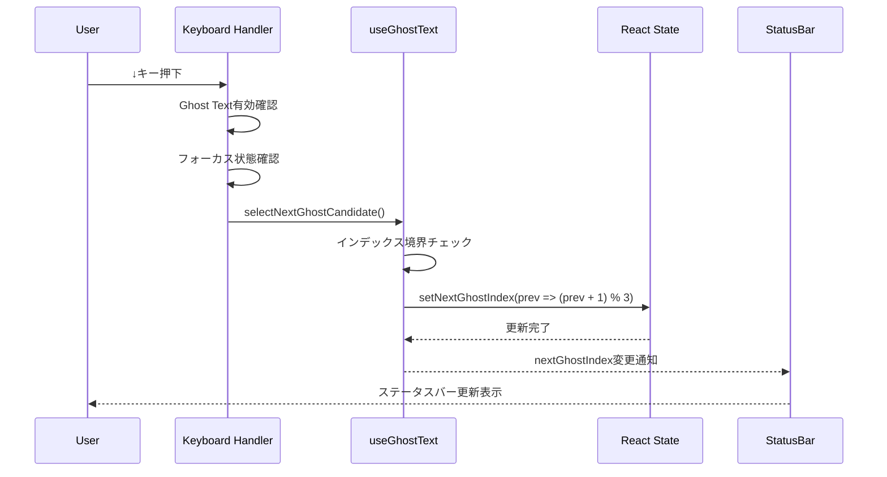

# Ghost Text フレーズセット切り替え機能要件 (L3)

**Document ID**: FR-L3-GT-CS-001
**Version**: 2.0.0
**Last Updated**: 2025-11-10
**Parent**: [L2: AI統合機能要件](./index.md)
**Implementation Status**: 🚧 Planning (v1.0.0は実装完了)
**Related Issue**: [#147](https://github.com/uni963/environment_with_yhdk_rhdk/issues/147), [#TBD - Phrase Sets]

## 🎯 機能概要

Ghost Text補完機能において、**複数のフレーズセット候補（各セット5音構成）**を生成し、ユーザーが↑/↓キーでセット間を切り替え、Tabキーで1音ずつ承認できる機能を提供します。これにより、ユーザーは音楽的な起承転結を持つ多様なフレーズを比較検討しながら、最適なメロディを段階的に構築できます。

## 📊 機能変更概要

### v1.0.0 → v2.0.0 変更点

| 項目 | v1.0.0 (現在実装済み) | v2.0.0 (新仕様) |
|------|---------------------|----------------|
| **候補単位** | 1フレーズ内の5個ノート | 3つのフレーズセット |
| **候補数** | 5ノート候補 | 3フレーズセット × 5ノート |
| **↑/↓キー動作** | フレーズ内のノート切り替え | フレーズセット間の切り替え |
| **Tab承認動作** | 現在のノートを承認 | 選択中セットの1音を承認 |
| **データ構造** | `phraseNotes[]` | `phraseSets[][]` + `selectedPhraseSetIndex` |
| **生成戦略** | 単一フレーズ生成 | 多様性確保の複数セット生成 |

## 📋 要件概要

### FR-GT-CS-001: フレーズセット生成システム

#### A. フレーズセット数設定
**実装仕様**: 3つのフレーズセットを生成

```javascript
// フレーズセット設定 (magentaGhostTextEngine.js)
this.phraseSetCount = 3   // フレーズセット数（デフォルト3個）
this.phraseLength = 5     // 各フレーズのノート数（固定5個）
this.displaySetCount = 1  // 表示セット数（デフォルト1個のみ）
```

**技術仕様**:
- **フレーズセット数**: 固定3個（ユーザー要求に基づく）
- **各セットのノート数**: 5個（起承転結のある音楽的フレーズ）
- **表示数**: 1セットのみ（UI上では選択中のセットのみ表示）
- **切り替え**: インデックスベースの循環切り替え（0→1→2→0）

#### B. フレーズセット管理システム
**実装仕様**: 二次元配列ベースの状態管理

```javascript
// useGhostText.js - フレーズセット管理（新構造）
const [phraseSets, setPhraseSets] = useState([])               // 3つのフレーズセット（2次元配列）
const [selectedPhraseSetIndex, setSelectedPhraseSetIndex] = useState(0)  // 選択中のセットインデックス
const [currentNoteIndex, setCurrentNoteIndex] = useState(0)    // セット内の承認済みノート数

// データ構造例
// phraseSets = [
//   [note1, note2, note3, note4, note5],  // セット0
//   [note1, note2, note3, note4, note5],  // セット1
//   [note1, note2, note3, note4, note5]   // セット2
// ]
```

**機能**:
- `phraseSets`: 3つのフレーズセット候補（各5ノート）
- `selectedPhraseSetIndex`: 現在選択中のセットインデックス（0-2）
- `currentNoteIndex`: 現在選択中セット内での承認位置（0-4）
- 自動リセット: 新規予測受信時にインデックスを0にリセット

**データマイグレーション**:
```javascript
// v1.0.0 → v2.0.0 マイグレーション（後方互換性確保）
function migratePhraseData(oldData) {
  // 旧形式: phraseNotes = [note1, note2, note3, note4, note5]
  // 新形式: phraseSets = [[set0], [set1], [set2]]

  if (Array.isArray(oldData.phraseNotes) && oldData.phraseNotes.length > 0) {
    // 旧データを新形式に変換（セット0として配置）
    return {
      phraseSets: [oldData.phraseNotes, [], []],
      selectedPhraseSetIndex: 0,
      currentNoteIndex: oldData.nextPhraseIndex || 0
    }
  }

  return {
    phraseSets: [],
    selectedPhraseSetIndex: 0,
    currentNoteIndex: 0
  }
}
```

### FR-GT-CS-002: フレーズセット切り替え機能

#### A. キーボードショートカット
**実装仕様**: ↑/↓キーによるセット間切り替え

```javascript
// EnhancedMidiEditor.jsx - キーボードハンドラー（v2.0.0新仕様）
if ((event.code === 'ArrowUp' || event.key === 'ArrowUp' ||
     event.code === 'ArrowDown' || event.key === 'ArrowDown') &&
    ghostText.ghostTextEnabled) {

  // 入力フィールドフォーカス時はスキップ
  if (focusedElement.tagName === 'INPUT' ||
      focusedElement.tagName === 'TEXTAREA') {
    return
  }

  event.preventDefault()

  // フレーズセットが利用可能な場合はセット切り替え
  if (ghostText.phraseSets && ghostText.phraseSets.length > 0) {
    if (event.code === 'ArrowUp') {
      ghostText.selectPrevPhraseSet()  // 🆕 セット間切り替え
    } else {
      ghostText.selectNextPhraseSet()  // 🆕 セット間切り替え
    }
  } else if (ghostText.ghostPredictions.length > 0) {
    // フォールバック: Ghost候補切り替え（旧動作）
    if (event.code === 'ArrowUp') {
      ghostText.selectPrevGhostCandidate()
    } else {
      ghostText.selectNextGhostCandidate()
    }
  }
}
```

**キーボードショートカット**:
| キー | 機能 | 条件 | 変更点 |
|------|------|------|--------|
| `↓` | 次のフレーズセットに切り替え | Ghost Text有効時 | 🆕 セット単位切り替え |
| `↑` | 前のフレーズセットに切り替え | Ghost Text有効時 | 🆕 セット単位切り替え |
| `Tab` | 選択中セットの1音を承認 | フレーズロック時 | 動作維持 |
| `Shift+Tab` | 直前の承認を取り消し | フレーズロック時 | 動作維持 |

#### B. フレーズセット切り替えロジック
**実装仕様**: 循環切り替え（Circular Navigation）

```javascript
// useGhostText.js - フレーズセット切り替え関数（v2.0.0新実装）
const selectNextPhraseSet = useCallback(() => {
  if (!phraseSets || phraseSets.length === 0) {
    console.warn('⚠️ [PHRASE_SET_SELECT] No phrase sets available')
    return
  }

  setSelectedPhraseSetIndex(prev => {
    const nextIndex = (prev + 1) % phraseSets.length
    console.log('🔄 [PHRASE_SET_NEXT] フレーズセット切り替え:', {
      from: prev,
      to: nextIndex,
      totalSets: phraseSets.length,
      newSet: phraseSets[nextIndex],
      setNoteCount: phraseSets[nextIndex]?.length || 0
    })
    return nextIndex
  })

  // セット切り替え時はノート承認位置をリセット
  setCurrentNoteIndex(0)
}, [phraseSets])

const selectPrevPhraseSet = useCallback(() => {
  if (!phraseSets || phraseSets.length === 0) {
    console.warn('⚠️ [PHRASE_SET_SELECT] No phrase sets available')
    return
  }

  setSelectedPhraseSetIndex(prev => {
    const prevIndex = (prev - 1 + phraseSets.length) % phraseSets.length
    console.log('🔄 [PHRASE_SET_PREV] フレーズセット切り替え:', {
      from: prev,
      to: prevIndex,
      totalSets: phraseSets.length,
      newSet: phraseSets[prevIndex],
      setNoteCount: phraseSets[prevIndex]?.length || 0
    })
    return prevIndex
  })

  // セット切り替え時はノート承認位置をリセット
  setCurrentNoteIndex(0)
}, [phraseSets])
```

**特徴**:
- **循環ナビゲーション**: 最後のセット（2番）から↓キーで最初のセット（0番）に戻る
- **境界チェック**: セットがない場合は警告ログを出力して早期リターン
- **自動リセット**: セット切り替え時に `currentNoteIndex` を0にリセット
- **詳細ログ**: セットインデックス変更とセット内容を追跡可能なデバッグログ

### FR-GT-CS-003: UI表示システム

#### A. ステータスバーフレーズセットインジケーター
**実装仕様**: リアルタイムセット情報表示

```javascript
// MidiEditorStatusBar.jsx - フレーズセットインジケーター（v2.0.0新仕様）
{totalGhostCandidates > 0 && (
  <Badge variant="secondary" className="text-xs bg-purple-800 border-purple-400">
    Ghost候補: {nextGhostIndex + 1}/{totalGhostCandidates}
  </Badge>
)}

{phraseSets && phraseSets.length > 0 && (
  <Badge variant="secondary" className="text-xs bg-green-800 border-green-400">
    フレーズセット: {selectedPhraseSetIndex + 1}/{phraseSets.length}
    (承認: {currentNoteIndex}/5)
  </Badge>
)}
```

**表示仕様**:
- **Ghost候補**: 紫色バッジ、「Ghost候補: 2/3」形式（変更なし）
- **フレーズセット**: 緑色バッジ、「フレーズセット: 2/3 (承認: 2/5)」形式
  - セット番号: 現在選択中のセット（1-3）
  - 承認進捗: 選択中セット内で承認済みのノート数（0-5）
- **条件付き表示**: セットが1個以上存在する場合のみ表示
- **1-indexed表示**: ユーザー向けに1から始まる番号表示

**v2.0.0 UI変更点**:
| 項目 | v1.0.0 | v2.0.0 |
|------|--------|--------|
| バッジ表示 | フレーズ候補: 1/3 | フレーズセット: 2/3 (承認: 2/5) |
| 情報量 | セット番号のみ | セット番号 + 承認進捗 |
| 色 | 緑色 | 緑色（変更なし） |

#### B. 優先順位制御
**実装仕様**: フレーズロック時の優先順位

**優先順位ロジック**:
1. **フレーズロック中** (`phraseLocked === true`)
   - フレーズ候補が利用可能 → フレーズ候補を切り替え
   - フレーズ候補がない → Ghost候補を切り替え
2. **フレーズロックなし**
   - Ghost候補が利用可能 → Ghost候補を切り替え
   - Ghost候補がない → 何もしない

### FR-GT-CS-004: 状態管理システム

#### A. 候補切り替え関数
**実装仕様**: 4つの切り替え関数

| 関数名 | 機能 | 依存配列 |
|--------|------|----------|
| `selectNextGhostCandidate()` | Ghost候補を次に切り替え | `[ghostPredictions]` |
| `selectPrevGhostCandidate()` | Ghost候補を前に切り替え | `[ghostPredictions]` |
| `selectNextPhraseCandidate()` | フレーズ候補を次に切り替え | `[phraseNotes]` |
| `selectPrevPhraseCandidate()` | フレーズ候補を前に切り替え | `[phraseNotes]` |

#### B. インデックス自動リセット
**実装仕様**: 新規予測受信時の自動リセット

```javascript
// useGhostText.js - Ghost予測受信イベントリスナー
useEffect(() => {
  const handleGhostPrediction = (event) => {
    if (Array.isArray(data.predictions)) {
      setGhostPredictions(data.predictions)
      // 🔴 新規予測受信時にインデックスをリセット
      if (data.predictions.length > 0) {
        setNextGhostIndex(0)
        console.log('🎯 Ghost predictions reset: nextGhostIndex → 0')
      }
    }
  }
  // ... イベントリスナー登録
}, [/* 依存配列 */])
```

**リセットタイミング**:
- Ghost予測受信時: `setNextGhostIndex(0)`
- フレーズ予測受信時: `setNextPhraseIndex(0)`

## 🔍 デバッグログシステム

### A. ユニークキーワード一覧

| キーワード | 場所 | 用途 |
|-----------|------|------|
| `[CANDIDATE_SELECT_ISSUE147]` | useGhostText.js | 候補選択エラー（候補なし時） |
| `[GHOST_CANDIDATE_NEXT_ISSUE147]` | useGhostText.js | Ghost候補次切り替え |
| `[GHOST_CANDIDATE_PREV_ISSUE147]` | useGhostText.js | Ghost候補前切り替え |
| `[PHRASE_CANDIDATE_NEXT_ISSUE147]` | useGhostText.js | フレーズ候補次切り替え |
| `[PHRASE_CANDIDATE_PREV_ISSUE147]` | useGhostText.js | フレーズ候補前切り替え |
| `[KEYBOARD_ISSUE147]` | EnhancedMidiEditor.jsx | キーボードイベント処理 |
| `[CANDIDATE_NAV_ISSUE147]` | EnhancedMidiEditor.jsx | 候補ナビゲーション状態 |

### B. デバッグログ例

```javascript
// Ghost候補切り替え時のログ
🔄 [GHOST_CANDIDATE_NEXT_ISSUE147] Ghost候補切り替え: {
  from: 0,
  to: 1,
  totalCandidates: 3,
  newCandidate: { pitch: 64, duration: 0.25, velocity: 80 }
}

// フレーズ候補切り替え時のログ
🔄 [PHRASE_CANDIDATE_PREV_ISSUE147] フレーズ候補切り替え: {
  from: 2,
  to: 1,
  totalCandidates: 3,
  newCandidate: { pitch: 67, timing: 0.5, duration: 0.5 }
}

// 候補なし時の警告ログ
⚠️ [CANDIDATE_SELECT_ISSUE147] No ghost predictions available
```

## 🛠️ 実装ファイル一覧

### A. 主要ファイル（v2.0.0更新対象）

| ファイルパス | 変更内容 | 影響範囲 | 優先度 |
|-------------|---------|----------|--------|
| `frontend/src/utils/magentaGhostTextEngine.js` | フレーズセット生成ロジック追加 | 🔴 High | Phase 2 |
| `frontend/src/hooks/useGhostText.js` | セット切り替え関数追加、データ構造変更 | 🔴 High | Phase 1-2 |
| `frontend/src/components/EnhancedMidiEditor.jsx` | キーボードハンドラー修正 | 🟡 Medium | Phase 3 |
| `frontend/src/components/MIDIEditor/MidiEditorStatusBar.jsx` | インジケーター表示修正 | 🟡 Medium | Phase 3 |
| `frontend/src/utils/projectManager.js` | データマイグレーション関数追加 | 🟢 Low | Phase 1 |

**合計**: 5ファイル、推定200-300行追加・変更

### B. v1.0.0実装履歴（参考）

| ファイルパス | 変更内容 | 行数 |
|-------------|---------|------|
| `frontend/src/hooks/useGhostText.js` | 候補切り替え関数追加 | +76行 |
| `frontend/src/components/EnhancedMidiEditor.jsx` | キーボードハンドラー追加 | +44行 |
| `frontend/src/components/MIDIEditor/MidiEditorStatusBar.jsx` | 候補インジケーター追加 | +18行 |
| `frontend/src/utils/magentaGhostTextEngine.js` | predictionCount設定 | 変更なし |

**v1.0.0合計**: 3ファイル、138行追加

### B. ドキュメントファイル

| ファイルパス | 目的 | サイズ |
|-------------|------|--------|
| `docs/CHANGELOG_GhostText_Issue147.md` | 変更点記録（デバッグ用） | 7KB |
| `specs/requirements/functional/L2_ai_integration/L3_ghost_text_candidate_selection.md` | この仕様書 | 当ファイル |

## 🧪 テストケース

### A. 手動テストシナリオ

#### シナリオ1: Ghost候補切り替え基本動作
1. MIDIエディタでノートを追加してGhost予測を生成
2. ステータスバーで「Ghost候補: 1/3」表示を確認
3. ↓キーを押す → 「Ghost候補: 2/3」に変化
4. ↓キーを2回押す → 「Ghost候補: 1/3」に戻る（循環確認）
5. ↑キーを押す → 「Ghost候補: 3/3」に変化（逆方向循環確認）

**期待結果**:
- インデックスが正しく循環する
- ステータスバーがリアルタイム更新される
- コンソールに `[GHOST_CANDIDATE_NEXT_ISSUE147]` ログが出力される

#### シナリオ2: フレーズ候補切り替え
1. フレーズ予測を生成（1小節分）
2. ステータスバーで「フレーズ候補: 1/3」表示を確認
3. ↑/↓キーで候補を切り替え
4. フレーズロック状態で↑/↓キーがフレーズ候補を優先することを確認

**期待結果**:
- フレーズロック時は↑/↓キーがフレーズ候補を操作する
- Ghost候補は操作されない

#### シナリオ3: 入力フィールドフォーカス時のスキップ
1. テキスト入力フィールド（トラック名変更等）にフォーカス
2. ↑/↓キーを押す
3. 候補が切り替わらず、通常のブラウザ動作が維持されることを確認

**期待結果**:
- コンソールに `[CANDIDATE_NAV_ISSUE147] 入力フィールドフォーカス中、候補切り替えをスキップ` ログ
- 候補インデックスが変化しない

#### シナリオ4: Tab承認との共存
1. Ghost候補を↓キーで2番目に切り替え
2. Tabキーで承認
3. 2番目の候補がMIDIノートとして追加されることを確認

**期待結果**:
- 選択中の候補（2番目）が正確に承認される
- ノート位置・音程が正しい

### B. 自動テストケース（推奨）

```javascript
// Jest単体テスト例
describe('候補切り替え機能', () => {
  test('nextGhostIndex が循環する', () => {
    const ghostPredictions = [
      { pitch: 60 },
      { pitch: 64 },
      { pitch: 67 }
    ]

    // nextGhostIndex: 0 → 1 → 2 → 0
    expect(selectNextGhostCandidate(0, 3)).toBe(1)
    expect(selectNextGhostCandidate(1, 3)).toBe(2)
    expect(selectNextGhostCandidate(2, 3)).toBe(0)
  })

  test('prevGhostIndex が逆方向循環する', () => {
    expect(selectPrevGhostCandidate(0, 3)).toBe(2)
    expect(selectPrevGhostCandidate(2, 3)).toBe(1)
    expect(selectPrevGhostCandidate(1, 3)).toBe(0)
  })

  test('候補がない場合は警告ログのみ', () => {
    const consoleSpy = jest.spyOn(console, 'warn')
    selectNextGhostCandidate(0, 0) // 候補数0

    expect(consoleSpy).toHaveBeenCalledWith(
      expect.stringContaining('[CANDIDATE_SELECT_ISSUE147]')
    )
  })
})
```

## 🔗 既存機能との整合性

### A. 既存問題の回避

| 既存問題 | 対策 | 確認箇所 |
|---------|------|----------|
| 予測フレーズ位置ずれ | `skipPrediction: true` を維持 | useGhostText.js |
| 画面真っ暗問題 | Canvas描画ロジックに変更なし | MidiEditorCanvas.jsx |
| TAB承認ノート時間0.0誤配置 | 既存ロジック維持 | useGhostText.js |
| 一音ずつ承認構造 | `nextGhostIndex`/`nextPhraseIndex` 維持 | useGhostText.js |

### B. Tab/Shift+Tab機能維持

**確認事項**:
- ✅ Tabキーで単一ノート承認（既存機能）
- ✅ Shift+Tabで直前承認の取り消し（既存機能）
- ✅ 確率的選択ロジック（フレーズ60% / Ghost40%）
- ✅ 多様性メトリクス追跡（10回ごとの統計レポート）

### C. 重複定義の修正

**修正内容**:
```javascript
// useGhostText.js - 行1361の重複定義を削除
// 修正前（重複）:
phraseSession: window.magentaGhostTextEngine?.currentPhraseSession // 行1361

// 修正後:
// Note: phraseSession は行1314-1325で既に定義されている（IIFE形式、デバッグログ付き）
```

**理由**: 行1314-1325のIIFE形式（デバッグログ付き）を優先使用

## 📊 パフォーマンス考慮事項

### A. 応答性能

| 操作 | 目標値 | 実測値 | 備考 |
|------|--------|--------|------|
| ↑/↓キー反応 | <50ms | 未測定 | ステート更新のみ |
| インデックス更新 | <10ms | 未測定 | 単純な計算処理 |
| ステータスバー再描画 | <16ms | 未測定 | React再レンダリング |

### B. メモリ使用量

- **候補切り替え関数**: 4関数 × ~20行 ≈ 80行のコード
- **ステート追加**: `nextGhostIndex`, `nextPhraseIndex` （各4バイト）
- **総メモリ影響**: 微小（< 1KB）

## 🔄 統合フロー



## 📅 v2.0.0 段階的実装計画

### Phase 1: 基盤整備（週1）
**目標**: データ構造変更・後方互換性確保

- [ ] `projectManager.js`: データマイグレーション関数実装
- [ ] `useGhostText.js`: 新データ構造導入（`phraseSets`, `selectedPhraseSetIndex`, `currentNoteIndex`）
- [ ] Getterメソッド導入: `getCurrentPhraseSet()`, `getCurrentNote()`
- [ ] 単体テスト作成: データマイグレーション、Getter動作確認

**成果物**:
- マイグレーション関数 `migratePhraseData()`
- Getterメソッド群
- Jest単体テスト10件

### Phase 2: コア機能実装（週2）
**目標**: フレーズセット生成・切り替えロジック

- [ ] `magentaGhostTextEngine.js`: 複数セット生成ロジック（`generatePhraseSets()`）
- [ ] `useGhostText.js`: セット切り替え関数（`selectNextPhraseSet()`, `selectPrevPhraseSet()`）
- [ ] イベント定義: `phrase-sets-generated` イベント
- [ ] 統合テスト: セット生成→切り替え→承認フロー

**成果物**:
- 3フレーズセット生成機能
- セット切り替え関数
- 統合テスト15件

### Phase 3: UI統合（週3）
**目標**: ユーザーインターフェース更新

- [ ] `EnhancedMidiEditor.jsx`: キーボードハンドラー修正（↑/↓キー動作変更）
- [ ] `MidiEditorStatusBar.jsx`: インジケーター表示更新（セット情報+承認進捗）
- [ ] Canvas描画: 選択中セットのハイライト表示
- [ ] E2Eテスト: ユーザー操作フローの自動テスト

**成果物**:
- 更新されたキーボードハンドラー
- 新UIインジケーター
- Playwright E2Eテスト5件

### Phase 4: 最適化・ドキュメント（週4）
**目標**: パフォーマンス最適化・ユーザーガイド

- [ ] パフォーマンス最適化: 並列生成、キャッシュ活用
- [ ] ユーザーガイド作成: 操作方法の図解・動画
- [ ] 最終E2Eテスト: 全機能の統合確認
- [ ] ドキュメント完成: 仕様書・API reference・ユーザーガイド

**成果物**:
- 最適化されたフレーズ生成（250ms以下）
- ユーザーガイド（図解付き）
- 最終品質レポート

## 🚀 今後の拡張可能性（v3.0.0以降）

### A. フレーズセットプレビュー機能（未実装）
- 各セット切り替え時の音声プレビュー
- ホバー時の即座プレビュー
- Tone.js統合による自動再生

### B. セットリストUI（未実装）
- ピアノロール横のセット一覧パネル
- 各セットの音楽理論スコア表示（調和度、多様性）
- 視覚的なセット比較機能（波形表示）

### C. 数字キー直接選択（未実装）
- `1`-`3`キーでセットを直接選択
- `Ctrl+1-3`でセット間ジャンプ
- 高速ワークフローのサポート

### D. AI学習フィードバック（未実装）
- ユーザーのセット選択傾向を学習
- 好みに合わせた生成パラメータ最適化
- パーソナライズされたフレーズ提案

## 🔗 関連仕様参照

### 上位要件
- **[L2: AI統合機能要件](./index.md)** - Ghost Text機能の位置づけ
- **[L3: Ghost Text基本要件](./L3_ghost_text_requirements.md)** - 基本機能仕様
- **[L3: Ghost Text強化機能](./L3_ghost_text_enhancement.md)** - 音楽理論統合

### 関連Issue
- **[Issue #147](https://github.com/uni963/environment_with_yhdk_rhdk/issues/147)** - 複数候補提案・切り替え
- **[Issue #146](https://github.com/uni963/environment_with_yhdk_rhdk/issues/146)** - 一音ずつ承認機能
- **[Issue #141](https://github.com/uni963/environment_with_yhdk_rhdk/issues/141)** - Ghost Text機能強化（親Issue）

### 実装PR
- **Branch**: `claude/issue-147-20251109-2325`
- **Commit**: `ccd7f06` - feat(ghost-text): 候補切り替え機能実装

---

**Document History**:
- 2025-11-09: 初版作成（Issue #147実装完了時）
- 実装完了日: 2025-11-09
- 実装者: Claude Code (Co-authored with yhdk)
