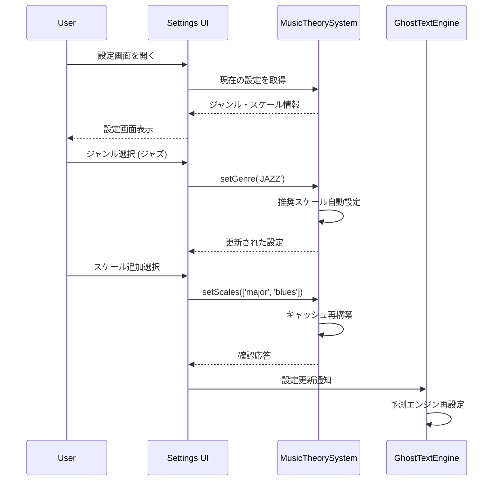
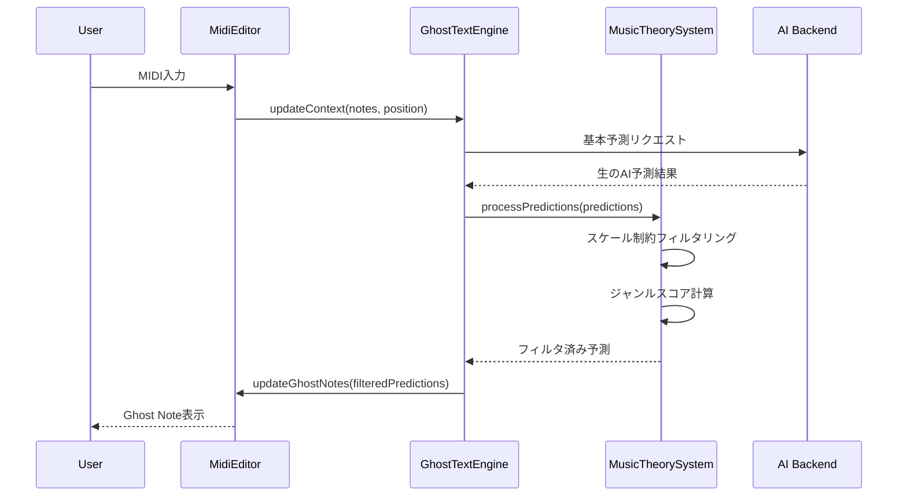

# Ghost Text ジャンル・スケール対応機能要件 (L3)

**Document ID**: FR-L3-GT-001
**Version**: 1.0.0
**Last Updated**: 2025-10-05
**Parent**: [L2: AI統合機能要件](./index.md)
**Implementation Status**: 🚧 In Development

## 🎼 機能概要

Ghost Text補完機能にジャンル別音楽理論とスケール制約機能を追加し、音楽的に一貫性のある音程提案を実現します。ユーザーが事前にジャンル（ポップ、ジャズ、R&B、ロック、バラード）とスケール（メジャー、マイナー、ペンタトニック、ブルーノート）を選択することで、選択されたスケールに沿った音程のみを提案する高度な音楽理論フィルタリングシステムです。

## 🎯 L3 詳細要件

### FR-GT-001: ジャンル選択システム

#### A. サポート対象ジャンル
**実装仕様**: 5つの主要音楽ジャンルをカバー

```javascript
// ジャンル定義仕様
const MUSIC_GENRES = {
  POP: {
    name: "ポップミュージック調",
    recommendedScales: ["major", "minor", "major pentatonic"],
    rhythmCharacteristics: {
      straightFeel: true,
      syncopation: 0.3,
      restProbability: 0.15
    },
    harmonicTendencies: {
      prefersConsonance: true,
      allowedTensions: ["add9", "6"]
    }
  },
  JAZZ: {
    name: "ジャズ調",
    recommendedScales: ["major", "dorian", "mixolydian", "blues"],
    rhythmCharacteristics: {
      swingRatio: 0.67,
      syncopation: 0.6,
      restProbability: 0.25
    },
    harmonicTendencies: {
      prefersConsonance: false,
      allowedTensions: ["7", "9", "11", "13"],
      chromaticPassing: true
    }
  }
  // ... 他のジャンル定義
}
```

**技術仕様**:
- **ジャンル数**: 5種類（ポップ、ジャズ、R&B、ロック、バラード）
- **推奨スケール**: ジャンル毎に2-4個の適合スケール
- **リズム特性**: シンコペーション、休符確率、ノート長さ傾向
- **ハーモニー特性**: 協和/不協和傾向、許可テンション、回避音程

#### B. ジャンル特性データベース
**実装ファイル**: `src/utils/musicTheory/MusicTheorySystem.js`

```javascript
// ジャンル特性実装例
class GenreCharacteristics {
  calculateGenreScore(midiNote, genreId, context) {
    const genre = MUSIC_GENRES[genreId];
    const interval = this.getIntervalFromRoot(midiNote);

    let score = 0.5; // ベーススコア

    switch (genreId) {
      case 'POP':
        // 1,3,5度重視
        if ([0, 4, 7].includes(interval)) score += 0.3;
        break;
      case 'JAZZ':
        // 拡張和音・テンション重視
        if ([2, 6, 9, 11].includes(interval)) score += 0.2;
        break;
      // ... 他のジャンル処理
    }

    return Math.min(score, 1.0);
  }
}
```

### FR-GT-002: スケール制約システム

#### A. サポート対象スケール
**実装仕様**: tonal.js ライブラリベース

```javascript
// スケール定義仕様
const SCALE_DEFINITIONS = {
  major: {
    name: "メジャースケール",
    tonalName: "major",
    intervals: ["1P", "2M", "3M", "4P", "5P", "6M", "7M"],
    semitones: [0, 2, 4, 5, 7, 9, 11],
    mood: "bright"
  },
  minor: {
    name: "マイナースケール",
    tonalName: "natural minor",
    intervals: ["1P", "2M", "3m", "4P", "5P", "6m", "7m"],
    semitones: [0, 2, 3, 5, 7, 8, 10],
    mood: "dark"
  },
  pentatonic: {
    name: "ペンタトニックスケール",
    tonalName: "major pentatonic",
    intervals: ["1P", "2M", "3M", "5P", "6M"],
    semitones: [0, 2, 4, 7, 9],
    mood: "universal"
  },
  blues: {
    name: "ブルーノートスケール",
    tonalName: "blues",
    intervals: ["1P", "3m", "4P", "5d", "5P", "7m"],
    semitones: [0, 3, 5, 6, 7, 10],
    mood: "bluesy"
  }
}
```

**技術仕様**:
- **スケール数**: 4種類（メジャー、マイナー、ペンタトニック、ブルーノート）
- **音程範囲**: MIDI 21-108 (A0-C8)
- **オクターブ対応**: ±2オクターブの自動拡張
- **tonal.js統合**: Scale.get() APIによる音程生成

#### B. スケール制約フィルタリング
**実装仕様**: リアルタイム音程フィルタリング

```javascript
// スケール制約実装例
class ScaleConstraintFilter {
  filterByScale(midiNotes, options = {}) {
    const {
      allowPassingTones = false,
      preferConsonance = false,
      maxDistance = 12
    } = options;

    const scaleNotes = this.getCurrentScaleNotes();

    return midiNotes.filter(midiNote => {
      // スケール内音程は常に許可
      if (scaleNotes.includes(midiNote)) return true;

      // 経過音の許可
      if (allowPassingTones) {
        const hasAdjacentScaleNote = scaleNotes.some(scaleNote =>
          Math.abs(midiNote - scaleNote) === 1
        );
        if (hasAdjacentScaleNote) return true;
      }

      return false;
    });
  }
}
```

### FR-GT-003: 音楽理論統合システム

#### A. MusicTheorySystem コアクラス
**実装ファイル**: `src/utils/musicTheory/MusicTheorySystem.js`

```javascript
// 音楽理論システム実装
export class MusicTheorySystem {
  constructor() {
    this.currentGenre = null;
    this.currentScales = [];
    this.rootNote = "C";
    this.octave = 4;
    this.scaleCache = new Map();
  }

  // ジャンル設定
  setGenre(genreId) {
    this.currentGenre = MUSIC_GENRES[genreId];
    this.setScales(this.currentGenre.recommendedScales.slice(0, 2));
  }

  // スケール設定
  setScales(scaleIds) {
    this.currentScales = scaleIds;
    this.clearCache();
  }

  // 現在のスケール音程取得
  getCurrentScaleNotes() {
    const cacheKey = `${this.rootNote}${this.octave}-${this.currentScales.join(',')}`;

    if (this.scaleCache.has(cacheKey)) {
      return this.scaleCache.get(cacheKey);
    }

    const allNotes = new Set();

    for (const scaleId of this.currentScales) {
      const scaleName = this.getScaleName(scaleId);
      const fullScaleName = `${this.rootNote}${this.octave} ${scaleName}`;
      const scale = Scale.get(fullScaleName);

      if (!scale.empty && scale.notes) {
        // 複数オクターブにわたって音程追加
        for (let octaveOffset = -1; octaveOffset <= 2; octaveOffset++) {
          scale.notes.forEach(noteName => {
            const midiNote = Note.midi(noteName.replace(/\d/, '') + (this.octave + octaveOffset));
            if (midiNote >= 21 && midiNote <= 108) {
              allNotes.add(midiNote);
            }
          });
        }
      }
    }

    const result = Array.from(allNotes).sort((a, b) => a - b);
    this.scaleCache.set(cacheKey, result);
    return result;
  }

  // Ghost Text予測処理
  processPredictions(predictions) {
    return predictions
      .map(prediction => {
        const midiNote = prediction.pitch || prediction.note;
        if (!this.isInScale(midiNote)) return null;

        const genreScore = this.calculateGenreScore(midiNote);
        return {
          ...prediction,
          midiNote,
          genreScore,
          scaleCompliant: true
        };
      })
      .filter(prediction => prediction !== null)
      .sort((a, b) => b.genreScore - a.genreScore);
  }
}
```

#### B. tonal.js ライブラリ統合
**依存関係**: `tonal` パッケージ

```bash
# パッケージ依存関係
npm install tonal
```

```javascript
// tonal.js統合実装
import { Scale, Note, Interval, Chord } from 'tonal';

class TonalIntegration {
  // スケール取得
  getScale(rootNote, scaleName) {
    const fullScaleName = `${rootNote} ${scaleName}`;
    return Scale.get(fullScaleName);
  }

  // 音程変換
  noteToMidi(noteName) {
    return Note.midi(noteName);
  }

  // インターバル計算
  getInterval(note1, note2) {
    return Interval.distance(note1, note2);
  }
}
```

### FR-GT-004: UI統合システム

#### A. 設定パネル拡張
**実装ファイル**: `src/components/SettingsModal.jsx`

```javascript
// Ghost Text設定UI実装例
const GhostTextGenreSettings = ({ settings, onSettingsChange }) => {
  return (
    <div className="ghost-text-genre-settings">
      {/* ジャンル選択 */}
      <div className="genre-selection">
        <h4>音楽ジャンル選択</h4>
        <select value={settings.genre} onChange={handleGenreChange}>
          <option value="POP">ポップミュージック調</option>
          <option value="JAZZ">ジャズ調</option>
          <option value="RNB">R&B調</option>
          <option value="ROCK">ロック調</option>
          <option value="BALLAD">バラード調</option>
        </select>
      </div>

      {/* スケール選択 */}
      <div className="scale-selection">
        <h4>対応スケール選択</h4>
        <div className="scale-checkboxes">
          {AVAILABLE_SCALES.map(scale => (
            <label key={scale.id}>
              <input
                type="checkbox"
                checked={settings.scales.includes(scale.id)}
                onChange={() => handleScaleToggle(scale.id)}
              />
              {scale.name}
            </label>
          ))}
        </div>
      </div>

      {/* リアルタイムプレビュー */}
      <div className="preview-section">
        <h4>プレビュー</h4>
        <button onClick={playScalePreview}>
          選択スケールを試聴
        </button>
        <div className="current-notes">
          対応音程: {getCurrentScaleNotes().join(', ')}
        </div>
      </div>
    </div>
  );
};
```

#### B. Ghost Text エンジン統合
**実装ファイル**: `src/utils/magentaGhostTextEngine.js`

```javascript
// MagentaGhostTextEngine拡張実装
import { musicTheorySystem } from './musicTheory/MusicTheorySystem.js';

class EnhancedMagentaGhostTextEngine extends MagentaGhostTextEngine {
  constructor() {
    super();
    this.musicTheory = musicTheorySystem;
  }

  async generatePredictions(context) {
    // 既存のAI予測を取得
    const basePredictions = await super.generatePredictions(context);

    // 音楽理論フィルタリング適用
    const filteredPredictions = this.musicTheory.processPredictions(basePredictions);

    // ジャンル特性による再ランキング
    return filteredPredictions.sort((a, b) =>
      b.genreScore - a.genreScore
    );
  }

  // 設定更新の統合
  updateMusicSettings(settings) {
    if (settings.genre) {
      this.musicTheory.setGenre(settings.genre);
    }
    if (settings.scales && settings.scales.length > 0) {
      this.musicTheory.setScales(settings.scales);
    }
    if (settings.rootNote && settings.octave) {
      this.musicTheory.setRootNote(settings.rootNote, settings.octave);
    }
  }
}
```

### FR-GT-005: パフォーマンス最適化

#### A. キャッシング戦略
**実装仕様**: マルチレベルキャッシュ

```javascript
// パフォーマンス最適化実装
class PerformanceOptimizer {
  constructor() {
    this.scaleCache = new Map();     // スケール音程キャッシュ
    this.predictionCache = new Map(); // 予測結果キャッシュ
    this.genreScoreCache = new Map(); // ジャンルスコアキャッシュ
  }

  // スケール計算結果キャッシュ
  getCachedScaleNotes(rootNote, octave, scales) {
    const cacheKey = `${rootNote}${octave}-${scales.join(',')}`;

    if (!this.scaleCache.has(cacheKey)) {
      const notes = this.calculateScaleNotes(rootNote, octave, scales);
      this.scaleCache.set(cacheKey, notes);
    }

    return this.scaleCache.get(cacheKey);
  }

  // 予測結果キャッシュ（30秒TTL）
  getCachedPrediction(context) {
    const cacheKey = this.generateContextKey(context);
    const cached = this.predictionCache.get(cacheKey);

    if (cached && Date.now() - cached.timestamp < 30000) {
      return cached.prediction;
    }

    return null;
  }
}
```

#### B. デバウンス処理
**実装仕様**: 入力最適化

```javascript
// デバウンス実装
class InputDebouncer {
  constructor(delay = 100) {
    this.delay = delay;
    this.timeoutId = null;
  }

  debounce(fn, ...args) {
    clearTimeout(this.timeoutId);
    this.timeoutId = setTimeout(() => fn(...args), this.delay);
  }
}

// Ghost Text入力処理での使用
const debouncer = new InputDebouncer(100);

function handleMidiInput(notes, cursorPosition) {
  debouncer.debounce(() => {
    const context = this.buildContext(notes, cursorPosition);
    this.generateGhostTextPredictions(context);
  });
}
```

## 🎨 ユーザーエクスペリエンス仕様

### A. 設定フロー
1. **初期設定**: 新規ユーザー向けデフォルト（ポップ・メジャースケール）
2. **ジャンル選択**: ドロップダウンで5つのジャンルから選択
3. **スケール選択**: チェックボックスで複数スケール選択可能
4. **リアルタイムプレビュー**: 選択したスケールの試聴機能
5. **自動保存**: 設定は自動的にローカルストレージに保存

### B. Ghost Text表示
1. **フィルタリング表示**: スケール外音程は表示されない
2. **優先度表示**: ジャンルスコアに基づく透明度調整
3. **カラーコーディング**: スケール内音程は緑、経過音は黄色
4. **採用フィードバック**: 採用された予測の学習

### C. プリセット管理
1. **ジャンル別プリセット**: ジャンル選択時の推奨スケール自動設定
2. **カスタムプリセット**: ユーザー定義の設定保存・呼び出し
3. **共有機能**: プリセット設定のエクスポート・インポート

## 📊 パフォーマンス要件

### A. 応答性能目標

| 機能 | 目標値 | 許容値 | 測定方法 |
|------|--------|--------|----------|
| ジャンル切り替え | <100ms | <200ms | UI応答時間 |
| スケール変更 | <200ms | <500ms | キャッシュ再構築時間 |
| 予測フィルタリング | <50ms | <100ms | フィルタ処理時間 |
| 設定保存 | <50ms | <100ms | localStorage書き込み |

### B. メモリ使用量

| コンポーネント | 目標値 | 許容値 | 備考 |
|----------------|--------|--------|------|
| スケールキャッシュ | <1MB | <5MB | 全ジャンル・スケール組み合わせ |
| 予測キャッシュ | <500KB | <2MB | 30秒TTL |
| 音楽理論データ | <100KB | <500KB | 静的定義データ |
| tonal.jsライブラリ | <200KB | <1MB | 外部依存関係 |

### C. 精度目標

| 指標 | 目標値 | 現在値 | 測定方法 |
|------|--------|--------|----------|
| スケール適合率 | >95% | - | 提案音程のスケール内比率 |
| ジャンル妥当性 | >85% | - | ユーザー採用率 |
| 予測精度 | >80% | - | AI予測の音楽的妥当性 |
| ユーザー満足度 | >90% | - | A/Bテスト・ユーザー評価 |

## 🔄 統合フロー

### A. 初期化フロー


### B. 予測生成フロー


## 🧪 テストケース仕様

### A. 単体テスト
```javascript
// 音楽理論システムテスト例
describe('MusicTheorySystem', () => {
  test('ジャンル設定でスケールが自動設定される', () => {
    const system = new MusicTheorySystem();
    system.setGenre('JAZZ');

    expect(system.currentGenre.id).toBe('jazz');
    expect(system.currentScales).toContain('major');
    expect(system.currentScales).toContain('dorian');
  });

  test('スケール制約フィルタリングが正しく動作する', () => {
    const system = new MusicTheorySystem();
    system.setGenre('POP');
    system.setScales(['major']);
    system.setRootNote('C', 4);

    const testNotes = [60, 61, 62, 63, 64]; // C, C#, D, D#, E
    const filtered = system.filterByScale(testNotes);

    expect(filtered).toContain(60); // C (スケール内)
    expect(filtered).toContain(62); // D (スケール内)
    expect(filtered).toContain(64); // E (スケール内)
    expect(filtered).not.toContain(61); // C# (スケール外)
    expect(filtered).not.toContain(63); // D# (スケール外)
  });
});
```

### B. 統合テスト
```javascript
// Ghost Text統合テスト例
describe('Enhanced Ghost Text', () => {
  test('ジャンル・スケール設定が予測に反映される', async () => {
    const engine = new EnhancedMagentaGhostTextEngine();

    // ジャズ・ブルーススケール設定
    engine.updateMusicSettings({
      genre: 'JAZZ',
      scales: ['blues'],
      rootNote: 'C',
      octave: 4
    });

    const context = {
      notes: [60, 64, 67], // C major triad
      position: 3,
      trackType: 'midi'
    };

    const predictions = await engine.generatePredictions(context);

    // ブルーススケール音程のみが提案される
    predictions.forEach(prediction => {
      expect(engine.musicTheory.isInScale(prediction.midiNote)).toBe(true);
    });

    // ジャズ特性で高スコアの音程が優先される
    expect(predictions[0].genreScore).toBeGreaterThan(0.7);
  });
});
```

### C. E2Eテスト
```javascript
// Playwright E2Eテスト例
test('ジャンル・スケール設定からGhost Text表示まで', async ({ page }) => {
  await page.goto('/');

  // 設定画面を開く
  await page.click('[data-testid="settings-button"]');
  await page.click('[data-testid="ghost-text-tab"]');

  // ジャンル選択
  await page.selectOption('[data-testid="genre-select"]', 'JAZZ');

  // スケール選択
  await page.check('[data-testid="scale-blues"]');
  await page.uncheck('[data-testid="scale-major"]');

  // 設定保存
  await page.click('[data-testid="save-settings"]');

  // MIDIエディタでノート入力
  await page.click('[data-testid="piano-track-button"]');
  await page.click('[data-testid="midi-editor-canvas"]', { position: { x: 100, y: 150 } });

  // Ghost Text表示を確認
  await expect(page.locator('[data-testid="ghost-note"]')).toBeVisible();

  // ブルーススケール音程のみ表示されることを確認
  const ghostNotes = await page.locator('[data-testid="ghost-note"]').all();
  for (const note of ghostNotes) {
    const midiNote = await note.getAttribute('data-midi-note');
    // ブルーススケール音程であることを検証
    expect([60, 63, 65, 66, 67, 70]).toContain(parseInt(midiNote));
  }
});
```

## 🔗 関連仕様参照

### 上位要件
- **[L2: AI統合機能要件](./index.md)** - Ghost Text機能の位置づけ
- **[L1: 機能要件一覧](../L1_index.md)** - 全体機能要件との関係

### 関連システム
- **[L2: 音声処理要件](../L2_audio_processing/)** - MIDI処理システムとの連携
- **[L3: 統合音声システム](../../../architecture/logical/L3_components/audio/)** - 音声エンジンとの統合

### 実装仕様
- **[L3: コンポーネント設計](../../../architecture/logical/L3_components/)** - UI・システムコンポーネント
- **[L2: システムフロー](../../../design/sequences/L2_component_flows.md)** - 処理フロー設計

---

**実装ファイル参照**:
- `frontend/src/utils/musicTheory/MusicTheorySystem.js` - 音楽理論システム
- `frontend/src/utils/magentaGhostTextEngine.js` - Ghost Textエンジン拡張
- `frontend/src/components/SettingsModal.jsx` - 設定UI拡張
- `backend/ai_agent/main.py` - バックエンドAPI拡張