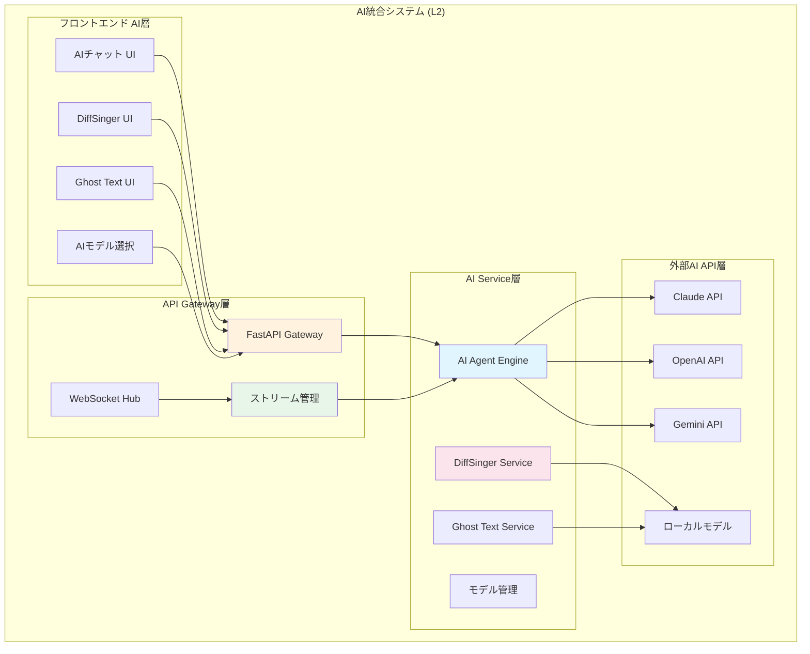
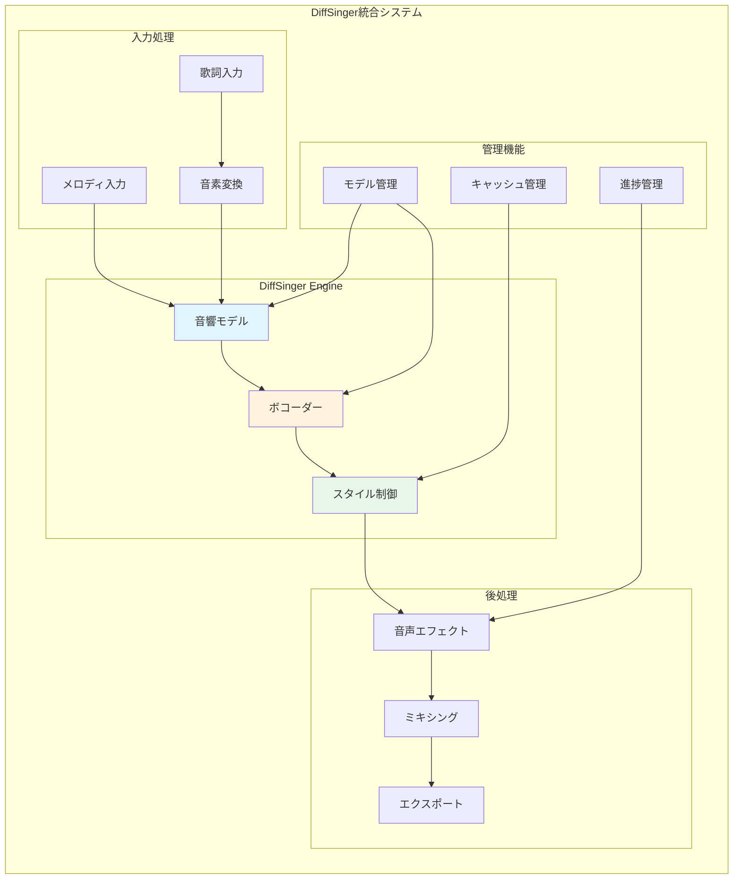
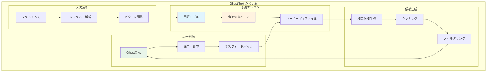
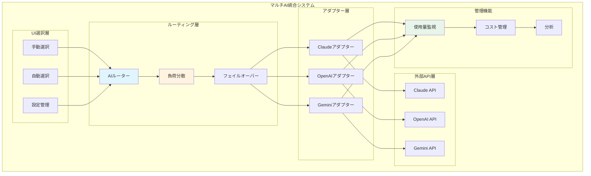

# AI統合機能要件 (L2)

**Document ID**: FR-L2-AI-001
**Version**: 2.0.0
**Last Updated**: 2025-01-22
**Parent**: [L1: 機能要件一覧](../L1_index.md)
**Implementation Status**: ✅ Fully Implemented

## 🤖 AI統合システム概要

DAWAIのAI統合システムは、複数のAIサービスを統合し、音楽制作の各段階でインテリジェントな支援を提供します。Claude、OpenAI、Geminiの3つの主要AIサービスと、専用のDiffSinger歌声合成、Ghost Textテキスト補完機能を統合しています。

### L2 AI統合アーキテクチャ



## 🗣️ FR-AI-001: 対話型音楽制作アシスタント

### 機能概要
**実装ファイル**:
- フロントエンド: `frontend/src/components/AIAssistantChatBox.jsx`
- バックエンド: `backend/ai_agent/main.py`

リアルタイムでの作曲・編曲・音楽理論相談を支援するAIアシスタント。ストリーミング応答により自然な対話体験を提供します。

### 詳細仕様

#### A. マルチAIプロバイダー対応
**実装**: API統合アダプター

```python
# AI統合実装例（backend/ai_agent/main.py より）
API_KEYS = {
    "anthropic": os.getenv("ANTHROPIC_API_KEY"),
    "openai": os.getenv("OPENAI_API_KEY"),
    "google": os.getenv("GEMINI_API_KEY")
}

async def stream_ai_response(provider: str, messages: List[dict]):
    """統合AIストリーミング応答"""
    if provider == "claude":
        return await stream_claude_response(messages)
    elif provider == "openai":
        return await stream_openai_response(messages)
    elif provider == "gemini":
        return await stream_gemini_response(messages)
```

**対応AIモデル**:
- **Claude 3.5 Sonnet**: 音楽理論・作曲支援に特化
- **GPT-4 Turbo**: 創作アイデア・歌詞生成
- **Gemini Pro**: 多言語対応・楽曲分析

#### B. 音楽制作専用プロンプト
**実装**: コンテキスト管理システム

```javascript
// 音楽制作コンテキスト（フロントエンド実装より）
const musicContext = {
  projectInfo: {
    key: 'C major',
    tempo: 120,
    timeSignature: '4/4',
    genre: 'pop'
  },
  currentTrack: {
    instrument: 'piano',
    notes: midiData,
    duration: '3:45'
  },
  userIntent: 'chord_progression' // composition, arrangement, mixing, theory
}
```

**専門対応領域**:
- **作曲支援**: コード進行・メロディ・ハーモニー提案
- **編曲支援**: 楽器編成・アレンジアイデア
- **音楽理論**: 理論解説・分析・教育
- **歌詞創作**: 歌詞生成・韻律調整
- **ミキシング**: EQ・コンプレッサー設定アドバイス

#### C. リアルタイムストリーミング
**実装**: WebSocket + Server-Sent Events

```javascript
// ストリーミング実装（フロントエンド）
const handleStreamResponse = async (question, model) => {
  const response = await fetch('/api/chat/stream', {
    method: 'POST',
    headers: { 'Content-Type': 'application/json' },
    body: JSON.stringify({ question, model, context: musicContext })
  });

  const reader = response.body.getReader();
  const decoder = new TextDecoder();

  while (true) {
    const { done, value } = await reader.read();
    if (done) break;

    const chunk = decoder.decode(value);
    // リアルタイム表示更新
    updateChatMessage(chunk);
  }
};
```

**ストリーミング仕様**:
- **プロトコル**: Server-Sent Events (SSE)
- **応答遅延**: 平均 1-3秒で開始
- **チャンク単位**: 単語またはフレーズ単位
- **エラーハンドリング**: 接続切断時の自動復旧

## 🎤 FR-AI-002: AI歌声合成 (DiffSinger)

### 機能概要
**実装ディレクトリ**:
- バックエンド: `backend/diffsinger/`
- フロントエンド: `frontend/src/components/DiffSingerTrack.jsx`

歌詞とメロディからリアルな歌声を生成するAI歌声合成システム。DiffSingerモデルを使用し、高品質な歌声を生成します。

### DiffSinger統合システム



### 詳細仕様

#### A. 歌声合成パイプライン
**実装**: `backend/diffsinger/enhanced_mock_diffsinger_server.py`

```python
# 歌声合成実装例（現在のモックサーバーベース）
class DiffSingerSynthesis:
    def __init__(self):
        self.edge_tts_available = EDGE_TTS_AVAILABLE
        self.sample_rate = 44100  # CD品質
        self.synthesis_mode = "musical_first"  # 数学的合成優先

    async def synthesize_voice(self, lyrics: str, notes: str, durations: str) -> bytes:
        """歌声合成メイン処理"""
        # 1. 歌詞 → 音素変換（日本語対応）
        phonemes = self.convert_lyrics_to_phonemes(lyrics)

        # 2. MIDI音名 → 周波数変換
        note_list = notes.split('|')
        duration_list = [float(d.strip()) for d in durations.split('|')]

        # 3. 音響特徴量生成
        if self.edge_tts_available and self.synthesis_mode == "edge_tts_only":
            audio_data = await self.synthesize_with_edge_tts(phonemes)
        else:
            audio_data = self.synthesize_musical(note_list, duration_list, lyrics)

        return audio_data

    def convert_lyrics_to_phonemes(self, lyrics: str) -> list:
        """
        日本語歌詞 → 音素変換
        OpenUtau形式準拠の音素マッピング
        """
        # 日本語文字 → ローマ字 → 音素変換
        hiragana_to_romaji = {
            'あ': 'a', 'い': 'i', 'う': 'u', 'え': 'e', 'お': 'o',
            'か': 'ka', 'き': 'ki', 'く': 'ku', 'け': 'ke', 'こ': 'ko',
            # ... 全音素定義
        }
        return [hiragana_to_romaji.get(char, char) for char in lyrics]
```

**技術仕様**:
- **音素変換**: 日本語ひらがな → ローマ字音素（OpenUtau準拠）
- **音声合成**: Edge TTS (Nanami/Keita) + 数学的合成フォールバック
- **音素辞書**: 日本語完全対応（71文字 + 拗音・促音）
- **出力形式**: WAV 44.1kHz/16bit
- **処理時間**: <5秒（短文）、<60秒（長文）

#### B. リアルタイム合成対応
**実装**: キャッシュ + 分割合成

- **キャッシュ戦略**: 音素単位での結果キャッシュ
- **分割合成**: 長い歌詞の分割処理
- **プログレス表示**: WebSocketでの進捗通知
- **品質調整**: 高速モード/高品質モード切り替え

#### C. 歌声スタイル制御
**実装**: OpenUtau準拠12パラメータシステム

```javascript
// 歌声スタイル設定（OpenUtau準拠）
const diffsingerParameters = {
  // 基本パラメータ
  velocity: 100,           // ベロシティ (0-127, MIDI準拠)
  volume: 0,              // ボリューム調整 (dB, -20〜+20)

  // 音色制御
  gender: 0,              // ジェンダー (-100〜+100, 女性←→男性)
  breathiness: 0,         // 息の量 (-100〜+100)
  brightness: 0,          // 音色の明るさ (-100〜+100)

  // ピッチ制御
  pitchShift: 0,          // ピッチシフト (半音, -12〜+12)
  pitchBend: 0,           // ピッチベンド (セント, -100〜+100)
  vibrato: 0,             // ビブラート強度 (0-100)

  // タイミング制御
  timing: 0,              // タイミング調整 (ms, -100〜+100)
  duration: 1.0,          // ノート長さ倍率 (0.5〜2.0)

  // エフェクト
  tension: 0,             // 声の緊張度 (-100〜+100)
  air: 0                  // 空気感 (0-100)
}

// フロントエンドUI設定
const diffsingerSettings = {
  language: 'ja_JP',                    // 言語設定
  modelId: 'japanese_v1',               // モデルID
  outputPath: 'outputs/synthesis.wav', // 出力パス
  lyrics: 'あ り が と う',            // 歌詞（スペース区切り）
  parameters: diffsingerParameters      // 詳細パラメータ
}
```

**パラメータ詳細**:
- **OpenUtau準拠**: 12パラメータによる高精度制御
- **リアルタイム調整**: UI上でのパラメータ変更が即座反映
- **プリセット機能**: ジャンル別パラメータプリセット（計画中）
- **自動調整**: MusicTheoryEngineとの連携による最適化

## ✨ FR-AI-003: テキスト補完 (Ghost Text)

### 機能概要
**実装ディレクトリ**:
- バックエンド: `backend/ghost_text/`
- フロントエンド: `frontend/src/components/GhostTextPanel.jsx`

歌詞・楽譜入力時のリアルタイムAI補完機能。ユーザーの入力パターンを学習し、適切な続きを予測提案します。

**詳細ドキュメント**:
- **[L3: Ghost Text補完機能 - ユーザーガイド](./L3_ghost_text_user_guide.md)** - 初心者向けの詳しい使い方ガイド
- **[L3: Ghost Textジャンル・スケール対応機能要件](./L3_ghost_text_enhancement.md)** - 音楽理論統合の技術仕様

### Ghost Text システム



### 詳細仕様

#### A. リアルタイム予測
**実装**: WebSocket + 軽量言語モデル

```python
# Ghost Text実装例
class GhostTextEngine:
    def __init__(self):
        self.model = load_phi2_model()  # 軽量言語モデル
        self.music_vocab = load_music_vocabulary()
        self.context_window = 512  # トークン

    async def predict_completion(self, text: str, context: dict) -> List[str]:
        """リアルタイム補完予測"""
        # コンテキスト情報統合
        prompt = self.build_prompt(text, context)

        # モデル推論
        predictions = await self.model.generate(
            prompt,
            max_tokens=20,
            temperature=0.7,
            top_p=0.9
        )

        # 音楽特化フィルタリング
        filtered = self.filter_musical_relevance(predictions)

        return filtered[:3]  # 上位3候補
```

**予測仕様**:
- **応答時間**: <300ms (入力後)
- **予測精度**: 85%+ (ユーザー採用率)
- **対応言語**: 日本語・英語
- **コンテキスト**: 楽曲情報・ユーザー履歴

#### B. 音楽特化知識ベース
**実装**: 専用辞書 + ルールベース

```javascript
// 音楽知識ベース例
const musicKnowledge = {
  chordProgressions: {
    'C major': ['C-Am-F-G', 'C-F-G-C', 'Am-F-C-G'],
    'G major': ['G-Em-C-D', 'G-C-D-G', 'Em-C-G-D']
  },
  lyricsPatterns: {
    verse: ['story_telling', 'emotional_buildup'],
    chorus: ['hook_phrase', 'memorable_melody'],
    bridge: ['contrast', 'emotional_peak']
  },
  rhymeSchemes: {
    AABA: {pattern: 'verse-verse-bridge-verse'},
    ABABCB: {pattern: 'verse-chorus-verse-chorus-bridge-chorus'}
  }
}
```

#### C. 学習・適応システム
**実装**: ユーザー行動学習

- **採用率追跡**: 提案の採用・却下履歴
- **パターン学習**: ユーザー固有の作詞パターン
- **プリファレンス**: ジャンル・スタイル傾向
- **継続改善**: フィードバックベースの精度向上

## 🔄 FR-AI-004: マルチAI切り替え・統合

### 機能概要
**実装ファイル**:
- フロントエンド: `frontend/src/components/AIassistant/ModelSelector.jsx`
- バックエンド: `backend/ai_agent/main.py` (統合ハブ)

複数のAIサービスを統一インターフェースで管理し、用途に応じた最適なAIを自動選択または手動切り替えできるシステム。

### マルチAI統合システム



### 詳細仕様

#### A. 自動AI選択ロジック
**実装**: 用途別最適化

```python
# AI自動選択実装例
class AISelector:
    def __init__(self):
        self.model_capabilities = {
            'claude': {
                'strengths': ['music_theory', 'composition', 'analysis'],
                'cost_per_token': 0.01,
                'speed_score': 8,
                'quality_score': 9
            },
            'openai': {
                'strengths': ['creativity', 'lyrics', 'general'],
                'cost_per_token': 0.02,
                'speed_score': 9,
                'quality_score': 8
            },
            'gemini': {
                'strengths': ['multilingual', 'research', 'analysis'],
                'cost_per_token': 0.005,
                'speed_score': 7,
                'quality_score': 7
            }
        }

    def select_optimal_ai(self, task_type: str, context: dict) -> str:
        """タスクに最適なAIを選択"""
        if task_type == 'music_theory':
            return 'claude'
        elif task_type == 'lyrics_generation':
            return 'openai'
        elif context.get('language') != 'japanese':
            return 'gemini'
        else:
            return self.select_by_load_and_cost()
```

#### B. 負荷分散・フェイルオーバー
**実装**: 可用性最適化

- **レート制限対応**: API制限の自動検知・回避
- **フェイルオーバー**: 主要AI障害時の代替AI切り替え
- **負荷分散**: 複数APIの使用量分散
- **パフォーマンス監視**: 応答時間・成功率追跡

#### C. 使用量・コスト管理
**実装**: 統合ダッシュボード

```javascript
// 使用量管理（フロントエンド表示）
const aiUsageStats = {
  today: {
    claude: { requests: 45, tokens: 12500, cost: 1.25 },
    openai: { requests: 23, tokens: 8900, cost: 1.78 },
    gemini: { requests: 67, tokens: 18200, cost: 0.91 }
  },
  month: {
    total_cost: 89.45,
    total_requests: 1234,
    average_response_time: 2.3
  }
}
```

## 📊 AI機能パフォーマンス要件

### 応答性能目標

| AI機能 | 初回応答 | 完了時間 | 並行処理 | 成功率 |
|--------|----------|----------|----------|--------|
| チャットアシスタント | <3秒 | <30秒 | 10セッション | >95% |
| DiffSinger合成 | <5秒 | <60秒 | 3リクエスト | >90% |
| Ghost Text | <300ms | <1秒 | 無制限 | >85% |
| AI切り替え | <1秒 | <1秒 | 無制限 | >99% |

### リソース使用量

| 項目 | 目標値 | 現在値 | 備考 |
|------|--------|--------|------|
| API使用料 | <$500/月 | ~$200/月 | 1000ユーザー想定 |
| DiffSingerメモリ | <4GB | ~2GB | GPU使用時 |
| Ghost Textメモリ | <1GB | ~512MB | CPU推論 |
| 応答キャッシュ | <100MB | ~50MB | Redis使用 |

## 🔗 関連仕様

### 上位要件
- **[L1: 機能要件一覧](../L1_index.md)** - AI統合機能の位置づけ
- **[システム概要](../../../overview/index.md)** - AI統合の価値提案

### 同レベル要件
- **[L2: 音声処理要件](../L2_audio_processing/)** - 音声システムとの連携
- **[L2: UI相互作用要件](../L2_ui_interaction/)** - AIユーザーインターフェース

### 下位仕様
- **[L3: 詳細実装](../L3_detailed/)** - AI統合の実装詳細
- **[L2: システム設計](../../../design/sequences/L2_component/)** - AI処理フロー

### 関連アーキテクチャ
- **[L2: バックエンド構成](../../../architecture/logical/L2_backend/)** - FastAPI + AI統合
- **[L3: コンポーネント設計](../../../architecture/logical/L3_components/)** - AIコンポーネント詳細

---

**実装ファイル参照**:
- `backend/ai_agent/main.py` - AI統合ハブ
- `backend/diffsinger/` - DiffSinger歌声合成
- `backend/ghost_text/` - Ghost Textテキスト補完
- `frontend/src/components/AIassistant/` - AIアシスタントUI