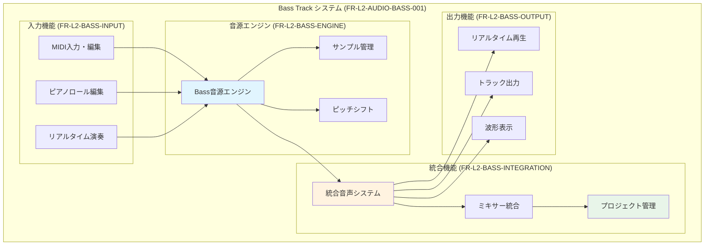

# Bass Track機能要件 (L2)

**Document ID**: FR-L2-AUDIO-BASS-001
**Version**: 1.0.0
**Last Updated**: 2025-10-05
**Parent**: [L2: 音声処理機能要件](./index.md)
**Implementation Status**: 🔄 実装準備中

## 🎸 Bass Track機能概要

Bass Trackは、低音域楽器専用のトラック機能として、ピアノトラック機能と同等のロジックを使用し、MuseScore_General音源のbassサンプルを使用したリアルタイム演奏・MIDI編集機能を提供します。

### Bass Track機能スコープ



## 📋 機能要件詳細

### FR-L2-BASS-INPUT: Bass入力機能要件

#### FR-L2-BASS-INPUT-001: MIDI入力・編集
```yaml
要件ID: FR-L2-BASS-INPUT-001
優先度: HIGH
実装状況: 未実装

機能概要:
  - Bass音域 (MIDI 24-60, C1-C4) での MIDI入力・編集
  - ピアノロールエディタでの直感的な操作
  - Piano Track同等のノート操作 (追加・編集・削除・移動・コピー)

詳細仕様:
  対象音域:
    - 実装範囲: MIDI 24-60 (C1-C4)
    - 主要範囲: MIDI 28-55 (E1-G3)
    - サンプル範囲: MIDI 41-62 (F2-D4)

  操作機能:
    - ノート追加: クリック・ドラッグ
    - ノート編集: 長さ・ピッチ・ベロシティ変更
    - ノート削除: 選択・削除
    - ノート移動: ドラッグ&ドロップ
    - 複数選択: Shift/Ctrl + クリック
    - コピー&ペースト: Ctrl+C/Ctrl+V

  入力検証:
    - MIDI値範囲チェック (0-127)
    - ベロシティ範囲チェック (1-127)
    - 重複ノート処理
```

#### FR-L2-BASS-INPUT-002: リアルタイム演奏入力
```yaml
要件ID: FR-L2-BASS-INPUT-002
優先度: MEDIUM
実装状況: 未実装

機能概要:
  - MIDIキーボード・マウスクリックによるリアルタイム演奏
  - 演奏内容の自動記録・再生
  - クリック・タップレスポンス20ms以内

詳細仕様:
  入力ソース:
    - MIDIキーボード (Web MIDI API)
    - 仮想キーボード (マウス・タッチ)
    - コンピューターキーボード (キーマッピング)

  演奏記録:
    - リアルタイム記録ON/OFF
    - クオンタイズ設定 (1/4, 1/8, 1/16音符)
    - メトロノーム同期
    - オーバーダブ録音対応

  レスポンス要件:
    - 入力遅延: 20ms以内
    - 音声出力遅延: 20ms以内
    - UI反応遅延: 16ms以内 (60FPS)
```

### FR-L2-BASS-ENGINE: Bass音源エンジン要件

#### FR-L2-BASS-ENGINE-001: Bass音源サンプル管理
```yaml
要件ID: FR-L2-BASS-ENGINE-001
優先度: CRITICAL
実装状況: 未実装

機能概要:
  - MuseScore_General bass音源サンプル (8ファイル) の管理
  - 高品質オーディオバッファ管理
  - 非同期サンプルロード・キャッシュ管理

サンプル構成:
  ファイルパス: /sounds/MuseScore_General/samples/bass/
  サンプル詳細:
    - Bass B2.wav  (MIDI 47, 123.47Hz)
    - Bass B3.wav  (MIDI 59, 246.94Hz)
    - Bass D3.wav  (MIDI 50, 146.83Hz)
    - Bass D4.wav  (MIDI 62, 293.66Hz)
    - Bass F2.wav  (MIDI 41, 87.31Hz)
    - Bass F3.wav  (MIDI 53, 174.61Hz)
    - Bass G#2.wav (MIDI 44, 103.83Hz)
    - Bass G#3.wav (MIDI 56, 207.65Hz)

技術仕様:
  音声形式: WAVファイル、44.1kHz/16bit推奨
  ロード時間: 3秒以内 (全サンプル)
  メモリ使用量: 50MB以内
  キャッシュ: ブラウザメモリ永続化
```

#### FR-L2-BASS-ENGINE-002: ピッチシフト・サンプル選択
```yaml
要件ID: FR-L2-BASS-ENGINE-002
優先度: HIGH
実装状況: 未実装

機能概要:
  - 最近接サンプル選択アルゴリズム
  - 高品質ピッチシフト (Web Audio API)
  - Bass音域最適化チューニング

技術仕様:
  サンプル選択:
    - 最近接MIDI音程選択
    - ピッチシフト範囲: ±12セミトーン
    - 低音域品質保持優先

  ピッチシフト:
    - アルゴリズム: Web Audio detune
    - 精度: セント単位 (1セミトーン=100セント)
    - 品質: Bass音域特化調整

  パフォーマンス:
    - CPU使用率: 10%以下 (アイドル時)
    - 処理遅延: 5ms以内
    - 同時発音数: 8和音以上
```

#### FR-L2-BASS-ENGINE-003: Bass音源再生エンジン
```yaml
要件ID: FR-L2-BASS-ENGINE-003
優先度: CRITICAL
実装状況: 未実装

機能概要:
  - マルチノート同時再生 (ポリフォニック)
  - ノート開始・停止・ベロシティ制御
  - Piano Engine同等の再生品質

技術仕様:
  再生機能:
    - 同時発音数: 無制限 (実質8-16和音)
    - ベロシティ対応: 127段階
    - ノート長: 可変長対応
    - リリース制御: 自然なフェードアウト

  音質制御:
    - マスター音量: 0-100%
    - トラック音量: 0-200%
    - ミュート・ソロ機能
    - Pan (L/R) 制御

  統合要件:
    - unifiedAudioSystem.js 統合
    - Tone.js エンジン活用
    - Web Audio API 直接制御
```

### FR-L2-BASS-INTEGRATION: システム統合要件

#### FR-L2-BASS-INTEGRATION-001: 統合音声システム連携
```yaml
要件ID: FR-L2-BASS-INTEGRATION-001
優先度: CRITICAL
実装状況: 未実装

機能概要:
  - unifiedAudioSystem.js への Bass Engine登録
  - 他トラック (Piano, Drum, DiffSinger) との同期再生
  - マスターミキサー統合

統合仕様:
  エンジン登録:
    - engine_type: 'melodic'
    - track_type: 'bass'
    - インターフェース: playNote, stopNote, setVolume

  同期再生:
    - トラック間同期: サンプル精度
    - テンポ同期: BPM変更対応
    - 再生制御: 一括play/pause/stop

  ミキサー統合:
    - チャンネルストリップ: 専用Bass チャンネル
    - EQ・エフェクト: 基本EQ搭載
    - バス送信: リバーブ・ディレイ対応
```

#### FR-L2-BASS-INTEGRATION-002: プロジェクト管理統合
```yaml
要件ID: FR-L2-BASS-INTEGRATION-002
優先度: HIGH
実装状況: 未実装

機能概要:
  - ProjectManager.js Bass Track対応
  - プロジェクト保存・読み込み
  - トラックエクスポート・インポート

実装仕様:
  データ構造:
    - track_type: 'bass'
    - notes: MIDI Note Array
    - settings: Bass固有設定
    - automation: 音量・Pan・エフェクト

  永続化:
    - localStorage 自動保存
    - JSON エクスポート対応
    - プロジェクトファイル統合

  トラック操作:
    - Bass Track追加・削除
    - トラック複製・移動
    - トラック設定変更
```

### FR-L2-BASS-OUTPUT: 出力機能要件

#### FR-L2-BASS-OUTPUT-001: リアルタイム再生
```yaml
要件ID: FR-L2-BASS-OUTPUT-001
優先度: CRITICAL
実装状況: 未実装

機能概要:
  - リアルタイム Bass音源再生
  - 低遅延オーディオ出力
  - 高品質Bass音響特性

技術仕様:
  出力品質:
    - サンプルレート: 44.1kHz
    - ビット深度: 16bit以上
    - 周波数特性: 20Hz-20kHz
    - Bass強化: 60-250Hz領域最適化

  遅延要件:
    - 総遅延: 20ms以内
    - バッファサイズ: 128-512サンプル
    - プロセシング遅延: 5ms以内

  出力制御:
    - リアルタイム音量調整
    - 即座のミュート・ソロ
    - クロスフェード対応
```

## 🔧 技術制約・前提条件

### システム要件
```yaml
ブラウザ要件:
  - Chrome 90+ / Firefox 88+ / Safari 14+
  - Web Audio API 完全対応
  - Web MIDI API 対応 (Chrome)
  - ES2020+ JavaScript 対応

パフォーマンス要件:
  - CPU: 2GHz dual-core 以上
  - RAM: 4GB 以上
  - オーディオ: 低遅延オーディオデバイス推奨
  - ネットワーク: 音源ロード用 (初回のみ)

開発環境:
  - React 18.3.1+
  - Vite 6.3.5
  - Tone.js 15.1.22
  - Web Audio API
```

### 依存関係
```yaml
必須依存:
  - unifiedAudioSystem.js (音声システム統合)
  - ProjectManager.js (プロジェクト管理)
  - EnhancedMidiEditor.jsx (MIDI編集UI)
  - Tone.js (音声処理ライブラリ)

音源ファイル:
  - /sounds/MuseScore_General/samples/bass/*.wav (8ファイル)
  - 総サイズ: 約30-50MB
  - ライセンス: MuseScore General準拠

UI コンポーネント:
  - Piano Track UI パターン継承
  - Shadcn/ui コンポーネント活用
  - Tailwind CSS スタイリング
```

## 📊 受け入れ基準

### 機能受け入れ基準
```yaml
必須機能 (MUST HAVE):
  ✅ Bass音域 (C1-C4) での MIDI入力・編集
  ✅ 8つのBass音源サンプル正常ロード・再生
  ✅ ピアノロールエディタでのBass音域表示・編集
  ✅ 他トラックとの同期再生
  ✅ プロジェクト保存・読み込み対応

推奨機能 (SHOULD HAVE):
  ✅ MIDIキーボード入力対応
  ✅ リアルタイム演奏記録
  ✅ Bass音域最適化UI
  ✅ Bass専用エフェクト

希望機能 (COULD HAVE):
  ✅ Bass Tab譜表示
  ✅ Bass奏法エミュレーション
  ✅ Bass音源選択 (複数音源)
```

### 品質受け入れ基準
```yaml
パフォーマンス:
  - 音源ロード時間: 3秒以内
  - 再生遅延: 20ms以内
  - CPU使用率: 10%以下 (アイドル時)
  - メモリ使用量: 50MB以下 (Bass Track追加時)

品質:
  - ユニットテストカバレッジ: 95%以上
  - E2Eテスト: 全シナリオ通過
  - クロスブラウザ: Chrome/Firefox/Safari対応
  - 長時間動作: メモリリーク無し (4時間以上)

ユーザビリティ:
  - 学習コストなし: Piano Track経験者即座利用可能
  - 直感的操作: 説明なしで基本操作理解
  - エラー回復: 操作ミス時の適切な回復方法提供
```

## 🧪 テスト要件

### テスト戦略
```yaml
ユニットテスト:
  - SampledBassEngine: 音源ロード・再生・制御
  - useBassAudio: React フック動作
  - BassTrack: コンポーネント描画・イベント

統合テスト:
  - unifiedAudioSystem 統合
  - ProjectManager Bass Track対応
  - 他トラックとの同期再生

E2Eテスト:
  - Bass Track作成・編集・再生ワークフロー
  - プロジェクト保存・読み込み
  - 長時間使用安定性テスト
  - クロスブラウザ互換性テスト
```

### テストケース例
```yaml
TC-BASS-001: Bass Track作成・基本操作
  前提: DAWAI アプリケーション起動済み
  操作:
    1. "Add Track" → "Bass Track" 選択
    2. Bass Track UI表示確認
    3. ピアノロールでF2音域クリック
    4. Bass音再生確認
  期待結果:
    - Bass Track UI正常表示
    - F2 Bass音源正常再生
    - ノート正確配置

TC-BASS-002: 複数ノート同時再生
  前提: Bass Track作成済み
  操作:
    1. E1, A1, D2, G2 ノード配置
    2. 再生ボタンクリック
  期待結果:
    - 4音同時再生
    - 音の干渉・歪みなし
    - UI反応正常
```

---

**実装優先度**: CRITICAL - 音声処理コア機能
**リスクレベル**: LOW - Piano Track実装パターン活用
**推定工数**: 1.5日 (設計0.5日 + 実装1日)
**期待効果**: Bass音域演奏機能追加により楽曲制作表現力大幅向上