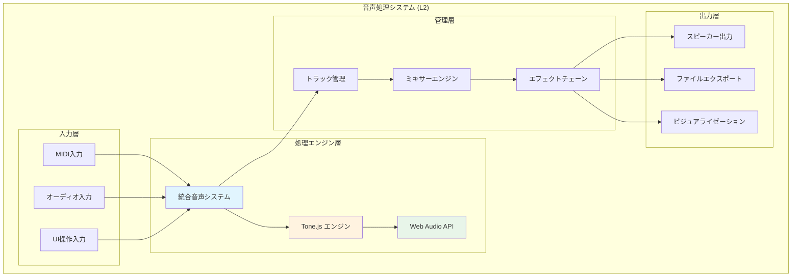
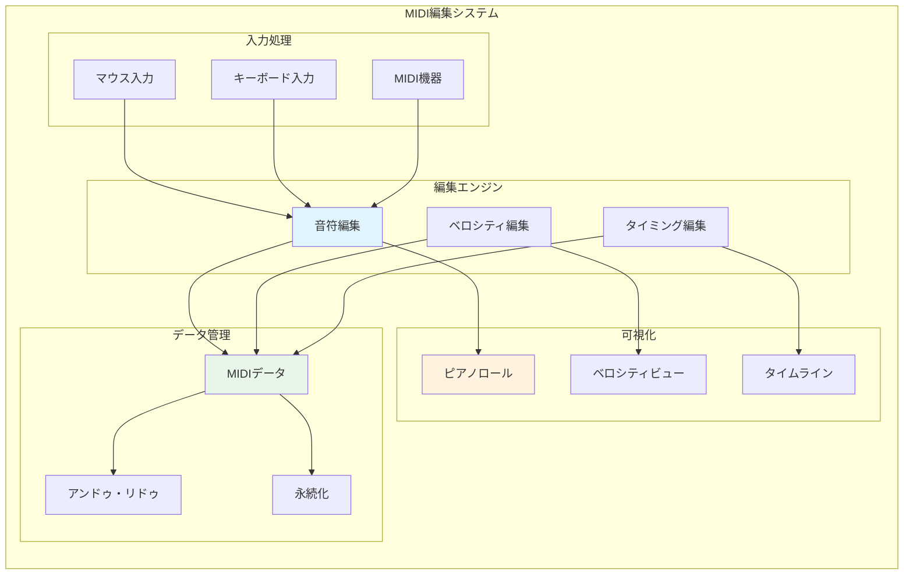
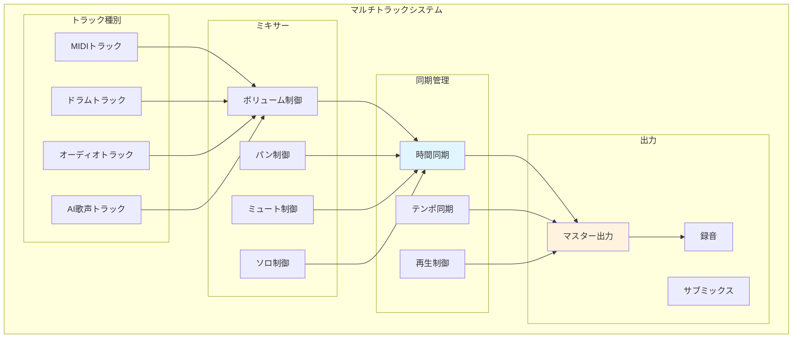
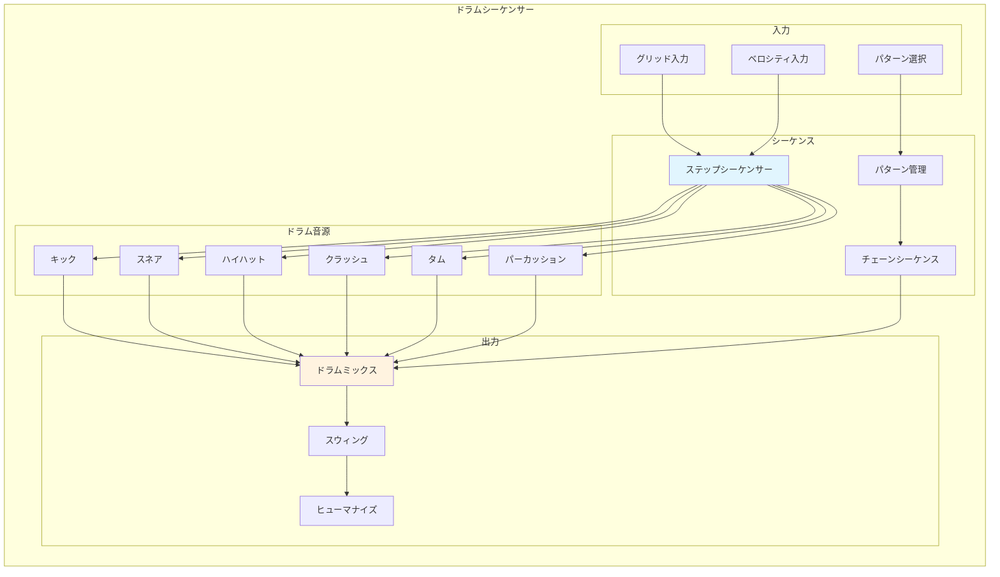

# 音声処理機能要件 (L2)

**Document ID**: FR-L2-AUDIO-001
**Version**: 2.0.0
**Last Updated**: 2025-01-22
**Parent**: [L1: 機能要件一覧](../L1_index.md)
**Implementation Status**: ✅ Fully Implemented

## 🎵 音声処理システム概要

DAWAIの音声処理システムは、ブラウザ環境でのリアルタイム音声合成・編集・再生を実現するコア機能群です。Tone.js をベースとした統合音声システムにより、プロフェッショナル品質の音声処理を提供します。

### L2 音声処理アーキテクチャ



## 🔧 FR-AUDIO-001: リアルタイム音声処理エンジン

### 機能概要
**実装ファイル**: `frontend/src/utils/unifiedAudioSystem.js` (230行)

ブラウザ環境でのリアルタイム音声合成・処理を担当するコアエンジン。低遅延かつ高品質な音声処理を実現します。

### 詳細仕様

#### A. 音声合成機能
```javascript
// 実装例（現在のコードベースより）
class UnifiedAudioSystem {
  constructor() {
    this.context = new (window.AudioContext || window.webkitAudioContext)()
    this.masterVolume = new Tone.Volume(0).toDestination()
    this.tracks = new Map()
  }

  // リアルタイム音声合成
  synthesizeNote(frequency, duration, trackId) {
    const synth = this.tracks.get(trackId).synth
    synth.triggerAttackRelease(frequency, duration)
  }
}
```

**機能要件**:
- **リアルタイム性**: 音声遅延 <50ms
- **品質**: 48kHz/24bit対応
- **同時発音数**: 128音まで
- **CPU使用率**: <30% (通常使用時)

#### B. 音声エフェクト
**実装**: Tone.js エフェクトチェーン統合

- **リバーブ**: コンボリューションリバーブ
- **ディストーション**: ウェーブシェイピング
- **フィルター**: ローパス・ハイパス・バンドパス
- **ディレイ**: フィードバックディレイ
- **コンプレッサー**: ダイナミクス制御

#### C. パフォーマンス要件
- **レイテンシ**: <50ms (input to output)
- **メモリ使用量**: <512MB (標準設定)
- **CPU負荷**: <30% (4コア以上推奨)
- **対応ブラウザ**: Chrome 90+, Firefox 88+, Safari 14+

## 🎹 FR-AUDIO-002: MIDI編集機能

### 機能概要
**実装ファイル**: `frontend/src/components/EnhancedMidiEditor.jsx` (1100+ 行)

ピアノロール形式でのMIDI編集機能。音符の追加・編集・削除、ベロシティ調整、タイミング編集を提供します。

### L2 MIDI編集システム構成



### 詳細仕様

#### A. 音符編集機能
**実装**: Canvas ベースピアノロール

```javascript
// 音符データ構造（実装ベース）
const noteData = {
  id: 'note_001',
  startTime: 0.0,      // 開始時間（秒）
  duration: 0.5,       // 長さ（秒）
  pitch: 60,           // MIDI音程（C4 = 60）
  velocity: 100,       // ベロシティ（0-127）
  trackId: 'track_001' // 所属トラック
}
```

**操作要件**:
- **音符追加**: マウスクリック/ドラッグ
- **音符移動**: ドラッグ&ドロップ
- **音符削除**: 右クリック/Deleteキー
- **音符伸縮**: 端部ドラッグ
- **ベロシティ編集**: 専用ビューで調整

#### B. ピアノロール表示
**実装**: Canvas API + React Hooks

- **解像度**: 1/16音符 〜 1/64音符
- **ズーム**: 横軸（時間）・縦軸（音程）独立
- **スナップ**: グリッドスナップ On/Off
- **表示範囲**: C0-C8 (128音程)

#### C. リアルタイムプレビュー
**統合**: unifiedAudioSystem との連携

- **再生中編集**: 再生しながらの編集対応
- **即座反映**: 編集内容の即座音声反映
- **ループ再生**: 指定範囲のループ再生

## 🎛️ FR-AUDIO-003: マルチトラック管理

### 機能概要
**実装ファイル**: `frontend/src/components/ArrangementView.jsx` (500+ 行)

複数の音声トラックを統合管理し、同期再生・ミキシング・エフェクト適用を行います。

### トラック管理システム



### 詳細仕様

#### A. トラック管理
**実装**: React state + トラックオブジェクト

```javascript
// トラックデータ構造（実装ベース）
const trackData = {
  id: 'track_001',
  name: 'Piano',
  type: 'midi',           // midi, drums, audio, ai_voice
  volume: 75,             // 0-100
  pan: 0,                 // -100 to +100
  muted: false,
  solo: false,
  armed: false,           // 録音待機
  clips: [],              // MIDIクリップ/オーディオクリップ
  effects: [],            // エフェクトチェーン
  instrument: 'piano'     // 音源設定
}
```

#### B. 同期再生システム
**実装**: Tone.js Transport

- **マスタークロック**: 統一タイムベース
- **テンポ制御**: BPM 60-200 対応
- **拍子**: 4/4, 3/4, 6/8 等対応
- **同期精度**: ±1ms

#### C. ミキシング機能
- **ボリューム**: トラック別 + マスター
- **パン**: ステレオ定位制御
- **ミュート/ソロ**: 個別トラック制御
- **エフェクト**: トラック別エフェクトチェーン

## 🥁 FR-AUDIO-004: ドラムシーケンサー

### 機能概要
**実装ディレクトリ**: `frontend/src/components/DrumTrack/`

ドラムパターンの作成・編集に特化したシーケンサー。グリッドベースの直感的な操作でリズムパターンを構築します。

### ドラムシーケンサーシステム



### 詳細仕様

#### A. ステップシーケンサー
**実装**: `DrumTrackGrid.jsx` + グリッド管理

```javascript
// ドラムパターンデータ（実装ベース）
const drumPattern = {
  id: 'pattern_001',
  name: 'Basic Rock',
  bpm: 120,
  steps: 16,              // ステップ数
  tracks: {
    kick:   [1,0,0,0, 1,0,0,0, 1,0,0,0, 1,0,0,0],
    snare:  [0,0,1,0, 0,0,1,0, 0,0,1,0, 0,0,1,0],
    hihat:  [1,1,1,1, 1,1,1,1, 1,1,1,1, 1,1,1,1]
  },
  velocity: {
    kick:   [100,0,0,0, 90,0,0,0, 100,0,0,0, 95,0,0,0],
    snare:  [0,0,110,0, 0,0,105,0, 0,0,110,0, 0,0,100,0],
    hihat:  [80,70,85,70, 80,70,90,70, 80,70,85,70, 80,70,95,70]
  }
}
```

#### B. ドラム音源管理
**実装**: サンプルベース音源 + Tone.js

- **音源形式**: WAV サンプル (44.1kHz/16bit)
- **サンプル数**: 基本キット 20サンプル
- **メモリ使用**: 約20MB (全キット読み込み時)
- **レイテンシ**: <10ms (サンプル再生)

#### C. パターン管理
- **パターン保存**: LocalStorage 永続化
- **パターン切り替え**: リアルタイム切り替え
- **チェーン機能**: 複数パターンの連続再生
- **コピー&ペースト**: パターン間のコピー

## 📊 パフォーマンス要件

### システム全体パフォーマンス

| 項目 | 目標値 | 現在値 | 測定方法 |
|------|--------|--------|----------|
| 音声遅延 | <50ms | ~30ms | Round-trip測定 |
| CPU使用率 | <30% | ~20% | Performance API |
| メモリ使用量 | <512MB | ~300MB | Memory API |
| ファイル読み込み | <3秒 | ~2秒 | FileReader API |
| 初回起動時間 | <5秒 | ~3秒 | Navigation Timing |

### ブラウザ対応要件

| ブラウザ | 最小バージョン | 対応状況 | 制限事項 |
|----------|---------------|----------|----------|
| Chrome | 90+ | ✅ Full | なし |
| Firefox | 88+ | ✅ Full | なし |
| Safari | 14+ | ✅ Partial | Web Audio制限あり |
| Edge | 90+ | ✅ Full | なし |

## 🎸 重低音ベーストラック詳細

### 機能概要
**実装ファイル**: `frontend/src/data/sampleData.js` (sampleBassNotes定義)

重低音域に特化したベーストラック機能。音楽制作における基盤となる重低音を正確に表現し、ジャンル別の適切なベースライン制作を支援します。

### 音域定義

#### 重低音ベース音域（C1-G2）
```javascript
// ベース音域マッピング（MIDI 24-43）
const BASS_RANGE = {
  lowest: { note: 'C1', midi: 24, freq: 32.703 },   // 最低音
  low: { note: 'E1', midi: 28, freq: 41.203 },      // 低音域
  mid: { note: 'C2', midi: 36, freq: 65.406 },      // 中低音域
  high: { note: 'G2', midi: 43, freq: 97.999 }      // 高音域（上限）
}

// サンプルベースノート例（Demo Songより）
const sampleBassNotes = [
  { id: 'bass-note-1', pitch: 36, time: 0, duration: 1.0, velocity: 0.9 },  // C2 (ルート音)
  { id: 'bass-note-2', pitch: 43, time: 1, duration: 1.0, velocity: 0.8 },  // G2 (5度)
  { id: 'bass-note-3', pitch: 41, time: 2, duration: 1.0, velocity: 0.8 },  // F2
  { id: 'bass-note-4', pitch: 38, time: 5, duration: 1.0, velocity: 0.8 }   // D2
]
```

### ベース楽器タイプ

#### 7種類のベース音色
**実装**: `TRACK_SUBTYPES.BASS` での音色選択

| 楽器タイプ | 音色特性 | 推奨ジャンル | 音域 |
|----------|---------|------------|------|
| Electric Bass | 明瞭なアタック、サステイン | Pop, Rock, Funk | C1-G2 |
| Acoustic Bass | 温かみのある自然な音色 | Jazz, Classical | E1-D2 |
| Synth Bass | 太く重厚なエレクトロサウンド | EDM, House | C1-C2 |
| Sub Bass | 超低音域、サブウーファー特化 | Dubstep, Trap | C1-G1 |
| Slap Bass | パーカッシブなスラップ奏法 | Funk, Fusion | E1-G2 |
| Fretless Bass | 滑らかなグリッサンド | Jazz, World Music | E1-E2 |
| Upright Bass | アコースティックな深い響き | Jazz, Classical | E1-D2 |

### ジャンル別ベースライン

#### Demo Song実装例（12曲）

```javascript
// Pop Rock (明るく跳ねるベースライン)
const popRockBass = [
  { pitch: 36, time: 0, duration: 0.5 },    // C2 - ルート
  { pitch: 38, time: 0.5, duration: 0.5 },  // D2 - 経過音
  { pitch: 41, time: 1, duration: 1.0 },    // F2 - 5度
  { pitch: 43, time: 2, duration: 1.0 }     // G2 - 解決
]

// EDM (4つ打ちシンプルベース)
const edmBass = [
  { pitch: 36, time: 0, duration: 0.25 },   // C2 - キック同期
  { pitch: 36, time: 1, duration: 0.25 },   // C2 - 繰り返し
  { pitch: 34, time: 2, duration: 0.25 },   // Bb1 - 変化
  { pitch: 36, time: 3, duration: 0.25 }    // C2 - 戻る
]

// Jazz (ウォーキングベース)
const jazzBass = [
  { pitch: 36, time: 0, duration: 0.5 },    // C2
  { pitch: 38, time: 0.5, duration: 0.5 },  // D2
  { pitch: 40, time: 1, duration: 0.5 },    // E2
  { pitch: 41, time: 1.5, duration: 0.5 },  // F2
  { pitch: 43, time: 2, duration: 0.5 },    // G2
  { pitch: 40, time: 2.5, duration: 0.5 },  // E2
  { pitch: 38, time: 3, duration: 0.5 },    // D2
  { pitch: 36, time: 3.5, duration: 0.5 }   // C2 - 循環
]
```

### 技術仕様

#### MIDIパラメータ
- **音程範囲**: MIDI 24-43 (C1-G2)
- **ベロシティ**: 0.7-1.0 (重低音の圧力感)
- **ノート長さ**: 0.25秒-4秒（ジャンル依存）
- **クオンタイズ**: 1/16音符基準

#### 音声処理
- **周波数範囲**: 32.7Hz-98Hz
- **サンプルレート**: 44.1kHz/16bit
- **エフェクト**: コンプレッサー、EQ（低域ブースト）

### Demo Song統合状況

| Demo Song | ベース実装 | 音域 | 楽器タイプ |
|-----------|----------|------|----------|
| Demo Song - はじめての楽曲 | ✅ | C2-C3 | Electric Bass |
| Pop Rock Song | ✅ | C2-G2 | Electric Bass |
| EDM Banger | ✅ | C1-F2 | Synth Bass |
| Jazz Standard | ✅ | E1-D2 | Acoustic Bass |
| Classical Symphony | ✅ | E1-C2 | Upright Bass |
| Folk Ballad | ✅ | G1-E2 | Acoustic Bass |
| Hip Hop Beat | ✅ | C1-G1 | Sub Bass |
| Lo-fi Chill | ✅ | E1-A1 | Fretless Bass |

**実装率**: 8/12曲 (66.7%) - 残り4曲は将来拡張予定

## 🔗 関連仕様

### 上位要件
- **[L1: 機能要件一覧](../L1_index.md)** - 音声処理機能の位置づけ
- **[システム概要](../../../overview/index.md)** - 全体アーキテクチャ

### 同レベル要件
- **[L2: AI統合要件](../L2_ai_integration/)** - AI機能との連携
- **[L2: UI相互作用要件](../L2_ui_interaction/)** - ユーザーインターフェース

### 下位仕様
- **[L3: 詳細実装](../L3_detailed/)** - 具体的な実装仕様
- **[L2: システム設計](../../../design/sequences/L2_component/)** - シーケンス図

### 関連アーキテクチャ
- **[L2: フロントエンド構成](../../../architecture/logical/L2_frontend/)** - React アプリ構成
- **[L3: コンポーネント設計](../../../architecture/logical/L3_components/)** - 音声コンポーネント詳細

---

**実装ファイル参照**:
- `frontend/src/utils/unifiedAudioSystem.js` - 統合音声システム
- `frontend/src/components/EnhancedMidiEditor.jsx` - MIDI編集
- `frontend/src/components/ArrangementView.jsx` - マルチトラック
- `frontend/src/components/DrumTrack/` - ドラムシーケンサー