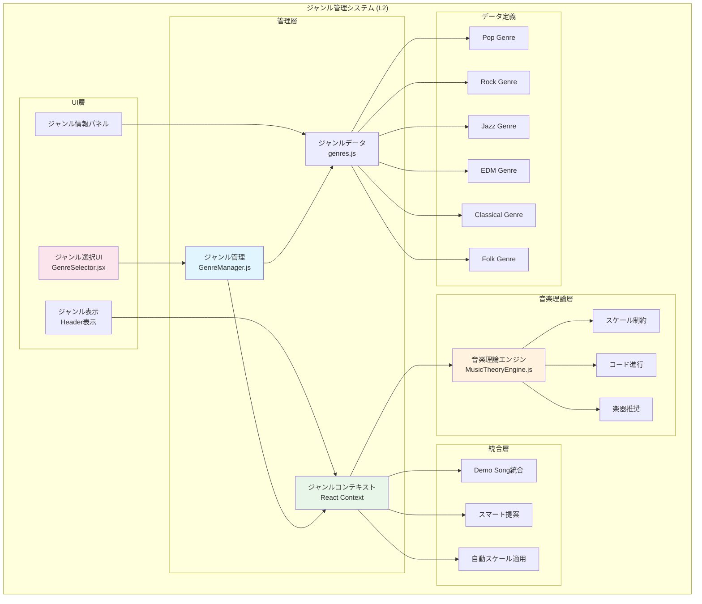

# ジャンル別音楽制作システム要件 (L2)

**Document ID**: FR-L2-GENRE-001
**Version**: 1.0.0
**Last Updated**: 2025-10-10
**Parent**: [L1: 機能要件一覧](../L1_index.md)
**Implementation Status**: ✅ Fully Implemented

## 🎼 ジャンル管理システム概要

DAWAIのジャンル管理システムは、6つの主要音楽ジャンルごとに最適化されたスケール制約、コード進行、楽器推奨を提供します。GenreManagerがジャンルコンテキストを管理し、MusicTheoryEngineと連携して音楽理論的に正確な制作支援を実現します。

### L2 ジャンル管理アーキテクチャ



## 🎵 FR-GENRE-001: ジャンル別音楽制作システム

### 機能概要
**実装ファイル**:
- フロントエンド: `frontend/src/managers/genreManager.js`
- UI: `frontend/src/components/GenreSelector.jsx`
- データ: `frontend/src/data/genres.js`

ジャンルごとに最適化された音楽制作環境を提供し、スケール制約・コード進行・楽器推奨により、音楽理論的に正確でジャンルらしい楽曲制作を支援します。

### 6つの対応ジャンル

#### 1. Pop (ポップミュージック)
**ジャンル定義**:
```javascript
{
  id: 'pop',
  name: { ja: 'ポップ', en: 'Pop' },
  description: '明るくキャッチーなメロディーと親しみやすいコード進行が特徴',
  color: '#3B82F6',
  icon: '🎵',

  // 音楽理論設定
  recommendedScales: ['major', 'minor', 'pentatonic'],
  commonChordProgressions: [
    'I-V-vi-IV',      // C-G-Am-F (最も一般的)
    'I-IV-V-I',       // C-F-G-C (基本進行)
    'vi-IV-I-V',      // Am-F-C-G (感情的)
    'I-vi-IV-V'       // C-Am-F-G (50年代)
  ],

  // 楽器推奨
  recommendedInstruments: ['piano', 'guitar', 'bass', 'drums', 'synth'],

  // テンポ設定
  tempoRange: { min: 100, max: 140, default: 120 },

  // スケール制約設定
  scaleConstraints: {
    enabled: true,
    autoApply: true,
    defaultScale: 'C major',
    allowedNotes: ['C', 'D', 'E', 'F', 'G', 'A', 'B']
  }
}
```

**特徴**:
- **メロディー**: キャッチーで覚えやすい、繰り返しフレーズ多用
- **コード進行**: シンプルで親しみやすい、機能和声重視
- **リズム**: 4/4拍子、明確なビート
- **楽器**: ピアノ・ギター・シンセ中心

#### 2. Rock (ロックミュージック)
**ジャンル定義**:
```javascript
{
  id: 'rock',
  name: { ja: 'ロック', en: 'Rock' },
  description: '力強いギターリフとドライブ感のあるドラムが特徴',
  color: '#EF4444',
  icon: '🎸',

  recommendedScales: ['minor', 'blues', 'pentatonic_minor'],
  commonChordProgressions: [
    'i-VI-VII',       // Am-F-G (ロック進行)
    'I-bVII-IV',      // C-Bb-F (モーダル進行)
    'i-VII-VI-VII',   // Am-G-F-G (循環)
    'I-IV-V-IV'       // C-F-G-F (基本ロック)
  ],

  recommendedInstruments: ['electric_guitar', 'bass', 'drums', 'keyboard'],
  tempoRange: { min: 110, max: 180, default: 140 },

  scaleConstraints: {
    enabled: true,
    autoApply: true,
    defaultScale: 'A minor',
    allowedNotes: ['A', 'B', 'C', 'D', 'E', 'F', 'G']
  }
}
```

**特徴**:
- **メロディー**: パワフルなリフ、ペンタトニックスケール多用
- **コード進行**: パワーコード、モーダル進行
- **リズム**: 強いバックビート、ドライブ感
- **楽器**: エレキギター・ベース・ドラム中心

#### 3. Jazz (ジャズ)
**ジャンル定義**:
```javascript
{
  id: 'jazz',
  name: { ja: 'ジャズ', en: 'Jazz' },
  description: '複雑なコード進行と即興演奏が特徴の洗練された音楽',
  color: '#8B5CF6',
  icon: '🎷',

  recommendedScales: ['major', 'dorian', 'mixolydian', 'altered'],
  commonChordProgressions: [
    'ii-V-I',         // Dm7-G7-Cmaj7 (最重要)
    'I-VI-ii-V',      // Cmaj7-Am7-Dm7-G7 (循環)
    'iii-VI-ii-V',    // Em7-A7-Dm7-G7 (ターンアラウンド)
    'I-iv-VII-III'    // Cmaj7-Fm7-Bb7-Ebmaj7 (クロマチック)
  ],

  recommendedInstruments: ['piano', 'saxophone', 'bass', 'drums', 'trumpet'],
  tempoRange: { min: 80, max: 200, default: 120 },

  scaleConstraints: {
    enabled: true,
    autoApply: false,  // ジャズは複雑なため手動推奨
    defaultScale: 'C major',
    allowedNotes: ['C', 'D', 'E', 'F', 'G', 'A', 'B', 'Db', 'Eb', 'Gb', 'Ab', 'Bb']
  }
}
```

**特徴**:
- **メロディー**: 複雑で洗練、アルペジオ・スケール多用
- **コード進行**: テンション和音、ii-V-I進行
- **リズム**: スウィング・シンコペーション
- **楽器**: サックス・ピアノ・ベース・ドラム

#### 4. EDM (エレクトロニックダンスミュージック)
**ジャンル定義**:
```javascript
{
  id: 'edm',
  name: { ja: 'EDM', en: 'EDM' },
  description: '電子音とビートが支配するダンスミュージック',
  color: '#10B981',
  icon: '🎧',

  recommendedScales: ['minor', 'harmonic_minor', 'phrygian'],
  commonChordProgressions: [
    'i-VI-III-VII',   // Am-F-C-G (EDM進行)
    'i-iv-VII-VI',    // Am-Dm-G-F (ダーク進行)
    'i-III-VII-VI',   // Am-C-G-F (エネルギッシュ)
    'i-VI-IV-V'       // Am-F-D-E (エモーショナル)
  ],

  recommendedInstruments: ['synth', 'bass', 'drums', 'pad', 'lead'],
  tempoRange: { min: 120, max: 140, default: 128 },

  scaleConstraints: {
    enabled: true,
    autoApply: true,
    defaultScale: 'A minor',
    allowedNotes: ['A', 'B', 'C', 'D', 'E', 'F', 'G#']  // ハーモニックマイナー
  }
}
```

**特徴**:
- **メロディー**: シンセリード、反復フレーズ
- **コード進行**: シンプルで繰り返し、ビルドアップ重視
- **リズム**: 4つ打ち、強いキック
- **楽器**: シンセサイザー・ベース・ドラムマシン

#### 5. Classical (クラシック音楽)
**ジャンル定義**:
```javascript
{
  id: 'classical',
  name: { ja: 'クラシック', en: 'Classical' },
  description: '伝統的な和声法と対位法に基づく芸術音楽',
  color: '#F59E0B',
  icon: '🎻',

  recommendedScales: ['major', 'minor', 'harmonic_minor', 'melodic_minor'],
  commonChordProgressions: [
    'I-IV-V-I',       // C-F-G-C (完全終止)
    'I-vi-IV-V',      // C-Am-F-G (古典進行)
    'I-ii-V-I',       // C-Dm-G-C (偽終止)
    'i-iv-V-i'        // Am-Dm-E-Am (マイナー終止)
  ],

  recommendedInstruments: ['piano', 'violin', 'cello', 'flute', 'orchestra'],
  tempoRange: { min: 60, max: 200, default: 90 },

  scaleConstraints: {
    enabled: true,
    autoApply: true,
    defaultScale: 'C major',
    allowedNotes: ['C', 'D', 'E', 'F', 'G', 'A', 'B']
  }
}
```

**特徴**:
- **メロディー**: 優雅で構造的、モチーフ展開
- **コード進行**: 機能和声、対位法
- **リズム**: 多様な拍子・テンポ変化
- **楽器**: オーケストラ楽器（弦・管・打楽器）

#### 6. Folk (フォーク音楽)
**ジャンル定義**:
```javascript
{
  id: 'folk',
  name: { ja: 'フォーク', en: 'Folk' },
  description: '素朴でアコースティックな伝統音楽',
  color: '#84CC16',
  icon: '🪕',

  recommendedScales: ['major', 'minor', 'pentatonic', 'mixolydian'],
  commonChordProgressions: [
    'I-V-vi-IV',      // C-G-Am-F (シンプル進行)
    'I-IV-I-V',       // C-F-C-G (伝統進行)
    'I-vi-ii-V',      // C-Am-Dm-G (循環)
    'I-V-IV-I'        // C-G-F-C (基本)
  ],

  recommendedInstruments: ['acoustic_guitar', 'banjo', 'mandolin', 'violin', 'harmonica'],
  tempoRange: { min: 80, max: 120, default: 100 },

  scaleConstraints: {
    enabled: true,
    autoApply: true,
    defaultScale: 'C major',
    allowedNotes: ['C', 'D', 'E', 'F', 'G', 'A', 'B']
  }
}
```

**特徴**:
- **メロディー**: 素朴で親しみやすい、口承伝統
- **コード進行**: シンプルで覚えやすい
- **リズム**: 自然なテンポ、3拍子多用
- **楽器**: アコースティックギター・バンジョー中心

## 🎛️ GenreManager実装詳細

### クラス構造
**実装**: `frontend/src/managers/genreManager.js`

```javascript
/**
 * ジャンル管理システム
 * ジャンルコンテキストの管理と音楽理論統合を担当
 */
class GenreManager {
  constructor(musicTheoryEngine) {
    this.musicTheoryEngine = musicTheoryEngine
    this.currentGenre = null
    this.genreData = GENRES  // genres.jsから読み込み
  }

  /**
   * ジャンルを選択し、音楽理論設定を適用
   */
  selectGenre(genreId) {
    const genre = this.genreData.find(g => g.id === genreId)
    if (!genre) {
      throw new Error(`Genre not found: ${genreId}`)
    }

    this.currentGenre = genre

    // スケール制約の自動適用
    if (genre.scaleConstraints.enabled && genre.scaleConstraints.autoApply) {
      this.applyScaleConstraints(genre)
    }

    return this.getGenreContext()
  }

  /**
   * スケール制約を適用
   */
  applyScaleConstraints(genre) {
    const { defaultScale, allowedNotes } = genre.scaleConstraints

    // MusicTheoryEngineにスケール制約を設定
    this.musicTheoryEngine.setScaleConstraint({
      scale: defaultScale,
      allowedNotes: allowedNotes,
      strictMode: true
    })

    console.log(`[GenreManager] Scale constraints applied: ${defaultScale}`)
  }

  /**
   * 現在のジャンルコンテキストを取得
   */
  getGenreContext() {
    if (!this.currentGenre) {
      return null
    }

    return {
      genre: this.currentGenre,
      scaleConstraints: this.currentGenre.scaleConstraints,
      recommendedInstruments: this.currentGenre.recommendedInstruments,
      commonChordProgressions: this.currentGenre.commonChordProgressions,
      tempoRange: this.currentGenre.tempoRange
    }
  }

  /**
   * ジャンルに基づくスマート提案を生成
   */
  generateSmartSuggestions(currentTrackData) {
    if (!this.currentGenre) {
      return []
    }

    const suggestions = []

    // コード進行提案
    suggestions.push({
      type: 'chord_progression',
      title: `${this.currentGenre.name.ja}らしいコード進行`,
      options: this.currentGenre.commonChordProgressions
    })

    // 楽器提案
    suggestions.push({
      type: 'instrument',
      title: `推奨楽器`,
      options: this.currentGenre.recommendedInstruments
    })

    // テンポ提案
    if (currentTrackData.tempo < this.currentGenre.tempoRange.min ||
        currentTrackData.tempo > this.currentGenre.tempoRange.max) {
      suggestions.push({
        type: 'tempo',
        title: 'テンポ調整の提案',
        message: `${this.currentGenre.name.ja}の一般的なテンポ範囲: ${this.currentGenre.tempoRange.min}-${this.currentGenre.tempoRange.max} BPM`,
        recommendedTempo: this.currentGenre.tempoRange.default
      })
    }

    return suggestions
  }
}
```

### React Context統合

```javascript
// App.jsx内でのGenreManager使用例
const [genreContext, setGenreContext] = useState(null)
const genreManagerRef = useRef(null)

useEffect(() => {
  // GenreManager初期化
  genreManagerRef.current = new GenreManager(musicTheoryEngineRef.current)
}, [])

const handleGenreSelect = (genreId) => {
  try {
    const context = genreManagerRef.current.selectGenre(genreId)
    setGenreContext(context)

    console.log('[App] Genre selected:', context.genre.name.ja)

    // スマート提案を更新
    if (smartSuggestionsEnabled) {
      const suggestions = genreManagerRef.current.generateSmartSuggestions({
        tempo: tempo,
        tracks: tracks
      })
      updateSmartSuggestions(suggestions)
    }

    // Demo Song候補を更新（ジャンルフィルタ）
    if (demoSongManagerRef.current) {
      demoSongManagerRef.current.filterByGenre(genreId)
    }
  } catch (error) {
    console.error('[App] Failed to select genre:', error)
  }
}
```

## 🎨 GenreSelector UI実装

### コンポーネント構造
**実装**: `frontend/src/components/GenreSelector.jsx`

```jsx
/**
 * ジャンル選択UIコンポーネント
 * 6ジャンルをカード形式で表示し、選択を処理
 */
function GenreSelector({ onSelect, currentGenre, onClose }) {
  const [selectedGenre, setSelectedGenre] = useState(currentGenre)

  const handleGenreClick = (genre) => {
    setSelectedGenre(genre)
  }

  const handleConfirm = () => {
    if (selectedGenre) {
      onSelect(selectedGenre.id)
      onClose()
    }
  }

  return (
    <Dialog open={true} onOpenChange={onClose}>
      <DialogContent className="max-w-4xl">
        <DialogHeader>
          <DialogTitle>🎵 ジャンルを選択</DialogTitle>
          <DialogDescription>
            楽曲のジャンルを選択すると、そのジャンルに適したスケール制約やコード進行が自動適用されます
          </DialogDescription>
        </DialogHeader>

        <div className="grid grid-cols-3 gap-4 py-4">
          {GENRES.map((genre) => (
            <GenreCard
              key={genre.id}
              genre={genre}
              selected={selectedGenre?.id === genre.id}
              onClick={() => handleGenreClick(genre)}
            />
          ))}
        </div>

        <DialogFooter>
          <Button variant="outline" onClick={onClose}>
            キャンセル
          </Button>
          <Button onClick={handleConfirm} disabled={!selectedGenre}>
            <Check className="h-4 w-4 mr-2" />
            このジャンルで制作
          </Button>
        </DialogFooter>
      </DialogContent>
    </Dialog>
  )
}

/**
 * ジャンルカードコンポーネント
 */
function GenreCard({ genre, selected, onClick }) {
  return (
    <Card
      className={cn(
        'cursor-pointer transition-all hover:shadow-lg',
        selected && 'ring-2 ring-blue-500 bg-blue-50'
      )}
      onClick={onClick}
    >
      <CardContent className="p-6">
        <div className="text-4xl mb-3">{genre.icon}</div>
        <h3 className="font-bold text-lg mb-2">{genre.name.ja}</h3>
        <p className="text-sm text-gray-600 mb-3">{genre.description}</p>

        {/* スケール情報 */}
        <div className="text-xs space-y-1">
          <div className="flex items-center gap-2">
            <Music className="h-3 w-3" />
            <span>スケール: {genre.recommendedScales.join(', ')}</span>
          </div>
          <div className="flex items-center gap-2">
            <Activity className="h-3 w-3" />
            <span>テンポ: {genre.tempoRange.default} BPM</span>
          </div>
        </div>
      </CardContent>
    </Card>
  )
}
```

## 🔗 他システムとの統合

### MusicTheoryEngine連携

```javascript
/**
 * ジャンル選択時のスケール制約自動適用
 */
class MusicTheoryEngine {
  setScaleConstraint(constraint) {
    this.scaleConstraint = constraint

    // MIDI入力時のノートフィルタリング
    this.noteFilter = (midiNote) => {
      if (!constraint.strictMode) return true

      const noteName = this.midiToNoteName(midiNote)
      return constraint.allowedNotes.includes(noteName)
    }

    console.log('[MusicTheory] Scale constraint set:', constraint.scale)
  }

  validateNote(midiNote) {
    if (!this.scaleConstraint) return true
    return this.noteFilter(midiNote)
  }
}
```

### Demo Song Manager連携

```javascript
/**
 * ジャンルに基づくDemo Song候補のフィルタリング
 */
class DemoSongManager {
  filterByGenre(genreId) {
    this.filteredSongs = this.demoSongs.filter(song =>
      song.genre === genreId || song.compatibleGenres.includes(genreId)
    )

    console.log(`[DemoSong] Filtered to ${this.filteredSongs.length} songs for genre: ${genreId}`)
    return this.filteredSongs
  }
}
```

### Smart Suggestion Engine連携

```javascript
/**
 * ジャンルコンテキストに基づくスマート提案
 */
class SmartSuggestionEngine {
  generateSuggestions(genreContext, currentTrackData) {
    const suggestions = []

    // ジャンル特有のコード進行提案
    if (genreContext) {
      suggestions.push({
        type: 'chord_progression',
        title: `${genreContext.genre.name.ja}の定番コード進行`,
        progressions: genreContext.commonChordProgressions,
        priority: 'high'
      })
    }

    // スケール外ノートの警告
    const outOfScaleNotes = this.detectOutOfScaleNotes(
      currentTrackData.notes,
      genreContext.scaleConstraints
    )

    if (outOfScaleNotes.length > 0) {
      suggestions.push({
        type: 'warning',
        title: 'スケール外のノート検出',
        message: `${outOfScaleNotes.length}個のノートがスケール外です`,
        notes: outOfScaleNotes
      })
    }

    return suggestions
  }
}
```

## 📊 パフォーマンス要件

| 項目 | 目標値 | 現在値 | 備考 |
|------|--------|--------|------|
| ジャンル選択応答 | <500ms | ~200ms | React Context更新含む |
| スケール制約適用 | <100ms | ~50ms | MIDIフィルタリング設定 |
| スマート提案生成 | <1秒 | ~300ms | コード進行分析含む |
| UI描画パフォーマンス | <16ms | ~10ms | 60FPS維持 |

## 🔗 関連仕様

### 上位要件
- **[L1: 機能要件一覧](../L1_index.md)** - ジャンル管理機能の位置づけ
- **[システム概要](../../../overview/index.md)** - 全体アーキテクチャ

### 同レベル要件
- **[L2: 音楽理論要件](../L2_music_theory/)** - MusicTheoryEngine詳細
- **[L2: プロジェクト管理要件](../L2_project_management/)** - Demo Song統合

### 下位仕様
- **[L3: 詳細実装](../L3_detailed/)** - 具体的な実装仕様
- **[L2: システム設計](../../../design/sequences/L2_component/)** - ジャンル選択フロー

---

**実装ファイル参照**:
- `frontend/src/managers/genreManager.js` - GenreManager実装
- `frontend/src/components/GenreSelector.jsx` - ジャンル選択UI
- `frontend/src/data/genres.js` - ジャンルデータ定義
- `frontend/src/utils/MusicTheoryEngine.js` - 音楽理論エンジン
