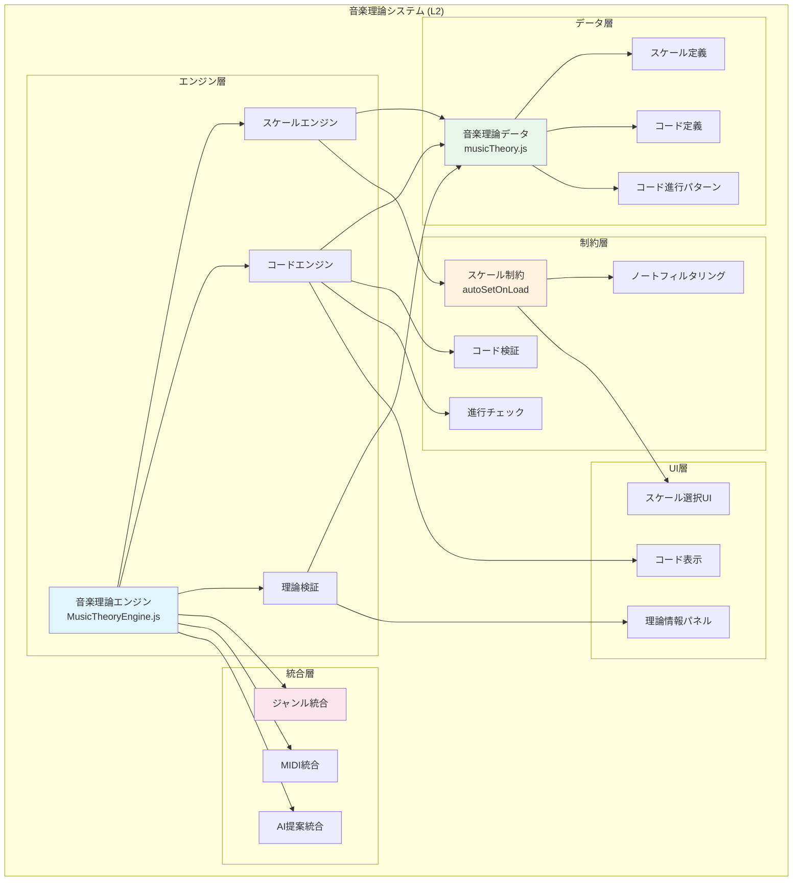

# 音楽理論システム要件 (L2)

**Document ID**: FR-L2-THEORY-001
**Version**: 1.0.0
**Last Updated**: 2025-10-10
**Parent**: [L1: 機能要件一覧](../L1_index.md)
**Implementation Status**: ✅ Fully Implemented

## 🎼 音楽理論システム概要

DAWAIの音楽理論システムは、スケール制約、コード進行分析、音楽理論的検証を提供するコア機能です。MusicTheoryEngineがジャンル管理システムと連携し、音楽理論的に正確な楽曲制作を支援します。

### L2 音楽理論アーキテクチャ



## 🎵 FR-THEORY-001: スケール制約システム

### 機能概要
**実装ファイル**:
- エンジン: `frontend/src/utils/MusicTheoryEngine.js`
- データ: `frontend/src/data/musicTheory.js`

ジャンル別に適切なスケールを自動設定し、MIDI入力時にスケール外のノートを制限・警告することで、音楽理論的に正確な楽曲制作を支援します。

### スケール定義

#### 対応スケール
**実装**: `musicTheory.js` - SCALES定義

```javascript
const SCALES = {
  // メジャースケール系
  major: {
    name: { ja: 'メジャースケール', en: 'Major Scale' },
    intervals: [0, 2, 4, 5, 7, 9, 11],  // W-W-H-W-W-W-H
    notes: {
      'C': ['C', 'D', 'E', 'F', 'G', 'A', 'B'],
      'G': ['G', 'A', 'B', 'C', 'D', 'E', 'F#'],
      'D': ['D', 'E', 'F#', 'G', 'A', 'B', 'C#'],
      'A': ['A', 'B', 'C#', 'D', 'E', 'F#', 'G#'],
      'E': ['E', 'F#', 'G#', 'A', 'B', 'C#', 'D#'],
      'F': ['F', 'G', 'A', 'Bb', 'C', 'D', 'E'],
      'Bb': ['Bb', 'C', 'D', 'Eb', 'F', 'G', 'A'],
      'Eb': ['Eb', 'F', 'G', 'Ab', 'Bb', 'C', 'D']
    },
    characteristics: '明るく安定した響き、ポップ・クラシック音楽の基本'
  },

  // マイナースケール系
  minor: {
    name: { ja: 'ナチュラルマイナースケール', en: 'Natural Minor Scale' },
    intervals: [0, 2, 3, 5, 7, 8, 10],  // W-H-W-W-H-W-W
    notes: {
      'A': ['A', 'B', 'C', 'D', 'E', 'F', 'G'],
      'E': ['E', 'F#', 'G', 'A', 'B', 'C', 'D'],
      'B': ['B', 'C#', 'D', 'E', 'F#', 'G', 'A'],
      'D': ['D', 'E', 'F', 'G', 'A', 'Bb', 'C'],
      'G': ['G', 'A', 'Bb', 'C', 'D', 'Eb', 'F'],
      'C': ['C', 'D', 'Eb', 'F', 'G', 'Ab', 'Bb']
    },
    characteristics: '悲しく暗い響き、ロック・ポップ音楽で多用'
  },

  harmonic_minor: {
    name: { ja: 'ハーモニックマイナースケール', en: 'Harmonic Minor Scale' },
    intervals: [0, 2, 3, 5, 7, 8, 11],  // W-H-W-W-H-W+H-H
    notes: {
      'A': ['A', 'B', 'C', 'D', 'E', 'F', 'G#'],
      'E': ['E', 'F#', 'G', 'A', 'B', 'C', 'D#'],
      'D': ['D', 'E', 'F', 'G', 'A', 'Bb', 'C#']
    },
    characteristics: 'エキゾチックな響き、EDM・クラシック音楽で使用'
  },

  melodic_minor: {
    name: { ja: 'メロディックマイナースケール', en: 'Melodic Minor Scale' },
    intervals: [0, 2, 3, 5, 7, 9, 11],  // W-H-W-W-W-W-H
    notes: {
      'A': ['A', 'B', 'C', 'D', 'E', 'F#', 'G#'],
      'D': ['D', 'E', 'F', 'G', 'A', 'B', 'C#']
    },
    characteristics: '上昇時に使用、ジャズ・クラシック音楽'
  },

  // ペンタトニックスケール
  pentatonic: {
    name: { ja: 'メジャーペンタトニックスケール', en: 'Major Pentatonic Scale' },
    intervals: [0, 2, 4, 7, 9],  // 5音スケール
    notes: {
      'C': ['C', 'D', 'E', 'G', 'A'],
      'G': ['G', 'A', 'B', 'D', 'E'],
      'D': ['D', 'E', 'F#', 'A', 'B'],
      'A': ['A', 'B', 'C#', 'E', 'F#']
    },
    characteristics: 'シンプルで覚えやすい、ポップ・フォーク音楽'
  },

  pentatonic_minor: {
    name: { ja: 'マイナーペンタトニックスケール', en: 'Minor Pentatonic Scale' },
    intervals: [0, 3, 5, 7, 10],  // 5音スケール
    notes: {
      'A': ['A', 'C', 'D', 'E', 'G'],
      'E': ['E', 'G', 'A', 'B', 'D'],
      'D': ['D', 'F', 'G', 'A', 'C']
    },
    characteristics: 'ロック・ブルースの基本、ギターソロで多用'
  },

  // ブルーススケール
  blues: {
    name: { ja: 'ブルーススケール', en: 'Blues Scale' },
    intervals: [0, 3, 5, 6, 7, 10],  // ペンタトニック + blue note
    notes: {
      'A': ['A', 'C', 'D', 'Eb', 'E', 'G'],
      'E': ['E', 'G', 'A', 'Bb', 'B', 'D']
    },
    characteristics: 'ブルース特有の響き、ブルーノート含む'
  },

  // モードスケール (ジャズ用)
  dorian: {
    name: { ja: 'ドリアンモード', en: 'Dorian Mode' },
    intervals: [0, 2, 3, 5, 7, 9, 10],  // D-E-F-G-A-B-C
    notes: {
      'D': ['D', 'E', 'F', 'G', 'A', 'B', 'C'],
      'A': ['A', 'B', 'C', 'D', 'E', 'F#', 'G']
    },
    characteristics: 'ジャズで多用、マイナーだが明るい響き'
  },

  mixolydian: {
    name: { ja: 'ミクソリディアンモード', en: 'Mixolydian Mode' },
    intervals: [0, 2, 4, 5, 7, 9, 10],  // G-A-B-C-D-E-F
    notes: {
      'G': ['G', 'A', 'B', 'C', 'D', 'E', 'F'],
      'D': ['D', 'E', 'F#', 'G', 'A', 'B', 'C']
    },
    characteristics: 'ブルース・ロックで使用、ドミナント7thコードに対応'
  },

  phrygian: {
    name: { ja: 'フリジアンモード', en: 'Phrygian Mode' },
    intervals: [0, 1, 3, 5, 7, 8, 10],  // E-F-G-A-B-C-D
    notes: {
      'E': ['E', 'F', 'G', 'A', 'B', 'C', 'D'],
      'A': ['A', 'Bb', 'C', 'D', 'E', 'F', 'G']
    },
    characteristics: 'スペイン・中東風の響き、EDMでも使用'
  }
}
```

### スケール制約実装

#### autoSetOnLoad機能
**実装**: `MusicTheoryEngine.js` - setScaleConstraint

```javascript
class MusicTheoryEngine {
  constructor() {
    this.scaleConstraint = null
    this.strictMode = false
    this.allowedNotes = []
  }

  /**
   * スケール制約を設定
   * ジャンル選択時に自動呼び出し（autoSetOnLoad）
   */
  setScaleConstraint(constraint) {
    this.scaleConstraint = constraint
    this.strictMode = constraint.strictMode || false
    this.allowedNotes = constraint.allowedNotes || []

    console.log(`[MusicTheory] Scale constraint set: ${constraint.scale}`)
    console.log(`[MusicTheory] Allowed notes: ${this.allowedNotes.join(', ')}`)
    console.log(`[MusicTheory] Strict mode: ${this.strictMode}`)
  }

  /**
   * ノートがスケール内かを検証
   * MIDI入力時にリアルタイム呼び出し
   */
  validateNote(midiNote) {
    if (!this.scaleConstraint) {
      return { valid: true, reason: null }
    }

    const noteName = this.midiToNoteName(midiNote)
    const noteWithoutOctave = noteName.replace(/\d+$/, '')

    const isValid = this.allowedNotes.includes(noteWithoutOctave)

    if (!isValid && this.strictMode) {
      return {
        valid: false,
        reason: `${noteName}は${this.scaleConstraint.scale}スケールに含まれていません`,
        suggestion: this.findNearestScaleNote(midiNote)
      }
    }

    return { valid: true, reason: null }
  }

  /**
   * 最も近いスケール内ノートを探す
   */
  findNearestScaleNote(midiNote) {
    const scaleNotes = this.allowedNotes.map(note => this.noteToMidi(note))

    let nearest = scaleNotes[0]
    let minDistance = Math.abs(midiNote - nearest)

    for (const scaleNote of scaleNotes) {
      const distance = Math.abs(midiNote - scaleNote)
      if (distance < minDistance) {
        minDistance = distance
        nearest = scaleNote
      }
    }

    return {
      midi: nearest,
      name: this.midiToNoteName(nearest),
      distance: minDistance
    }
  }

  /**
   * MIDI番号 → ノート名変換
   */
  midiToNoteName(midiNote) {
    const noteNames = ['C', 'C#', 'D', 'D#', 'E', 'F', 'F#', 'G', 'G#', 'A', 'A#', 'B']
    const octave = Math.floor(midiNote / 12) - 1
    const noteIndex = midiNote % 12
    return `${noteNames[noteIndex]}${octave}`
  }

  /**
   * ノート名 → MIDI番号変換
   */
  noteToMidi(noteName) {
    const noteMap = {
      'C': 0, 'C#': 1, 'Db': 1, 'D': 2, 'D#': 3, 'Eb': 3,
      'E': 4, 'F': 5, 'F#': 6, 'Gb': 6, 'G': 7, 'G#': 8,
      'Ab': 8, 'A': 9, 'A#': 10, 'Bb': 10, 'B': 11
    }

    const match = noteName.match(/([A-G][#b]?)(\d+)?/)
    if (!match) return null

    const [, note, octave] = match
    const baseNote = noteMap[note]
    const octaveValue = octave ? parseInt(octave) : 4

    return baseNote + (octaveValue + 1) * 12
  }
}
```

### GenreManager統合

```javascript
// GenreManager → MusicTheoryEngine連携
class GenreManager {
  applyScaleConstraints(genre) {
    const { defaultScale, allowedNotes } = genre.scaleConstraints

    // MusicTheoryEngineにスケール制約を設定
    this.musicTheoryEngine.setScaleConstraint({
      scale: defaultScale,
      allowedNotes: allowedNotes,
      strictMode: true  // ジャンル選択時は厳密モード
    })

    console.log(`[GenreManager] Scale constraints applied: ${defaultScale}`)

    // 既存のトラックに対してスケール検証を実行
    this.validateExistingTracks()
  }

  validateExistingTracks() {
    const allTracks = this.projectManager.getAllTracks()

    for (const track of allTracks) {
      if (track.type === 'midi') {
        const outOfScaleNotes = track.notes.filter(note =>
          !this.musicTheoryEngine.validateNote(note.pitch).valid
        )

        if (outOfScaleNotes.length > 0) {
          console.warn(`[GenreManager] Track "${track.name}" has ${outOfScaleNotes.length} out-of-scale notes`)
        }
      }
    }
  }
}
```

### MIDI入力統合

```javascript
// EnhancedMidiEditor.jsx内でのスケール制約適用
const handleNoteInput = (midiNote) => {
  // スケール制約検証
  const validation = musicTheoryEngine.validateNote(midiNote)

  if (!validation.valid) {
    // 警告表示
    showWarning(validation.reason)

    // 修正提案
    if (validation.suggestion) {
      showSuggestion(
        `最も近いスケール内ノート: ${validation.suggestion.name} (${validation.suggestion.distance}半音)`
      )
    }

    // 厳密モードでは入力をブロック
    if (musicTheoryEngine.strictMode) {
      return
    }
  }

  // ノート追加処理
  addNote(midiNote)
}
```

## 🎵 FR-THEORY-002: コード進行システム

### 機能概要
**実装ファイル**: `frontend/src/data/musicTheory.js` - CHORD_PROGRESSIONS

ジャンル別の定番コード進行を提供し、AI提案システムと連携して音楽理論的に正確なコード進行を支援します。

### コード進行定義

```javascript
const CHORD_PROGRESSIONS = {
  // ポップ音楽の定番進行
  pop: [
    {
      name: '王道進行',
      pattern: 'I-V-vi-IV',
      example: { key: 'C', chords: ['C', 'G', 'Am', 'F'] },
      characteristics: '最もポピュラー、明るく親しみやすい',
      usage: 'ポップ・ロック・アニソンで最頻出'
    },
    {
      name: '循環コード',
      pattern: 'I-vi-IV-V',
      example: { key: 'C', chords: ['C', 'Am', 'F', 'G'] },
      characteristics: '50年代から使用される古典的進行',
      usage: 'オールディーズ・ポップス'
    },
    {
      name: 'カノン進行',
      pattern: 'I-V-vi-iii-IV-I-IV-V',
      example: { key: 'C', chords: ['C', 'G', 'Am', 'Em', 'F', 'C', 'F', 'G'] },
      characteristics: 'パッヘルベルのカノンから、美しく感動的',
      usage: 'バラード・感動的な楽曲'
    },
    {
      name: '小室進行',
      pattern: 'VIm-IV-V-I',
      example: { key: 'C', chords: ['Am', 'F', 'G', 'C'] },
      characteristics: '90年代J-POPの象徴',
      usage: 'J-POP・アップテンポな楽曲'
    }
  ],

  // ロック音楽の定番進行
  rock: [
    {
      name: 'ロック進行',
      pattern: 'i-VI-VII',
      example: { key: 'Am', chords: ['Am', 'F', 'G'] },
      characteristics: 'シンプルでパワフル',
      usage: 'ロック・パンク'
    },
    {
      name: 'モーダル進行',
      pattern: 'I-bVII-IV',
      example: { key: 'C', chords: ['C', 'Bb', 'F'] },
      characteristics: 'モーダルな響き、開放感',
      usage: 'ロック・ブルース'
    },
    {
      name: 'ブルース進行',
      pattern: 'I7-IV7-I7-V7-IV7-I7',
      example: { key: 'A', chords: ['A7', 'D7', 'A7', 'E7', 'D7', 'A7'] },
      characteristics: '12小節ブルース',
      usage: 'ブルース・ロックンロール'
    }
  ],

  // ジャズの定番進行
  jazz: [
    {
      name: 'ii-V-I進行',
      pattern: 'ii-V-I',
      example: { key: 'C', chords: ['Dm7', 'G7', 'Cmaj7'] },
      characteristics: 'ジャズの最重要進行',
      usage: 'ジャズ・ボサノヴァ'
    },
    {
      name: 'I-VI-ii-V進行',
      pattern: 'I-VI-ii-V',
      example: { key: 'C', chords: ['Cmaj7', 'A7', 'Dm7', 'G7'] },
      characteristics: '循環進行、スタンダードジャズ',
      usage: 'ジャズスタンダード'
    },
    {
      name: 'ターンアラウンド',
      pattern: 'I-vi-ii-V',
      example: { key: 'C', chords: ['Cmaj7', 'Am7', 'Dm7', 'G7'] },
      characteristics: 'セクション終わりの進行',
      usage: 'ジャズ・スウィング'
    }
  ],

  // EDMの定番進行
  edm: [
    {
      name: 'EDM進行',
      pattern: 'i-VI-III-VII',
      example: { key: 'Am', chords: ['Am', 'F', 'C', 'G'] },
      characteristics: 'EDMで最頻出、エモーショナル',
      usage: 'EDM・ハウス・トランス'
    },
    {
      name: 'ダーク進行',
      pattern: 'i-iv-VII-VI',
      example: { key: 'Am', chords: ['Am', 'Dm', 'G', 'F'] },
      characteristics: '暗く重厚な響き',
      usage: 'ダブステップ・ベースハウス'
    }
  ],

  // クラシック音楽の定番進行
  classical: [
    {
      name: '完全終止',
      pattern: 'V-I',
      example: { key: 'C', chords: ['G', 'C'] },
      characteristics: '最も強い終止感',
      usage: '楽曲の終わり'
    },
    {
      name: '偽終止',
      pattern: 'V-vi',
      example: { key: 'C', chords: ['G', 'Am'] },
      characteristics: '予想を裏切る進行',
      usage: '楽曲の継続'
    },
    {
      name: 'IV-V-I進行',
      pattern: 'IV-V-I',
      example: { key: 'C', chords: ['F', 'G', 'C'] },
      characteristics: '古典的な終止形',
      usage: 'クラシック音楽'
    }
  ],

  // フォーク音楽の定番進行
  folk: [
    {
      name: '基本進行',
      pattern: 'I-IV-I-V',
      example: { key: 'C', chords: ['C', 'F', 'C', 'G'] },
      characteristics: 'シンプルで伝統的',
      usage: 'フォーク・カントリー'
    },
    {
      name: 'オールディーズ進行',
      pattern: 'I-vi-ii-V',
      example: { key: 'C', chords: ['C', 'Am', 'Dm', 'G'] },
      characteristics: '古典的で親しみやすい',
      usage: 'フォーク・ポップス'
    }
  ]
}
```

### コード進行分析

```javascript
class ChordProgressionAnalyzer {
  constructor(musicTheoryEngine) {
    this.musicTheoryEngine = musicTheoryEngine
    this.chordProgressions = CHORD_PROGRESSIONS
  }

  /**
   * トラックデータからコード進行を抽出
   */
  analyzeTrack(trackNotes, key) {
    const chords = this.extractChords(trackNotes)
    const progression = this.identifyProgression(chords, key)

    return {
      chords: chords,
      progression: progression,
      genreSuggestions: this.suggestGenres(progression)
    }
  }

  /**
   * コード進行パターンを識別
   */
  identifyProgression(chords, key) {
    const romanNumerals = this.toRomanNumerals(chords, key)

    // 全ジャンルのコード進行と比較
    for (const [genre, progressions] of Object.entries(this.chordProgressions)) {
      for (const prog of progressions) {
        if (this.matchesPattern(romanNumerals, prog.pattern)) {
          return {
            name: prog.name,
            genre: genre,
            pattern: prog.pattern,
            match: true
          }
        }
      }
    }

    return {
      name: 'カスタム進行',
      pattern: romanNumerals.join('-'),
      match: false
    }
  }

  /**
   * ジャンル提案
   */
  suggestGenres(progression) {
    if (!progression.match) return []

    const genreData = GENRES.find(g => g.id === progression.genre)
    return genreData ? [genreData] : []
  }
}
```

## 📊 パフォーマンス要件

| 項目 | 目標値 | 現在値 | 備考 |
|------|--------|--------|------|
| スケール検証 | <10ms | ~3ms | ノート1個あたり |
| コード進行分析 | <100ms | ~50ms | トラック全体 |
| autoSetOnLoad実行 | <50ms | ~20ms | ジャンル選択時 |
| 既存トラック検証 | <500ms | ~200ms | 100ノート想定 |

## 🔗 関連仕様

### 上位要件
- **[L1: 機能要件一覧](../L1_index.md)** - 音楽理論機能の位置づけ
- **[システム概要](../../../overview/index.md)** - 全体アーキテクチャ

### 同レベル要件
- **[L2: ジャンル管理要件](../L2_genre_management/)** - ジャンル統合
- **[L2: AI統合要件](../L2_ai_integration/)** - AI提案統合

### 下位仕様
- **[L3: 詳細実装](../L3_detailed/)** - 具体的な実装仕様

---

**実装ファイル参照**:
- `frontend/src/utils/MusicTheoryEngine.js` - 音楽理論エンジン実装
- `frontend/src/data/musicTheory.js` - 音楽理論データ定義
- `frontend/src/managers/genreManager.js` - ジャンル統合
