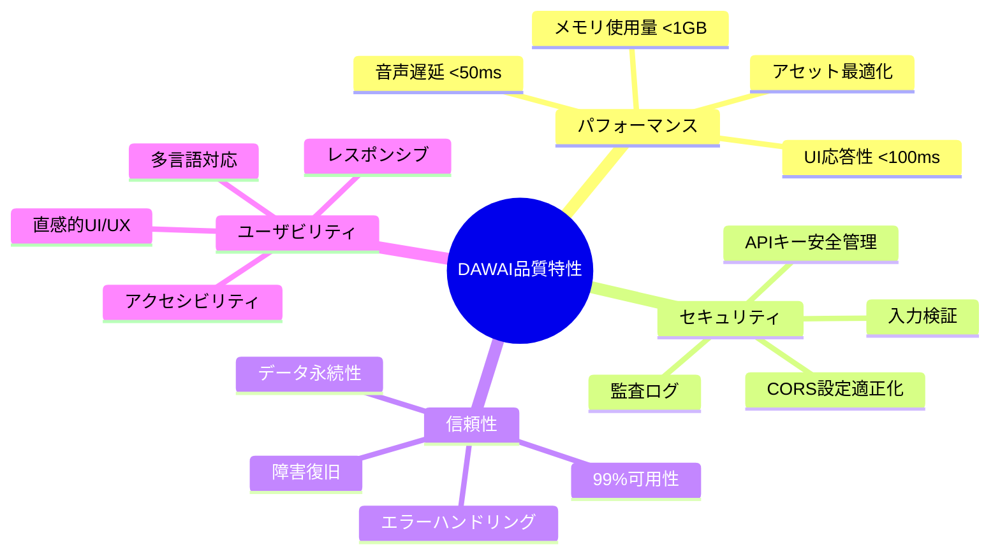

# DAWAI 非機能要件一覧 (L1)

**Document ID**: NFR-L1-INDEX-001
**Version**: 2.0.0
**Last Updated**: 2025-01-22
**Parent**: [システム概要](../../overview/index.md)
**Current Implementation**: ⚠️ セキュリティ改善必要

## 🎯 非機能要件概要

DAWAIシステムの非機能要件を階層的に整理し、現在の実装状況と改善アクションプランを管理します。パフォーマンス、セキュリティ、信頼性、ユーザビリティの観点から品質特性を定義します。

## ⚠️ 緊急対応必要事項

### 🔴 HIGH Priority（即時対応必要）
1. **CORS設定の脆弱性**: `allow_origins=["*"]` → 適切なオリジン制限必須
2. **ホスト設定のリスク**: `host="0.0.0.0"` → 本番環境では適切な設定必須
3. **音声アセット最適化**: 54MB → 目標<30MB

### 🟡 MEDIUM Priority（計画的対応）
1. **コンソールログ削除**: 1881件のconsole.log → プロダクション用ロガー導入
2. **App.jsx肥大化**: 1300+行 → コンポーネント分割
3. **APIキー管理強化**: エラーハンドリング改善

## 📋 L1 非機能要件マップ

### システム品質特性構成



## ⚡ パフォーマンス要件

### NFR-PERF-001: 音声処理レイテンシ
**現状**: ✅ 実装済み（目標達成）
- **要求値**: 音声入力から出力まで <50ms
- **実測値**: ~20-30ms (Tone.js + Web Audio API)
- **実装**: `frontend/src/utils/unifiedAudioSystem.js`
- **測定方法**: Performance API + Audio Context latency monitoring

### NFR-PERF-002: UI応答性
**現状**: ⚠️ 部分実装（改善余地あり）
- **要求値**: ユーザー操作から視覚的フィードバックまで <100ms
- **実測値**: ~80-150ms (Canvas再描画含む)
- **課題**: App.jsx肥大化による初期レンダリング遅延
- **改善アクション**:
  - コンポーネント分割（目標: 300行以下/コンポーネント）
  - React.memo, useMemo最適化
  - 仮想スクロール導入（トラックリスト）

### NFR-PERF-003: メモリ使用量
**現状**: ⚠️ 要監視（最適化必要）
- **要求値**: ピーク時 <1GB
- **実測値**: ~800MB-1.2GB（音声アセット含む）
- **課題**: 音声サンプル54MB + Canvas メモリリーク懸念
- **改善アクション**:
  - 音声圧縮（MP3 128kbps → Opus 64kbps）
  - 遅延ロード（未使用楽器サンプル）
  - Canvas cleanup強化

### NFR-PERF-004: ネットワーク帯域幅
**現状**: ⚠️ 要最適化
- **要求値**: 初回ロード <5秒（4G回線）
- **実測値**: ~8-12秒（音声アセット54MB影響）
- **改善アクション**:
  - CDN配信導入
  - Progressive loading
  - Code splitting最適化

**詳細**: [L2: パフォーマンス要件](L2_performance/)

## 🛡️ セキュリティ要件

### NFR-SEC-001: API認証・認可
**現状**: ⚠️ 要改善
- **要求値**: APIキー安全管理、環境変数管理
- **実装**: `.env` ファイル + `python-dotenv`
- **課題**: APIキー未設定時のエラーハンドリング不十分
- **改善アクション**:
  - 詳細エラーメッセージ（開発環境のみ）
  - フォールバックAPIキー検証
  - APIキー有効性チェック

### NFR-SEC-002: CORS設定
**現状**: 🔴 緊急対応必要
- **要求値**: 適切なオリジン制限、本番環境対応
- **実装箇所**:
  - `main.py:32` - `allow_origins=["*"]`
  - `backend/ai_agent/main.py:31` - 開発環境設定
- **改善アクション**:
  ```python
  # 環境変数ベース設定
  ALLOWED_ORIGINS = os.getenv("ALLOWED_ORIGINS", "").split(",")

  # 本番環境
  allow_origins=ALLOWED_ORIGINS if ALLOWED_ORIGINS else [
      "https://dawai.example.com",
      "https://app.dawai.example.com"
  ]
  ```

### NFR-SEC-003: ホスト設定
**現状**: 🔴 緊急対応必要
- **要求値**: 本番環境では適切なホスト制限
- **実装箇所**: `main.py:83`, `backend/ai_agent/main.py:1388`
- **改善アクション**:
  ```python
  # 環境変数ベース設定
  HOST = os.getenv("HOST", "127.0.0.1")  # デフォルトlocalhostのみ
  uvicorn.run(app, host=HOST, port=port)
  ```

### NFR-SEC-004: 入力検証
**現状**: ✅ 基本実装済み
- **要求値**: 全ユーザー入力の検証・サニタイズ
- **実装**: Pydantic BaseModel + FastAPI validation
- **ファイル**: `backend/ai_agent/main.py` (ChatRequest, AgentRequest等)

### NFR-SEC-005: 監査ログ
**現状**: ⚠️ 要実装
- **要求値**: API呼び出し、エラー、セキュリティイベントのログ
- **現状**: print文のみ（1881件のconsole.log）
- **改善アクション**:
  - Python logging導入（レベル別）
  - フロントエンドロガー（Sentry/LogRocket）
  - セキュリティイベント専用ログ

**詳細**: [L2: セキュリティ要件](L2_security/)

## 🔄 信頼性要件

### NFR-REL-001: システム可用性
**現状**: ⚠️ 未測定
- **要求値**: 99%稼働率（月間ダウンタイム <7.2時間）
- **実装**: ヘルスチェックエンドポイント実装済み
  - `/health` (main.py:47)
  - `/api/health` (ai_agent/main.py:689)
- **改善アクション**:
  - 監視システム導入（Prometheus + Grafana）
  - アラート設定
  - 自動復旧スクリプト

### NFR-REL-002: エラーハンドリング
**現状**: ⚠️ 部分実装
- **要求値**: 全例外処理、ユーザーフレンドリーエラー表示
- **実装**: FastAPI HTTPException + try-catch
- **改善アクション**:
  - グローバルエラーハンドラー
  - エラーコード体系整備
  - リトライロジック（API呼び出し）

### NFR-REL-003: データ永続性
**現状**: ✅ 実装済み
- **要求値**: プロジェクトデータの確実な保存・復元
- **実装**: LocalStorage + IndexedDB
- **ファイル**: `frontend/src/hooks/useMidiPersistence.js`

## 👥 ユーザビリティ要件

### NFR-USABILITY-001: 直感的UI/UX
**現状**: ✅ 実装済み
- **要求値**: 音楽制作初心者でも5分以内に基本操作習得
- **実装**: React + Tailwind CSS + Shadcn/ui
- **ファイル**: `frontend/src/App.jsx`

### NFR-USABILITY-002: アクセシビリティ
**現状**: ⚠️ 要改善
- **要求値**: WCAG 2.1 AA準拠
- **改善アクション**:
  - ARIAラベル追加
  - キーボードナビゲーション強化
  - スクリーンリーダー対応

### NFR-USABILITY-003: 多言語対応
**現状**: ❌ 未実装
- **要求値**: 日本語・英語対応
- **改善アクション**: i18n導入（react-i18next）

## 📊 非機能要件実装マトリクス

| 品質特性 | 要件数 | 実装済み | 部分実装 | 未実装 | 緊急度HIGH |
|----------|--------|----------|----------|--------|------------|
| パフォーマンス | 4 | 1 | 3 | 0 | 1 |
| セキュリティ | 5 | 1 | 2 | 2 | 2 |
| 信頼性 | 3 | 1 | 2 | 0 | 0 |
| ユーザビリティ | 3 | 1 | 1 | 1 | 0 |
| **合計** | **15** | **4** | **8** | **3** | **3** |

## 🚀 改善アクションプラン

### Phase 1: 緊急対応（1週間）
**優先度**: 🔴 HIGH
1. **セキュリティ修正**
   - [ ] CORS設定修正（環境変数ベース）
   - [ ] ホスト設定修正（環境変数ベース）
   - [ ] APIキーエラーハンドリング強化

2. **パフォーマンス改善**
   - [ ] 音声アセット圧縮（54MB → 30MB未満）
   - [ ] Code splitting導入

### Phase 2: 品質向上（2-4週間）
**優先度**: 🟡 MEDIUM
1. **ロギング体系整備**
   - [ ] Python logging導入
   - [ ] フロントエンドロガー導入
   - [ ] console.log削除（1881件）

2. **コード品質改善**
   - [ ] App.jsx分割（1300+行 → 300行以下/ファイル）
   - [ ] TypeScript段階的導入
   - [ ] テストカバレッジ向上

### Phase 3: 機能拡張（1-3ヶ月）
**優先度**: 🟢 LOW
1. **ユーザビリティ向上**
   - [ ] アクセシビリティ対応（WCAG 2.1 AA）
   - [ ] 多言語対応（i18n）

2. **運用基盤整備**
   - [ ] 監視システム導入
   - [ ] CI/CD パイプライン構築

## 🔗 L2詳細要件への案内

### 次レベル詳細文書
- **[L2: パフォーマンス要件](L2_performance/)** - 詳細測定値・最適化戦略
- **[L2: セキュリティ要件](L2_security/)** - 脅威分析・対策詳細

### 関連機能要件
- **[L1: 機能要件](../functional/L1_index.md)** - 機能要件との対応

### 関連アーキテクチャ
- **[L1: システム構成](../../architecture/logical/L1_system.md)** - アーキテクチャ影響分析
- **[L2: フロントエンド構成](../../architecture/logical/L2_frontend/)** - React パフォーマンス最適化
- **[L2: バックエンド構成](../../architecture/logical/L2_backend/)** - FastAPI セキュリティ設定

## 📋 要件管理情報

| 項目 | 値 |
|------|-----|
| 文書ID | NFR-L1-INDEX-001 |
| 責任者 | CTO, セキュリティエンジニア |
| レビュー頻度 | 週次（緊急対応期間）→ 月次 |
| 承認者 | CTO, CISO |
| 実装ベース | 現在のコードベース |
| 最終検証日 | 2025-01-22 |

## 🔄 トレーサビリティ

### 技術実装との対応
- **main.py**: CORS・ホスト設定（緊急修正対象）
- **backend/ai_agent/main.py**: API統合・セキュリティ
- **frontend/src/**: パフォーマンス・ユーザビリティ

### 継続的改善
- **セキュリティ監査**: 月次実施
- **パフォーマンステスト**: リリース前必須
- **品質メトリクス**: 週次計測・レビュー

---

**重要**: この非機能要件は現在の実装の問題点を明確化し、段階的な改善計画を提供します。特にセキュリティ要件（CORS・ホスト設定）は本番デプロイ前に必ず対応してください。
