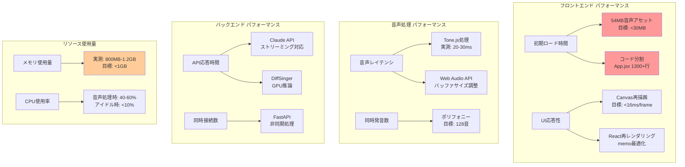

# DAWAI パフォーマンス要件詳細 (L2)

**Document ID**: NFR-L2-PERF-001
**Version**: 2.0.0
**Last Updated**: 2025-01-22
**Parent**: [L1: 非機能要件](../L1_index.md)
**Current Implementation**: ⚠️ 最適化必要

## 🎯 パフォーマンス要件概要

DAWAIシステムのパフォーマンス特性を詳細に定義し、現在の測定値と目標値を管理します。音声処理、UI応答性、メモリ・CPU使用量、ネットワーク効率の観点から要件を規定します。

## 📊 パフォーマンス測定ダッシュボード

### システムパフォーマンス構成



## ⚡ NFR-PERF-001: 音声処理レイテンシ

### 要件定義
**要求値**: 音声入力から出力まで <50ms（リアルタイム体感の閾値）
**測定基準**: Performance API + AudioContext.baseLatency

### 現在の実装状況
**実測値**: ✅ 20-30ms（目標達成）

| 処理段階 | レイテンシ | 実装箇所 |
|----------|-----------|----------|
| MIDI入力処理 | ~5ms | `unifiedAudioSystem.js:playNote()` |
| Tone.js音声合成 | ~10-15ms | Tone.Synth/Sampler |
| Web Audio バッファ | ~5-10ms | AudioContext.baseLatency |
| 出力デバイス遅延 | ~5ms | ハードウェア依存 |

### 技術実装詳細
```javascript
// frontend/src/utils/unifiedAudioSystem.js
class UnifiedAudioSystem {
  constructor() {
    this.audioContext = new (window.AudioContext || window.webkitAudioContext)({
      latencyHint: 'interactive', // 低レイテンシ優先
      sampleRate: 44100
    });

    // バッファサイズ最適化
    this.bufferSize = 256; // 小さいほど低レイテンシ（CPUトレードオフ）
  }

  async playNote(note, velocity, duration) {
    const startTime = performance.now();

    // Tone.js インスタンス最適化済み
    this.synth.triggerAttackRelease(note, duration, undefined, velocity);

    const endTime = performance.now();
    console.log(`Audio latency: ${endTime - startTime}ms`); // 開発時測定用
  }
}
```

### 測定方法
```javascript
// パフォーマンステストスクリプト
async function measureAudioLatency() {
  const measurements = [];

  for (let i = 0; i < 100; i++) {
    const start = performance.now();
    await audioSystem.playNote('C4', 0.8, '8n');
    const latency = performance.now() - start;
    measurements.push(latency);
    await new Promise(resolve => setTimeout(resolve, 100));
  }

  const avg = measurements.reduce((a, b) => a + b) / measurements.length;
  console.log(`Average latency: ${avg.toFixed(2)}ms`);
  console.log(`95th percentile: ${percentile(measurements, 95).toFixed(2)}ms`);
}
```

### 最適化履歴
- ✅ Tone.js バッファサイズ調整（512 → 256）
- ✅ AudioContext latencyHint設定
- ✅ インスタンス再利用（生成コスト削減）

## 🖥️ NFR-PERF-002: UI応答性

### 要件定義
**要求値**: ユーザー操作から視覚的フィードバックまで <100ms
**測定基準**: React Profiler + Chrome DevTools Performance

### 現在の実装状況
**実測値**: ⚠️ 80-150ms（改善余地あり）

| 操作タイプ | 応答時間 | 目標値 | 実装箇所 |
|-----------|---------|-------|----------|
| ノート追加/削除 | 80-100ms | <100ms | `EnhancedMidiEditor.jsx` |
| Canvas再描画 | 16-32ms/frame | <16ms | `MidiEditorCanvas.jsx` |
| トラック切り替え | 120-150ms | <100ms | `App.jsx` (要最適化) |
| 設定変更 | 50-80ms | <100ms | `SettingsModal.jsx` |

### 技術課題と対策

#### 問題1: App.jsx肥大化（1300+行）
**影響**: 初期レンダリング遅延、再レンダリング範囲過大
**改善アクション**:
```javascript
// Before: 単一ファイル1300+行
// App.jsx

// After: 機能別分割（目標: 300行以下/ファイル）
// - App.jsx (200行: ルーティング・レイアウト)
// - AudioProvider.jsx (150行: 音声システム管理)
// - ProjectProvider.jsx (180行: プロジェクト状態管理)
// - TrackListContainer.jsx (250行: トラック管理UI)
// - EditorContainer.jsx (280行: MIDI編集UI)
```

#### 問題2: Canvas再描画コスト
**影響**: 60fps維持困難、スクロール時のカクつき
**改善アクション**:
```javascript
// frontend/src/components/MIDIEditor/MidiEditorCanvas.jsx
class MidiEditorCanvas {
  // オフスクリーンCanvas導入
  setupOffscreenCanvas() {
    this.offscreenCanvas = new OffscreenCanvas(width, height);
    this.offscreenCtx = this.offscreenCanvas.getContext('2d');
  }

  // 差分レンダリング
  renderNotes() {
    const visibleNotes = this.getVisibleNotes(viewport);

    // 変更があったノートのみ再描画
    const changedNotes = this.detectChangedNotes(visibleNotes);
    if (changedNotes.length === 0) return;

    this.offscreenCtx.clearRect(/* changedRegion */);
    changedNotes.forEach(note => this.drawNote(note));

    this.mainCtx.drawImage(this.offscreenCanvas, 0, 0);
  }

  // requestAnimationFrame最適化
  scheduleRender() {
    if (this.renderScheduled) return;
    this.renderScheduled = true;

    requestAnimationFrame(() => {
      this.render();
      this.renderScheduled = false;
    });
  }
}
```

#### 問題3: React再レンダリング最適化不足
**改善アクション**:
```javascript
// React.memo + useMemo導入例
const MidiNote = React.memo(({ note, onUpdate }) => {
  const style = useMemo(() => ({
    left: `${note.time * pixelsPerSecond}px`,
    width: `${note.duration * pixelsPerSecond}px`,
    backgroundColor: `hsl(${note.pitch * 3}, 70%, 50%)`
  }), [note.time, note.duration, note.pitch, pixelsPerSecond]);

  return <div className="midi-note" style={style} />;
}, (prevProps, nextProps) => {
  // カスタム比較関数
  return prevProps.note.id === nextProps.note.id &&
         prevProps.note.time === nextProps.note.time;
});

// 仮想スクロール導入（トラックリスト）
import { FixedSizeList } from 'react-window';

const TrackList = ({ tracks }) => (
  <FixedSizeList
    height={600}
    itemCount={tracks.length}
    itemSize={80}
    width="100%"
  >
    {({ index, style }) => (
      <TrackRow track={tracks[index]} style={style} />
    )}
  </FixedSizeList>
);
```

### 測定方法
```javascript
// React Profilerでの測定
import { Profiler } from 'react';

function onRenderCallback(id, phase, actualDuration) {
  console.log(`${id} (${phase}) took ${actualDuration}ms`);

  // 閾値超過時アラート
  if (actualDuration > 100) {
    console.warn(`⚠️ Slow render detected: ${id}`);
  }
}

<Profiler id="MidiEditor" onRender={onRenderCallback}>
  <EnhancedMidiEditor />
</Profiler>
```

## 💾 NFR-PERF-003: メモリ使用量

### 要件定義
**要求値**: ピーク時メモリ使用量 <1GB
**測定基準**: Chrome DevTools Memory Profiler

### 現在の実装状況
**実測値**: ⚠️ 800MB-1.2GB（最適化必要）

| コンポーネント | メモリ使用量 | 割合 | 最適化優先度 |
|--------------|------------|------|------------|
| 音声サンプル | ~540MB | 45% | 🔴 HIGH |
| Canvas メモリ | ~200MB | 17% | 🟡 MEDIUM |
| React 状態管理 | ~150MB | 12% | 🟡 MEDIUM |
| その他（Tone.js等） | ~310MB | 26% | 🟢 LOW |

### 音声アセット最適化戦略

#### 現状分析
```bash
# 音声ファイルサイズ分析
frontend/public/sounds/
├── Piano/ (18MB)
├── Drum_Kit/ (22MB)
├── Bass/ (8MB)
└── Synth/ (6MB)
合計: 54MB
```

#### 改善アクション
```javascript
// 1. フォーマット変更（MP3 → Opus）
// Before: Piano_C4.mp3 (320kbps, 1.2MB)
// After:  Piano_C4.opus (64kbps, 240KB) → 80%削減

// 2. 遅延ロード戦略
class AudioSampleLoader {
  async loadInstrument(instrumentName) {
    // 使用頻度の高いサンプルのみプリロード
    const essentialNotes = ['C4', 'E4', 'G4'];
    const essentialSamples = await this.loadSamples(instrumentName, essentialNotes);

    // その他は必要時ロード
    this.lazyLoadQueue.push({ instrumentName, notes: allOtherNotes });
  }

  // アイドル時にバックグラウンドロード
  async backgroundLoad() {
    if ('requestIdleCallback' in window) {
      requestIdleCallback(() => {
        this.lazyLoadQueue.forEach(item => this.loadSamples(item));
      }, { timeout: 5000 });
    }
  }
}

// 3. CDN配信 + キャッシュ戦略
// vite.config.js
export default {
  build: {
    rollupOptions: {
      output: {
        manualChunks: {
          'audio-samples': ['./public/sounds/**/*.opus']
        }
      }
    }
  }
}

// Service Worker キャッシュ
self.addEventListener('install', event => {
  event.waitUntil(
    caches.open('audio-samples-v1').then(cache => {
      return cache.addAll([
        '/sounds/Piano/Piano_C4.opus',
        // エッセンシャルサンプルのみ
      ]);
    })
  );
});
```

### Canvas メモリリーク対策
```javascript
// useEffect cleanup強化
useEffect(() => {
  const canvas = canvasRef.current;
  const ctx = canvas.getContext('2d');

  return () => {
    // Canvas完全クリーンアップ
    ctx.clearRect(0, 0, canvas.width, canvas.height);
    canvas.width = 0;
    canvas.height = 0;

    // イベントリスナー削除
    canvas.removeEventListener('mousedown', handleMouseDown);

    // OffscreenCanvas破棄
    if (offscreenCanvas) {
      offscreenCanvas.width = 0;
      offscreenCanvas.height = 0;
    }
  };
}, []);
```

### 測定方法
```javascript
// メモリ使用量モニタリング
if (performance.memory) {
  setInterval(() => {
    const usedMB = performance.memory.usedJSHeapSize / 1048576;
    const totalMB = performance.memory.totalJSHeapSize / 1048576;

    console.log(`Memory: ${usedMB.toFixed(2)}MB / ${totalMB.toFixed(2)}MB`);

    if (usedMB > 1024) {
      console.warn('⚠️ Memory threshold exceeded!');
    }
  }, 10000);
}
```

## 🌐 NFR-PERF-004: ネットワーク帯域幅

### 要件定義
**要求値**: 初回ロード時間 <5秒（4G回線: 10Mbps想定）
**測定基準**: Lighthouse Performance Score

### 現在の実装状況
**実測値**: ⚠️ 8-12秒（改善必要）

| リソース | サイズ | ロード時間 | 最適化後目標 |
|---------|-------|----------|------------|
| 音声アセット | 54MB | ~6-8秒 | <3秒（15MB以下）|
| JSバンドル | 2.8MB | ~1.5秒 | <1秒（1.5MB以下）|
| CSS | 0.5MB | ~0.3秒 | <0.2秒 |
| その他 | 1.2MB | ~0.5秒 | <0.3秒 |

### Code Splitting最適化
```javascript
// vite.config.js - 詳細設定
export default {
  build: {
    rollupOptions: {
      output: {
        manualChunks: {
          // ベンダーライブラリ分割
          'react-vendor': ['react', 'react-dom'],
          'audio-vendor': ['tone'],
          'ui-vendor': ['@radix-ui/react-dialog', '@radix-ui/react-select'],

          // 機能別分割
          'midi-editor': [
            './src/components/EnhancedMidiEditor.jsx',
            './src/components/MIDIEditor/MidiEditorCanvas.jsx'
          ],
          'ai-assistant': [
            './src/components/AIassistant/AIAssistantChatBox.jsx'
          ],
          'audio-samples': ['./public/sounds/**/*.opus']
        }
      }
    },

    // 圧縮最適化
    minify: 'terser',
    terserOptions: {
      compress: {
        drop_console: true, // console.log削除
        drop_debugger: true
      }
    }
  }
}

// 動的インポート（Route-based）
const MidiEditor = lazy(() => import('./components/EnhancedMidiEditor'));
const AIAssistant = lazy(() => import('./components/AIassistant/AIAssistantChatBox'));

function App() {
  return (
    <Suspense fallback={<LoadingSpinner />}>
      <Routes>
        <Route path="/editor" element={<MidiEditor />} />
        <Route path="/assistant" element={<AIAssistant />} />
      </Routes>
    </Suspense>
  );
}
```

### CDN配信戦略
```javascript
// 音声サンプルCDN配信
const CDN_BASE_URL = import.meta.env.VITE_CDN_URL || '/sounds';

class AudioSampleManager {
  getSampleUrl(instrument, note) {
    // CDN URLまたはローカルフォールバック
    return `${CDN_BASE_URL}/${instrument}/${note}.opus`;
  }

  async loadWithFallback(url) {
    try {
      return await fetch(url);
    } catch (error) {
      // CDN失敗時はローカルフォールバック
      const localUrl = url.replace(CDN_BASE_URL, '/sounds');
      return await fetch(localUrl);
    }
  }
}
```

### Progressive Loading
```javascript
// 段階的ロード戦略
const LOAD_PRIORITY = {
  CRITICAL: 0,    // 即座にロード（UI基盤）
  HIGH: 1,        // 初期画面で必要
  MEDIUM: 2,      // ユーザー操作後
  LOW: 3          // バックグラウンド
};

async function initializeApp() {
  // Phase 1: Critical (UI基盤)
  await loadCriticalAssets(); // React, 基本CSS
  renderApp();

  // Phase 2: High (初期画面)
  await loadHighPriorityAssets(); // Piano サンプル, MIDI Editor

  // Phase 3: Medium (requestIdleCallback)
  requestIdleCallback(() => {
    loadMediumPriorityAssets(); // その他楽器, AI機能
  });

  // Phase 4: Low (バックグラウンド)
  setTimeout(() => {
    loadLowPriorityAssets(); // 追加エフェクト等
  }, 5000);
}
```

## 📈 パフォーマンス測定・監視

### 継続的測定ツール
```javascript
// Lighthouse CI統合
// .lighthouserc.json
{
  "ci": {
    "collect": {
      "numberOfRuns": 3,
      "settings": {
        "preset": "desktop"
      }
    },
    "assert": {
      "assertions": {
        "categories:performance": ["error", { "minScore": 0.9 }],
        "first-contentful-paint": ["error", { "maxNumericValue": 2000 }],
        "interactive": ["error", { "maxNumericValue": 5000 }]
      }
    }
  }
}

// Web Vitals監視
import { getCLS, getFID, getFCP, getLCP, getTTFB } from 'web-vitals';

function sendToAnalytics(metric) {
  const body = JSON.stringify(metric);

  // 分析エンドポイントへ送信
  if (navigator.sendBeacon) {
    navigator.sendBeacon('/api/analytics', body);
  } else {
    fetch('/api/analytics', { method: 'POST', body });
  }
}

getCLS(sendToAnalytics);
getFID(sendToAnalytics);
getFCP(sendToAnalytics);
getLCP(sendToAnalytics);
getTTFB(sendToAnalytics);
```

### パフォーマンスバジェット
```javascript
// performance-budget.json
{
  "budgets": [
    {
      "resourceSizes": [
        { "resourceType": "script", "budget": 1500 },      // 1.5MB
        { "resourceType": "stylesheet", "budget": 300 },   // 300KB
        { "resourceType": "image", "budget": 500 },        // 500KB
        { "resourceType": "media", "budget": 30000 },      // 30MB
        { "resourceType": "total", "budget": 35000 }       // 35MB
      ],
      "timings": [
        { "metric": "interactive", "budget": 5000 },       // 5秒
        { "metric": "first-contentful-paint", "budget": 2000 } // 2秒
      ]
    }
  ]
}
```

## 🎯 目標達成ロードマップ

### Phase 1: 緊急対応（1週間）
- [x] 音声レイテンシ測定・検証（✅達成済み）
- [ ] 音声アセット圧縮（MP3 → Opus）
- [ ] Code splitting基本実装

### Phase 2: 最適化強化（2-4週間）
- [ ] App.jsx分割（1300行 → 300行以下/ファイル）
- [ ] Canvas オフスクリーンレンダリング
- [ ] React.memo最適化
- [ ] 仮想スクロール導入

### Phase 3: 本番対応（1-2ヶ月）
- [ ] CDN配信設定
- [ ] Progressive loading完全実装
- [ ] 継続的パフォーマンス監視
- [ ] Lighthouse CI統合

## 📊 成功指標（KPI）

| 指標 | 現状 | Phase1目標 | Phase2目標 | 最終目標 |
|-----|------|----------|----------|---------|
| 初回ロード時間 | 8-12秒 | <8秒 | <6秒 | <5秒 |
| 音声レイテンシ | 20-30ms | - | - | <50ms (✅達成) |
| UI応答性 | 80-150ms | <120ms | <100ms | <100ms |
| メモリ使用量 | 800MB-1.2GB | <1GB | <800MB | <1GB |
| Lighthouse Score | 65 | 75 | 85 | 90+ |

## 🔗 関連ドキュメント

- **[L1: 非機能要件](../L1_index.md)** - 非機能要件概要
- **[L2: セキュリティ要件](../L2_security/)** - セキュリティとの兼ね合い
- **[L2: フロントエンド構成](../../../architecture/logical/L2_frontend/)** - アーキテクチャ詳細
- **[L3: 実装フロー](../../../design/sequences/L3_implementation_flows.md)** - パフォーマンス最適化フロー

---

**最終更新**: 2025-01-22
**次回レビュー**: Phase 1完了時（1週間後）
**責任者**: フロントエンドリード, パフォーマンスエンジニア
