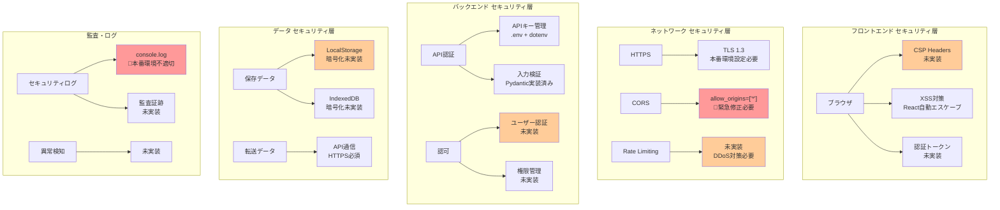

# DAWAI セキュリティ要件詳細 (L2)

**Document ID**: NFR-L2-SEC-001
**Version**: 2.0.0
**Last Updated**: 2025-01-22
**Parent**: [L1: 非機能要件](../L1_index.md)
**Current Implementation**: 🔴 緊急対応必要

## 🎯 セキュリティ要件概要

DAWAIシステムのセキュリティ特性を詳細に定義し、現在の脆弱性と対策を管理します。認証・認可、データ保護、ネットワークセキュリティ、監査ログの観点から要件を規定します。

## ⚠️ 緊急セキュリティ課題

### 🔴 CRITICAL（即時対応必須）

| ID | 課題 | 影響度 | 実装箇所 | 対応期限 |
|----|-----|-------|----------|---------|
| SEC-001 | CORS設定脆弱性 | HIGH | `main.py:32` | 即時 |
| SEC-002 | ホスト設定リスク | HIGH | `main.py:83`, `ai_agent/main.py:1388` | 即時 |
| SEC-003 | APIキーエラー露出 | MEDIUM | `ai_agent/main.py:多数` | 1週間 |

## 🛡️ セキュリティアーキテクチャ

### システムセキュリティ構成



## 🔐 NFR-SEC-001: API認証・認可

### 要件定義
**要求値**: 全APIエンドポイントの適切な認証・認可
**測定基準**: セキュリティ監査、ペネトレーションテスト

### 現在の実装状況
**実測値**: ⚠️ 基本実装のみ（強化必要）

#### APIキー管理（現状）
```python
# backend/ai_agent/main.py:44-49
DEFAULT_API_KEYS = {
    "anthropic": os.getenv("ANTHROPIC_API_KEY"),
    "openai": os.getenv("OPENAI_API_KEY"),
    "google": os.getenv("GEMINI_API_KEY")
}
```

**問題点**:
1. **環境変数未設定時の処理不足**
   - APIキーが`None`の場合、エラーメッセージが詳細すぎる
   - スタックトレースが外部に露出する可能性

2. **カスタムAPIキーの検証不足**
   - ユーザー提供のAPIキーをそのまま使用
   - 有効性チェックなし

#### 改善アクション

##### 1. 環境変数管理強化
```python
# backend/config.py (新規作成)
import os
from typing import Optional
from pydantic import BaseSettings, validator

class Settings(BaseSettings):
    # API Keys
    ANTHROPIC_API_KEY: Optional[str] = None
    OPENAI_API_KEY: Optional[str] = None
    GEMINI_API_KEY: Optional[str] = None

    # セキュリティ設定
    ALLOWED_ORIGINS: str = ""
    HOST: str = "127.0.0.1"
    PORT: int = 8000
    DEBUG: bool = False

    # 環境識別
    ENVIRONMENT: str = "development"  # development, staging, production

    @validator("ALLOWED_ORIGINS")
    def parse_origins(cls, v):
        if not v:
            return []
        return [origin.strip() for origin in v.split(",")]

    @validator("ANTHROPIC_API_KEY", "OPENAI_API_KEY", "GEMINI_API_KEY")
    def validate_api_key(cls, v, values):
        if values.get("ENVIRONMENT") == "production" and not v:
            raise ValueError("API keys are required in production")
        return v

    class Config:
        env_file = ".env"
        case_sensitive = True

settings = Settings()
```

##### 2. APIキー検証ミドルウェア
```python
# backend/middleware/api_key_validator.py
from fastapi import HTTPException, Request
import re

class APIKeyValidator:
    # APIキーフォーマット検証
    API_KEY_PATTERNS = {
        "anthropic": r"^sk-ant-[a-zA-Z0-9]{32,}$",
        "openai": r"^sk-[a-zA-Z0-9]{32,}$",
        "google": r"^AIza[a-zA-Z0-9_-]{35}$"
    }

    @staticmethod
    def validate_key_format(provider: str, api_key: str) -> bool:
        pattern = APIKeyValidator.API_KEY_PATTERNS.get(provider)
        if not pattern:
            return False
        return bool(re.match(pattern, api_key))

    @staticmethod
    async def verify_key_active(provider: str, api_key: str) -> bool:
        # 実際のAPI呼び出しで検証（軽量エンドポイント使用）
        try:
            if provider == "anthropic":
                # Claude API健全性チェック
                response = await make_test_request_anthropic(api_key)
            elif provider == "openai":
                response = await make_test_request_openai(api_key)
            elif provider == "google":
                response = await make_test_request_google(api_key)

            return response.status_code in [200, 201]
        except:
            return False

# backend/ai_agent/main.py 修正
class AIModelManager:
    def get_api_key(self, provider: str, custom_keys: Optional[Dict[str, str]] = None) -> Optional[str]:
        api_key = None

        # カスタムキー優先
        if custom_keys and provider in custom_keys:
            api_key = custom_keys[provider]

            # フォーマット検証
            if not APIKeyValidator.validate_key_format(provider, api_key):
                raise HTTPException(
                    status_code=400,
                    detail=f"Invalid API key format for {provider}"
                )

        # デフォルトキーフォールバック
        if not api_key:
            api_key = self.default_api_keys.get(provider)

        if not api_key:
            # 環境別エラーメッセージ
            if settings.ENVIRONMENT == "production":
                raise HTTPException(
                    status_code=500,
                    detail="Service configuration error"  # 詳細非開示
                )
            else:
                raise HTTPException(
                    status_code=400,
                    detail=f"{provider.title()} API key not configured. Please set in .env or provide in request."
                )

        return api_key
```

##### 3. エラーハンドリング改善
```python
# backend/ai_agent/main.py - グローバルエラーハンドラー
from fastapi.responses import JSONResponse
from fastapi.exceptions import RequestValidationError

@app.exception_handler(RequestValidationError)
async def validation_exception_handler(request: Request, exc: RequestValidationError):
    # 環境別エラー詳細度
    if settings.DEBUG:
        return JSONResponse(
            status_code=422,
            content={"detail": exc.errors(), "body": exc.body}
        )
    else:
        return JSONResponse(
            status_code=422,
            content={"detail": "Invalid request format"}
        )

@app.exception_handler(Exception)
async def general_exception_handler(request: Request, exc: Exception):
    # セキュリティログ記録
    logger.error(f"Unhandled exception: {exc}", exc_info=True)

    # 本番環境では詳細非開示
    if settings.ENVIRONMENT == "production":
        return JSONResponse(
            status_code=500,
            content={"detail": "Internal server error"}
        )
    else:
        return JSONResponse(
            status_code=500,
            content={"detail": str(exc), "type": type(exc).__name__}
        )
```

## 🌐 NFR-SEC-002: CORS設定

### 要件定義
**要求値**: 適切なオリジン制限、本番環境での厳格な設定
**測定基準**: セキュリティヘッダースキャン、OWASP準拠

### 現在の実装状況
**実測値**: 🔴 脆弱性あり（緊急修正必要）

#### 問題のあるCORS設定
```python
# main.py:30-36 - 🔴 脆弱
app.add_middleware(
    CORSMiddleware,
    allow_origins=["*"],  # 全オリジン許可（危険）
    allow_credentials=True,
    allow_methods=["*"],
    allow_headers=["*"],
)
```

**脆弱性の影響**:
1. **CSRF攻撃リスク**: 任意のオリジンからAPI呼び出し可能
2. **データ窃取リスク**: 悪意あるサイトからユーザーデータアクセス可能
3. **セッション乗っ取り**: `allow_credentials=True`との組み合わせで高リスク

#### 改善アクション（即時対応）

##### 環境別CORS設定
```python
# main.py - 修正版
from backend.config import settings

# 環境別オリジン設定
if settings.ENVIRONMENT == "production":
    allowed_origins = settings.ALLOWED_ORIGINS or [
        "https://dawai.example.com",
        "https://app.dawai.example.com"
    ]
elif settings.ENVIRONMENT == "staging":
    allowed_origins = [
        "https://staging.dawai.example.com",
        "http://localhost:5173"
    ]
else:  # development
    allowed_origins = [
        "http://localhost:5173",
        "http://localhost:3000",
        "http://127.0.0.1:5173",
        "http://127.0.0.1:3000"
    ]

app.add_middleware(
    CORSMiddleware,
    allow_origins=allowed_origins,  # 厳格なオリジン指定
    allow_credentials=True,
    allow_methods=["GET", "POST", "PUT", "DELETE", "OPTIONS"],  # 必要なメソッドのみ
    allow_headers=["Content-Type", "Authorization", "X-API-Key"],  # 必要なヘッダーのみ
    max_age=600  # プリフライトキャッシュ時間（秒）
)
```

##### 動的オリジン検証（高度な対策）
```python
# backend/middleware/cors_validator.py
from fastapi import Request
from starlette.middleware.base import BaseHTTPMiddleware

class DynamicCORSMiddleware(BaseHTTPMiddleware):
    async def dispatch(self, request: Request, call_next):
        origin = request.headers.get("origin")

        # オリジン検証ロジック
        if origin and self.is_allowed_origin(origin):
            response = await call_next(request)
            response.headers["Access-Control-Allow-Origin"] = origin
            response.headers["Access-Control-Allow-Credentials"] = "true"
            return response
        elif origin:
            # 不正オリジンからのアクセス記録
            logger.warning(f"Blocked CORS request from: {origin}")

        return await call_next(request)

    def is_allowed_origin(self, origin: str) -> bool:
        # ホワイトリストチェック
        if origin in settings.ALLOWED_ORIGINS:
            return True

        # パターンマッチング（サブドメイン対応）
        if settings.ENVIRONMENT == "production":
            import re
            pattern = r"^https://([a-z0-9-]+\.)?dawai\.example\.com$"
            return bool(re.match(pattern, origin))

        return False
```

##### .env 設定例
```bash
# .env.production
ENVIRONMENT=production
ALLOWED_ORIGINS=https://dawai.example.com,https://app.dawai.example.com
HOST=0.0.0.0  # Nginxリバースプロキシ経由の場合のみ
PORT=8000

# .env.development
ENVIRONMENT=development
ALLOWED_ORIGINS=http://localhost:5173,http://127.0.0.1:5173
HOST=127.0.0.1
PORT=8000
DEBUG=true
```

## 🖥️ NFR-SEC-003: ホスト設定

### 要件定義
**要求値**: 環境に応じた適切なホスト設定
**測定基準**: ネットワークセキュリティ監査

### 現在の実装状況
**実測値**: 🔴 リスクあり（緊急対応必要）

#### 問題のあるホスト設定
```python
# main.py:83 - 🔴 リスク
uvicorn.run(app, host="0.0.0.0", port=port)

# backend/ai_agent/main.py:1388 - 🔴 リスク
uvicorn.run(app, host="0.0.0.0", port=8000)
```

**リスクの影響**:
1. **外部アクセス許可**: `0.0.0.0`は全ネットワークインターフェースでリスン
2. **ファイアウォールバイパス**: 意図しないネットワークからアクセス可能
3. **DDoS攻撃リスク**: 公開環境での直接攻撃対象化

#### 改善アクション

##### 環境別ホスト設定
```python
# main.py - 修正版
from backend.config import settings

if __name__ == "__main__":
    port = int(os.getenv("PORT", 8000))

    # 環境別ホスト設定
    host = settings.HOST

    # セキュリティ警告
    if host == "0.0.0.0" and settings.ENVIRONMENT == "production":
        logger.warning(
            "⚠️  Running on 0.0.0.0 in production. "
            "Ensure reverse proxy (Nginx/Caddy) is configured."
        )

    logger.info(f"🎵 Starting DAWAI Server on {host}:{port} ({settings.ENVIRONMENT})")
    logger.info(f"🎨 Frontend build path: {frontend_build_path}")
    logger.info(f"✅ Frontend exists: {os.path.exists(frontend_build_path)}")

    uvicorn.run(
        app,
        host=host,
        port=port,
        log_level="info" if settings.DEBUG else "warning"
    )
```

##### デプロイメント推奨構成
```nginx
# Nginx リバースプロキシ設定例
# /etc/nginx/sites-available/dawai

upstream dawai_backend {
    server 127.0.0.1:8000;  # Uvicornはlocalhostのみリスン
}

server {
    listen 80;
    listen [::]:80;
    server_name dawai.example.com;

    # HTTPS リダイレクト
    return 301 https://$server_name$request_uri;
}

server {
    listen 443 ssl http2;
    listen [::]:443 ssl http2;
    server_name dawai.example.com;

    # SSL証明書（Let's Encrypt）
    ssl_certificate /etc/letsencrypt/live/dawai.example.com/fullchain.pem;
    ssl_certificate_key /etc/letsencrypt/live/dawai.example.com/privkey.pem;

    # セキュリティヘッダー
    add_header X-Frame-Options "SAMEORIGIN" always;
    add_header X-Content-Type-Options "nosniff" always;
    add_header X-XSS-Protection "1; mode=block" always;
    add_header Referrer-Policy "strict-origin-when-cross-origin" always;

    # CSP（Content Security Policy）
    add_header Content-Security-Policy "default-src 'self'; script-src 'self' 'unsafe-inline' 'unsafe-eval'; style-src 'self' 'unsafe-inline'; img-src 'self' data: https:; font-src 'self' data:; connect-src 'self' https://api.anthropic.com https://api.openai.com https://generativelanguage.googleapis.com;" always;

    # Rate Limiting
    limit_req_zone $binary_remote_addr zone=dawai_limit:10m rate=10r/s;
    limit_req zone=dawai_limit burst=20 nodelay;

    # バックエンドプロキシ
    location /api {
        proxy_pass http://dawai_backend;
        proxy_http_version 1.1;
        proxy_set_header Upgrade $http_upgrade;
        proxy_set_header Connection 'upgrade';
        proxy_set_header Host $host;
        proxy_set_header X-Real-IP $remote_addr;
        proxy_set_header X-Forwarded-For $proxy_add_x_forwarded_for;
        proxy_set_header X-Forwarded-Proto $scheme;
        proxy_cache_bypass $http_upgrade;

        # タイムアウト設定
        proxy_connect_timeout 60s;
        proxy_send_timeout 60s;
        proxy_read_timeout 60s;
    }

    # フロントエンド静的ファイル
    location / {
        root /var/www/dawai/frontend/dist;
        try_files $uri $uri/ /index.html;

        # キャッシュ設定
        location ~* \.(js|css|png|jpg|jpeg|gif|ico|svg|woff|woff2|ttf|eot)$ {
            expires 1y;
            add_header Cache-Control "public, immutable";
        }
    }
}
```

##### Dockerデプロイメント設定
```dockerfile
# Dockerfile - セキュア設定
FROM python:3.11-slim

# セキュリティアップデート
RUN apt-get update && apt-get upgrade -y && \
    apt-get clean && rm -rf /var/lib/apt/lists/*

# 非rootユーザー作成
RUN useradd -m -u 1000 dawai
USER dawai

WORKDIR /app

# 依存関係インストール
COPY --chown=dawai:dawai requirements.txt .
RUN pip install --no-cache-dir -r requirements.txt

# アプリケーションコピー
COPY --chown=dawai:dawai . .

# 環境変数（機密情報は外部シークレット管理）
ENV ENVIRONMENT=production
ENV HOST=0.0.0.0
ENV PORT=8000

EXPOSE 8000

# ヘルスチェック
HEALTHCHECK --interval=30s --timeout=10s --start-period=40s --retries=3 \
    CMD python -c "import requests; requests.get('http://localhost:8000/health')"

CMD ["python", "main.py"]
```

```yaml
# docker-compose.yml - セキュア構成
version: '3.8'

services:
  dawai-backend:
    build: .
    container_name: dawai-backend
    restart: unless-stopped
    environment:
      - ENVIRONMENT=production
      - HOST=0.0.0.0  # コンテナ内のみ
      - PORT=8000
    env_file:
      - .env.production  # 機密情報
    networks:
      - dawai-internal
    # ホストポート非公開（Nginxプロキシ経由のみ）
    expose:
      - "8000"

  nginx:
    image: nginx:alpine
    container_name: dawai-nginx
    restart: unless-stopped
    ports:
      - "80:80"
      - "443:443"
    volumes:
      - ./nginx.conf:/etc/nginx/conf.d/default.conf
      - ./frontend/dist:/var/www/dawai/frontend/dist
      - /etc/letsencrypt:/etc/letsencrypt:ro
    networks:
      - dawai-internal
    depends_on:
      - dawai-backend

networks:
  dawai-internal:
    driver: bridge
    internal: false  # 外部アクセス制御
```

## 🔒 NFR-SEC-004: 入力検証

### 要件定義
**要求値**: 全ユーザー入力の検証・サニタイズ
**測定基準**: OWASP Top 10準拠

### 現在の実装状況
**実測値**: ✅ 基本実装済み（Pydantic活用）

#### 実装済みの入力検証
```python
# backend/ai_agent/main.py - Pydanticモデル
from pydantic import BaseModel, validator, Field

class ChatRequest(BaseModel):
    message: str = Field(..., min_length=1, max_length=10000)
    context: Optional[Any] = ""
    model: str = Field(default="claude-3-sonnet", regex="^(claude-|gpt-|gemini-)")
    apiKeys: Optional[Dict[str, str]] = None
    stream: bool = False

    @validator('message')
    def validate_message(cls, v):
        # XSS対策: HTMLタグ除去（基本）
        if '<script>' in v.lower() or '</script>' in v.lower():
            raise ValueError('Invalid characters in message')
        return v

    @validator('model')
    def validate_model(cls, v):
        allowed_models = [
            "claude-3-sonnet", "claude-3-opus",
            "gpt-4", "gpt-3.5-turbo",
            "gemini-2.5-pro", "gemini-1.5-pro"
        ]
        if v not in allowed_models:
            raise ValueError(f'Invalid model: {v}')
        return v
```

#### 強化版入力検証
```python
# backend/validators/input_validator.py
from pydantic import BaseModel, validator, Field
import bleach
import re

class SecureChatRequest(BaseModel):
    message: str = Field(..., min_length=1, max_length=10000)
    context: Optional[Any] = ""
    model: str
    apiKeys: Optional[Dict[str, str]] = None
    stream: bool = False

    @validator('message')
    def sanitize_message(cls, v):
        # HTML サニタイズ（bleach使用）
        allowed_tags = []  # タグ許可なし
        allowed_attributes = {}
        sanitized = bleach.clean(v, tags=allowed_tags, attributes=allowed_attributes, strip=True)

        # SQL Injection対策パターンチェック
        sql_patterns = [
            r"(\bUNION\b|\bSELECT\b|\bDROP\b|\bINSERT\b|\bUPDATE\b|\bDELETE\b)",
            r"(--|#|/\*|\*/)",
            r"(;|\||&&)"
        ]
        for pattern in sql_patterns:
            if re.search(pattern, sanitized, re.IGNORECASE):
                raise ValueError('Potentially malicious input detected')

        return sanitized

    @validator('context')
    def validate_context(cls, v):
        if isinstance(v, str):
            # 最大サイズチェック
            if len(v) > 50000:
                raise ValueError('Context too large')
        elif isinstance(v, dict):
            # ネストレベルチェック（DoS対策）
            if cls._get_dict_depth(v) > 10:
                raise ValueError('Context nesting too deep')
        return v

    @staticmethod
    def _get_dict_depth(d, depth=0):
        if not isinstance(d, dict) or not d:
            return depth
        return max(SecureChatRequest._get_dict_depth(v, depth + 1) for v in d.values())

    @validator('apiKeys')
    def validate_api_keys(cls, v):
        if v:
            # APIキー数制限
            if len(v) > 5:
                raise ValueError('Too many API keys')

            # キー長チェック
            for key, value in v.items():
                if len(value) > 200:
                    raise ValueError(f'API key too long: {key}')

        return v
```

## 📝 NFR-SEC-005: 監査ログ

### 要件定義
**要求値**: セキュリティイベント、API呼び出し、エラーの体系的ログ記録
**測定基準**: SIEM統合、コンプライアンス準拠

### 現在の実装状況
**実測値**: 🔴 不十分（print文のみ）

#### 問題のある現状
```python
# backend/ai_agent/main.py - 多数のprint文
print(f"StreamingAIModelManager: Starting Claude streaming...")
print(f"Agent response from {config['provider']}: {response_text[:500]}...")
```

**問題点**:
1. **構造化されていない**: ログレベル、タイムスタンプ、コンテキスト情報なし
2. **本番環境不適切**: print文は標準出力に直接出力（制御不可）
3. **監査証跡不足**: セキュリティイベントの追跡不可

#### 改善アクション（即時対応）

##### Python logging導入
```python
# backend/utils/logger.py
import logging
import json
from datetime import datetime
from typing import Dict, Any

class SecurityLogger:
    def __init__(self):
        self.logger = logging.getLogger("dawai.security")
        self.logger.setLevel(logging.INFO)

        # ファイルハンドラー（JSON形式）
        file_handler = logging.FileHandler("logs/security.log")
        file_handler.setLevel(logging.INFO)

        # フォーマッター
        formatter = logging.Formatter(
            '{"timestamp": "%(asctime)s", "level": "%(levelname)s", '
            '"module": "%(module)s", "message": %(message)s}'
        )
        file_handler.setFormatter(formatter)
        self.logger.addHandler(file_handler)

    def log_api_call(self, endpoint: str, method: str, user_ip: str, response_code: int, duration_ms: float):
        log_data = {
            "event_type": "api_call",
            "endpoint": endpoint,
            "method": method,
            "user_ip": user_ip,
            "response_code": response_code,
            "duration_ms": duration_ms
        }
        self.logger.info(json.dumps(log_data))

    def log_security_event(self, event_type: str, severity: str, details: Dict[str, Any]):
        log_data = {
            "event_type": "security",
            "security_event": event_type,
            "severity": severity,
            "details": details,
            "timestamp": datetime.utcnow().isoformat()
        }

        if severity == "critical":
            self.logger.critical(json.dumps(log_data))
        elif severity == "high":
            self.logger.error(json.dumps(log_data))
        elif severity == "medium":
            self.logger.warning(json.dumps(log_data))
        else:
            self.logger.info(json.dumps(log_data))

    def log_authentication_attempt(self, success: bool, provider: str, user_ip: str, details: str = ""):
        log_data = {
            "event_type": "authentication",
            "success": success,
            "provider": provider,
            "user_ip": user_ip,
            "details": details
        }

        if not success:
            self.logger.warning(json.dumps(log_data))
        else:
            self.logger.info(json.dumps(log_data))

security_logger = SecurityLogger()
```

##### ミドルウェア統合
```python
# backend/middleware/logging_middleware.py
from fastapi import Request
from starlette.middleware.base import BaseHTTPMiddleware
import time

class LoggingMiddleware(BaseHTTPMiddleware):
    async def dispatch(self, request: Request, call_next):
        start_time = time.time()

        # リクエスト情報取得
        client_ip = request.client.host
        method = request.method
        path = request.url.path

        # 処理実行
        response = await call_next(request)

        # レスポンス時間計算
        duration_ms = (time.time() - start_time) * 1000

        # APIコールログ記録
        security_logger.log_api_call(
            endpoint=path,
            method=method,
            user_ip=client_ip,
            response_code=response.status_code,
            duration_ms=duration_ms
        )

        # 異常検知
        if response.status_code >= 400:
            security_logger.log_security_event(
                event_type="http_error",
                severity="medium" if response.status_code < 500 else "high",
                details={
                    "endpoint": path,
                    "status_code": response.status_code,
                    "user_ip": client_ip
                }
            )

        return response

# main.py に追加
app.add_middleware(LoggingMiddleware)
```

##### セキュリティイベント検知
```python
# backend/ai_agent/main.py - セキュリティログ統合

@app.post("/api/chat")
async def chat(request: ChatRequest, http_request: Request):
    try:
        # APIキー取得試行ログ
        client_ip = http_request.client.host
        api_key = ai_manager.get_api_key(config["api_key_name"], request.apiKeys)

        if api_key:
            security_logger.log_authentication_attempt(
                success=True,
                provider=config["provider"],
                user_ip=client_ip,
                details="API key validated successfully"
            )
        else:
            security_logger.log_authentication_attempt(
                success=False,
                provider=config["provider"],
                user_ip=client_ip,
                details="API key missing or invalid"
            )

            # 失敗回数追跡（Rate Limiting）
            await track_failed_attempt(client_ip)

    except Exception as e:
        security_logger.log_security_event(
            event_type="api_error",
            severity="high",
            details={
                "endpoint": "/api/chat",
                "error_type": type(e).__name__,
                "error_message": str(e),
                "user_ip": client_ip
            }
        )
        raise
```

##### フロントエンドロガー（Sentry統合例）
```javascript
// frontend/src/utils/errorLogger.js
import * as Sentry from "@sentry/react";

// Sentry初期化（本番環境のみ）
if (import.meta.env.PROD) {
  Sentry.init({
    dsn: import.meta.env.VITE_SENTRY_DSN,
    environment: import.meta.env.VITE_ENVIRONMENT,
    tracesSampleRate: 0.1,

    // セキュリティイベント設定
    beforeSend(event, hint) {
      // 機密情報マスキング
      if (event.request?.data) {
        event.request.data = maskSensitiveData(event.request.data);
      }
      return event;
    }
  });
}

// セキュリティイベント記録
export function logSecurityEvent(eventType, severity, details) {
  Sentry.captureMessage(`Security: ${eventType}`, {
    level: severity,
    tags: {
      event_type: eventType,
      security: true
    },
    extra: details
  });
}

// API エラーログ
export function logAPIError(endpoint, error, context = {}) {
  Sentry.captureException(error, {
    tags: {
      endpoint,
      error_type: "api_error"
    },
    extra: context
  });
}

function maskSensitiveData(data) {
  const sensitiveKeys = ['apiKey', 'password', 'token', 'secret'];

  if (typeof data === 'object') {
    const masked = { ...data };
    sensitiveKeys.forEach(key => {
      if (masked[key]) {
        masked[key] = '***MASKED***';
      }
    });
    return masked;
  }

  return data;
}
```

## 🚀 セキュリティ改善アクションプラン

### Phase 1: 緊急対応（即時〜1週間）
**優先度**: 🔴 CRITICAL

- [ ] **CORS設定修正**
  - [ ] 環境変数ベース設定実装
  - [ ] 本番環境用オリジンリスト定義
  - [ ] 動的CORS検証導入

- [ ] **ホスト設定修正**
  - [ ] 環境別HOST設定
  - [ ] デプロイメント構成レビュー
  - [ ] Nginxリバースプロキシ設定

- [ ] **APIキー管理強化**
  - [ ] フォーマット検証実装
  - [ ] エラーメッセージ改善
  - [ ] 環境別エラー詳細度設定

### Phase 2: セキュリティ基盤整備（1-2週間）
**優先度**: 🟡 HIGH

- [ ] **ロギング体系構築**
  - [ ] Python logging導入
  - [ ] セキュリティログファイル設定
  - [ ] ログローテーション設定

- [ ] **監査証跡実装**
  - [ ] API呼び出しログ記録
  - [ ] 認証試行ログ記録
  - [ ] セキュリティイベント検知

- [ ] **入力検証強化**
  - [ ] bleach導入（HTMLサニタイズ）
  - [ ] パターンベース検証追加
  - [ ] DoS対策（サイズ・深さ制限）

### Phase 3: 高度なセキュリティ対策（1-2ヶ月）
**優先度**: 🟢 MEDIUM

- [ ] **認証・認可実装**
  - [ ] ユーザー認証システム構築
  - [ ] JWT トークン管理
  - [ ] ロールベースアクセス制御（RBAC）

- [ ] **セキュリティヘッダー設定**
  - [ ] CSP（Content Security Policy）
  - [ ] X-Frame-Options
  - [ ] HSTS（HTTP Strict Transport Security）

- [ ] **Rate Limiting**
  - [ ] API呼び出しレート制限
  - [ ] DDoS対策
  - [ ] IP ベースブロッキング

- [ ] **データ暗号化**
  - [ ] LocalStorage暗号化
  - [ ] API通信TLS 1.3強制
  - [ ] 機密情報マスキング

## 📊 セキュリティ測定指標（KPI）

| 指標 | 現状 | Phase1目標 | Phase2目標 | 最終目標 |
|-----|------|----------|----------|---------|
| CORS脆弱性 | 🔴 allow_origins=["*"] | ✅ 環境別設定 | - | ✅ 動的検証 |
| ホスト設定 | 🔴 0.0.0.0固定 | ✅ 環境変数管理 | - | ✅ プロキシ統合 |
| APIキーエラー | ⚠️ 詳細露出 | ✅ 環境別メッセージ | - | ✅ 検証強化 |
| ログ体系 | 🔴 print文のみ | ✅ Python logging | ✅ 構造化ログ | ✅ SIEM統合 |
| 入力検証 | ✅ Pydantic基本 | - | ✅ サニタイズ強化 | ✅ 多層防御 |

## 🔗 関連ドキュメント

- **[L1: 非機能要件](../L1_index.md)** - 非機能要件概要
- **[L2: パフォーマンス要件](../L2_performance/)** - パフォーマンスとの兼ね合い
- **[L2: バックエンド構成](../../../architecture/logical/L2_backend/)** - アーキテクチャ詳細
- **[L1: システムフロー](../../../design/sequences/L1_system_flows.md)** - セキュリティフロー

---

**最終更新**: 2025-01-22
**次回レビュー**: Phase 1完了時（1週間後）
**責任者**: CISO, バックエンドリード, セキュリティエンジニア

**緊急連絡先**: セキュリティインシデント発生時は security@dawai.example.com へ即時連絡
